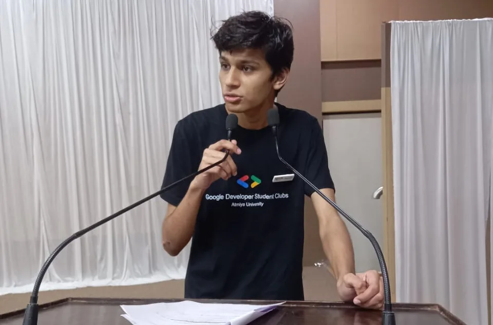
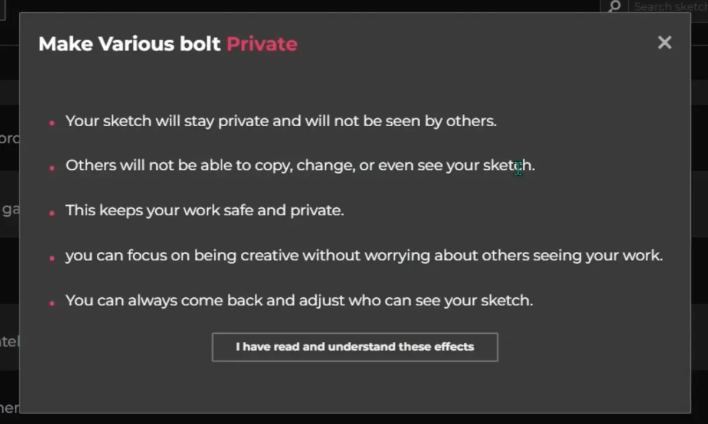
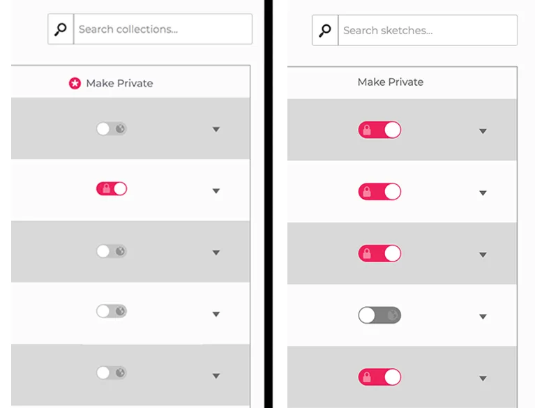
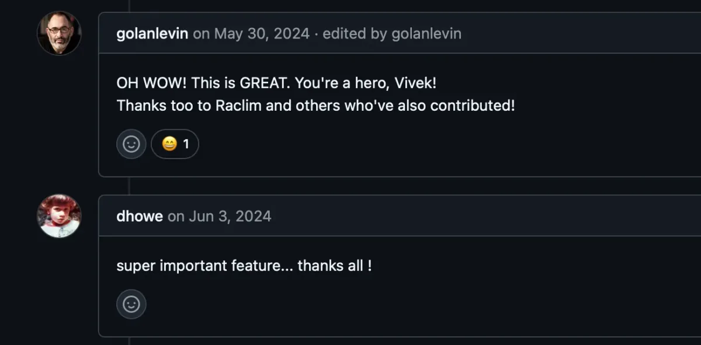
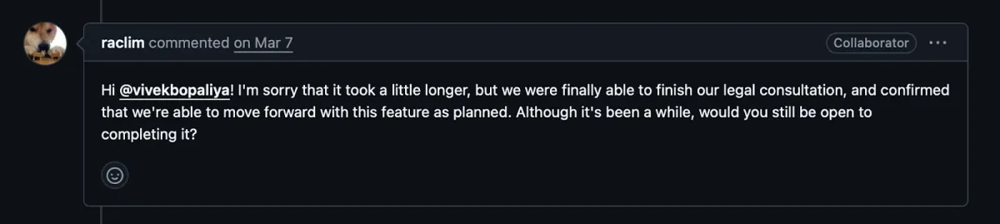

*Vivek presenting at the Atmiya University in Gujarat, India.*

Around that time, I came across the [p5.js Editor](https://editor.p5js.org/), an online code editor for creative coding projects. The [repository](https://github.com/processing/p5.js-web-editor) had been around for a while and much of the code was written years ago, but since it was built using the MERN stack (MongoDB, Express, React, Node), I felt motivated to contribute and test my growing skills. I began small: [fixing minor bugs](https://github.com/processing/p5.js-web-editor/pull/2782), understanding how things worked, and slowly building confidence.

After two of my bug fix pull requests got merged, I wanted to do something bigger. That’s when I stumbled upon a [long-standing GitHub discussion](https://github.com/processing/p5.js-web-editor/issues/1987) around a potential feature: giving users the ability to set their sketches as **Private** or **Public**, just like how GitHub lets you manage your repository’s visibility.

> This wasn’t just a small fix, it required adding a whole new layer to the system: changes in the database, UI updates, Redux state logic, permission handling, and more.

*Vivek’s initial proposal for the private sketch feature.*

There was no design or concrete plan yet. So I decided to create something from scratch, inspired by GitHub’s UI, and started building this feature during my free time between college classes. After nearly a week of intense focus, I submitted the first version of the feature pull request on February 18, 2024***.*** The response was incredibly heartwarming — p5.js contributor [Linda Paiste](https://github.com/lindapaiste) reviewed it and left thoughtful comments, and I quickly incorporated her suggestions. Soon after, p5.js Editor Lead [Rachel Lim](https://github.com/raclim) and others chimed in, and to my surprise, they were all very excited!

> It felt amazing to see such a warm reaction to something I had quietly worked on all by myself. That was exactly the kind of surprise I hoped to bring — **something useful, unexpected, and driven by genuine interest**.

*Rachel’s old design mock-up (LEFT) updated by Vivek (RIGHT).*

Over time, more ideas and feedback started rolling in. A month later, I got some free time from college and revisited the feature to polish it further. That’s when I found an old design mockup by Rachel for the private sketch idea, so I completely revamped my pull request to match the new design and improve the UX. Again, I received encouraging feedback: people loved how it looked and worked. The feature was functional, well-tested, and good to go…

*Words of encouragements from p5.js contributors Golan Levin and Daniel Howe on GitHub.*

But we soon hit a pause between June 14, 2024, and early January 2025, there wasn’t much activity on the pull request. Testing and discussions slowed down. But then, out of the blue, I saw a new comment from Rachel saying:

*p5.js Project Lead Rachel Lim moving the feature forward on GitHub.*

By this time, my internship had ended, college was nearly over, and like most fresh grads, I was facing a tough job market. So I reached out to Rachel to ask if there were any internship opportunities. I didn’t expect much as [Processing Foundation](https://processingfoundation.org) is a non-profit, but I just shared my work and said I’d love to help more.

> To my surprise, **Rachel appreciated the time and dedication I had put into the pull request** over the past year, and although there wasn’t a formal internship, she worked with the team and offered **meaningful compensation** for my work.

From there, things picked up fast. We did a 2-week sprint structure, where we’d sync up regularly, plan priorities, and slowly wrap up the remaining pieces: testing, UI tweaks, bug fixes, and merge conflict resolutions. Every time I hit a blocker, Rachel was quick to help — through email or GitHub — always encouraging, patient, and genuinely supportive.

With this collaboration, we were able to wrap up the entire feature by July 2025, after carefully polishing everything. The final version is now on track for **official release next Monday, August 25, 2025**, as part of a campaign to support more open-source software contributions. It makes me incredibly happy to know that something I built starting from a dorm room, will now be used by a global community of creators, students, and educators.

  <iframe src="https://www.youtube.com/embed/m4me8uExCA0?feature=oembed" frameborder="0" scrolling="no"></iframe>

Our software gets to stay **free and open-source** thanks to generous donors like you. If p5.js has brightened your day in any way, [will you consider making a monthly donation](https://donorbox.org/back-to-school-805292)?

**100% of your donations will go towards p5.js software development, and recurring donations help us plan.** Thanks to the recurring donations we’ve received in 2024, we were able to support p5.js contributors like Vivek to build the private sketch feature for the p5.js Editor.
