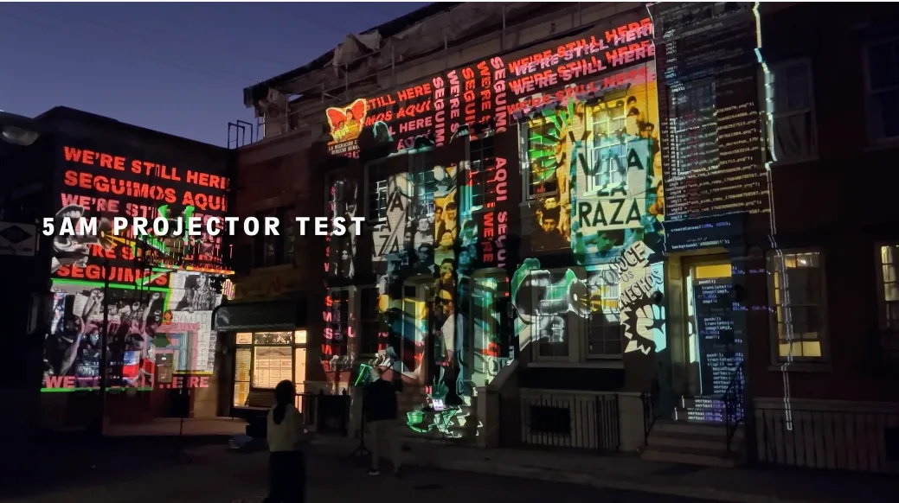
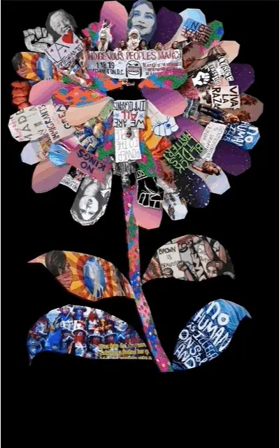
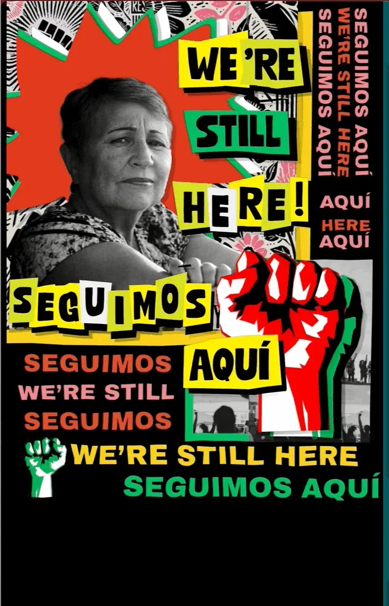
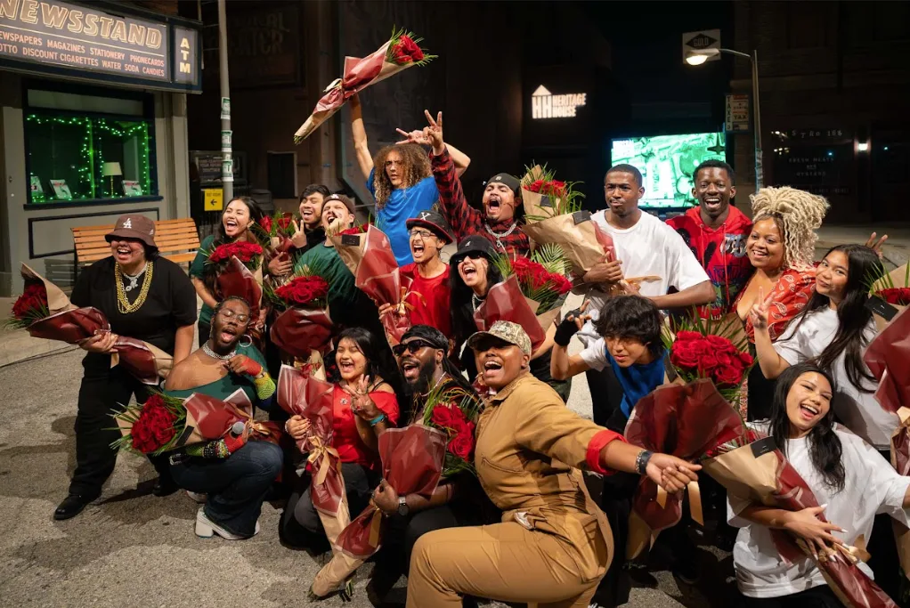

  <iframe src="https://www.youtube.com/embed/ztwJwoS_ycs?feature=oembed" frameborder="0" scrolling="no"></iframe>

#### Fellowship Project: Call / Code / Response

- Artists: Ana C., [Jiwon Ham](https://www.instagram.com/jiwonhaam/), &
  [Payton Croskey](https://instagram.com/paytoncroskey)
- Links: [collage tool](https://anacardenas.com/p5_sketches_exp/collage.html),
  [student collage repo](https://github.com/anuzk13/p5_sketches),
  [performance repo](https://github.com/anuzk13/p5_performances)

“The most radical thing about this project,” Processing Foundation Co-Executive
Director Xin Xin says, “is that we are letting young people lead with their
vision, and every adult involved is following their cues.” This approach is
captured in the defining philosophy of the collaboration as Processing
Foundation Fellow Jiwon Ham reflects, the project was ultimately about
“different disciplines, one purpose: amplifying a story led by youth.”

_LIVE FROM LA_ is a youth-led production that emerged from the Hip Hop Theatre
Program founded by Street Poets, Inc., who also served as the play’s lead
producer. The production was created by Street Poets, Inc., Unusual Suspects
Theatre Company, and the Processing Foundation, with Versa-Style Street Dance
Company and No Easy Props joining as creative partners. Together, each
organization contributed skill-building workshops across disciplines including
theatre, dance, poetry, music, and creative technology. At the heart of the
collaboration were 12 committed young people, ages 13–19, who wrote and
performed a play drawn from their own lived experiences.

This project stemmed from the 2025 Processing Foundation Fellowship, an
exploratory cohort model in which Fellows were paired directly with a community
partner to co-develop software tailored to that partner’s specific needs. The
creative technologists awarded this Fellowship were Ana C., Jiwon Ham, and
Payton Croskey, who built the technical and artistic architecture for the coded
projections that displayed across the stage during the performance.

_Projection test on a Los Angeles building facade during the development of
*LIVE FROM LA*. Youth-created collages and coded visuals are mapped onto the
architecture, transforming the space into a canvas for storytelling, protest,
and collective expression. *Photo by Mariana Blanco.*_

For Jiwon, whose practice evolved from presenting motion graphics on public LED
screens in Seoul to building immersive, interactive systems, _LIVE_

_FROM LA_ was an opportunity to root her work in the city she now calls home.
Jiwon often begins her projects through conversations and memory-gathering. “I’m
consistently drawn to how people form emotional relationships with place,” Jiwon
explains. In this production, that approach translated into a projection system
built to help students curate and layer meaningful images about their own
histories, families, and beliefs.

“I felt very connected to this story,” Ana reflects. “My life and the story have
been intertwined throughout this process.” Ana came to creative technology
through illustration. Raised in a family of artists and engineers, she grew up
finding the connections between analog and digital art making. Over time, her
practice moved beyond aesthetics and into research-driven work that focuses on
the interplay of technology and identity. Inspired by artists like Doris
Salcedo, whose public interventions engage memory and political history, Ana
began exploring augmented reality and creative coding as ways to enter into
dialogue with place. In _LIVE FROM LA,_ that sensibility shaped her approach to
using coding as a medium for empowerment, helping students see technology as
something they could use to author and amplify their stories.

Payton approaches creative technology as both a designer and a theorist. Her
early experiments revealed how computation could make objects feel alive,
raising questions about futurity, artificiality, and power. Now a PhD researcher
at UC Santa Barbara’s Expressive Computation Lab, her work inspects the
crossroads of AI, AR, and Afrofuturism, where she develops community-centered
methods for ethically modeling and preserving Black cultural data. “Meaningful
innovation happens when process matters as much as product,” says Payton. In
_LIVE FROM LA,_ Payton brought a liberatory design framework into the theatre
space, prioritizing accessibility, dialogue, and shared ownership so that the
students’ stories were protected and shaped on their own terms.

The team analyzed the student-written script scene-by-scene to determine where
projections could best serve the story without disrupting the emotional flow.
They chose a collage-style aesthetic to mirror the “raw energy” of youth
protest. To make the vision a reality, the fellows co-created a custom digital
collage-making tool using p5.js, TypeScript, and React.

_A collage flower blooms from layered images of protest, memory, and identity.
Generated from student-created visuals, the animation transforms acts of
resistance into a living, growing form, reflecting how collective stories take
root and expand across the stage._

The technical labor was shared with intentionality. Ana built the software and
the control interface, ensuring the code was clean and triggerable in real-time.
Jiwon managed the hardware and used 3D scanning and Blender to simulate how
projections would interact with the building facades of the outdoor Hollywood
studio lot. And Payton focused on the cultural narratives and developed the
lesson plans to introduce students to creative coding.

The project’s philosophy was rooted in call-and-response as a constant dialogue
between the technologists and the performers. One of the most powerful
connections was formed with a student named Jorge, who played a “nerdy tech
guy,” as he puts it. Though Jorge had never coded before, the team designed a
custom curriculum for him. Ana recalls the beauty of teaching him in her native
language: “I would just put \[the variables\] in Spanish because that way it’s
clear what the variables are … I really admired the voice that they had and all
the agency they saw \[with making their protest collages\].”

_An animated protest collage layers portraits, symbols, and bilingual text
“We’re still here / Seguimos aquí” as words emerge and shift across the
projection. The piece reflects the persistence of community, memory, and
resistance within the youth-led performance._

The students’ input directly shaped the visuals. When an actor named Natalia
performed a poem about resilience, the team created an animation of flowers
“blooming” from the crevices of the buildings. Another student actor playing
Luna was moved to tears seeing the faces of her own family and friends projected
behind her while she spoke. Ana describes the atmosphere as one of “mutual
admiration,” where the fellows often found themselves speechless by the wisdom
and courage of the youth.

The collaboration culminated in a climactic scene where the students staged on
the Radford Studio backlot in front of more than 200 audience members. The
students performed across a set of building facades transformed by immersive
projections generated from their own digital collages. While students performed
their spoken-word poetry, the Fellows carefully cued and orchestrated the
dynamic projections onto the buildings. As the story reached its peak, the
actors staged a protest against city plans to gentrify their neighborhood.
Sirens pierced the air. The crowd fled. The stage emptied.

But the projections did not disappear. The students’ collages remained lit,
flickering defiantly across the facades long after the performers had exited. In
that charged silence, the images of resistance and hope held their ground, a
reminder that we’re still here.

_Cast and collaborators from LIVE FROM LA gather in celebration after the
performance, holding bouquets and sharing a moment of joy and accomplishment.
Photo courtesy of Unusual Suspects Theatre Company._

---

The Processing Foundation Fellowship supports artists and creative technologists
developing open-source creative tools and practices that expand access to
creative technology. Through financial support, mentorship, and community
partnerships, fellows create tools, artistic works, and research that contribute
to a more open and accessible creative coding ecosystem.

- Learn more about the Fellowship →
  [here](https://processingfoundation.org/fellowships)
- Support programs like this → [here](https://processingfoundation.org/donate)
