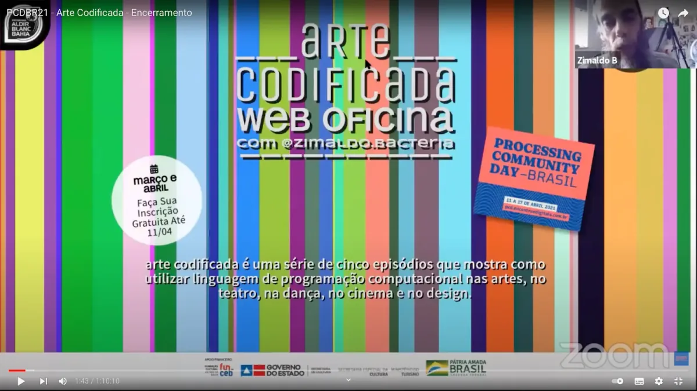
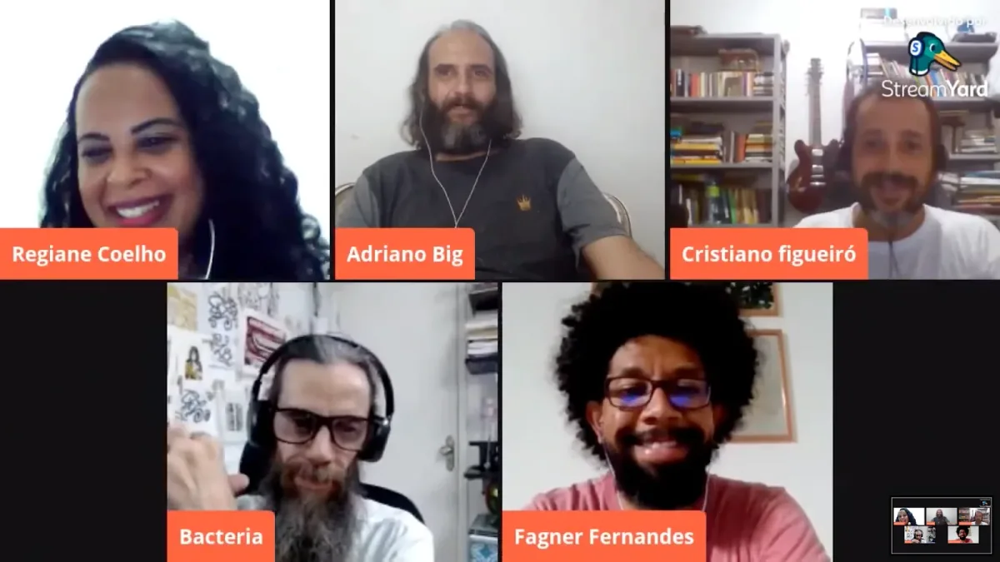
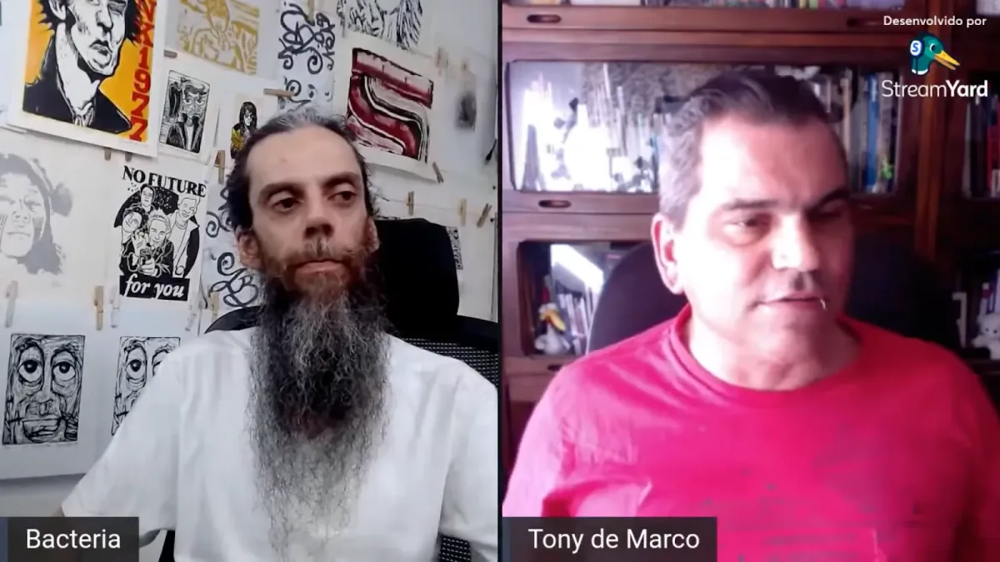

Para a versão em português desta história, [clique aqui](https://medium.com/processing-foundation/festejando-20-anos-de-processing-com-arte-codificada-aaa2d27769e0).

---

*This year, on August 9, the Processing software turned 20 years old. To celebrate, the Processing Foundation organized* [Processing Community Day 2021](https://processingfoundation.org/advocacy/pcd-2021)*, a distributed, worldwide party held on August 20–22, 2021. For PCD2021, the community could participate in a number of ways, from hosting an event online or in their city, to contributing to the* [20th Anniversary Processing Community Catalog](https://processingfoundation.org/advocacy/community-catalog)*, to sharing creative coding projects and resources at* [#pcd2021share](https://twitter.com/search?q=%23pcd2021share&src=typed_query&f=live)*, to creating a real or virtual birthday cake at* [#pcd2021cake](https://twitter.com/search?q=%23pcd2021cake&src=typed_query&f=live)*. Over the next couple weeks, we’ll be posting a series of articles written by some of the folks who organized a PCD2021 event. Happy 20th birthday!*

---

The year 2021 was a busy period for the Processing community, in particular for the Processing community in Brazil. Two major events connected people around the world. The Covid-19 pandemic forced us all to remain in seclusion for an extended period, but technology enabled encounters in the digital sphere. In Brazil, it made online meetings of various local groups possible — groups that had been meeting and creating locally throughout the country.

For me, the previous year, 2020, was one of reimagining my use of Processing. As an experienced graphic design professional since 2011 — when I started my studies in creative dynamics with Prof. Jarbas Jácome at the Federal University of Recôncavo da Bahia — I have increasingly used Processing in my design and visual arts work.

Early on, I realized that I could develop several projects through coding, and used Processing to create my first code, Desenho Aleatório Colaborativo sem as Mãos. My conception of a work of art is linked to being creative in a group, and Desenho Aleatório Colaborativo Sem as Mãos depends on the viewer’s action to exist. IVisitors must first move their faces in front of the screen for the computer to recognize them with OpenCV. The program then generates a drawing, which is sent to a print queue using system scripts, and ultimately erased from the device’s memory. This work was my contribution to one of the biggest art festivals in Bahia, the 11th Bienal do Recôncavo — held at Espaço Danemman in 2012, in the city of São Félix.

From 2012, I created several graphic design projects using Processing, including visual identities and graphic patterns that change with every click. I now routinely use Processing to develop images and visual projects that adapt according to the proposed algorithm, and which can be a work of visual art or a print-on-demand project.

In 2021, through the Aldir Blanc Arts Incentive Law and the Jorge Portugal Arts Award, I developed a digital inclusion project named the Codified Art web-workshop. This work had the support of the visual artist Vaneza Melo, who is also a former student of Prof. Jarbas Jácome. Together, we created a series of introductory video lessons for Processing that are aimed at artists from various fields of production and without programming experience.

The Codified Art web-workshop started with an opening episode dedicated to the history of Processing from the legendary graphic designer Muriel Cooper. We made videos demonstrating the universe of Processing applicability, based on the teachings of Daniel Shiffman and with help from Jarbas Jacome and Tony de Marco.

Also in 2021, we were selected by the Processing Community Dia Brasil to participate in the 20th anniversary of Processing. We presented our web-workshop and talked about the importance of building code in the 21st century.

In this contact with the Brazilian Processing community, we got to know the works of creative programmers from all over the country and engaged in dialogue with relevant figures from the community, such as Monica Rizzolli, Alexandre Villares, Sergio Venâncio, Rodrigo Rezende, Rodrigo Junqueira, Guilherme Vieira, Mariana Leal, and so many others.

### Dialogical Inclusion

When we think of the Arte Codificada Web Workshop project, we imagine the power of code to include people. Brazil lacks didactic objects capable of motivating adolescents and adults in the classroom. Creative programming can be a way to attract different audiences to the universe of codes. This project was created to cultivate dialogue about coding in Brazil, mainly in Bahia.

The person who led us to imagine this possibility was Prof. Jarbas Jácome, whose work in this area deserves all possible merit. As an advisor, Jácome trained the first generation of artists in Bahia who work with the Processing programming language. He encouraged research groups, followed course completion papers, and still maintains constant dialogue with former students..

From Cachoeira, a city in the interior of the state of Bahia, we were lucky to expand our knowledge through Processing’s extremely powerful tool, which also streamlines the learning of a community in its surroundings. Yes, the community outside the academy is also encouraged to think through Processing, with practical projects in public schools.

What inspired us to talk about coding in episodes on the web was the possibility of including people — whether they work with visual art or not — and encouraging them to see another path, whose purpose is great teamwork. The very essence of Processing leads us to attend forums and establish contacts in order to achieve our goal.

*\[**image description**: A screenshot of the title card of the livesteam for Processing Community Day—Brasil, which says, “Art Codificada Web Oficina.”\]*

*Opening Live Web Workshop Codified Art on April 17, 2021 and a Talk Lights screen with several participants of Processing Community Day Brasil 2021. \[**Image description**: A screenshot of a livestream with 12 participants within a zoom titled “PCDBR21 — Lightning Talks.”\]*

Thus, our proposal is to create content aimed at teaching creative programming in the Portuguese language, using visual resources and practical examples on a digital platform. We show work by visual artists and creators employing other artistic languages ​​that use the Processing language in their poetics.

Today, the channel is a visual library housing diverse content, including a 23-minute mini documentary about the history of Processing, four video classes introducing the Processing programming language (each approx. 60 minutes), and three livestreams with guest artists. We have also already completed two new scripts.

*Screenshot of Ep. 01 from the Web Codified Art Workshop: “Processing, a code for artists.” \[**Image description**: A screenshot of Jarbas Jácome in a room covered with drawings.\]*

### Processing World

The first Codified Art web-workshop video, entitled “Processing: A code for artists,” is the result of careful research by the visual artist and researcher Vaneza Melo, exploring the influence of Muriel Cooper on the works of John Maeda and, later, Ben Fry and Casey Reas. The video also examines the various libraries and APIs that contributed to Processing, such as the development of p5.js and the alternative environments to the Processing Development Environment, as well as including a step-by-step guide on how to install Processing and access the online editor for p5.js.

*Screenshot of Ep 02 from the Web Workshop Codified art: “From drawing to programming logic.”*

In the video classes, we use references and examples from Daniel Shiffman’s book *Learning Processing*, as well as codes I created for visual art or graphic design projects. We try to detail each aspect of the Processing Development Environment and each demonstrated procedure, starting from the fundamentals of programming up to object-oriented programming.

At the Web Lives Oficina Arte Codifica, we invite Brazilian artists with relevant work in creative programming to visit us. The first guest was the aforementioned musician and art programmer Jarbas Jácome, Doctoral Scholar | Voxar Labs / CIn-UFPE / Samsung, Professor at the CAHL-UFRB and winner of the Sérgio Motta Art and Technology Award in 2009, and the Rumos Itaú Cultural Arte-Cibernética 2007 Award. On this livestream, Jácome talks about his doctoral research at UFPE.

*Live with artists from the community of creative programming in the state of Bahia. \[**Image description**: A screenshot with five people in a livestream, all smiling.\]*

A live event in celebration of the 20th anniversary of Processing was held on August 24, 2021, and featured participation from Regiane Coelho, visual artist and researcher in the area of ​​education and TDICs; Fagner Fernandes, visual artist and specialist in technologies and open, digital education; and Dr. Cristiano Figueiró, Professor of the Interdisciplinary Baccalaureate at UFBA — IHAC. Each of the participants spoke about their experiences and productions with Processing.

On August 31, 2021, we held the closing live event of the Web Oficina Arte Codifica Project with the participation of designer and typographer Tony de Marco, who spoke about his career as a designer and illustrator and his experience developing creative programming. Paulista was known for his experience at major Brazilian press outlets, in addition to being the creator of the iconic *Macmania* magazine, the main vehicle for the Macintosh community in Brazil in the 1990s and 2000s. He also made the publication *Tupigrafia*, dedicated to Brazilian typography and typographers.

De Marco demonstrated the diversity of 21st-century visual artists in Brazil. His approach to Processing diversified his production to the extent that he used it to create an urban visual figure called Pixotosco, a post-modern graffiti artist representing marginalized art in Brazil. In the field of typography, De Marco produces types using code. The types ultimately end up on posters, shirts, and other objects.

*Web Lives Codified Art Workshop with art-programmers Jarbas Jácome and Tony de Marco, below. \[**Image description**: A screenshot of a Zoom that shows a GitHub repo of “ExperimentosDeProcessing.”\]*

*Jarbas Jácome and Tony de Marco \[**Image description**: A screenshot of two people in a frame.\]*

Thus, the web-workshop Codified Art project, carried out between March and August 2021 — with the financial support of the Department of Culture of the State of Bahia — Brazil, through the Jorge Portugal Award, which is organized by the Aldir Blanc Bahia Program — was born to the Processing world.

We celebrate 20 years of Processing with opportunities to present knowledge. Following the path indicated by Paulo Freire, the production of this material was aimed at exchanges of learning. We try to unite groups within a single community, to exchange experiences. For those who are interested, all the content included in this article is gathered on YouTube [here](http://www.youtube.com/artecodizada) and on the Zimaldo Bactéria website [here](http://www.bacteria.com.br). Our desire is simple: for 20 more years of Processing.
