In December of this past year, we had the incredible opportunity to celebrate the 2023 Processing Foundation Fellowship program, our ten-year anniversary of this initiative, at [New York University’s Tisch Interactive Telecommunications Program (ITP)](https://tisch.nyu.edu/itp)! The evening included screening 8 fellowship project presentations and a panel of our fellows from across the world. We are so excited to share all presentations and conversations held at the end of last year, marking the incredible work of our 2023 Processing Foundation Fellows!

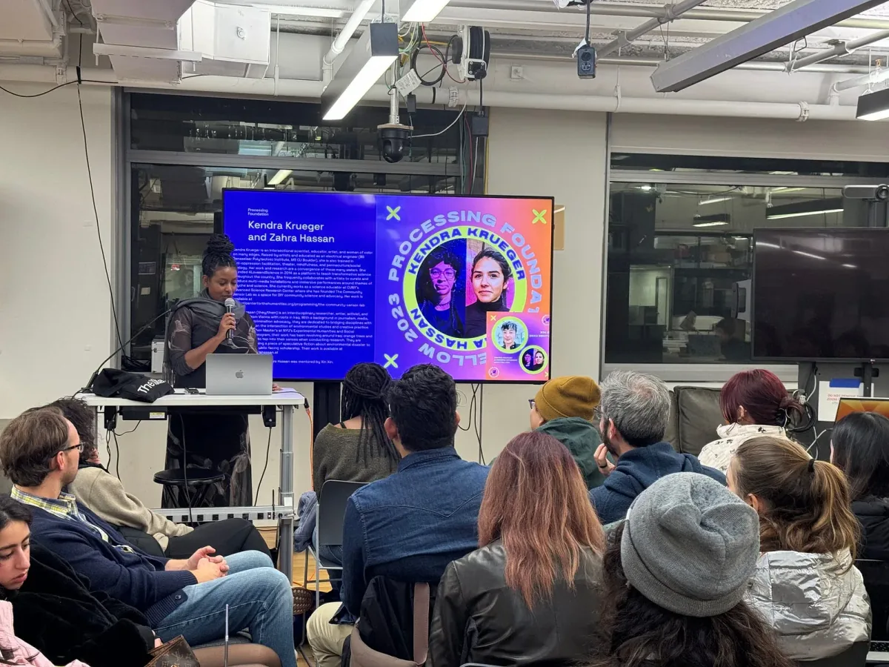

*Our Programs Manager, Tsige Tafesse, facilitating and hosting the Fellow presentation at NYU ITP.*

We are so proud of this past anniversary year of the [Processing Foundation Fellowship](https://processingfoundation.org/fellowships) Program, supporting projects at the intersection of code, art, and technology. Celebrating our continued commitment to empowering artists, designers, activists, educators, engineers, researchers, and coders, this incredible 2023 cohort of projects were funded with our most significant grant amount of $10,000! This has truly allowed us to uplift incredible work with even more robust support coming into our tenth year.

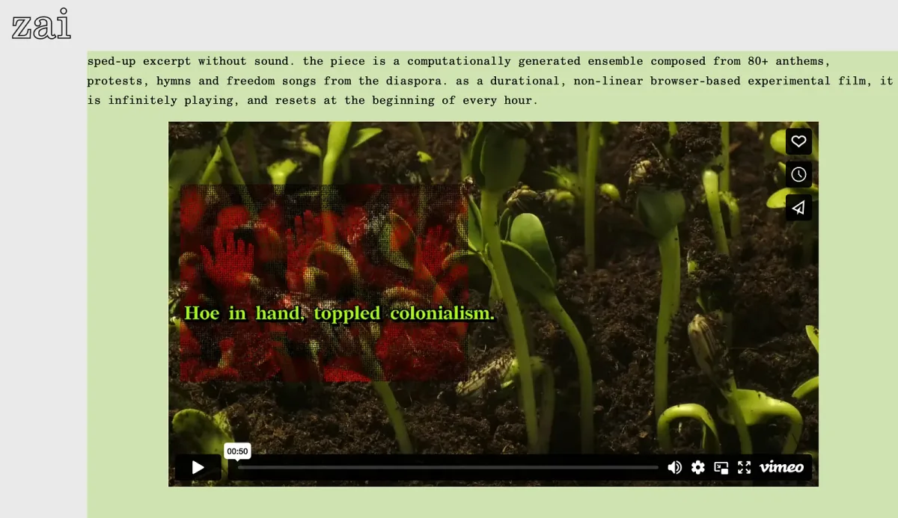

*A screenshot of 2023 Fellow Zainab Aliyu’s project, ‘freedom is a durational practice’*

Our milestone season has seen fellows from around the world that not only aimed to develop and extend the capabilities of software and education — but also to expand horizons of creativity with code. As we reflect on the achievements of this year’s fellows, their work stands as a testament to the program’s enduring mission: to cultivate tools of collective power and connection to nurture diverse needs that interact with software and community.

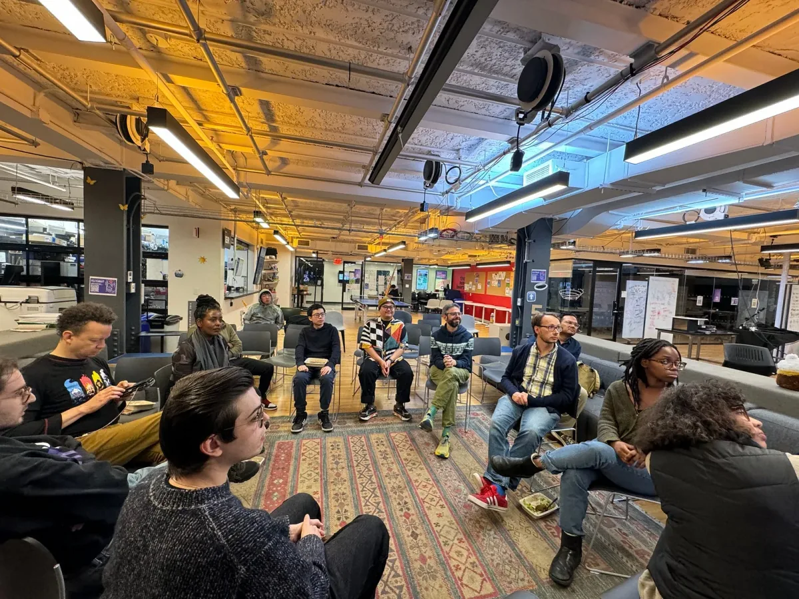

*‘Code and Canvas’ event at NYU ITP*

Our program this year stretched across the summer into the fall with regular cohort meetings, mentorship by Processing Foundation community leaders, and digital and in-person presentations hosted this year at the Interactive Telecommunications Program (ITP) at NYU Tisch in New York! Check out their presentations in full and dive into the incredible work of the Processing Foundation 2023 Fellowship Projects below.

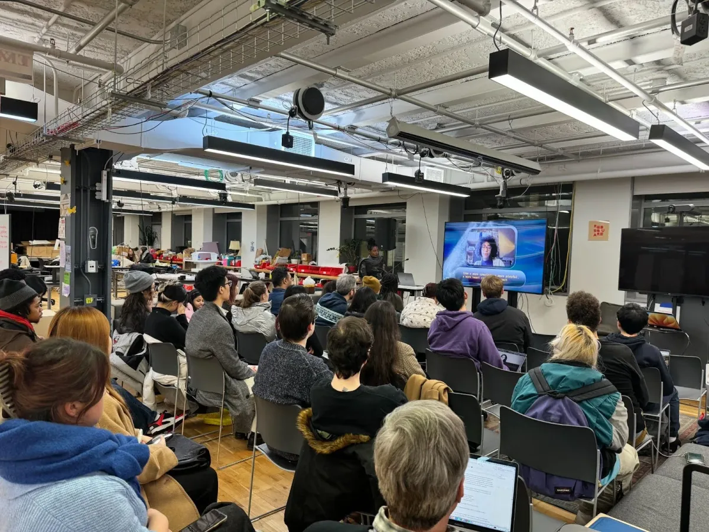

*Fellowship Wrap Up Event ‘Code & Canvas’ at NYU ITP*

The presentations are broken into Fellowship Project dyads, placing two fellow project presentations into intimate conversations around their work. These videos showcase the power of working together inside of a cohort alongside the presentations of these amazing final projects.

#### Kendra Krueger & Zahra Hassan: Engaging STEM Toolkit with Zainab Aliyu: Freedom is a Durational Practice

  <iframe src="https://www.youtube.com/embed/JSp_MmDzgfo?feature=oembed" frameborder="0" scrolling="no"></iframe>

Kendra Krueger and Zahra Hassan’s project, ‘4LoveandScience: An Inclusive STEM Pedagogy Toolkit merges science education with an intuitive, heart-centered approach. “We’re transforming the narrative around STEM education, making it more accessible, fun, and inclusive,” Krueger explains in their presentation. Hassan adds, “Our toolkit isn’t just a teaching aid; it’s a bridge connecting diverse disciplines and fostering a richer, more holistic understanding of science.” Zainab Aliyu’s project, ‘freedom is a durational practice’, is a moving image meditation that delves into the complexities of African liberation movements and their cultural resilience. “It’s about challenging narratives and celebrating the rich tapestry of African cultures,” Aliyu states. Her work reimagines historical narratives, offering a fresh perspective on African diasporic cultures.

**Check out their fellowship project presentations below:**

  <iframe src="https://www.youtube.com/embed/zaZ3dx1tAKQ?feature=oembed" frameborder="0" scrolling="no"></iframe>

**Project links:** [Engaging STEM](http://engagingstem.com/)  
[Freedom is a Durational Practice](https://zai.zone/#freedom)

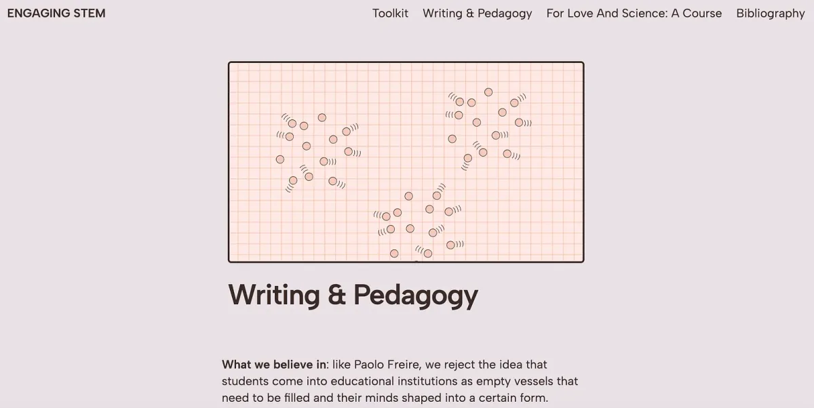

*A screenshot of the ‘Engaging STEM’ website*

**Social media links:  
**Zai’s [instagram](https://www.instagram.com/beatsbyzai/) — Zahra’s [instagram](https://www.instagram.com/sarahas_san/) and [twitter](https://twitter.com/sarahas_san) — Kendra’s [instagram](https://www.instagram.com/4loveandscience/)

#### Joanne Amarisa: the Data Garden Project with Nhân Phan: CodeSurfing

  <iframe src="https://www.youtube.com/embed/lOoDl7PVtsk?feature=oembed" frameborder="0" scrolling="no"></iframe>

The Data Garden Project is a unique blend of creative coding and storytelling to empower young girls in STEM. “We’re demystifying technology and making it more approachable,” Amarisa explains. “Our project isn’t just about coding; it’s about sparking imagination and confidence in young minds.” Nhân Phan’s ‘CodeSurfing’ initiative is reshaping how young people in Vietnam perceive coding. “Our goal is to make coding relatable and relevant to their everyday lives,” Phan says. “We’re building a community where technology is a tool for creative expression and problem-solving.”

**Check out their fellowship project presentations below:**

  <iframe src="https://www.youtube.com/embed/_CuvTxOJmjk?feature=oembed" frameborder="0" scrolling="no"></iframe>

**Project links:** [The Data Garden Project](https://datagardenproject.com/)   
[Code Surfing Club](https://codesurfing.club/)

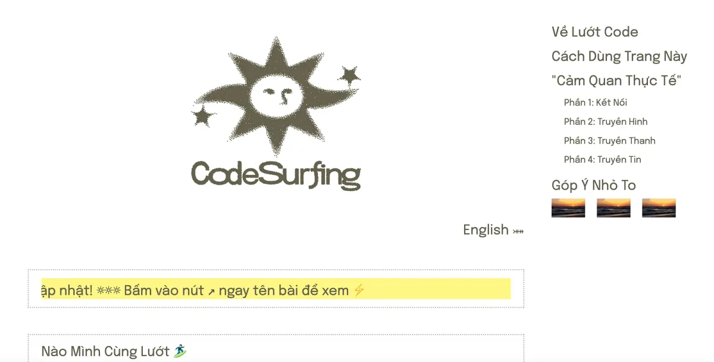

*A screenshot of Nhan Phan’s project page, ‘CodeSurfing’*

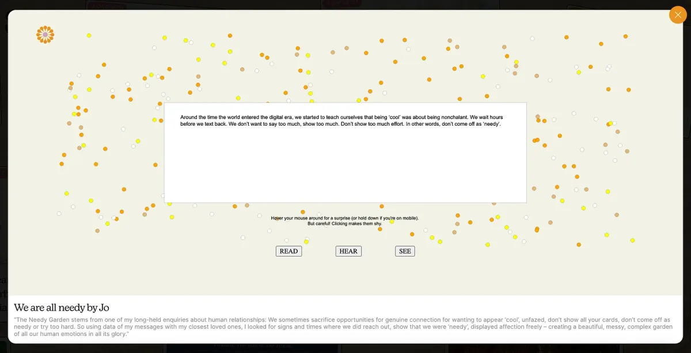

*A screenshot of ‘Data Garden Project’ by Joanne Amarisa*

**Social media links:  
**The Data Garden Project’s [instagram](https://www.instagram.com/thedatagardenproject/) — CodeSurfing’s [instagram](https://www.instagram.com/codesurfing.club/) — Nhan’s [instagram](https://www.instagram.com/nhaninsummer/)

#### Bobby Joe Smith III and Nat Decker: Sketching Access with Stephanie Jones: Black Life in the Age of AI

  <iframe src="https://www.youtube.com/embed/uvPoh7wtuhM?feature=oembed" frameborder="0" scrolling="no"></iframe>

The ‘Sketching Access’ project by Bobby Joe Smith III and Nat Decker challenges traditional notions of accessibility in technology. “Our work is about creating a more inclusive digital world,” Smith III comments. Decker adds, “We’re not just addressing physical accessibility; it’s also about cultural and social inclusivity.” In her Stephanie Jones presentation, “Black Life in the Age of AI,” Stephanie shares her work and delves into the complex interplay between artificial intelligence and the everyday experiences of Black life. As a scholar of race technology and computation, Jones explores the broader systems affecting Black life, highlighting how AI can perpetuate systemic racism. Jones’s project aims to provide a multifaceted resource on the intersection of Black life and AI, offering “multiple entry points, whether these were research articles, news articles, podcasts, video lectures, interviews, or art.”

**Check out their fellowship project presentations below:**

  <iframe src="https://www.youtube.com/embed/9j8GVaDKcJE?feature=oembed" frameborder="0" scrolling="no"></iframe>

**Project links:**   
[Black Life in the Age of AI](https://www.blacklifeai.com/)  
[Sketching Access](https://github.com/natdecker/sketching-access/wiki/A11y-%E2%80%90-Web-Accessibility)

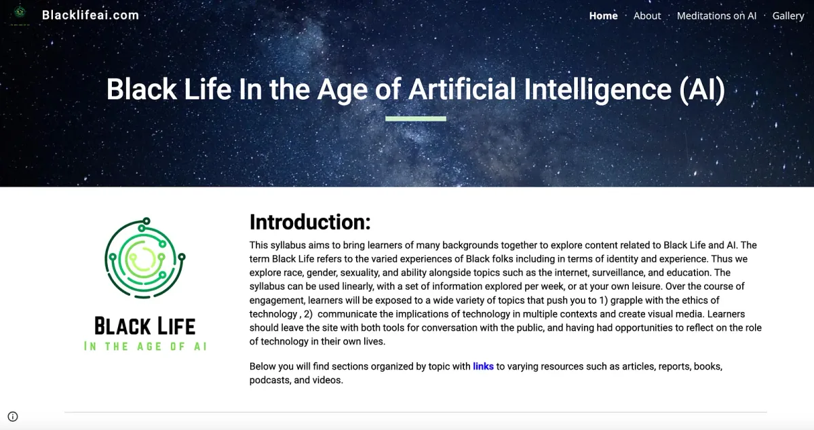

*A screenshot of Dr. Stephanie T. Jones’ project, ‘Black Life in the Age of AI’*

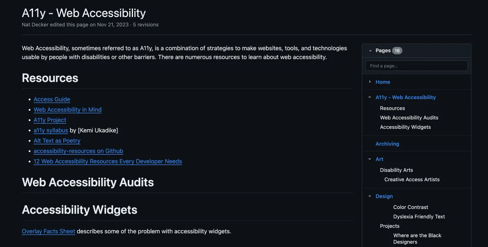

*A screenshot of ‘Sketching Access’ project’s Github*

**Social media links:  
**Nat’s [instagram](https://www.instagram.com/crip_fantasy/) — Bobby Joe’s [instagram](https://www.instagram.com/bobbyjoesmithiii/) — Stephanie’s [twitter](https://twitter.com/computeloop)

#### Kelly Chen & Olivia McKayla Ross: CYBERNETIC THEATER COMPANY-IN-A-BOX with Liam Baum: Expanding the p5.Sound Library

  <iframe src="https://www.youtube.com/embed/IIgiZBtFxN8?feature=oembed" frameborder="0" scrolling="no"></iframe>

Kelly Chen and Olivia McKayla Ross are revolutionizing how we think about performance and technology with their ‘CYBERNETIC THEATER COMPANY-IN-A-BOX.’ “We’re exploring the intersection of drama and coding, showing how computational concepts are inherent in our daily movements,” Chen remarks. Ross adds, “Our project is about expanding the creative potential of open-source arts education.” Liam Baum’s work with the p5.Sound Library is enhancing music education through coding. “We’re creating new ways for students to engage with music and technology,” Baum says. “It’s about making learning interactive, diverse, and fun.”

**Check out their fellowship project presentations below:**

  <iframe src="https://www.youtube.com/embed/BQ1wZjOtGas?feature=oembed" frameborder="0" scrolling="no"></iframe>

**Project links:** [Expanding the p5.Sound Library](https://p5-sound-curriculum.gitbook.io/p5.sound-library-curriculum-unit-1/)

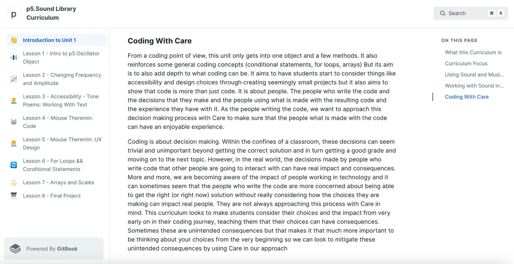

*A screenshot of p5.Sound Library Curriculum by Liam Baum*

**Social media links:  
**Olivia’s [instagram](https://www.instagram.com/cyberdoula/), [mastodon](https://digipres.club/@cyberdoula), and [twitter](https://twitter.com/cyberdoula) — Kelly’s [instagram](https://www.instagram.com/luckystarbus/) — Liam’s [instagram](https://www.instagram.com/mrbombmusic/) and [twitter](https://twitter.com/mrbombmusic)

As we conclude a landmark year for the Processing Foundation Fellowship Program, it’s clear that the tenth anniversary has not only been a celebration of past achievements but also an incredible moment for envisioning the future! The 2023 cohort, with its diverse and groundbreaking projects, embodies the program’s unwavering commitment to fostering innovation at the intersection of code, art, and technology. Through their collective efforts, these fellows have amplified the foundation’s core values of access, equity, and education, leaving a mark on communities around the world.

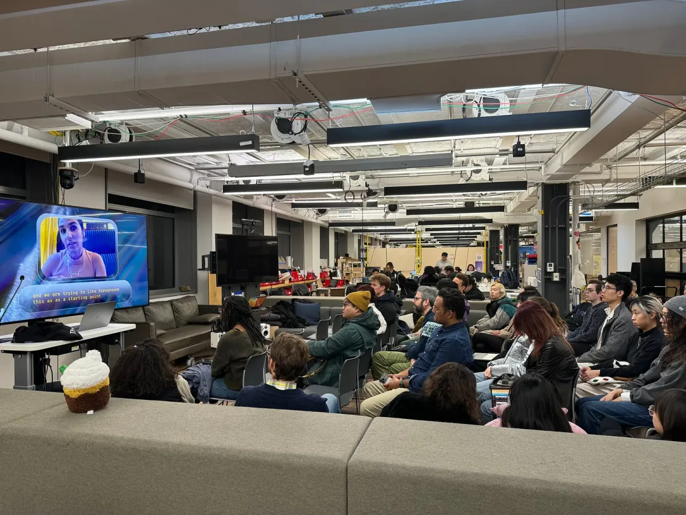

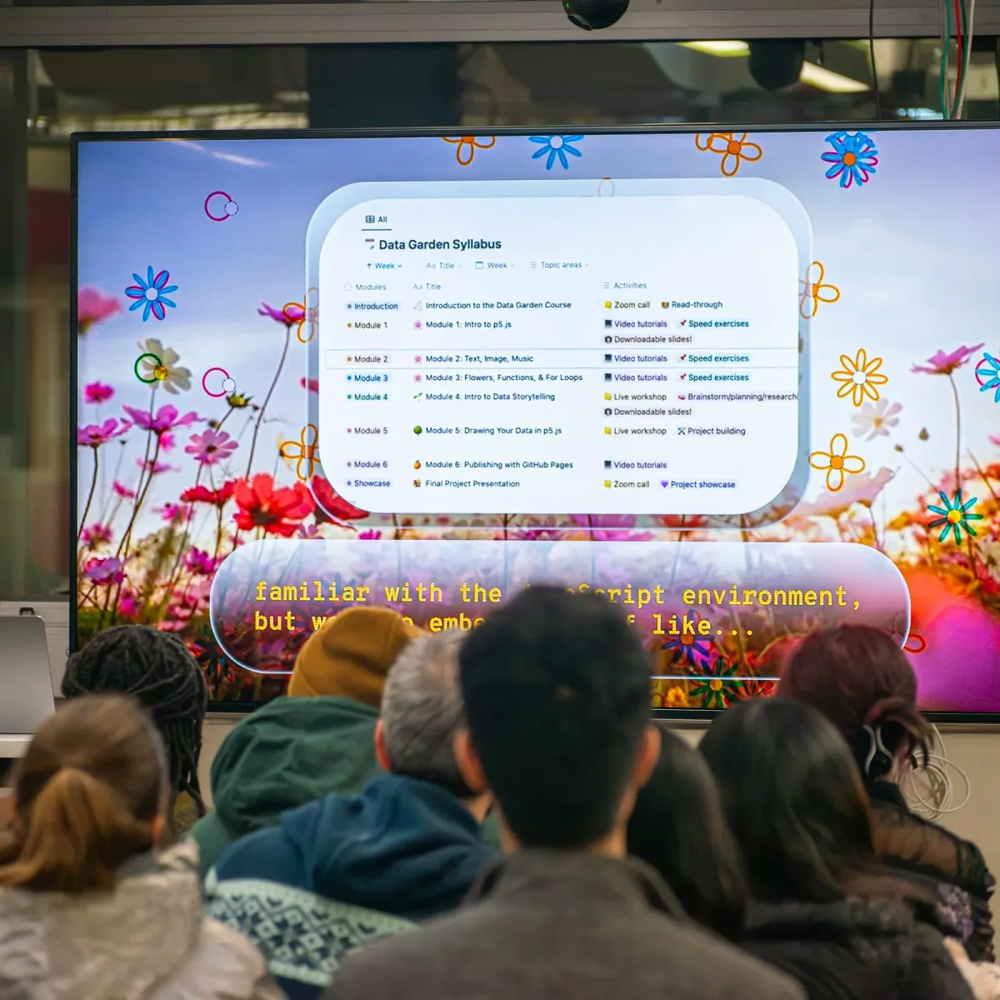

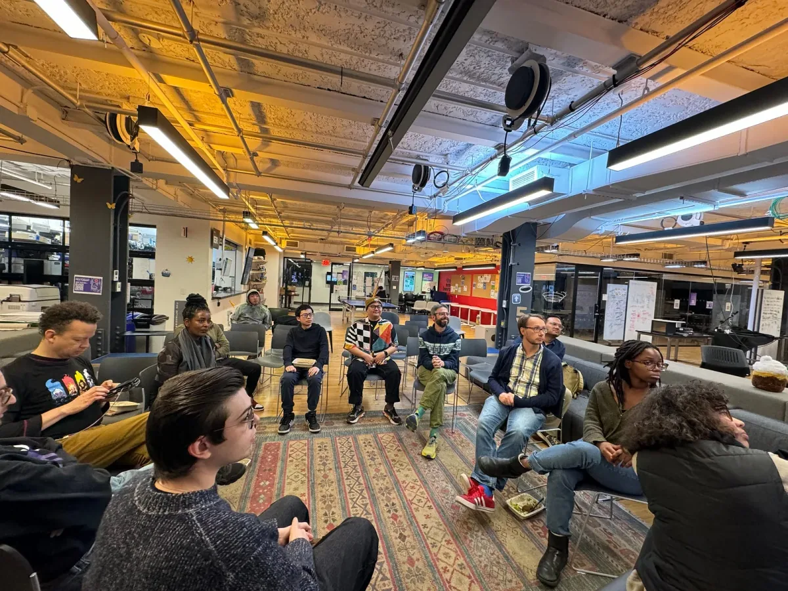

*‘Code and Canvas’ event at NYU ITP*

The success of this year’s fellowship program underscores the role of mentorship, community engagement, and public discourse in shaping the future of digital art, code, education, and technology. Looking ahead, we can’t wait to welcome your future projects and continue to build on the legacy of all the incredible work of these fellows, past fellows, and our Processing Foundation community!

Keep up with us at the Processing Foundation for our Fellowship application announcements in April 2024!
