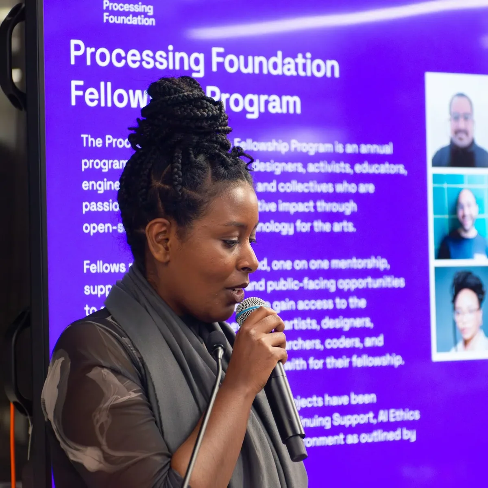
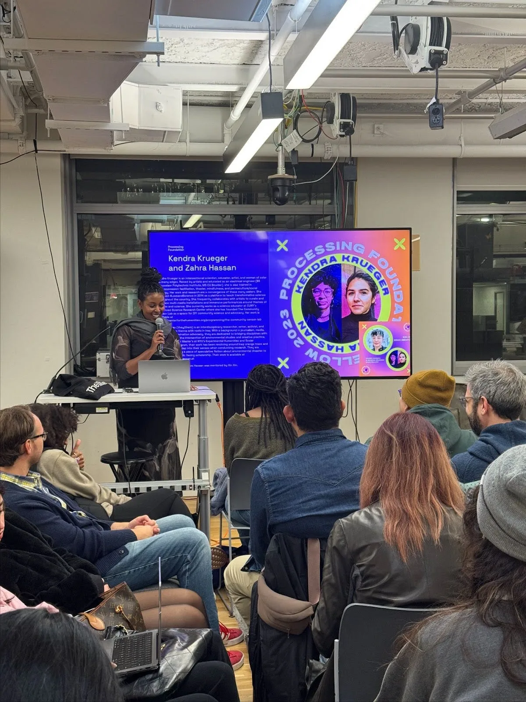
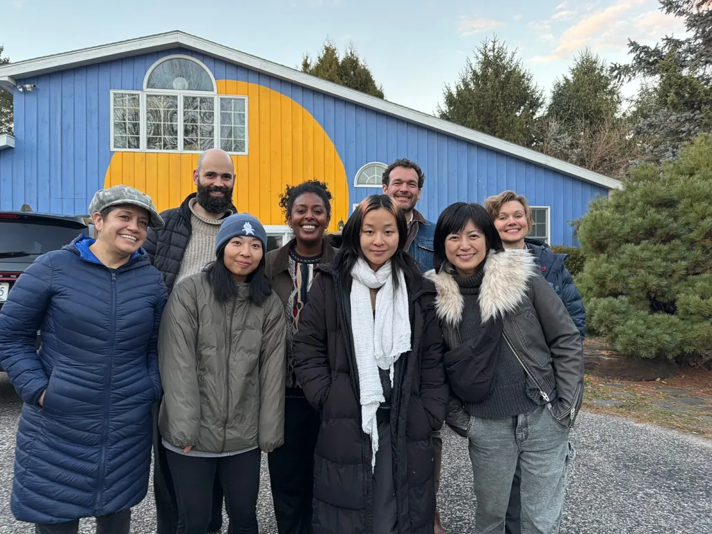
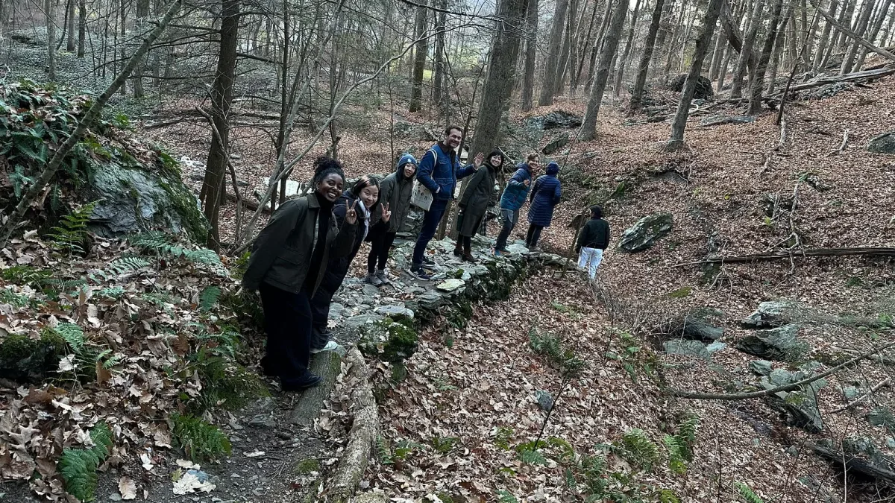
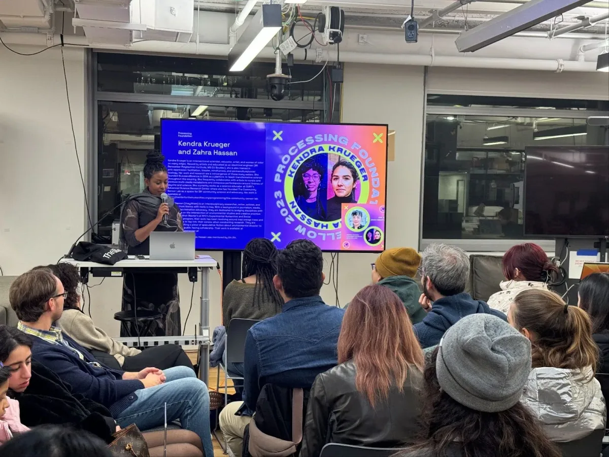

Our dedicated Program Manager, Tsige Tafesse, has played a remarkable role in shaping our fellowship program over the past 3 years. With record-breaking fellowship application numbers reaching [346 incredible applications in 2024](https://medium.com/processing-foundation/meet-our-2024-processing-foundation-fellows-4b7f5ed5d104) and [241 applications in 2023](https://medium.com/processing-foundation/meet-our-2023-processing-fellows-6433037145bd), Tsige has cultivated a program defined by kindness, compassionate criticality, and ingenuity. Her empathetic leadership has helped widen the capacity for the care of our fellows while nurturing a supportive and thoughtful community.

*Photo of [Tsige Tafesse](mailto:tsige@processingfoundation.org) hosting the 2023 Fellowship Presentation at NYU ITP. Photo by Jirui Ryan Han.*

Through her vision and care, the program has expanded in impact and equity. In this short feature, we celebrate Tsige’s achievements thus far in our organization and the lasting legacy she will continue to build as she transitions into her new position as ‘Community and Fellowship Manager.’

  <iframe src="https://www.youtube.com/embed/Zxbb87xAw2s?list=PLMVpERuYgvuhmmD92P9dwaxjr-5I92PQH" frameborder="0" scrolling="no"></iframe>

During Tsige’s 3-year tenure as Program Manager, she directed and facilitated 2 years of fellowship programs at Processing Foundation. She supported the work of 28 fellows in total, along with 20 fellowship finalists and 16 fellowship mentors over the course of 2 years. She organized a celebration of the [10th anniversary of the fellowship program at NYU ITP](https://medium.com/processing-foundation/celebrating-a-decade-of-innovation-the-processing-foundation-fellowship-wrapup-2023-e692ae02869f) as our first-ever in-person fellowship presentation, along with directing a digital fundraiser around the theme of ‘[Decade of Code](https://medium.com/processing-foundation/decade-of-code-annual-fundraiser-572a670179e8)’, celebrating the 10th anniversary of the fellowship program.

  <iframe src="https://www.youtube.com/embed/0ft4XohXIqU?feature=oembed" frameborder="0" scrolling="no"></iframe>

Tsige collaborated with [Yoon Grace Ra](mailto:yoongracera@gmail.com) to produce 8 fellowship videos each year and June Canedo de Souza for the Decade of Code annual fundraiser video. You can find all of our fellowship videos on our [fellowship playlist on Youtube](https://youtube.com/playlist?list=PLMVpERuYgvuhmmD92P9dwaxjr-5I92PQH&si=s-DuUVD4EtLPmxQE).

  <iframe src="https://www.youtube.com/embed/pe9AY9BhsYg" frameborder="0" scrolling="no"></iframe>

  <iframe src="https://www.youtube.com/embed/l9tZrlM2f3Q?list=PLMVpERuYgvuhmmD92P9dwaxjr-5I92PQH" frameborder="0" scrolling="no"></iframe>

Her care, professionalism, and sensitivity have been felt internally and externally, with Tsige organizing and initiating holiday parties and team retreats.

  <iframe src="https://www.youtube.com/embed/LR9K2FMpNHY?feature=oembed" frameborder="0" scrolling="no"></iframe>

*2024 Processing Foundation Team Retreat at [Watershed Center](https://www.thewatershedcenter.org).*

  <iframe src="https://www.youtube.com/embed/f4gq01JUsYw?list=PLMVpERuYgvuhmmD92P9dwaxjr-5I92PQH&amp;start=3" frameborder="0" scrolling="no"></iframe>

Tsige supported organizational shifts with new executive management during a tenuous time at our foundation. During this time, supported and facilitated our [board retreat](https://medium.com/processing-foundation/board-of-directors-and-advisors-retreat-2024-634bf47e3b73). She directed and curated a new theme for last year’s [2024 Fellowship ‘Sustaining Community: Expansion & Access’](https://medium.com/processing-foundation/fellowship-2024-sustaining-community-expansion-access-open-call-b70a52e7e632) with collaboration and feedback from fellowship alumni, Processing Foundation team and board members, and an external review committee. Within the theme were 4 focus areas: Archival Practices: Code & New Media, Open-Source Governance, Disability Justice in Creative Tech, and Access & AI. Outside of our organizational work, she was Inaugurated as an [Arts Leader by Studio Museum in Harlem](https://medium.com/processing-foundation/studio-museum-in-harlem-inaugurates-tsige-tafesse-as-an-arts-leader-8c3ab68fb3d5) — truly a title well deserved.

  <iframe src="https://www.youtube.com/embed/sxtN4kuUa1k?list=PLMVpERuYgvuhmmD92P9dwaxjr-5I92PQH" frameborder="0" scrolling="no"></iframe>

​​

### Gratitude from Fellowship Alumni

*“My experience working with Tsige during the fellowship was amazing — our meetings and conversations were always filled with warmth and kindness. She is such a positive, supportive, and empathetic person. I’m really grateful for her work as Program Manager, and I wish her all the best!” —* [Luís dos Santos Miguel, 2024 Fellow](https://processingfoundation.org/fellowships/fellowships-2024)

*“I remember Tsige as the first ‘face’ of the Processing Foundation I’ve ever directly met, and that was during my Fellowship application process. All I can say is for her warmth, energy, kindness and optimism, I could not think of a better person to embody and represent this vibrant community. Tsige not only shines in her role as Program Manager, with evident strength in connecting dots and bringing people together. But she is also extraordinarily kind and so fun to have a conversation with (and I say this from the other side of the world!). I leave every conversation with Tsige feeling excited, inspired, and hopeful about the work we do. This comes from her genuine enthusiasm and unwavering support that have really defined the dynamic of our Fellowship/Alumni cohort to make it a loving and supportive space — and I’m sure the same for the broader Processing Foundation community. To have someone like Tsige in our corner, I consider all of us so fortunate.” —* [Joanne Amarisa](mailto:joanneamarisa@yahoo.com)*, 2023 Fellow*

*“Tsige has been an inspiration of love and care as well as a lifeline of support. It was such a joy to have her hold space for us and guide us through the development of our project by creating the perfect balance of container and fluidity. Thank you Tsige!! May all your dreams come true!!!” —* [Kendra Krueger, 2023 Fellow](https://processingfoundation.org/fellowships/fellowships-2023)

*“Tsige cares A LOT about people and always makes sure that everyone feels included. From our very first conversation, I already felt the warmth of her kindness, even from halfway across the world. Without Tsige’s encouragement, I wouldn’t have had the confidence to pursue what I am doing today. Thank you, Tsige!” —* [Nhan Phan, 2023 Fellow](https://processingfoundation.org/fellowships/fellowships-2023)

*Photo of [Tsige Tafesse](mailto:tsige@processingfoundation.org) hosting the 2023 Fellowship Presentation at NYU ITP.*

*We are grateful for the incredible impact Tsige has had on our open-source communities. Her empathy, kindness, and brilliance have inspired us and will continue to support our global community. Thank you for sharing your light with us and continuing to shape our journey together!*

*Would you like to support us in shaping our creative open-source tools and fostering an equitable community?* [Donate today](https://processingfoundation.org/donate) *to help sustain and grow the impactful work of our Processing Foundation team members! Your donation supports our organization’s mission to provide self-determined communities with access to creative open-source technology. Thank you for your unwavering support.*
