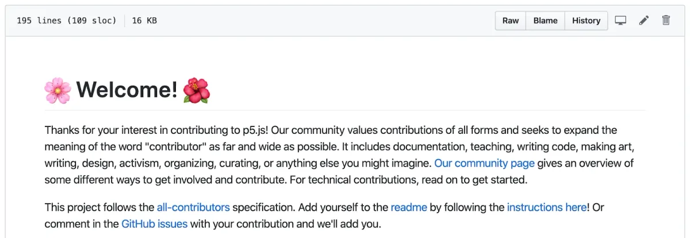
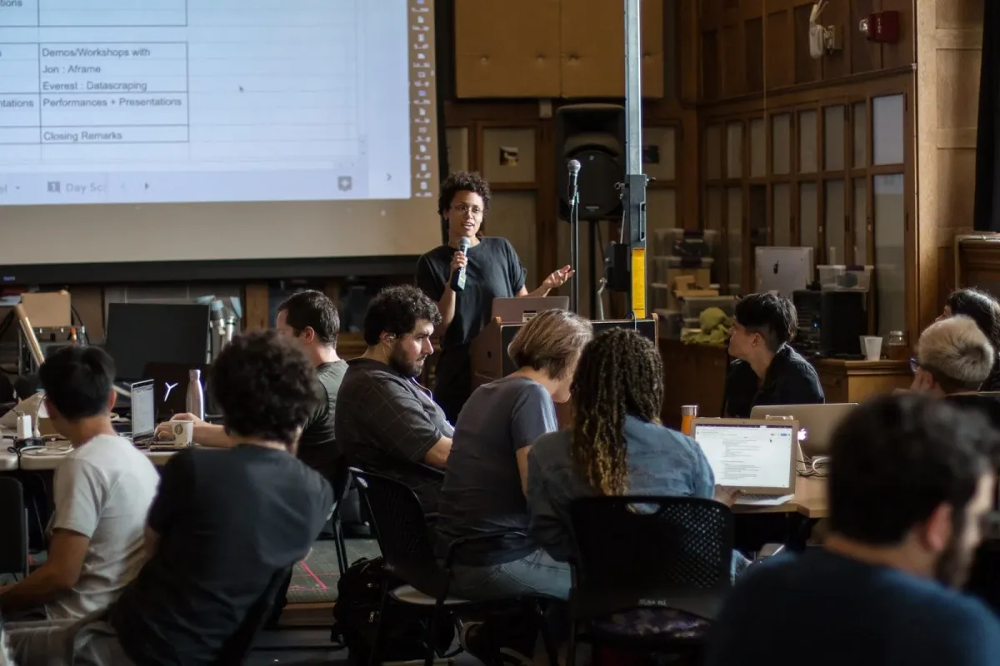
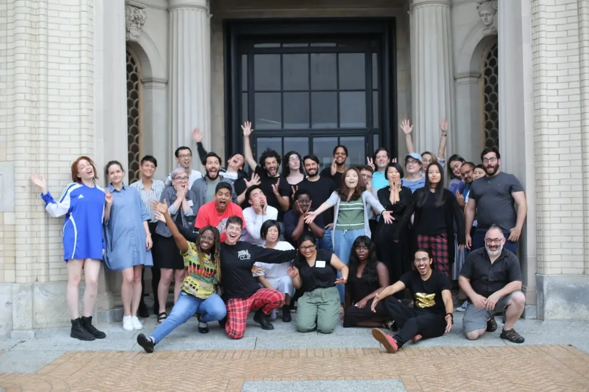
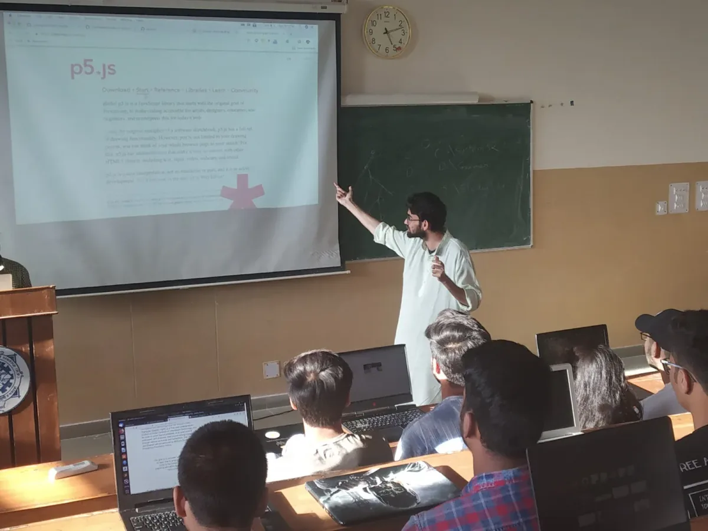
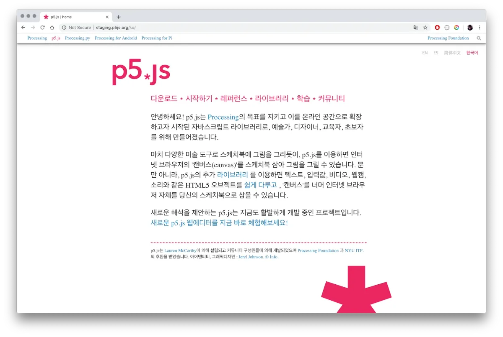
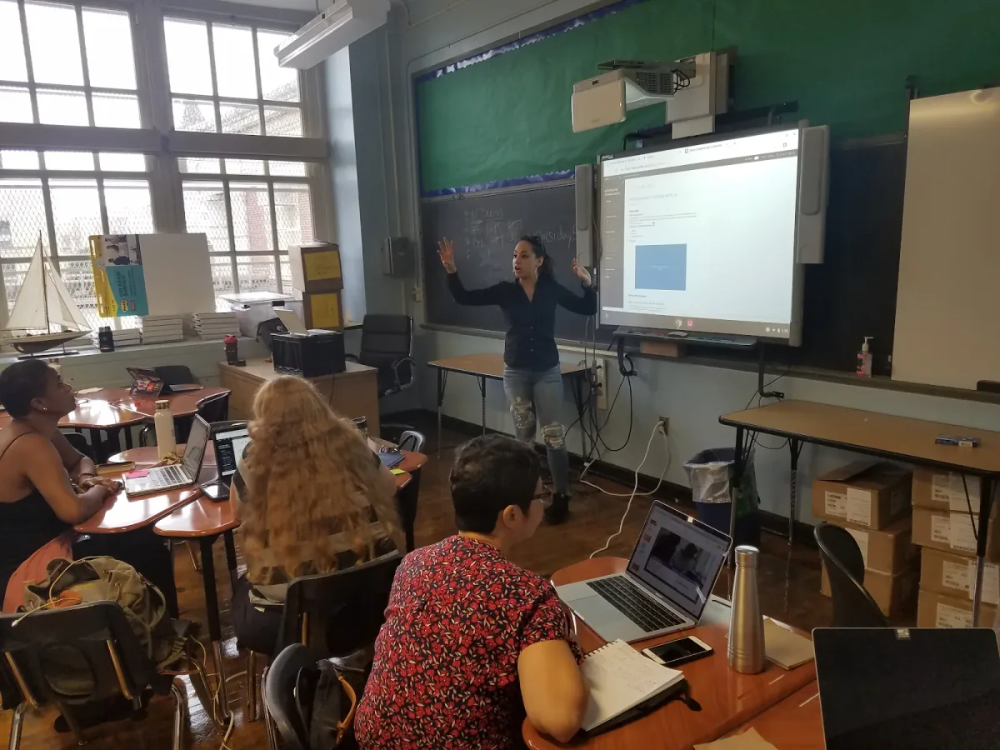
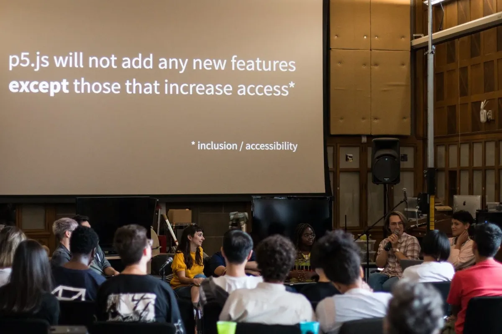
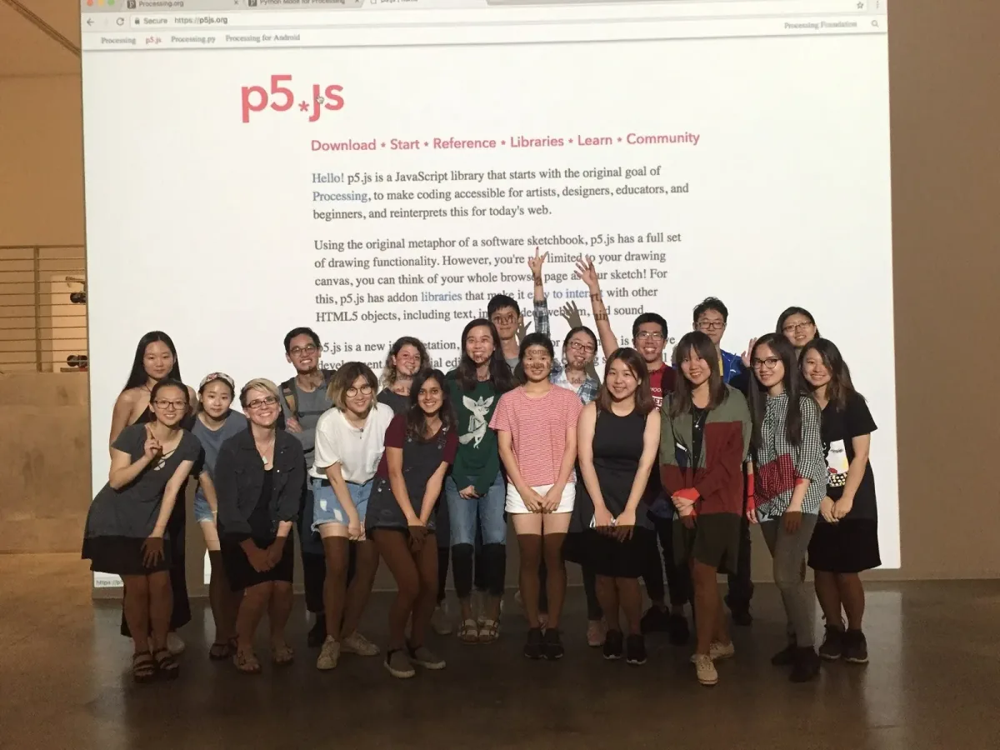

You can read an [English version of the post here](https://medium.com/processing-foundation/p5-js-1-0-is-here-b7267140753a). Puedes leer [la versión en español de este artículo aquí](https://medium.com/@ProcessingOrg/p5-js-1-0-est%C3%A1-aqu%C3%AD-42344aa2b4fd). 日本語版は[こちら](https://medium.com/processing-foundation/%E3%81%8A%E3%81%BE%E3%81%9F%E3%81%9B-p5-js-1-0-%E5%85%AC%E9%96%8B-f8fb9bf1a734)です！

Hoje estamos animados de anunciar o lançamento da versão 1.0 de p5.js! [p5.js](https://p5js.org/) é uma biblioteca JavaScript que busca tornar a programação e a expressão criativa na web acessíveis e inclusivas para artistas, designers, educadores e principiantes. Embora tenham se passado sete anos desde que o projeto p5.js começou, começamos a trabalhar intencionalmente na versão 1.0 há um ano, quando Kate Hollenbach trabalhou numa primeira versão de um plano de ação com este objetivo. Desde então, o esforço tem sido conduzido por [Stalgia Grigg](https://medium.com/processing-foundation/interview-with-stalgia-grigg-2019-p5-js-fellow-6fc40252e0) e [Evelyn Masso](https://medium.com/processing-foundation/interview-with-evelyn-masso-2019-p5-js-fellow-7ac6769704df), em colaboração com Lauren McCarthy, Cassie Tarakajian, Kenneth Lim, e milhares de outros contribuidores de todo o mundo, que se juntaram para trabalhar em todos os aspectos do projeto, incluindo código, documentação, atividades de ensino, alcance da comunidade, produção escrita, arte e muito mais. Refletindo sobre [os valores do projeto p5.js](https://p5js.org/community/), a versão 1.0 não é somente um marco no que tange ao código, mas também um trabalho de base significativo na documentação e comunidade.

### Revisão da biblioteca

No ano passado. trabalhando rumo à versão 1.0, lançamos 5 releases, representando 1,488 commits (cada commit pode ser entendido como uma rodada de mudanças em um ou mais arquivos). [Você pode baixar a nova release em p5js.org](https://p5js.org/download/). São tantas as novidades que tentamos reunir as principais funcionalidades e mudanças abaixo. Se você contribuiu em algo que deixamos escapar, por favor nos avise em hello@p5js.org, que nós incluiremos. :)

-   Suporte para criação de GIF animados usando a função image().
-   Adição de métodos amigáveis para principiantes como circle() e square(), que permitem criar círculos e retângulos, respectivamente.
-   Suporte para (e exigência de) textos alternativos nos métodos de desenho de imagens. Texto alternativo, ou alt-text, é o texto escrito que aparece no lugar de uma imagem numa página web se a imagem não conseguir ser carregada na tela do usuário. O texto ajuda ferramentas de leitores de tela a descrever imagens para leitores com deficiência visual.
-   Atualização de todos os materiais voltados aos usuários e contribuidores do projeto, bem como de toda a base de código e processos de build para usar ES6. Conduzido por Hirad Sab.
-   Introdução de novas ferramentas ao processo de build para garantir a manutenibilidade do código e priorizar a acessibilidade. Isto inclui coisas como linting e validação HTML para cumprimento das [Diretrizes de Acessibilidade para Conteúdo Web (WCAG)](https://www.w3.org/WAI/standards-guidelines/wcag/).

*Visão geral da biblioteca p5.SerialPort. \[Descrição da imagem: diagrama mostrando dispositivos Arduinos conectados a clientes web via biblioteca p5.SerialPort\]*

-   Updates to audio/video functionality and the [p5.sound library](https://p5js.org/reference/#/libraries/p5.sound) led by Jason Sigal to account for new browser requirements.
-   Atualizações na funcionalidade de áudio/vídeo e da [biblioteca p5.sound](https://p5js.org/reference/#/libraries/p5.sound), conduzida por Jason Sinal, para dar conta de novas exigências por parte dos navegadores.
-   [Melhorias no Sistema de Erros Amigáveis (FES)](https://p5js.org/contributor-docs/#/friendly_error_system). O FES é um sistema que principiantes podem ativar na biblioteca p5.js para verificar os tipos de argumentos e detectar erros comuns, provendo explicações mais acessíveis sobre debug de código no console. Atualizamos o FES para oferecer erros mais úteis e intuitivos em toda a biblioteca.
-   Adição de suporte para internacionalização para mensagens de erro amigáveis.
-   Modo WebGL mais robusto. Isto inclui aperfeiçoamento da renderização de texto, do desenho de formas geométricas e da iluminação, melhorando ainda as capacidades de mapeamento de texturas, simplificando e documentando a inteira “pipeline” de gráficos WebGL.

*Uma amostra de uma coleção de testes com p5.js no navegador para testar e melhorar a renderização WebGL. \[Descrição da imagem: Um grid 6x5 de cubos rotacionando em um fundo preto. Cada um dos cubos possui uma textura rosa abstrata.\]*

-   Integração da biblioteca de DOM externa com a biblioteca principal para permitir uma gama de funcionalidades usando elementos HTML como webcam, entrada de microfone, vídeo, áudio, elementos de input do usuário e de seleção de arquivos.
-   Várias correções de bugs e melhorias na documentação em todas as áreas.
-   Revisão, simplificação e documentação do processo de build das releases e ferramentas para melhor sustentabilidade.
-   Realização de exaustivos testes unitários em toda a biblioteca para garantir que o código continue a funcionar com a implementação de novas mudanças.
-   Implementação de bots, actions e templates para GitHub, incluindo um novo bot amigável de boas-vindas para novos usuários e [um template de issues](https://github.com/processing/p5.js/issues/new/choose) para ajudar novos contribuidores.
-   [Uma nova funcionalidade que permite aos contribuidores iniciar enquetes no Twitter a partir de issues do GitHub](https://github.com/processing/p5.js/tree/master/tweets) para encorajar e reduzir barreiras de acesso, visando uma maior participação e discussão na comunidade.
-   Um revisado conjunto de [documentações para contribuidores](https://github.com/processing/p5.js/tree/master/contributor_docs), bem como [um site de documentação para contribuidores](https://p5js.org/contributor-docs/#/), que documenta como o projeto é organizado e governado, e como participar.

*Captura de tela da mensagem de boas-vindas do [arquivo README da documentação oficial](https://github.com/processing/p5.js/blob/master/contributor_docs/README.md). \[Descrição da imagem: Captura de tela com mensagem de boas-vindas em inglês. [Texto completo do arquivo README](https://github.com/processing/p5.js/blob/master/contributor_docs/README.md)\].*

### Editor p5.js

Ao longo de todo esse trabalho, [o editor p5.js](https://editor.p5js.org/), conduzido por Cassie Tarakajian, tem sido peça fundamental em ajudar pessoas de todas as idades e habilidades a começar a criar, editar e compartilhar sketches p5.js rapidamente. O editor, [oficialmente lançado](https://medium.com/processing-foundation/hello-p5-js-web-editor-b90b902b74cf) há pouco mais de um ano, continua a crescer desde então, recentemente superando mais de 1 milhão de sketches criados na plataforma!

  <iframe src="https://www.youtube.com/embed/dtHxDggkBYc?feature=oembed" frameborder="0" scrolling="no"></iframe>

### Conferência de Contribuidores p5.js

Um dos passos chave para o lançamento da versão 1.0 foi a Conferência de Contribuidores p5.js, realizada em agosto de 2019 no [The Frank-Ratchye STUDIO for Creative Inquiry](https://studioforcreativeinquiry.org/), na Carnegie Mellon University, em Pittsburgh. Recebemos um grupo de pessoas extremamente enérgico, diverso e generoso, que vai desde contribuidores de longa data, que estão com a gente desde o começo, até pessoas completamente novas no projeto. Grupos de trabalho focaram em diversas áreas temáticas: Acesso (Inclusão e Acessibilidade); Música e Código em Performances; o panorama atual da Tecnologia Criativa; e Internacionalização.

*Conferência de Contribuidores p5.js, dia 1: co-organizadora shawné michaelain holloway falando com os participantes. \[Descrição da imagem: Uma das pessoas co-organizadoras no palco com um microfone na mão direita enquanto os participantes da conferência a ouvem explicar o cronograma de eventos e atividades da Conferência de Contribuidores p5.js\]*

Alguns resultados incluem:

-   [Uma prova de conceito de um notebook para p5.js](https://github.com/aparrish/nb5js-proof-of-concept). Criado por Allison Parrish.
-   O projeto de um sistema de bibliotecas para o editor p5.js. Criado por Cassie Tarakajian e Luca Damasco.
-   Protótipos para conectar p5.js a outras bibliotecas. Criado por Alex Yixuan Xu e Lauren Valley.
-   [Ferramentas/Toolkit para Contribuidores Globais p5.js](https://docs.google.com/document/d/1NPSVTWlTxWv8_rWLr8j91Qf8CcJA5ns8I8zFjCCmwuk/edit#heading=h.ea0uhs87h6fk). Criado por Aarón Montoya-Moraga, Kenneth Lim, Guillermo Montecinos, Qianqian Ye, Dorothy R. Santos, e Yasheng She.

*Conferência de Contribuidores p5.js, dia 1: participantes conversando. \[Descrição da imagem: em primeiro plano, cinco participantes conversando e rindo juntos enquanto outros participantes, ao fundo, conversam ou mexem no computador.\]*

-   Um grupo de trabalho sobre como escrever código criativo não-violento e [uma zine, conduzido por Olivia Ross](https://docs.google.com/presentation/d/19xxc2zWWdFMAQjT6tRdN5ZU13vAKSwM7jojaC2U4F6Q/edit#slide=id.p).
-   Um painel sobre Gênero e Negritude em espaços virtuais, liderado por American Artist, con shawné michaelain holloway e LaJuné McMillian.
-   Uma reforma do site p5.js para acessibilidade. Incluindo atualizações para acessibilidade usando leitores de tela, com melhorias nas seguintes páginas: Home, Download, Introdução a p5.js e Referência. Com contribuições de Claire Kearney-Volpe, Sina Bahram, Kate Hollenbach, Olivia Ross, Luis Morales-Navarro, Lauren McCarthy e Evelyn Masso.

*Conferência de Contribuidores p5.js, dia 2: Sina Barham, cientista de computação e acadêmico, apresenta sua pesquisa sobre acessibilidade. \[Descrição da imagem: a fotografia foi tirada do alto e mostra os participantes sentados ao redor de mesas móveis, olhando os slides de uma apresentação projetadas em um telão.\]*

-   [p5grid](https://github.com/aahdee/p5grid). A implementação de grids altamente flexíveis com formas de triângulos, quadrados, hexágonos e octógonos para p5.js. Criado por Aren Davey.
-   [p5.multiplayer](https://github.com/L05/p5.multiplayer). Uma série de templates para construir jogos para múltiplos jogadores para diversos dispositivos, onde múltiplos clientes se conectam a um único host. Criado por L05.
-   Experimentos utilizando [P5LIVE](https://teddavis.org/p5live/), testando implementações iniciais de softCompile, interface OSC e conectividade adicional com um demo para seu uso com MIDI. Um ambiente colaborativo de vj para codar em tempo real com p5.js! Criado por Ted Davis.
-   Performances colaborativas realizadas por Luisa Pereira, Jun Shern Chan, Shefali Nayak, Sona Lee, Ted Davis, Carlos Garcia e Natalie Braginsky.
-   Workshops de Data Scraping e narrativas não-lineares conduzidos por Everest Pipkin e Jon Chambers.

*Conferência de Contribuidores p5.js, dia 3: participantes discutem sobre um trabalho criado na plataforma p5Live com seu criador Ted Davis. \[Descrição da imagem: Participantes olhando para um monitor grande que mostra formas geométricas.\]*

Utilizamos considerável tempo na conferência para falar sobre o futuro do projeto p5.js, especialmente sobre sustentabilidade e governança. Juntos, tomamos a decisão de explorar um modelo rotativo de liderança que abriria o projeto a novas perspectivas e direções. Assim a própria atividade de liderança se tornaria menos onerosa, reduzindo barreiras de entrada. Com esta decisão, ficou claro que teríamos que investir significativamente em documentação e infraestrutura para facilitar a transição entre líderes.

*Participantes em uma palestra na Conferência para Contribuidores p5.js. \[Descrição da imagem: Participantes assistem atentamente a uma apresentação na Conferência para Contribuidores p5.js.\]*

*Participantes posam para foto na Conferência para Contribuidores p5.js. \[Descrição da imagem: grupo de participantes diversos na Conferência para Contribuidores p5.js sorrindo e fazendo caretas para uma foto.\]*

### Documentação

Tendo como base a conferência e os debates online, trabalhamos para documentar o projeto, as suas estruturas de organização e governança, assim como as várias maneiras de contribuição ao projeto. Através destes documentos, apresentamos ideias chave para estruturar nosso projeto em torno de conceitos como diversidade, inclusão e construção de comunidade. A documentação pode ser encontrada em diversos lugares:

-   [Página oficial do projeto p5.js](https://p5js.org/) — A estrutura do site e a sua linguagem foram atualizadas para ser mais intuitiva e amigável para principiantes. Também reestruturamos o site completo para ser mais acessível, de acordo com o WCAG. Isto incluiu acrescentar ferramentas ao processo de construção do site que validem páginas HTML e nos alertem de problemas de acessibilidade.
-   Páginas [Referência](https://p5js.org/reference/) e [Exemplos](https://p5js.org/examples/) do site oficial p5.js — A sua documentação exaustiva e amigável é um aspecto chave do p5.js. Foram adicionadas e atualizadas referências e exemplos para que a funcionalidade seja mais clara e fácil de aprender.
-   [Documentação para contribuidores](https://github.com/processing/p5.js/tree/master/contributor_docs) — Trabalhamos em uma pasta de documentação para contribuidores que guia as pessoas por diversos tópicos, como: começando a contribuir com o projeto, acrescentando documentação, criando bibliotecas, etc. Além disso, a documentação explica a estrutura do repositório, os processos que envolvem as releases, as tomadas de decisões, as avaliações comparativas (benchmarking), os testes e muito mais.
-   [Ferramentas para contribuidores globais p5.js](https://docs.google.com/document/d/1NPSVTWlTxWv8_rWLr8j91Qf8CcJA5ns8I8zFjCCmwuk/edit#heading=h.ea0uhs87h6fk) — Um guia para contribuidores internacionais e uma reflexão sobre o que significa contribuir para o projeto p5.js. Este documento trata de oportunidades e problemas, incluindo as implicações colonialistas e neo-imperialistas subjacentes ao tornar este projeto “disponível mundialmente”.
-   [Como escrever código criativo não-violento](https://docs.google.com/presentation/d/19xxc2zWWdFMAQjT6tRdN5ZU13vAKSwM7jojaC2U4F6Q/edit#slide=id.p) — Uma zine que reflete sobre o quadro geral da programação criativa e sobre como abraçar a inclusão, a descolonização, e como descentralizar comunidades dominantes dentro destes projetos e comunidades.

Diferentes contribuidores trabalharam também em muitos projetos documentais e educativos para fortalecer e diversificar a comunidade p5.js.

[Qianqian Ye](https://medium.com/processing-foundation/interview-with-2019-fellow-qianqian-ye-799c0115c295) busca fazer com que p5.js seja mais acessível na China, especialmente para os grupos minoritários como mulheres e pessoas que não se identifiquem com o gênero masculino. Para contrastar o fato de que a maior parte dos materiais educativos on-line, como YouTube por exemplo, são censurados na China, ela gravou tutoriais em vídeo, em mandarim, e os compartilhou em sites de vídeo chineses. Além disso, ela também se aliou a programadoras criativas na China para realizar sketches p5.js para meninas, mulheres e pessoas não-binárias, além de publicar entrevistas com nomes de referência dentro da comunidade p5.js nas redes sociais chinesas.

*Tutoriais p5.js de um minuto, em mandarim, para mulheres aprendendo a codar na China, através de várias plataformas. \[Descrição de imagem: um grid de thumbnails de vídeos da Qtv, que mostra Qianqian Ye no lado direito do frame, com seu computador portátil.\]*

*Captura de tela de um desafio de caligrafia com pincel. \[Descrição da imagem: uma captura de tela que mostra Qianqian à direita. À esquerda, a tela do seu computador, com linhas de código e um sketch p5.js, que reproduz um traço de caligrafia.\]*

-   [Manaswini Das, Nancy Chauhan, e Shaharyar Shamshi](https://medium.com/processing-foundation/interview-with-2019-fellows-manaswini-das-nancy-chauhan-and-shaharyar-shamshi-172127c2e277) trabalharam para empoderar pessoas da comunidade indiana de diversas origens para que possam aprender a programar. Através de seus esforços de tradução para o híndi, foram capazes de prover ferramentas para a comunidade indiana na própria língua nativa e preparar educadores para colaborar com diversas ONGs e indivíduos para construir uma comunidade de software mais diversa.

*Shaharyar Shamshi conduziu um workshop de p5.js para estudantes no Instituto Nacional de Tecnología de Hamirpur. \[Descrição da imagem: um professor aponta para uma projeção do site p5.js na frente da turma. Filas de estudantes com seus computadores abertos observam.\]*

-   [Matilde Wysocki](https://medium.com/processing-foundation/interview-with-2019-fellow-matilda-wysocki-b02f5fef8442) desenvolveu um currículo baseado em p5.js e ensinou programação básica como meio de expressão pessoal e alfabetização digital a jovens sem moradia da comunidade trans e não-binária, em um ambiente de segurança pessoal e de privacidade da identidade queer. Matilde apresentou a sua comunidade conceitos como Design Computacional e Machine Learning, como formas de letramento digital e empoderamento pessoal.
-   Yeseul Song traduziu o site oficial p5.js para o coreano, aumentando assim a nossa gama de traduções, que já inclui o espanhol, o chinês e o hindi (em andamento).

*Home page do site p5.js traduzido em coreano. \[Descrição da imagem: o site oficial p5.js com fundo branco e texto, em uma combinação de preto e magenta, traduzido em coreano.\]*

-   [Layla Quiñones](https://medium.com/processing-foundation/interview-with-2019-teaching-fellow-layla-quinones-3039f10ae761) e [Emily Fields](https://medium.com/processing-foundation/interview-with-2019-teaching-fellow-emily-fields-f324d605def6), orientadas por Saber Kahn, nosso Diretor de Comunidade Educativa, escreveram um currículo para ensinar estudantes como integrar som, animação, movimento e interatividade a artes computacionais criativas em p5.js. Esse trabalho focou no desenvolvimento de ferramentas para professores que têm pouca experiência em ensinar tópicos de Ciência da Computação às próprias comunidades.

*Estudante experimentando um sketch p5.js usando um guarda-chuva e um sensor Kinect. \[Descrição da imagem: uma garota segura um guarda-chuva com luzes. Ela estende a sua mão aberta enquanto olha para cima e observa a chuva digital que cai.\]*

*No Instituto de Ciências da Computação CS4ALL em NY, Layla Quinones treina professores do ensino fundamental para que possam ministrar o curso de Web Creativa, que usa p5.js para ensinar pensamento computacional a estudantes. \[Descrição da imagem: quatro pessoas em uma sala de aula. A professora fala à turma com os braços levantados.\]*

-   [Ashley Kang](https://medium.com/processing-foundation/p5-js-showcase-4a3756528542) criou uma galeria em p5.js para exibir projetos feitos com p5.js ao redor do mundo, com um enfoque em artistas, programadores e criadores de origens sub-representadas. [p5.js Showcase](https://p5js.org/showcase/) será lançado em conjunto com a versão 1.0 da biblioteca p5.js.

*Projeto p5.js Showcase criado por Ashley Kang \[Descrição da imagem: captura de tela do site [p5js.org/showcase](https://p5js.org/showcase/) com texto explicando o projeto e um botão para dar nome a um projeto.\]*

### Próximos passos

Uma das principais decisões que tomamos durante a Conferência de Contribuidores p5.js foi que, seguindo adiante, “p5.js não acrescentará novas funcionalidades, exceto aquelas que ajudem a aumentar o seu acesso (inclusão e acessibilidade)”. Esperamos que este compromisso nos ajudará a focar o futuro da biblioteca em torno de nossas prioridades: inclusão, diversidade e acessibilidade. Acreditamos que isso possa abrir novos diálogos sobre as diferentes maneiras com as quais podemos aumentar o acesso ao projeto p5.js e, ao mesmo tempo, lutar contra as barreiras e estruturas que atuam contra esse fim. Temos uma ampla visão de como a biblioteca p5.js possa fomentar significativamente uma web cada vez mais acessível e queremos seguir investigando, experimentando, prototipando e testando, junto a programadores com deficiências, artistas, estudantes e instituições.

*Conferência de Contribuidores para p5.js, dia 5: Evelyn Masso e Lauren McCarthy apresentam um trabalho realizado com o grupo de acessibilidade. \[Descrição da imagem: Os participantes olham para uma projeção que diz em inglês “p5.js não acrescentará novas capacidades, exceto por aquelas que aumentem o seu acesso (inclusão e acessibilidade).”\]*

Também publicaremos nossa zine de contribuidores no dia primeiro de março. Esta publicação celebrará a todos os contribuidores p5.js e o trabalho que temos feito juntos. Fiquem ligados para mais informações sobre este projeto!

*Coleção de imagens com as contribuições para a zine de contribuidores p5.js 1.0. \[Descrição da imagem: grid de imagens com uma ampla variedade de sketches e cores.\]*

Por fim, iremos adiante com o nosso desafio de abrir o projeto, implementando um novo modelo de liderança rotativo. [Lauren McCarthy deixará o seu papel de líder do projeto](https://medium.com/processing-foundation/making-space-for-the-future-of-p5-js-d3c6bd3da9ac), dando espaço a emocionantes novas ideias e líderes para o projeto. Fiquem ligados para uma chamada aberta para o papel de líder do projeto p5.js ainda este mês.

Mais novidades em breve! Após o lançamento da versão 1.0, esperamos nos aprofundar ainda mais neste trabalho para atrair cada vez mais toda comunidade de forma mais profunda e abrangente. Por agora, gostaríamos de agradecer a todos vocês, artistas, criadores, educadores, seguidores e contribuidores, por fazerem parte deste projeto. p5.js não seria o que é, e nós não seríamos o que somos, sem vocês! ❤

*Contribuidora Kate Hollenbach com seus estudantes. \[Descrição da imagem: grupo de estudantes posando em frente a um telão com o site do p5.js projetado ao fundo. Os estudantes estão sorrindo para a foto.\]*
