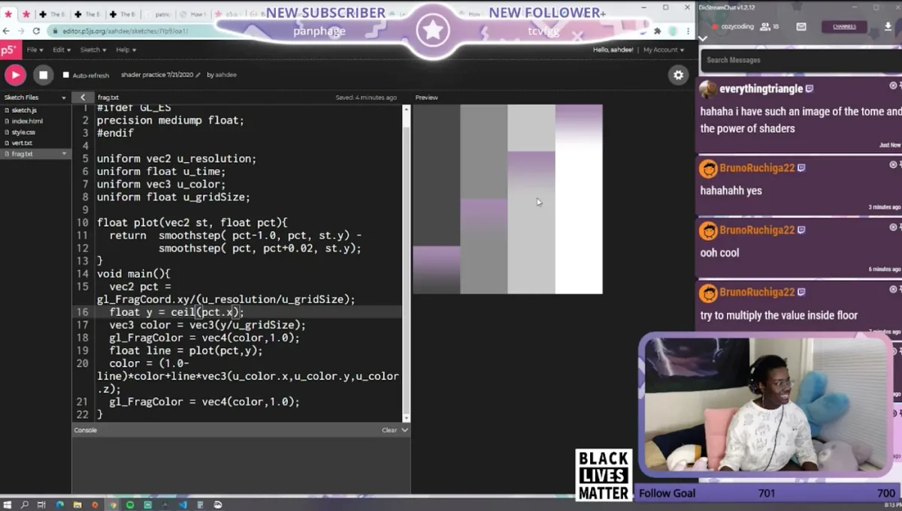
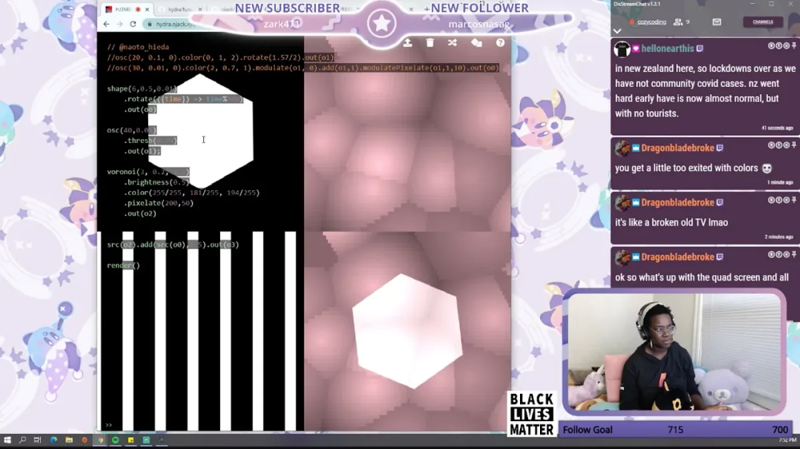
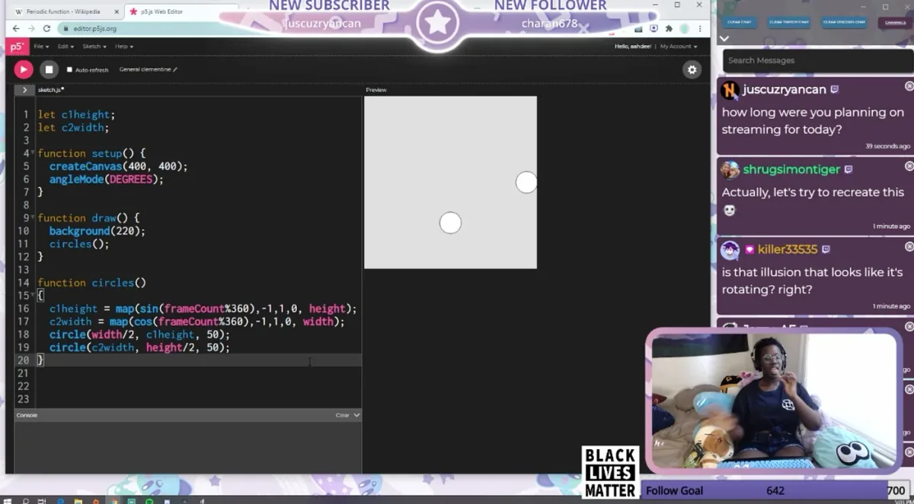

The 2020 Processing Foundation Fellowships sponsored six projects from around the world that expanded the p5.js and Processing softwares and nurtured their communities. In collaboration with NYU’s [Interactive Telecommunications Program](https://tisch.nyu.edu/itp), we also sponsored four Fellows to work on [ml5.js](https://ml5js.org/). Because of COVID-19, many of the Fellows had to reconfigure their projects, and this year’s cohort, both individually and as a whole, sought to address issues of accessibility and inclusion in their projects. Over the next couple months, we’ll be publishing our annual wrap-up articles on how the Fellowship projects went, some written by the Fellows in their own words, and some in conversation with Director of Advocacy Johanna Hedva. You can read about our past Fellows [here](https://medium.com/processing-foundation/https-medium-com-tag-pf-fellowships-la/home).

---

*Experimenting with shaders in p5.js on Aren Davey’s Twitch channel [Cozy Coding](https://www.twitch.tv/cozycoding). Aren Davey is a developer, artist, and aspiring graphic designer currently based in Pittsburgh. She is currently an undergraduate student at Carnegie Mellon University, pursuing a Bachelor of Computer Science and Fine Arts. She strives to break the stereotypes of programming by showing that it can be warm, playful, and spontaneous. In her downtime, she likes to steep tea, play video games, and pay homage to hexagons. Her github is [here](https://github.com/aahdee).*

**Johanna Hedva: Hi Aren! Tell me about your Fellowship project. What were your intentions and goals, and what did you accomplish?**

**Aren Davey**: Hi Johanna. Thank you for having me. While drafting my Fellowship proposal, I wanted to bring a project that made Processing and p5.js accessible. I recalled how I learned about Processing and p5.js, and I realized that it was mostly through a classroom setting that was blocked by a paywall. Without the opportunity to go to Carnegie Mellon, I would have either heard of these frameworks much later in life or never at all. So I wanted to create content that removes that payment barrier. Dan Shiffman’s [Coding Train](https://www.youtube.com/channel/UCvjgXvBlbQiydffZU7m1_aw) is honestly just what I imagined, but I wished that there was more interactivity between the content creator and the viewers. If a viewer has questions or wants to show the creator something cool that they did, they would have to comment under the video and there’s no way to know if they would get an answer or not. I found that there was a disconnect between the two groups. To close that, I decided that creating live p5.js tutorials and journeys on Twitch would work very well! So I created [Cozy Coding](https://www.twitch.tv/cozycoding).

[Cozy Coding](https://www.twitch.tv/cozycoding) is my Twitch channel where I explore different facets of p5.js live with viewers. About three times a week, I start broadcasting myself on my bed surrounded by my large assortment of plushies with lo-fi music in the background. I wanted to create a relaxed, comfortable environment where anyone can come and explore the world of p5.js with me. I wanted to be very approachable to beginners and put more focus on the art that code creates rather than the code itself. I would say, “Your code may look like trash, but right now that doesn’t matter. It doesn’t matter as long as your art looks beautiful.” A few viewers compared me to [Bob Ross](https://www.youtube.com/watch?v=gqdzXNsL_2o) because I would say that, haha. A lot of people really like my streams since I’m very open, I answer as many questions as I can, and I’m open to new ideas and seeing new art. I’m rather glad that I introduced p5.js streams to the Twitch community. I plan to continue my streams into the future and I’m excited to see where it’ll go.

*Hydra in the web browser — in progress. \[image description: The window is separated into four partitions: a white hexagon on a black background, black and white vertical bars, a pink voronoi, and the white hexagon overlaid on the pink voronoi. The chat is displayed on the right side of the screen and the streamer is at the bottom right interacting with the chat while experimenting in the editor.\]*

**JH: What was the most difficult issue you encountered in the project? How did you work through it?**

**AD**: The most difficult problem I encountered was getting my stream starting up on Twitch. I didn’t really know where to start nor how to engage viewers. Also, I tend to get quite a large amount of stage fright, so the anxiety inhibited me from starting to stream. When I got brave enough to start, I did a small Processing demo to a few people, including Dan and Dorothy Santos. It was *very* helpful as it got me used to performing on stream and interacting with people.

After that, I just kept going. I would pick a different facet of p5.js and just experiment and play around with it. I tagged my streams under the Science and Technology section to entice viewers and I really gained a lot of attention. Twitch has this feature called “raiding” where a streamer can choose to direct their viewers to another streamer at the end of a stream. Usually more popular streamers would raid less popular ones. I got raided by a few notable streamers like Instafluff and The Coding Garden, which gave me a decent amount of followers. I joined a Twitch Team called The Live Coders, a team of streamers that all mainly create software live on Twitch. I presented at their virtual conference at the end of June. There, I did a live demo of p5.js and talked about the world of creative coding and what frameworks are used. Currently, I’m at about 800 followers, and I’m grateful for each and every single one of them. To my surprise, some have even subscribed and donated to me! I’ve used the money to make myself more comfortable on stream or buy streaming setup equipment.

Another issue that I ran into was that I found that I was running out of ideas and topics to stream about. I still have this issue now and I think that my problem is that I was too general when I first started. I need to become more specific with my topics. I’m considering setting aside a time where I cover more advanced techniques. Currently I’m streaming about shaders in p5.js, which is something that I’ve never done before, so the viewers are in for a ride with me. We’re going through the Book of Shaders and that’s exciting.

**JH: What’s the future look like for you? Will you continue this work on Twitch, and/or contributing to open source generally?**

**AD**: Yes! I take so much pleasure in streaming and the little community that I created that I want to keep going. I want to expand and create different types of content with my channel while keeping its focus on creative coding and alternative programming. For example, at the start of this week I featured the live-coding tool Hydra, and my viewers and I really liked the experience. I’m on the look-out for other open-source tools, especially the ones that are hosted on the browser, because I want viewers to be able to start hacking as quickly as possible without the pains of setup. I’ve also streamed programming puzzle games like The Cat Machine and Opus Magnum. Those are both video games that have their own unique way of demonstrating theoretical and applied computer science principles that I enjoy playing and my viewers enjoy watching. This channel is my little plant that I think is a breath of fresh air to the programming side of Twitch and the creative coding community, and I plan to keep nurturing it for a very long time.

Due to the pandemic and a multitude of other factors, the future feels a bit uncertain for me. I took last semester off from school to save money (which was a really great idea in retrospect) and I am not too keen on paying full-priced tuition for online classes. I also don’t trust any university to create a feasible infrastructure that supports online learning on such a short notice. So I plan not to enroll in the fall semester as well. I want to go back to school and obtain my degree but doing it online in the middle of a pandemic isn’t the right time for me. I do have a couple of commissions that I am very excited for and I can’t wait for you all to see those as well. I also want to keep working on my gridding library, p5.grid, but I haven’t really had the time to sit down and focus on it.

Open-source tools are how I got to where I am today and I resonate with the idea of creating tools and infrastructure for people to use. It’s why I started my grid library about a year ago. To be a part of something bigger than myself is very grounding for me, and I view it as giving back to the community that supported me. I’d love to work on the development of upcoming and current open source software and I’ve been looking at a few frameworks.

*Time-based animations: a past Cozy Coding stream that features an animation demo in the p5 web editor. \[image description: The sketch has two circles that move in straight lines such that their paths are perpendicular. The chat is displayed on the right side of the screen and the streamer is at the bottom right interacting with the chat while experimenting in the editor.\]*
