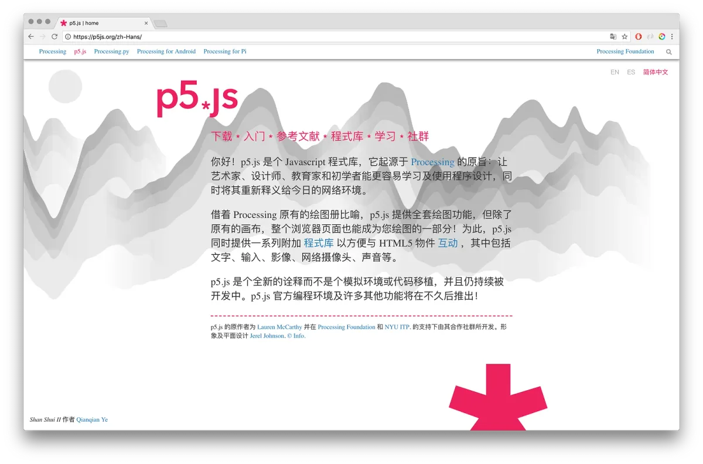
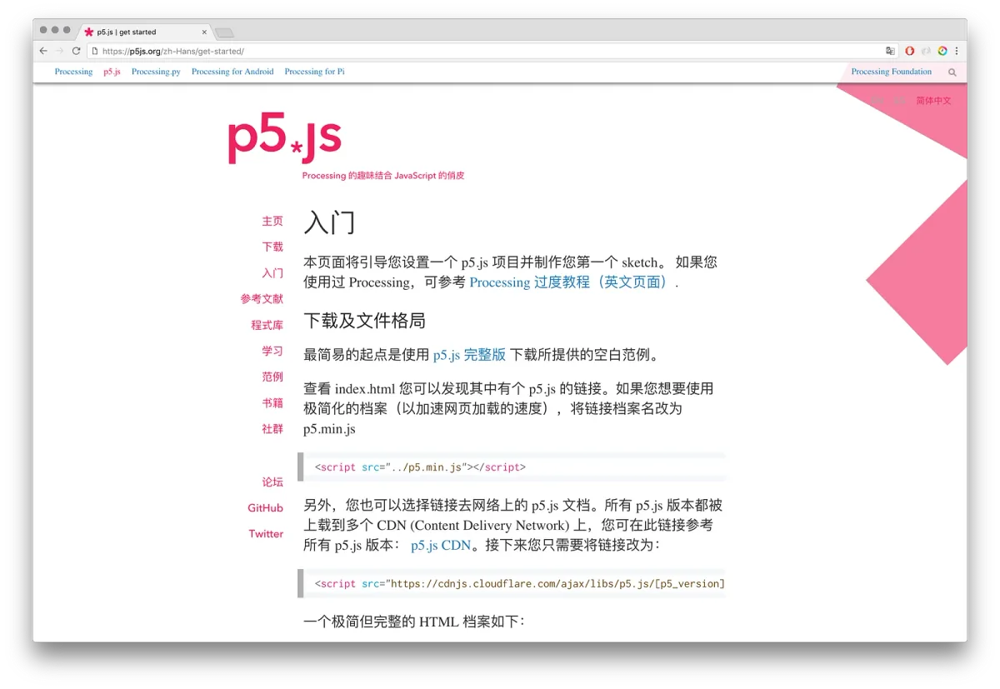
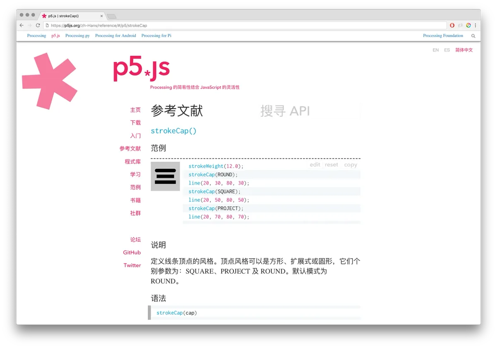

2018 Processing Foundation Fellow

以参阅此文章的中文版本，请点击[此链接](https://medium.com/processing-foundation/p5-js-%E7%9A%84%E4%B8%AD%E6%96%87%E7%BF%BB%E8%AF%91-%E4%B8%BA%E6%94%AF%E6%8C%81%E6%9B%B4%E5%A4%9A%E7%A7%8D%E8%AF%AD%E8%A8%80%E7%BF%BB%E8%AF%91%E5%81%9A%E5%87%86%E5%A4%87-a0fa94da770f).

Chinese copy editing by [Hye Min Cho](https://hyeminchocho.com/).

---

*The 2018 Processing Foundation Fellowships sponsored* [*eight projects*](https://medium.com/processing-foundation/introducing-the-2018-processing-foundation-fellows-a16ae4e87f80) *from around the world that expanded the p5.js and Processing softwares and their communities. Fellows developed work ranging from Chinese translation of the p5.js website, to workshops that teach smartphone coding in Ghana. During the coming weeks, we’ll post interviews with the fellows, in conversation with Director of Advocacy Johanna Hedva, that showcase and document the great work by this year’s cohort.*

---

*Homepage of the [p5.js website](http://p5js.org) in Simplified Chinese. \[image description: English and Chinese text on the homepage of the p5.js website.\]*

**Johanna Hedva**: Can you introduce us to what you set out to do with your fellowship work, and what you accomplished during that time?

**Kenneth Lim**: For my fellowship work, the overall aim was twofold: first, to translate the [p5.js website](http://p5js.org) into Chinese to improve community outreach amongst native Chinese users; second, to improve upon the current framework for translating the website by creating tools and conventions for future translations and for maintaining existing translations. The scope of the project is very wide, which contributes to part of the challenge.

When talking about written Chinese, there are actually two major variants depending on location and culture: Simplified Chinese and Traditional Chinese. For this project, I decided to focus first on Simplified Chinese and, once that has become relatively stable, to start working on Traditional Chinese translation with feedback from the community. The decision to start with Simplified Chinese first is simply because I use it more often in my daily life, so I have a much more intuitive understanding of the subtle differences and nuances behind things like terms used and punctuation. As such, I have managed to translate almost every page on the p5.js website into Simplified Chinese, with the exception of individual examples (to be continued after the fellowship).

*p5.js Getting Started page in Simplified Chinese. \[image description: Chinese text of the Getting Started page on the p5.js website.\]*

In terms of tooling, Chinese translation-wise, I have compiled a [wordlist/glossary](https://docs.google.com/spreadsheets/d/1yowXBskrVbCCrKtCRel3LTta_t3oXJN_RkK4AOchLGM/edit?usp=sharing) meant to provide consistency the same way a code style enforces consistency in a piece of code. This way, the writing can be in a consistent tone, which will reduce confusion among users. I have also started work on a tracking system for any languages’ translations. As the library itself continuously evolves, the website can change a lot in a short period of time, and if the translations are not updated regularly, they will drift out of sync with the original. I have implemented a rudimentary translation-tracking system for all the main pages of the website so that whenever any English text on them is modified, the system will mark that particular line as requiring a translator’s attention for update.

The reference and examples both have rather unique rendering methods which makes the translation job and building the tracking system more difficult, but as part of the fellowship, I have begun overhauling the reference rendering system in order to simplify and prepare it for translation tracking.

Over the course of the fellowship, I may have done a lot in terms of translation, but there is still much that needs to be done to make the task of future translation easier!

**JH**: We’re excited to have p5.js set up to be translated in other languages, and we’re particularly thrilled about its translation into Chinese. Can you speak to why the Chinese translation is so needed?

**KL**: I am very privileged to be natively bilingual, but much of the world isn’t. In the history of computing, almost all computing-related things are in English, which puts any non-English speaker at a disadvantage. I myself began learning programming years ago by reading whatever programming tutorial books were available in Chinese that I could find in my school’s library. This experience of learning programming in your own native language is what I wanted to bring to p5.js.

This way, no matter your native language, you won’t need to learn much English to get started with p5.js, and programming in general. This project is not just about doing a Chinese translation, but also about building a framework that can support more translations, which will lower the difficulty level one needs to get started with p5.js.

*Reference page for strokeCap() in Simplified Chinese. \[image description: Chinese text for the strokeCap() entry on the p5.js reference page.\]*

**JH**: What are some of the challenges of this kind of work?

**KL**: No matter which language you’re dealing with, natural language translation is still something that requires a human touch. Machine translations like Google Translate can do well on short phrases and words, but they still struggle with longer sentences and complex ideas. There are also many nuances in the original that a translator needs to know before they can make the correct call.

I used to work as a localization tester for video games. Unlike the game’s translator who only had access to the original script, as a tester, I’d have the video game and its translation, which meant I had the context for the translation itself. Quite often there were cases where putting the translated text into the context of the game made it obvious that the translation was inaccurate, though if you were to simply compare the original script and translated script, the translation would technically make sense. That is something I paid particular attention to when doing translation here: not just focusing on the meaning of the text but the context that surrounds it.

One thing I particularly aim for is to make the translation feel as native as possible, to be able to have a native speaker read this piece of translation and not being conscious that it was translated from English.

**JH**: What’s the future of this project, both in the short-term and how you envision it developing over time?

**KL**: In the very short term, the first thing that needs to be done is to translate individual examples into Chinese, and I [welcome the help](https://github.com/processing/p5.js-website/wiki/Adding-examples) of the community with that!

Over time, I want to finish creating a robust translation-tracking system to aid future translations and for maintaining existing translations. Hopefully that will lead to Traditional Chinese translations, and implementing more translations into the p5.js website as the project’s community grows. I myself will continue to maintain the Chinese translation as much as I can.
