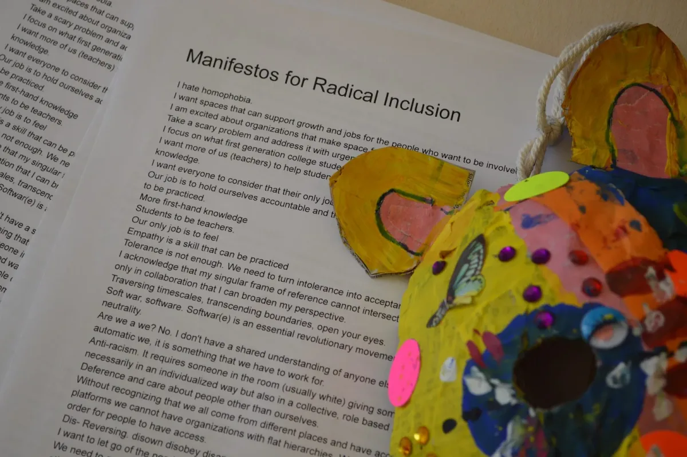
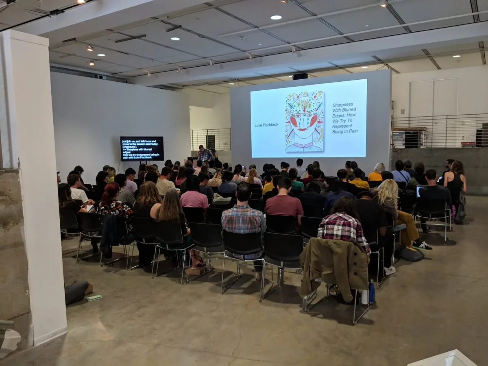

[Processing Community Day @ Los Angeles](https://day.processing.org/pcd-la-tracks.html) *— a day to celebrate art, code, and diversity — took place on January 19, 2019, at UCLA. This week we’ll be posting a series of reflections and interviews with the day’s participants and contributors.*

*[Manifestos for Radical Inclusion](https://medium.com/processing-foundation/manifestos-for-radical-inclusion-842f3e74eca6) was part of PCD@LA, posted around the space and handed out to participants. \[image description: A stack of papers on a desk titled “Manifestos for Radical Inclusion.” Some of the text can be seen. It reads, “I hate homophobia. I want spaces that can support growth and jobs for the people who want to be involved…” More first-hand knowledge. Students to be teachers. our only job is to feel Empathy is a skill that can be practiced…..” The full text can be found at [this link](https://medium.com/processing-foundation/manifestos-for-radical-inclusion-842f3e74eca6). A papier-mâché sculpture with brightly colored paint, stickers, and sequins is sitting on top of the pages.\]*

**Johanna Hedva: Can you describe your presentation and the track it was part of?**

**Rachel Simanjuntak**: My talk was about care, and part of the Accessibility, Disability, and Care track. I began by sharing how letters from my older siblings helped me recover from childhood abuse. Having suffered the same abuse that I did, they were able to see where I was struggling and speak directly to it. I also believe that as my siblings wrote the letters, they were processing their own experiences with trauma. My talk was very personal, but I hoped the audience would hear my story and recall a moment where they felt truly cared for. I believe that feeling is the foundation for thinking of code as care.

**JH: How did you first become interested in the topic?**

**RS**: Because of my childhood and my family’s origins, I’ve been acutely aware of care from a very young age, because I either needed it myself or I saw the ways that the need went unmet in my family. As an adult I see some of the same patterns repeating in the world. I feel an urgency to return the same level of energy and care that I received as a child back to the people around me.

**JH: How did you become part of PCD@LA 2019?**

**RS**: I heard about PCD through the alumni network at the School for Poetic Computation. I visited the PCD website and saw organizer Xin’s open call for speakers. After watching the info session, I was drawn to the ADC Track because of a question Taeyoon asked: “How can coding be a form of care?” I’d been thinking a lot about what it means to care for one another and to do it *well*. I was excited to explore how code is part of that conversation. Despite having very limited speaking experience, I decided to apply. Taeyoon later contacted me to expand on my initial talk description. I did and was accepted!

**JH: Did you feel it went well?**

**RS**: I think it went well, considering the journey behind the talk. I discovered that there’s a lot that I want to say about care, but it often hindered the writing process. The talk forced me to confront a lot of my own issues. This helped because I reconnected with my past and remembered the letters my siblings wrote to me. In other ways, I felt like I was trying to say too much and worried about convoluting my main points. It wasn’t easy.

**JH**: **Was there anything you’d do differently?**

**RS**: If I ever give this talk again I would definitely edit and practice more to keep the path to each point clear. I would also incorporate a few slides. I chose to present without them, hoping to connect more with the audience, but there are a few images that I think would have been extremely beneficial. Like the reference I made to [Marcus Fleming](https://www.instagram.com/poetechs/)’s piece “[Help Desk](https://www.instagram.com/p/BqGTq49AKkO/).”

*Luke Fischbeck delivers his talk called, “Sharpness With Blurred Edges: How We Try To Represent Being In Pain.” He included images from a database of artworks made by chronic pain patients. \[image description: An audience listens to a person delivering a talk at a lectern. On the wall is a large projection with an image of a drawing. The drawing is of a face, head, and shoulders, and has many colored lines and shapes and red arrows intersecting with the figure. The text on the image reads: “Luke Fischbeck. Sharpness With Blurred Edges: How We Try To Represent Being In Pain.”\]*

**JH: What did you learn from the other speakers in your track?**

**RS**: I learned from so many people in the months leading up to PCD! In the ACD track specifically, I was very excited to hear from Luke Fischbeck, who gave a talk called “Sharpness With Blurred Edges: How We Try To Represent Being In Pain.” I read his talk description and it reminded me that caring for someone is not always about big gestures — sometimes it’s recognizing that something as complex as pain is being represented in a very flat, two-dimensional way. And so, paying attention and questioning what’s around you became a part of my talk!

**JH: What was your favorite part of the day?**

**RS**: My favorite part of the day was the welcome. I’ve never used Processing before in my life so I was a ball of nerves that morning. I was afraid of being judged, of my talk being too simple, or not fitting in. After seeing how inclusive and supportive the community was, and resonating so much with the community’s values, I was finally able to focus on the day’s amazing content!

---

*When it comes to war (figuratively speaking),* [Rachel Simanjuntak](http://rachelksim.com/) *has learned that she is not built for the front lines. She is more like the medic — dealing with the aftermath and seeing things from between. It’s not the most glorious position, but there’s power here. She can feel it.*
