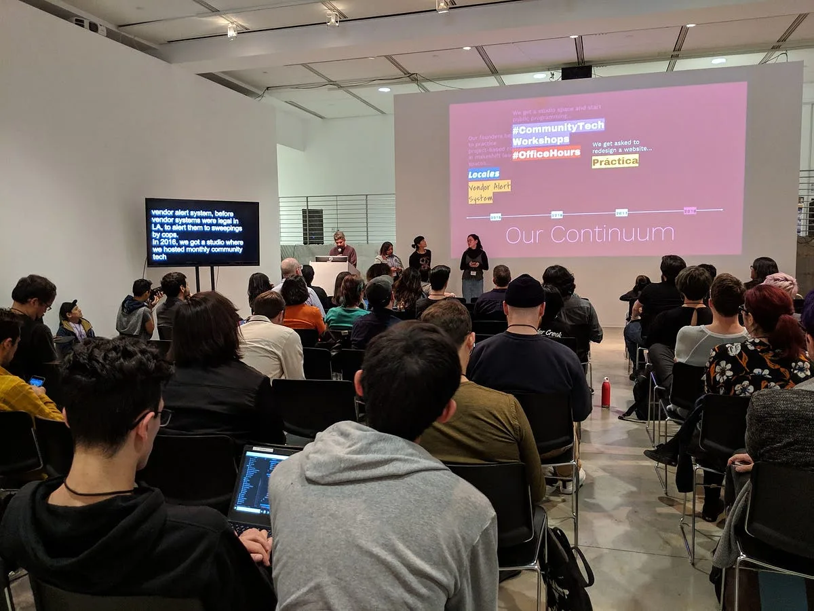
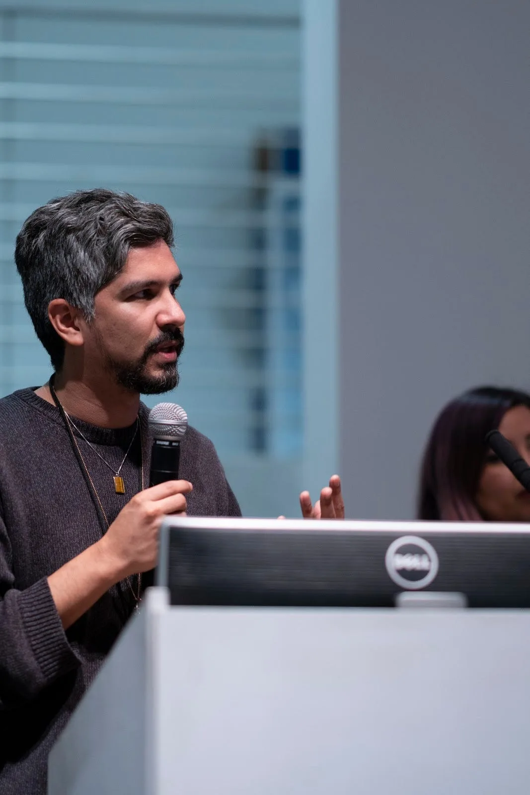
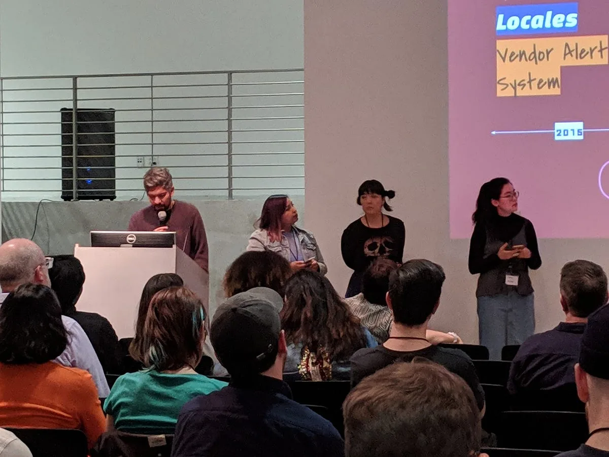

[Processing Community Day @ Los Angeles](https://day.processing.org/pcd-la-tracks.html) *— a day to celebrate art, code, and diversity — took place on January 19, 2019, at UCLA. This week we’ll be posting a series of reflections and interviews with the day’s participants and contributors.*

*Color Coded members talking about their “Vendor Alert System” project made to alert vendors of city sweeps before street vending was legalized. \[image description: An audience watches a group of four people deliver a presentation. On the right, projected on a wall, is a slide that shows a diagram of a timeline labelled “Our Continuum,” with the following keywords above it: “Locales, Vendor Alert System, #CommunityTech, #Workshops, #OfficeHours, We get asked to redesign a website, Práctica.” On the left is a screen with CART captioning. It reads, “…vendor alert system, before vendor systems were legal in LA, to alert them to sweepings by cops. In 2016, we got a studio where we hosted monthly community tech….”\]*

**Johanna Hedva**: Can you describe your presentation and the track it was part of?

**Color Coded**: “Business as Usual, CANCELED” was the name of our presentation for the Radical Pedagogy track. We talked about how our collective formed out of growing disillusion with “business as usual” in our chosen fields, as well as the realization that being dependent on the current economic system is dangerous and hazardous to our health and to our lives. We are all POC (artists, programmers, activists, and educators) who formed around the belief that #TechIsNotNeutral, meaning technology is created by real people with real biases, which shapes what is created. #EverythingIsByDesign and we believe that we need to #EmbodyAbolition in order to #BuildManyWorlds.

Through the need to survive, we have started to navigate our own way by choosing to collaborate with one another to advance sustainable, community-centric projects #ForUsByUs. Our commitment to relying on the community’s funding and support means we don’t depend on or need the permission of big tech companies to learn and build the tech we want for our communities. We want to move #BeyondDiversity into real steps toward reparations for systemic inequalities, like the racial wealth gap that has been created over centuries of racist policies in this country.

We’re rooted in LA so we want to build alongside our community and help LA folks realize their ideas. So we created #LevelUpLA Trainings, which is a series of short classes for small cohorts of our community members to learn the skills they need to build the tech they want to see. We offer trainings in design with lessons in typography, image making, designing narratives, and mapping design experiences. We are committed to design justice, which [“centers people who are normally marginalized by design.”](https://designjusticenetwork.org/network-principles/) We offer trainings in web development fundamentals, like learning HTML, CSS, and JavaScript, to deep-dives into how databases work, or trainings in how to translate your product ideas into a tech project that you build with whatever resources are available.

Our trainings are community-centric, with courses devoted to building infrastructures, to supporting community organizing efforts, to learning how to fundraise using digital tools, to learning how to build databases to stay in touch and communicate effectively with your community. Our trainings are affordable, offered at around ten percent the cost of traditional boot camps. Most of our community members are employed full-time, supporting families, or maybe have a number of side hustles. Our trainings are designed to fit into busy schedules. Our cohorts reflect the values of our collective. We build safe spaces for historically marginalized communities to learn. We value difference, whether that be in racial backgrounds, learning styles and abilities, languages or accessibility needs.

*One of Color Coded’s founding members Chris, presenting. \[image description: A person holds a microphone in front of a computer and speaks, gesticulating with their other hand. Behind them, out of focus, is part of another person’s face.\]*

**JH**: How did you first become interested in the topic, and how did you become part of PCD@LA 2019?

**CC**: Radical Pedagogy was a perfect topic for Color Coded because it started out with three members getting to know each other, teaching each other how to code, and how to organize. Initially, our learning together was project-based. We developed Locales, a showcase of locally owned mom-and-pop businesses run by people of color. We also worked on ideas for a Vendor Alert System (this was before street vending was finally legalized). It was going to be a simple system to alert vendors whenever city sweeps were happening. We found out about PCD@LA through one of our members, Ashley, who shared the open call in our Slack. Ashely felt it was worth a shot after catching PCD director Xin Xin in the info session last August. Xin mentioned that they wanted to find interesting voices that didn’t need to be used to applying to calls for proposals. Some of our members got together and put a proposal together for a workshop. We didn’t end up getting a workshop spot but were invited to present a lightning talk.

**JH**: Did you feel it went well? Was there anything you’d do differently?

**CC**: We were happy with our presentation and the opportunity to present. Even though it was only a nine-minute presentation, we had four collective members present together. We like to create and do things together, so we chose to have many voices in our presentation. Do anything differently… maybe we could have practiced our lines a few more times so that we did a little less reading and more engaging with the audience, but it was good practice.

**JH**: What did you learn from the other speakers in your track?

**CC**: One of our members, Chris, was really impressed with A.M. Darke’s approach to radical pedagogy in the higher ed space, and the way they’re bringing in the concept of co-creation into their gaming classes. Definitely, an inspiration as they think about how to design curriculum that’s more empowering for everyone, teachers, and learners.

*Four Color Coded members presented at PCD@LA. Left to right: Chris, Arlene, Aya, and Ashley. \[image description: An audience watches four people present. One stands at a podium holding a microphone. The other three are to the right. Behind them is a large wall with a projection. We can see only a corner of the slide being projected there. It reads, “Locales, Vendor Alert System, 2015.”\]*

**JH**: What was your favorite part of the day?

**CC**: Our member Aya attended PCD with a six-year-old, and the fact that we got to fully participate in an event together where we both got to learn was really fun. We got to participate in a workshop that introduced her to facial recognition technology, and more importantly how to trip up the technology when we don’t feel like participating. That was awesome. She got her own name tag and lunch box, and it was special for her to get all of things. It made her truly a part of the day.

For member Ashley, the Community Open Mic at the end of the day was truly special. Artists and educators signed up to share for a few minutes what projects and plans they’ve been working on and need help with. At some point, a few attendees were asked to come up because they’d been making PCD2019 @ Shanghai, Denver, Minneapolis, Chicago, Amsterdam, Utrecht, Lahore, and NYC happen! The time gave her a sense of how much and how far the values of Processing resonate. She hopes to see more pins on the PCD map soon and that PCD would spark a sense of community, curiosity, and fun wherever it happens next.

---

[Color Coded](https://colorcoded.la/) *is a tech learning space for people of color of all identities. We are a transformative space that centers historically excluded people in the co-teaching, co-creation, and co-ownership of new technologies. Through our projects and programming, we aim to expand mainstream definitions of technology so that they represent multiple forms of cultural production & creative strategies. We build tech that strengthens, rather than obscures, our ancestral knowledge. Our work supports and amplifies groups and individuals who are uplifting and sustaining communities of color in Los Angeles and beyond. Together, we advance sustainable, community-centric projects to stay lifelong learners, protect our families, defend our hoods, decolonize and indigenize, liberate ourselves, grow collective wealth, and simply thrive!*
