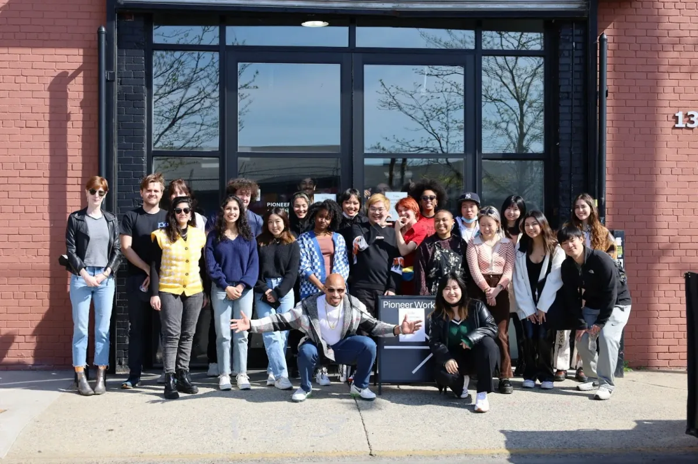

*Workshop facilitators and participants gathering for a group photo in front of Pioneer Work at Red Hook Labs*

[Code, Decolonized](https://docs.google.com/document/d/1BKmgg7zF4nuuMqGctO0OTIQmBxKO2OrvzYgvnSl2JD4/edit?usp=sharing) is a teaching practicum course offered at Parsons Design & Technology at the New School. Initiated by [shawné michaelain holloway](http://www.shawnemichaelainholloway.com/) and [Xin Xin](https://xin-xin.info/) in 2021, the project researches, experiments, and practices new ways of learning and teaching programming languages for the web through perspectives that are traditionally overlooked and under-recognized in the technical classroom.

In 2022, Xin Xin co-taught the spring semester course with new Code, Decolonized member Dejohn Huffman, who brings in a breadth of experience in community organizing and trauma-informed training. The course centers discussion of pedagogy from both theoretical and practical frameworks, and is structured to transition students into teaching roles. After receiving feedback from Processing Foundation mentors [Saber Khan](https://www.edsaber.info/), [Lauren Lee McCarthy](https://lauren-mccarthy.com/), [Dorothy R. Santos](https://dorothysantos.com/), and [Xiaowei R. Wang](https://www.xiaoweiwang.com/), Code, Decolonized students collaborated with [POWRPLNT](https://www.powrplnt.org/) to facilitate a two-day public symposium at Pioneer Work / Red Hook Labs at the end of April.

This post recaps the workshops designed and facilitated by Code, Decolonized students, with external links to dive deeper into the workshop materials.

### Instructors’ Bios

*Dejohn Huffman*

Dejohn Huffman (he/him) is a lifelong nurturer of all walks of life and specializes in community engagement. He has been committed to building bridges across the tech divide for over 8 years. Dejohn is a BPI Bard College alumni, adjunct lecturer at Parsons school of design, SOS Survivor of The System administrator, former NYC Health + Hospitals Contact Tracer-II, and Community Outreach Specialist who helped the city regain its independence from the clutches of COVID-19. His drive to change the tech narrative has been paramount in his desire to find new and innovative ways to introduce technology to marginalized spaces in the inner city communities. He champions the proper balance of sensitivity toward the impact of race/ethnicity, gender, sexual orientation, and gender identity in his teachings. His current efforts continue to reflect his commitment to enhance diversity, equity and inclusion in the tech sector for all. Inclusion for him is not just something to be achieved, talked about, or theorized — it is the source of his growth and his best opportunity to continue to give back.

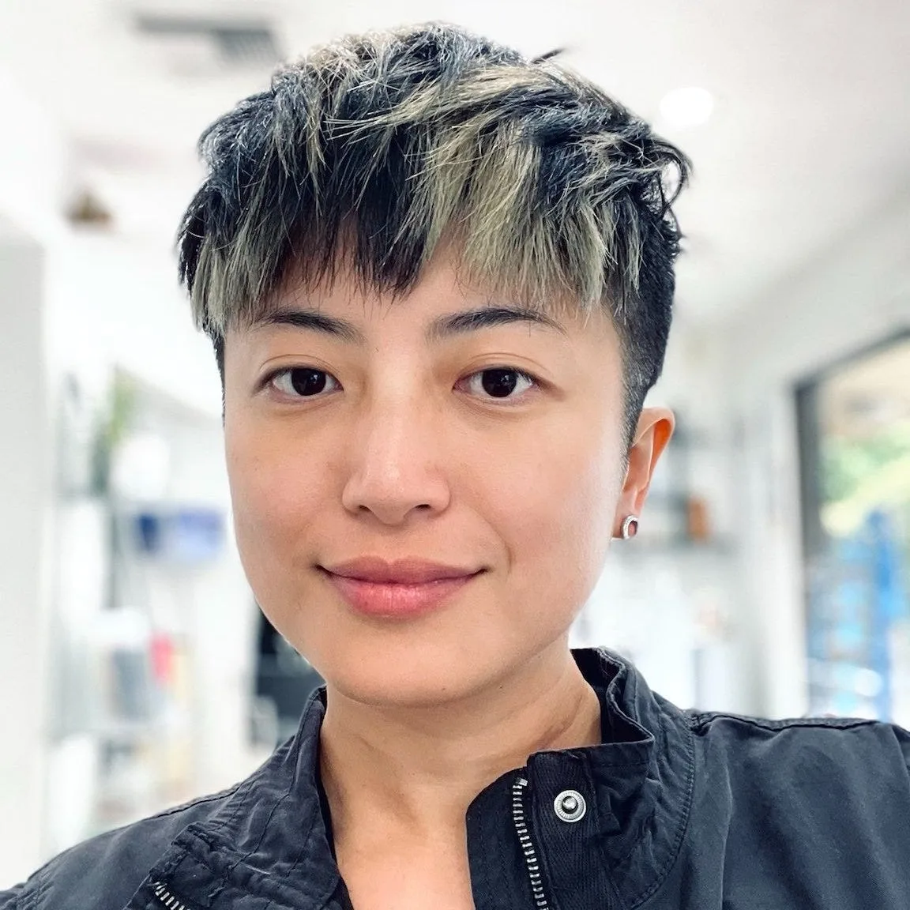

*Xin Xin*

[Xin Xin](https://xin-xin.info/) (they/them) is an interdisciplinary artist, designer, and organizer currently making socially-engaged software that explores the possibilities of reshaping language and power relations. Through mediating, subverting, and innovating modes of social interaction in the digital space, Xin invites participants to relate to one another and experience togetherness in new and unfamiliar ways.

Born in Taipei, Taiwan and raised in Massachusetts, United States. Xin identifies as a cross-cultural, non-binary, anarcho-feminist and will probably always have a genre-nonconforming practice. Xin received their M.F.A from UCLA Design Media Arts and teaches at Parsons School of Design as an [Assistant Professor of Interaction and Media Design](https://www.newschool.edu/parsons/faculty/xin-xin/).

### Jump into Drawing with p5.js: Cartesian Coordinates and 2D Shapes

Led by Aamina Palmer & Yiwen Xu

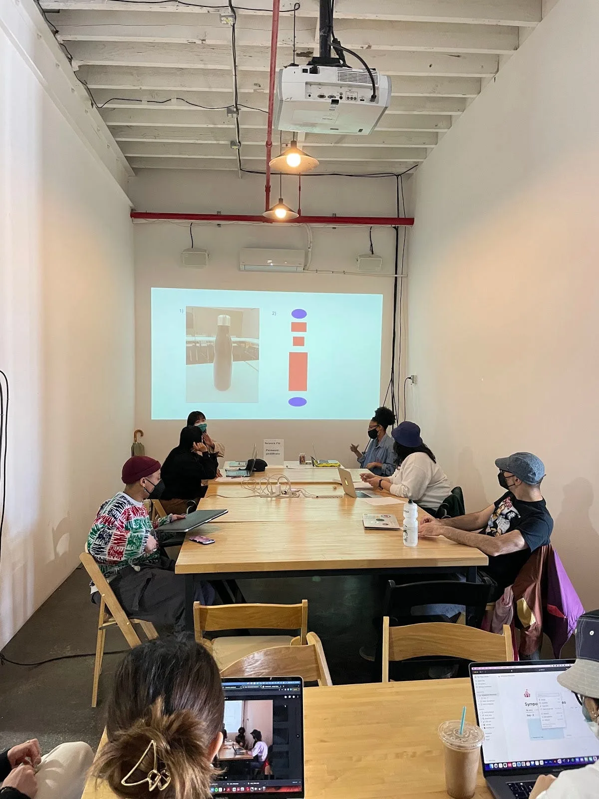

*Jump into Drawing with p5.js workshop held at the Code, Decolonized x POWRPLNT Symposium on Apr 23, 2022*

> This workshop introduces p5.js, a JavaScript language, and two aspects involved in making your first sketches. You will learn about cartesian coordinates, and how to draw 2D shapes on the p5 canvas. From there, you can try drawing an object of your choice using simple shapes and see what comes out!

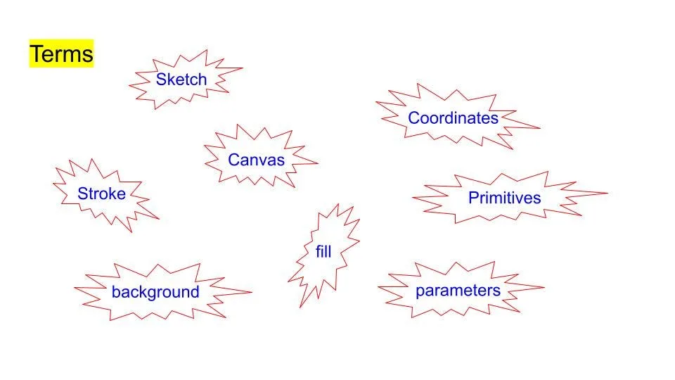

*Sample slide from the Jump into Drawing with p5.js workshop, created by Aamina Palmer and Yiwen Xu*

### Resources

-   [Workshop Slideshow](https://docs.google.com/presentation/d/1Ataw4-3Ex_Ods4_lmqEpVv_6TJV-A901D8jxbPgjfsE/edit?usp=sharing)
-   [Workshop Documentation](https://decolonize.codes/blog/posts/1960244b-ee6a-4c64-b545-0de63c49360a)

### Facilitators’ Bios

*Amina Palmer*

Aamina (she/her) is an artist and designer based in Brooklyn, NY. She is currently attending Parsons at The New School, in pursuit of a Master of Fine Arts in Design + Technology. Coming from a photography background, she is drawn to making and using images in her works on and offline. Her work involves play and playfulness in approaching new topics or revitalizing familiar ones. In an effort to make creative coding more accessible, she has co-taught two workshops, as part of the Code Decolonized Symposium, held in April of 2022. The workshop introduced the JavaScript language of p5.js and guided newcomer and experienced coders through using the cartesian coordinate system to draw on a grid using 2D primitive shapes.

*Yiwen Xu*

Yiwen got her bachelor’s degree in Digital Interactive Art at China Academy of Art. Then she came to the U.S. to continue her study in the major of Design and Technology at Parsons School of Design. She was a UI/UX designer who once worked as an all-media intern at People’s Daily, China. But she really wants to be an artist. She had some teaching experience in guiding teenagers with creative design at small art studios during undergraduate study. As a participant in Code Decolonized Symposium, she taught a p5.js workshop at Red Hook Labs with co-teacher Aamina Palmer on April 23 & 24th, 2022.

### Let’s Learn about Variables and IF Statements!

Led by Gina Lee & Zoyah Shah

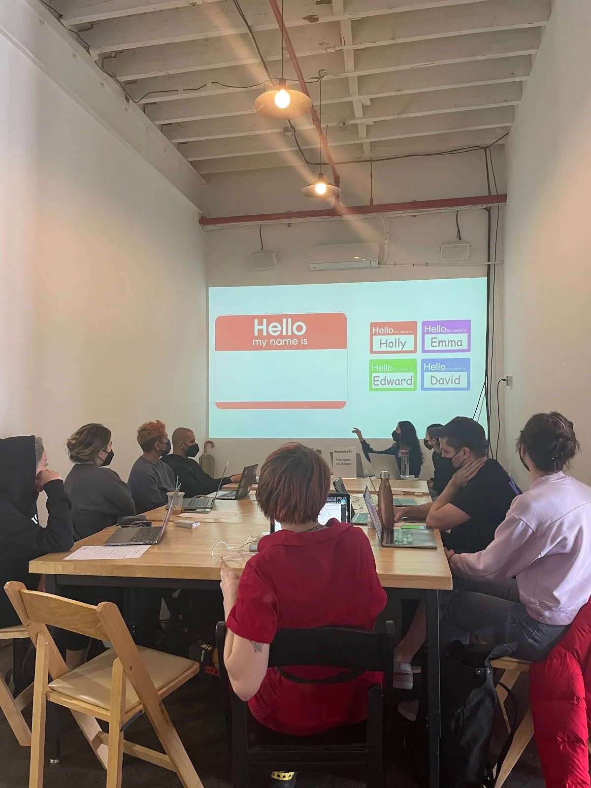

*Let’s Learn about Variables and IF Statements! workshop held at the Code, Decolonized x POWRPLNT Symposium on Apr 23, 2022*

> This workshop provides an introduction to variables and IF statements by using real life examples. You will learn about why variables and IF statements are important, and how to use them in p5.js.

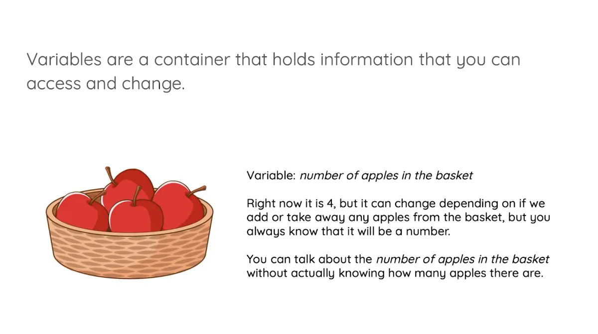

*Sample slide from the Let’s Learn about Variables and IF Statements! workshop, created by Gina Lee and Zoyah Shah.*

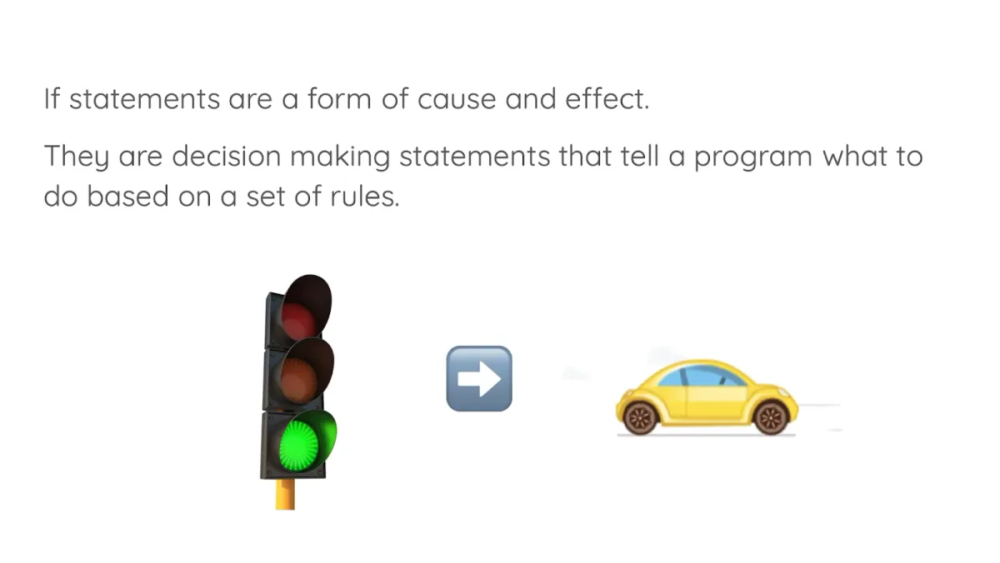

*Sample slide from the Let’s Learn about Variables and IF Statements! workshop, created by Gina Lee and Zoyah Shah.*

### Resources

-   [Workshop Slideshow](https://docs.google.com/presentation/d/1x1s1bZ9_hqwWHsP_eVGgCmv-q98RmuW060N0LIvln2I/edit)
-   [Workshop Documentation](https://decolonize.codes/blog/posts/aea01ee4-ce73-4e26-a6b7-0b83251fbf10)

### Facilitators’ Bios

*Gina Lee*

Gina (she/her) is currently studying Communication Design at Parsons School of Design in New York City. As a lifelong learner, her education in both New York and Portland, Oregon, have shaped many of her values and ideals as both a student and teacher. She is committed to continuously learning how to be more mindful in creating and teaching with inclusivity and accessibility at the forefront.

*Zoyah Shah*

Zoyah (she/her) is a designer currently studying communication design at Parsons School of Design. She grew up in the Bay Area in California, where she had the privilege of being introduced to coding at a very young age in school. She wants other people to have this same opportunity, so she is learning how to make education more accessible.

### GenZ(ine): a Beginner-Friendly Zine Playground

Led by Iley Cao & Munus Shih

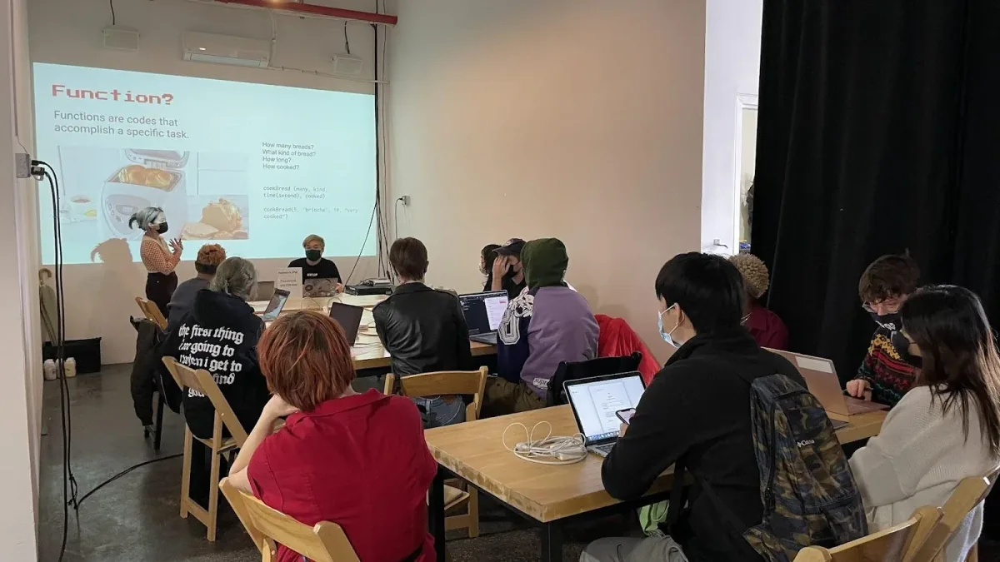

*Genz(ine) workshop held at the Code, Decolonized x POWRPLNT Symposium on Apr 22, 2022*

> “It’s amazing how inexpensive a publication can be if it doesn’t need to pay for writing, editing, design, paper, ink, or postage.”

> — Mega ‘Zines, Macworld (1995)”

> This generative zine workshop guides participants to create zines that focus on digital identity and self-expression while making the coding and printing process accessible to everyone.

> The workshop uses p5.zine ([demo](https://editor.p5js.org/munusshih/sketches/XVYsArvB2c)), a custom open-source tool to ease participants into learning functions (computer programming) and let everyone remix the zine template easily. This workshop welcomes everyone with different levels of coding knowledge.

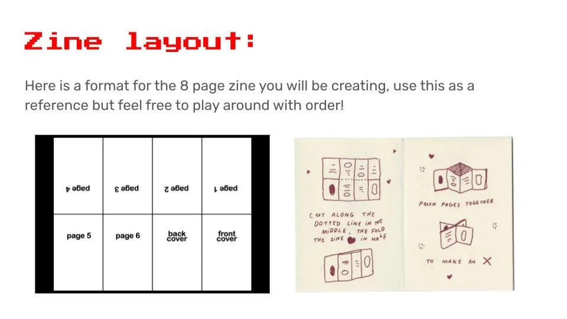

*Sample slide from the GenZ(ine) workshop, created by Iley Cao and Munus Shih*

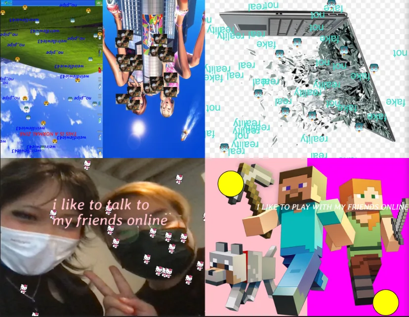

*A GenZ(ine) created by workshop participant and designer Theingi Thann*

### Resources

-   [p5.zine Demo](https://editor.p5js.org/munusshih/sketches/XVYsArvB2c)
-   [Workshop Slideshow](https://docs.google.com/presentation/d/1x1s1bZ9_hqwWHsP_eVGgCmv-q98RmuW060N0LIvln2I/edit)
-   [Workshop Documentation](https://www.notion.so/GenZ-ine-Project-b36caec04a95407494dd9cd2f9eb290c)

### Facilitators’ Bios

*Munus Shih*

[Munus Shih](https://munusshih.com/) (he/him) is a Taiwanese-born designer that collaborates with contextual data and bespoke algorithms. With an interdisciplinary background in Design and Engineering, his works encompass interactive and customizable brand identities, campaigns, and user interfaces.

Aside from professional work, he is an active member of many creative coding and design communities. He dedicates to curating workshops, publishing articles, and hosting lectures based on the idea of design as a liberal art or cultural media through a decolonized and inclusive lens. You can find more about his teaching and community work [here](https://munusshih.github.io/).

*Iley Cao*

Iley Cao (she/they) is a New York based, Chinese & Vietnamese multimedia designer and storyteller studying at Parsons and working at Milk Makeup. Their mission is to produce work and enact dialogue that is culturally and environmentally engaging and intersectional. Her specific interests lay in sustainable practices, beauty, lifestyle, and food systems, and she likes to try out new banana bread recipes.

### Mouse Paintbrush with p5.js

Led by tee topor & Sloane Dove

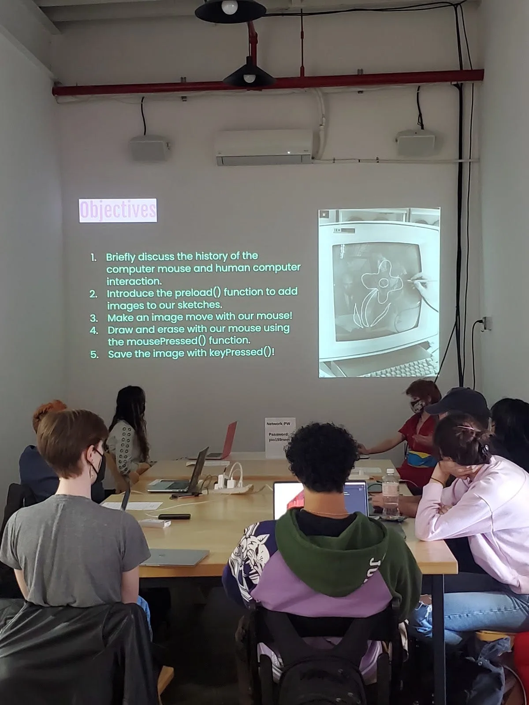

*Mouse Paintbrush with p5.js workshop held at the Code, Decolonized x POWRPLNT Symposium on Apr 22, 2022*

The screen and mouse are modes of seeing, created specifically to make things easier handling a computer. The mouse both simplified and complicated matters, making assumptions about the ways in which people see and erasing the possibilities of deeper understanding of the machines individuals are using every day, sacrificing autonomy. Doug Engelbart invented the computer mouse in 1961, not even knowing how to use a keyboard as that task was delegated to women. This placed women “close to the metal” as defined by Emma Rae Brumml Norton as a means of getting into the hardware, being able to get into the chip and understand its switches before layers of abstraction start to cover its mechanics. In the 1970’s it was women who were typing into computers when they were the size of desks.”

> This is a workshop meant for beginners and a means of getting closer to the metal.

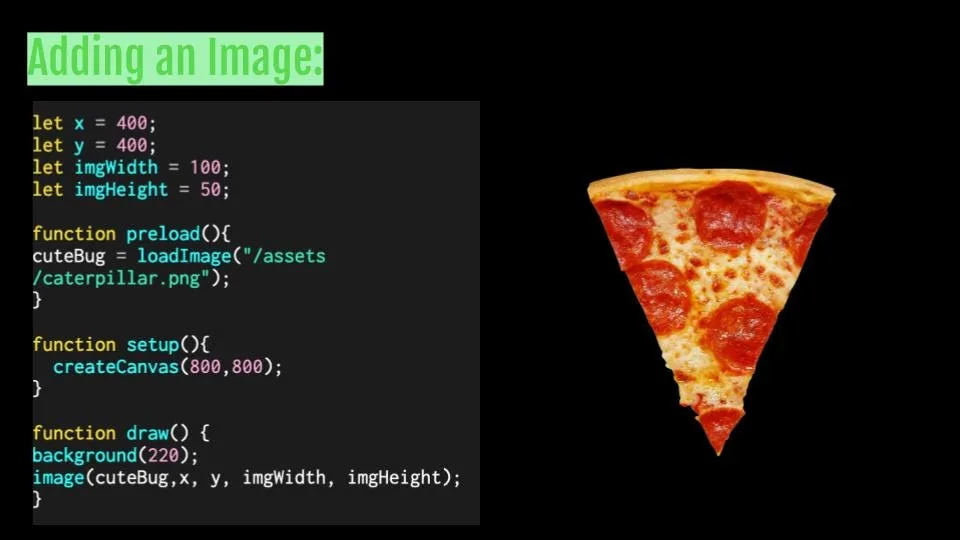

*Sample slide from the Mouse Paintbrush with p5.js workshop, created by tee topor and Sloane Dove.*

### Resources

-   [Workshop Slideshow](https://docs.google.com/presentation/d/1fYYHl614EQF5RJaSahZcCqRtLlEjNhmj7NKm0y9GYQQ/edit?usp=sharing)
-   [Workshop Documentation](https://tasty-dust-bf9.notion.site/mouse-paintbrush-with-p5-js-475a6f9b3c494a66b2ccc55983051067)

### Facilitators’ Bios

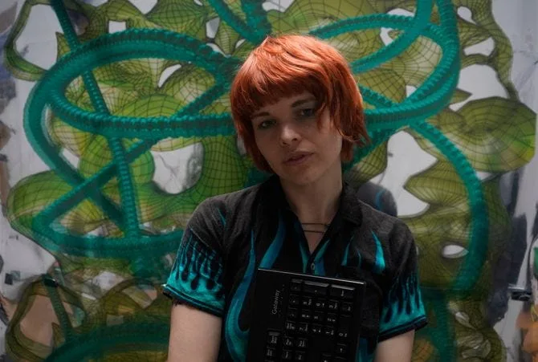

*tee topor*

Tee studied film at Boston University and Design and Technology at Parsons School of Design, where they are returning to teach net art and digital fabrication in the Fall of 2022.

### Visualizing Recurring Events with for Loops

Led by Jessica Jabr

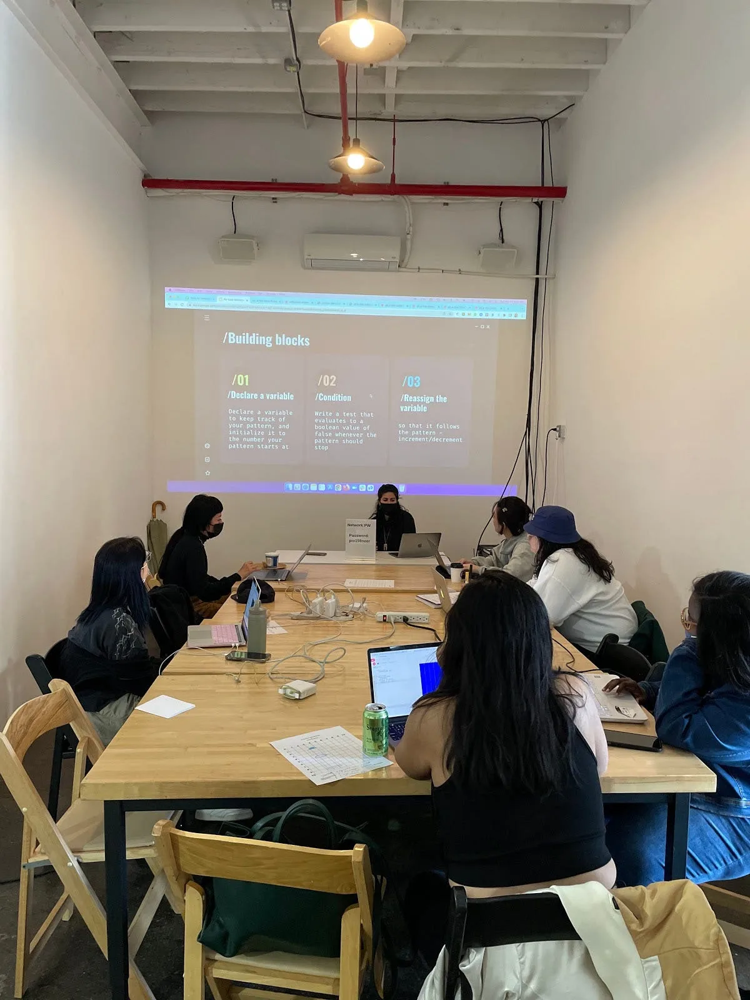

*Visualizing Recurring Events with for Loops workshop held at the Code, Decolonized x POWRPLNT Symposium on Apr 23, 2022*

> This workshop introduces the building blocks of the “for Loop” structure and how ‘for Loops’ are used within creative applications through visual repetition.

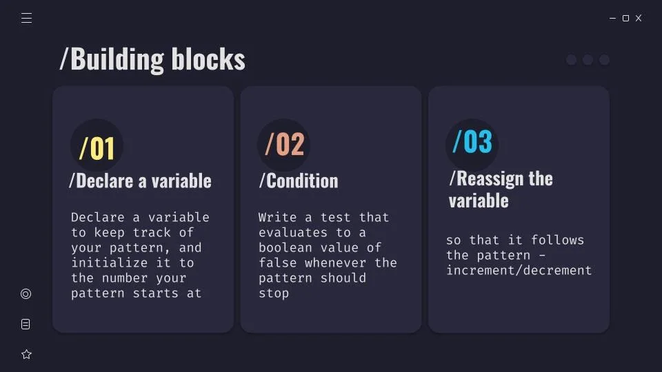

*Sample slide from the Visualizing Recurring Events with for Loops workshop, created by Jessica Jabr*

### Resources

-   [Workshop Slideshow](https://docs.google.com/presentation/d/1J0Rg5ZlT6QP5Adu9k-T46f-A4ArUtVyuaVJLv4nWKYs/edit?usp=sharing)
-   [Workshop p5 sketches](https://editor.p5js.org/fullmotion/collections/yZGM2KSdh)

### Facilitator’s Bio

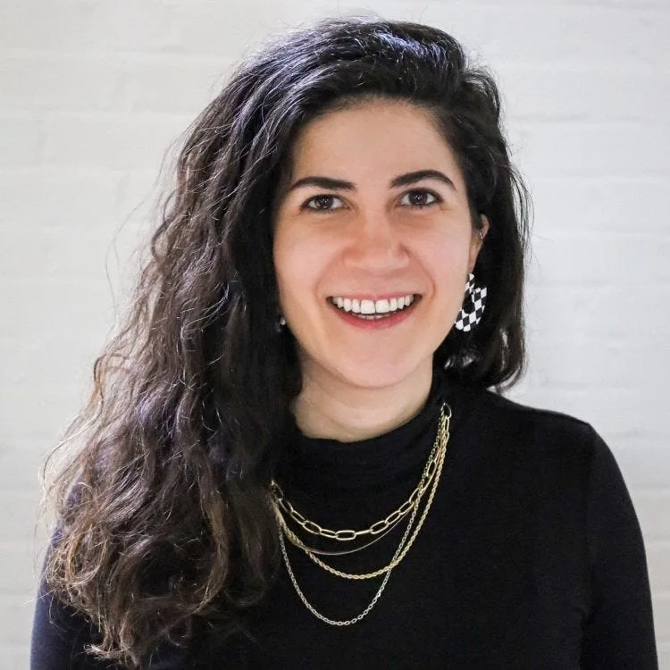

*Jessica Jabr*

Jessica is a creative technologist and experience designer. Her work revolves around human-computer interaction. She loves to play with physical computing, machine learning, and interactive experiences. She’s a serial idea-generator, who speaks product, and is obsessed with web3 technologies. Prior to pursuing her MFA in Design & Technology, she worked in programs and product management.

As a teacher, she cares about empowerment the most. Her goal is for students to leave her class feeling that they have the tools to achieve things in life. She wants her impact on students to sound like: “the sky is the limit”; from there it’s on every student to take what they want from her class. She has been influenced by amazing teachers throughout her life, especially in high school, and to this day she appreciates and remembers those teachers with the utmost respect and gratitude. Some of those teachers have shared valuable information that stuck with her to this day, and others whose interactions with her were remarkable, as a student who didn’t fit the mold.

She considers teaching as an outlet to impact others. Some of her objectives in leading a classroom:

-   Opening the eye of students to things they might not have thought of or crossed their minds
-   Changing predicted behavior
-   Influencing by motivating
-   Positive outlook on the future and the endless possibilities in the world

### Nested for Loop and Permutation Design

Led by Roy Yang

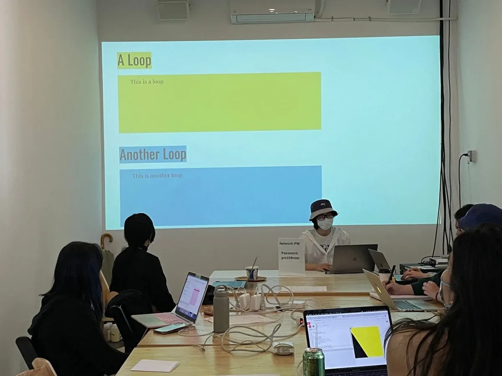

*Nested for Loop and Permutation Design workshop held at the Code, Decolonized x POWRPLNT Symposium on Apr 23, 2022*

> This workshop introduces nested for loop in an accessible way for people new to coding. Using [Nested For Loop Visualization](https://editor.p5js.org/Mustard-Roy/full/QHkGnGqtx), a custom software made in p5.js, this workshop guides participants to understand the principles and execution process behind a computer programming concept that is conventionally challenging for beginners. Once participants get some practice with creating nested for loops, the workshop explores the concept of permutation design by inviting participants to create a table of logo variants.

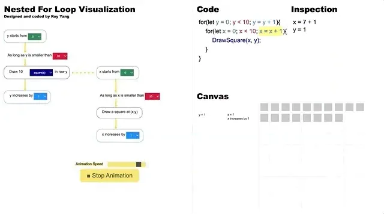

*A demo of the [Nested For Loop Visualization Software](https://editor.p5js.org/Mustard-Roy/full/QHkGnGqtx)*

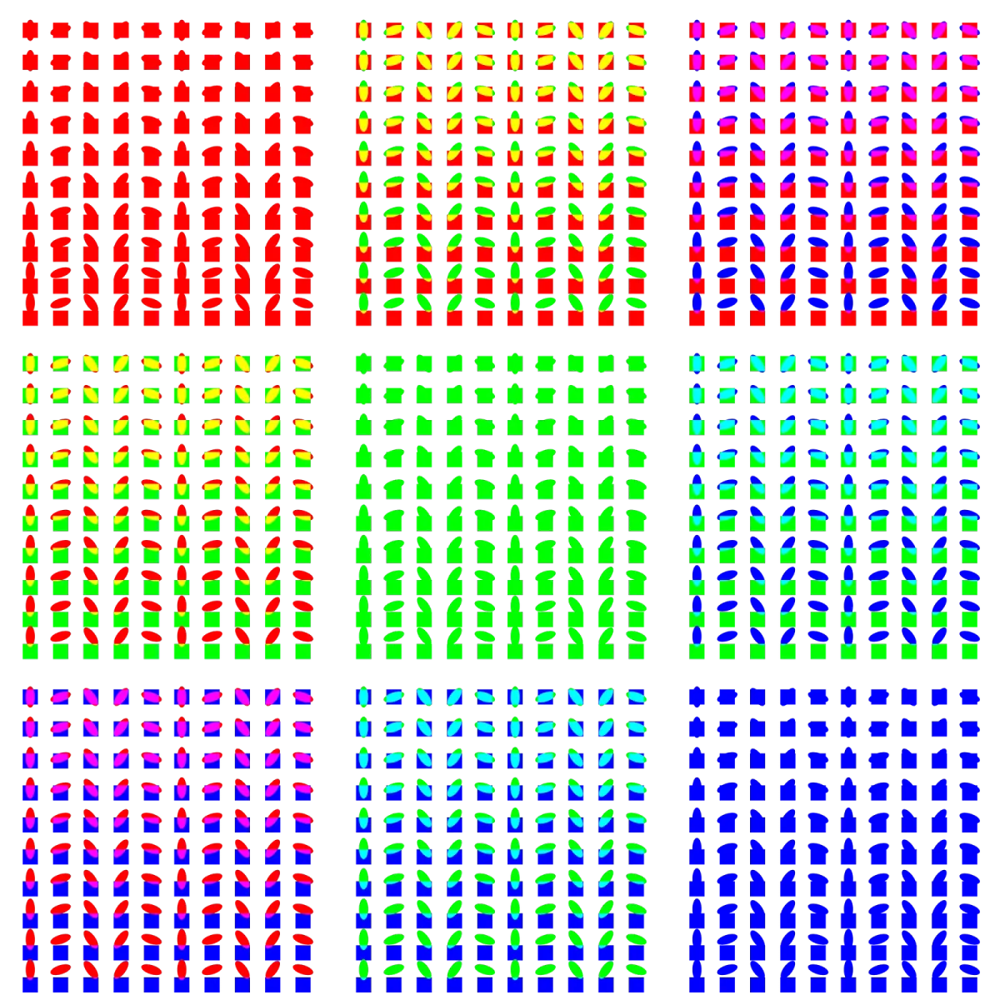

*Example of permutation design, created in p5.js by Roy Yang*

### Resources

-   [Nested For Loop Visualization Software](https://editor.p5js.org/Mustard-Roy/full/QHkGnGqtx)
-   [Workshop Slideshow](https://docs.google.com/presentation/d/1gcySt4Cj7uRxe69srLydJ6tz-Bc-QJCEtgd8UUtUm48/edit?usp=sharing)
-   [Workshop Documentation](https://decolonize.codes/blog/posts/0d99c24d-b9dc-4d76-8e4b-842fa27a752c)

### Facilitator’s Bio

*Roy Yang*

Roy Yang is a designer, engineer, and gamer committed to finding a balance in interdisciplinary areas that adopt technology in practice creatively, playfully, and carefully. He received bachelor’s degrees in Electronic and Electrical Engineering from University of Glasgow and University of Electronic Science and Technology of China. He is currently a Master of Fine Arts student at Parsons School of Design majoring in Design and Technology. He intends to join the industry as a product designer meanwhile approach teaching and holding workshops part-time.

### polyMorph — a Primer

Led by Jay Tobin

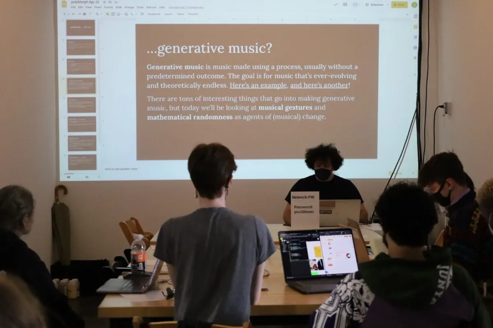

*Polymorph — a Primer workshop held at the Code, Decolonized x POWRPLNT Symposium on Apr 23, 2022*

Music-making software has a gatekeeping problem: built on the understanding that users are familiar with traditional western music theory and possess a firm background in navigating digital interfaces, digital audio workstations (DAWs) actively stifle rather than support the creation of art. [polyMorph](https://jaytobin.com/polymorph/) is a project that exists beyond the piano keyboard and the timeline sequencer — using gestures and phrases, polyMorph empowers first-time music-makers to create endlessly expansive works of experimental music.

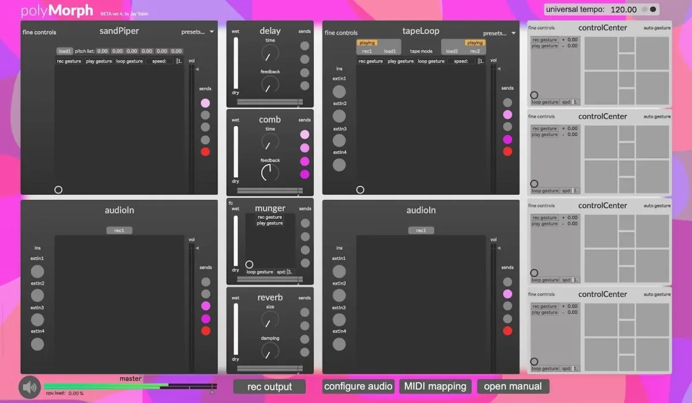

*polyMorph*

> This workshop will introduce attendees to polyMorph and generative music. We’ll cover gestures and randomness as compositional elements in music, and put together our own definition of what generative music is. The goal is to give attendees some insight into making their own procedural music, while introducing polyMorph as a fun, accessible tool for making their own work.

### Resources

-   [polyMorph Download Page](https://jaytobin.com/polymorph/)
-   [polyMorph Video Tutorial](https://www.youtube.com/watch?v=86p6qKNZBII)
-   [Workshop Slideshow](https://docs.google.com/presentation/d/1tRoSg5_XfzX5Qulo341keX_bban44Z21Q8Vuu2a293E/edit?usp=sharing)

### Facilitator’s Bio

*Jay Tobin*

[Jay Tobin](https://jaytobin.com/) is a creative technologist and programmer from New York. An audiovisual artist, his work spans from live sets at Ars Electronica to custom music production software. His interest is in building community by lowering barriers of access in tech, and bringing people together by treating education as a conversation. He taught a course on [polyMorph](https://jaytobin.com/polymorph/), his custom-built generative music production app, during the 2022 Code, Decolonized Symposium.
