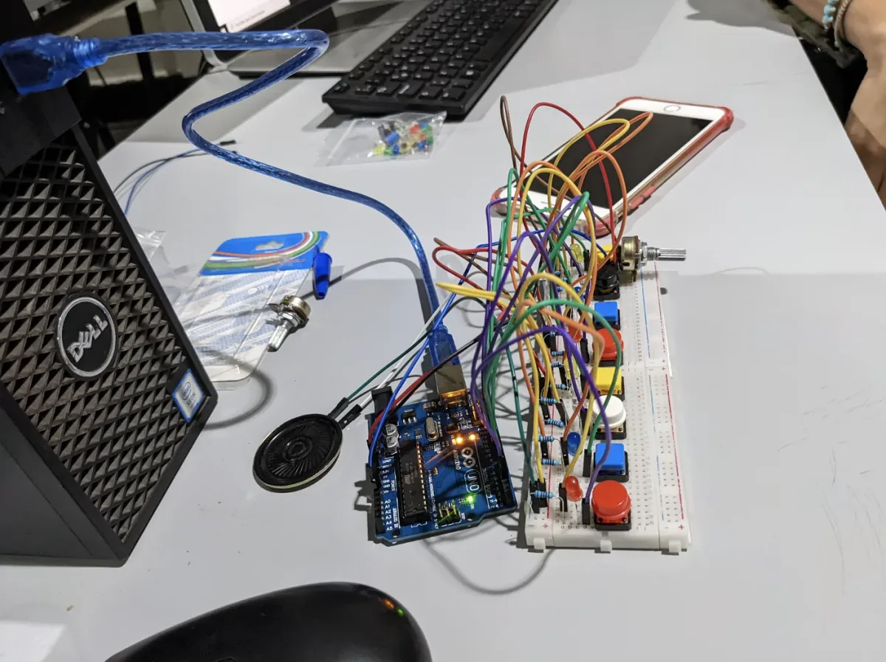
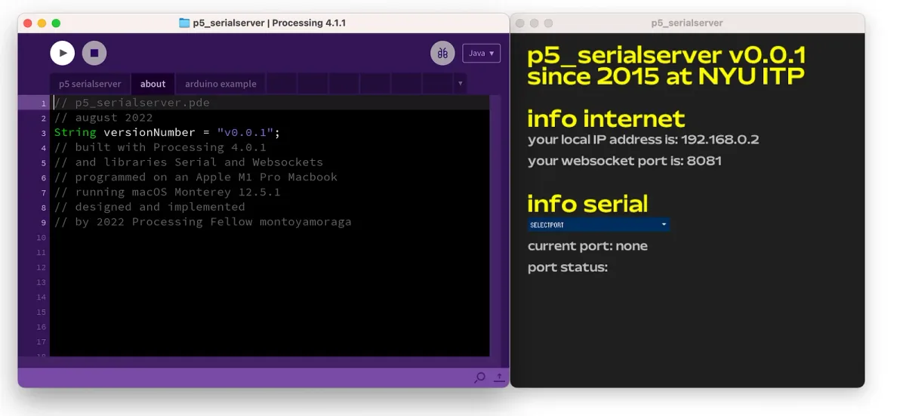
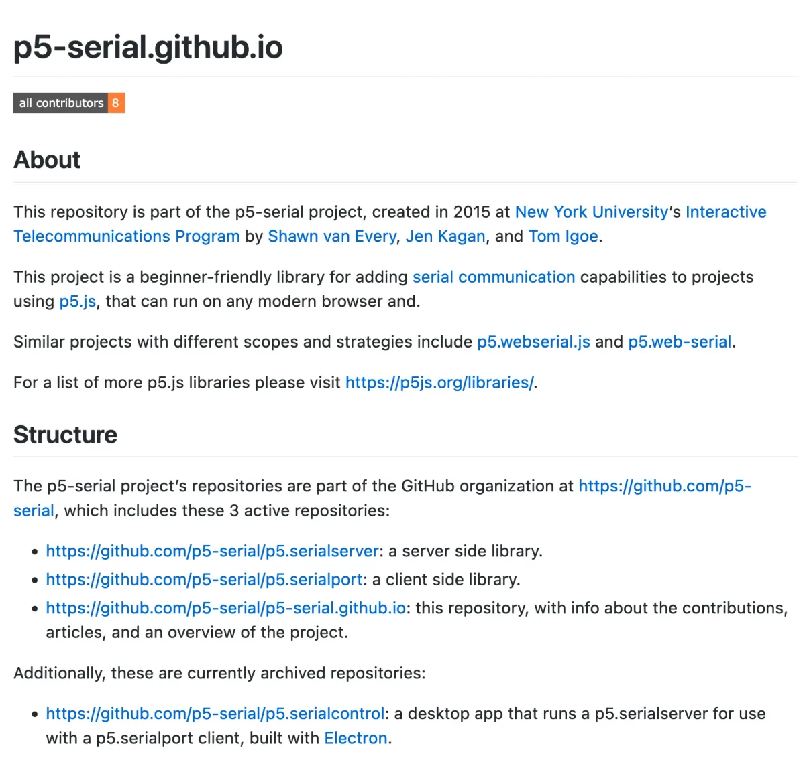

Tell us about yourself.

My name is Aarón Montoya-Moraga. I am from Chile and I currently live in Valparaíso, which is a city on the coast and work in the capital, Santiago. The two cities are two hours away. My pronouns are they/them. I’m currently a visiting professor at the state University of Chile, where I’m teaching design school classes about microelectronics with Arduino and the design of digital musical instruments and physics for designers. I’m trying to incorporate more open source and collaborative ways of teaching into undergraduate education.

**What was your fellowship project?**

So, I went to ITP in 2015. I met a lot of people there, and I was the first generation that was taught introduction to programming using p5.js instead of Processing, after around 10 years of teaching Processing. So I got to know Lauren McCarthy and all these heroes of mine in the arts. Through that, I’ve stayed in touch with the program and a lot of my friends have gone to the program as well. I was a resident after I was a student there, and I also started working on Spanish translation and internationalization of the p5.js project.

Over the years, I’ve tried to find ways of volunteering, and most of my work has been on software. I was going to do more hardware before the pandemic started and I had to be indoors. But I did do a project with Arduino last year for my other master’s thesis. I started to think a lot about how to get my practice out of the computer because I feel like a lot of it has been software. I love what I do, but sometimes it’s hard for people to grasp what I do because it’s software or screen-based.

Maybe it’s not as impressive as soldering 100 things or making a light turn on. So I’ve been thinking a lot about how to do that and that’s why the first class I taught last semester was about Arduino. I started using the p5-serial library, and I noticed that the library hasn’t been updated since 2019.

Over the past few years, the library has been supported by the Processing Foundation, and I wanted to help because it can be a hard process to install the library. So, I approached Shawn Van Every, one of the creators of the library who is now the dean at NYU ITP.

Improving the library was important — adding documentation, improving the code, adding guidelines for contributing and making it easier to collaborate and to use. This was a challenge, because I’m a generalist, as in, I’m not amazing at any particular software or hardware. So, this was a great opportunity for me to wear many different hats to make everything work in this project.

I was super excited and so I worked this summer on that, when I was on recess from school here too. I met with Shawn every two weeks. Since the library was already created, there’s been a lot of new protocols and ways to use it, as well as two other projects that are similar and have similar approaches, so we thought that maybe even a possible answer was the library doesn’t make sense anymore. Part of the work was making the decision of how this library fits in the current landscape of other tools and projects.

The end of my work was about making strong decisions about maintenance, about how to make it very robust and having a very limited scope. I wanted to have very little barriers of entry for somebody who wants to contribute to the project, having a very explicit focus on beginners. This library is not for making the fastest or most difficult thing in the world, but it’s for making your first serial project that communicates the physical world of a controller of an Arduino with the web on p5.js.

It was a lot of work, and it’s actually been a lot of progress. We decided that since we both have a very busy second half of the year, we found a moment between the holidays at the end of the year. We’re going to do a one day hackathon to put final touches on it. So we found ways to close out the fellowship as well as continuing to work on it and onboard new people that want to continue. That’s the current state.

**Who were sources of support for your project?**

I think everyone I’ve been in touch with at Processing Foundation. Shoutout to Dorothy Xiaowei, Sonia, and my mentor Shawn. In the middle of my fellowship I got sick and took two weeks off, but everyone was very supportive, telling me not to stress out and gave me extra time. Everyone is super kind, and I am intentional about being in places where it’s not all about the grind. Processing Foundation respects the process, so I feel like I thrive when I’m left with a lot of trust and told, “Go do your thing, let us know if you need anything.”

Shawn was very generous in being there for me, he was very trusting. He said, here are all the keys, you can do anything you want. Everytime I picked something to do, he encouraged me to go for it. He was so resourceful and had so much experience building software and teaching media arts, so it was really nice to learn from that and feel like I’m back at NYU ITP. For me, it was a very cool exercise of putting together all the skills over the years and build a nice strong community within p5.js, as well as how to welcome and onboard people.

**What were some challenges you encountered with your project?**

From the technical side, we have a big divide where we want to do art with computers, and we would like that to be straightforward but we’re also surrounded by tools made for corporations, or people who simply want to make things faster, better, stronger

For example, you can make your library dependent on more industrial code like from Microsoft, and you want it to be stable. You also want a tool that is not going to break, but there’s also people using the newest JavaScript every year and the syntactic sugar it offers, and it makes breaking changes. But you don’t want that to happen.

Having a way to filter out what you need, how to keep up with this balance of things is really important. You have to balance the people who want to learn things and also make sure things aren’t too obscure.

For example, when we were looking at the code of the library, there were eight years of breaking changes from 2015 to 2020. And the library works on my computer, but to have the library work on other computers, we had a lot to do. We were able to update the code to be using JavaScript from around 2020, but not 2022 because that would take hundreds of lines of code that we didn’t have capacity to do during this fellowship, so there is always so much work to do!

So it’s a lot of asking yourself, where is the line, what is the boundary? What template do people need? What are the examples people need? When you open the website and then the library, what do people need? If you’re using the library, you go on all these technical wormholes because of the difference between a string and a character and a number and an integral and a float, and it’s overwhelming. And you don’t wanna lose people in that process when they’re dealing with code to make art.

**How has the p5 community statement shown up in your work?**

I teach in spaces where my students tell me they have been traumatized by physics, by code. So I usually pull up the p5.js community statements and the Berlin code of conduct. And I tell them, this is a safe space. I’m gonna fail and make mistakes, I show them the ways I failed. I told them I once took down the whole p5.js website when I forgot a parenthesis and everybody was super nice to me. So I tell them, it’s very easy to make mistakes. It’s very cheap because we’re not gonna set anything on fire, nobody’s gonna get hurt.

I show them the GitHub, I show them how it has 15,000 commits. It has had all these bugs. Sometimes it breaks, it goes down. We cannot take things for granted.

I show them the Harvard Mark I computer, and how computers used to take up a whole building, and now they don’t. I try to put things in context how 150 years ago we couldn’t even record sound. I try to put it in context, so they don’t get overwhelmed about failing or missing a coma on their code. I tell them it’s going to be OK if they miss a semicolon or bracket, and we’re going to look at code, learn it, copy and paste it, and we’re going to learn how to borrow code from other people. That’s why this is open source. We can look at the library, we can look at the examples, we can fork it, we have to respect the licenses. I try to put them in conversation with the outside world so that they know that they’re not on their own.

I also make a point of pointing out thatAda Lovelace is the first computer pioneer. ThatTuring was punished for being gay. Computers were made for and by non-male people. If somebody tells you that computers can be used for fascism or for oppressing people, you are going against the essence of computers. Computers are for making cute and beautiful things and for making people laugh, not for war or anything like that. I also show them the work of Mar Hicks of how women were erased from computer history, and of course I introduce them to the work done by Adafruit and Limor Fried so that everybody can feel welcome.

I’ve been really lucky, I’ve gotten to meet a lot of amazing people. I had classes that were life changing, with Lauren McCarthy and Allison Parrish . To me, the social part of code is really important — you can’t do it on your own. I never talk about code as a way to be more capitalist or productive. I’m not teaching them code so that they can make money or just learn frontend. Code is for sharing your ideas.

Here in Chile I was born in the middle of our transition from dictatorship to democracy. So I tell my students who are way younger than me, don’t take our freedom or rights for granted. There’s a lot of countries where you can’t just be yourself on the internet, where you are prosecuted for being who you are. We need to understand this technology, we should have a say in what this technology is, and to do that you need to understand computers. It’s a stepping stone, learning how to code. You can do art with it, you can do activism, you can even make a ton of money, and that’s OK as long as we make the pledge that we’re not going to oppress people with our computers. That’s the kind of framework I give in my class.

**What were some of the joyful moments in your fellowship project?**

Since I have had some very bad experiences when I was learning to program, I wanted to make sure my students had a different experience. When I see people enjoying what they just learned, branching out and doing their own thing, that’s really encouraging for me.

One of my proudest moments this year is when I had to teach students in design about light, waves, and colors. We talked about computation, human perception for the eyes, and colors, as well as why 8 bits is used for R, G, and B. Also ways of dealing with color blindness, and how people who are color blind fear being ostracized. You can make things better for a wider array of people in a very cheap way. And that is very satisfying.

The most joyful moment of my fellowship project was to be able to incorporate all of my teaching practice and hands-on work with beginners, and apply those concepts to the p5-serial library, so that it can be used in other teaching environments and projects :)

**What words of wisdom do you have for future fellows?**

Most of what I do comes from Lauren McCarthy’s advice, including strategies for dealing with imposter syndrome. My words of wisdom would then be in that same vein: trust your instincts, trust your process, ask for help when you need to, and just be there to make a difference. And also the rule of three. Something that is going to take you X amount of time will probably take 3X that or even 10X, because software is hard. I hope the Processing Fellowship continues because it’s a very cool, safe space where we can give something back to the community. I like that there’s a huge focus on education, focusing on tools, expanding the array of tools and also not having metrics like, you need to write 10,000 lines of code.

*Aarón Montoya-Moraga is a Chilean media artist and educator. Their work is available at* [https://montoyamoraga.io/](https://montoyamoraga.io/) *and* [https://github.com/montoyamoraga/](https://github.com/montoyamoraga/)
