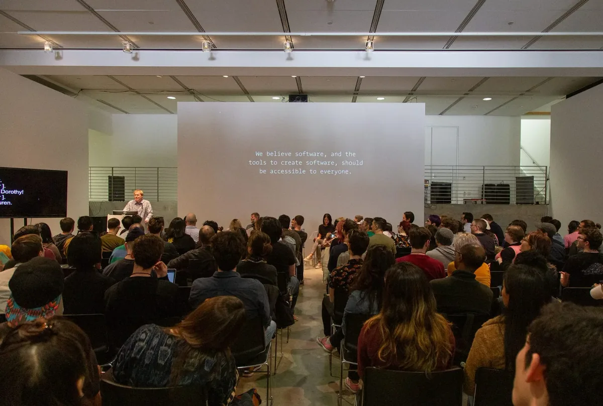
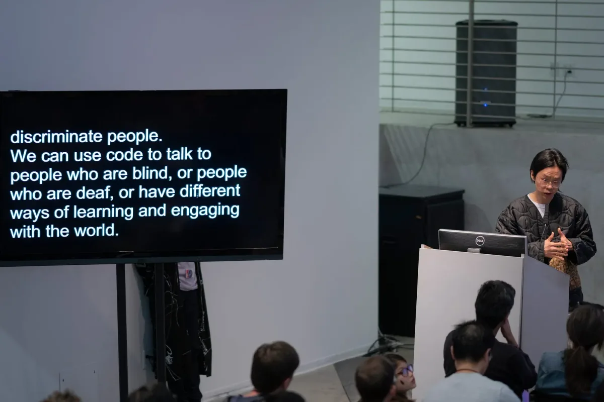
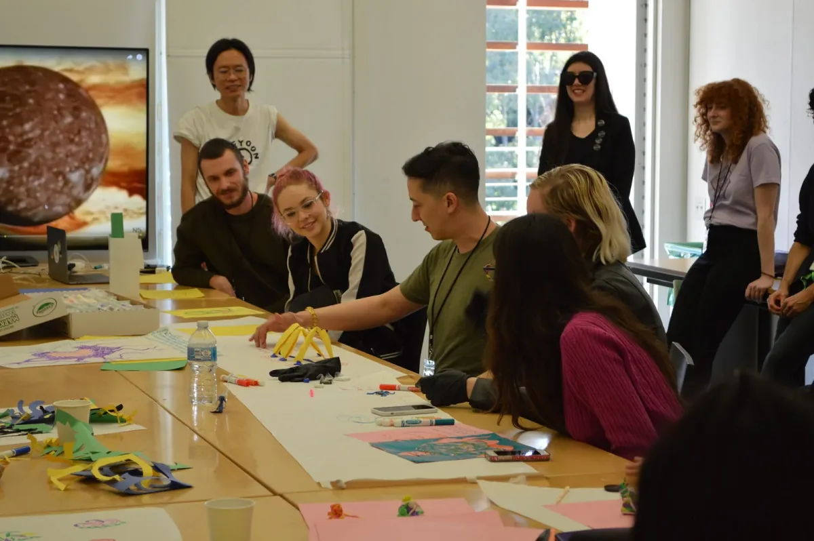

[*Processing Community Day @ Los Angeles*](https://day.processing.org/pcd-la-tracks.html)*—a day to celebrate art, code, and diversity — took place on January 19, 2019, at UCLA. This week we’ll be posting a series of reflections and interviews with the day’s participants and contributors.*

*[Ben Fry’s opening remarks](https://medium.com/processing-foundation/processing-community-day-2019-a589c975dd89) for PCD@LA highlighted the importance of community. He said, “A field gets interesting, and only truly evolves, when it expands by bringing in people with different kinds of abilities and experiences.” \[image description: Ben Fry stands at a lectern, in front of an audience. To his left is a screen with CART (Communication Access Realtime Translation) captioning. To his right is a wall with projected text that reads: “We believe software, and the tools to create software, should be accessible to everyone.”\]*

Hi all! My name is Tristan Espinoza. I participated in Processing Community Day @ Los Angeles as part of its organizing team. The day was complex and multifaceted, and though I went because of my interests in art and technology, these were tiny components. My main interest was in supporting a creative and research-based event that was primarily about togetherness. I’ll speak to the day from this perspective.

I was introduced to Processing in an art/design setting, during a foundations course in my school’s art and technology department. It became one of my least favorite classes. Formatted as an introduction to technologically based art, the course covered too many topics, of which Processing was only a small portion. It was almost exclusively demos, and lacked the conceptual underpinnings that allow students to develop specific, affective relationships with technology. We engaged with code as a tool, and not an expression of creativity. PCD @ Los Angeles was about the opposite.

We started with an introduction from the Processing Foundation’s Board of Directors and [opening remarks from Ben Fry](https://medium.com/processing-foundation/processing-community-day-2019-a589c975dd89). He discussed the ideological origins of Processing, tapping into exclusionary norms within education landscapes and coding. These practices still exist today, but are complicated by shifts in culture and technology.

*Taeyoon Choi, track coordinator for Accessibility, Disability, and Care, delivers his introductory talk for the track. \[image description: Taeyoon Choi stands at a lectern in front of an audience. To his left is a screen of CART captions, with text that reads, “…discriminate people. We can use code to talk to people who are blind, or people who are deaf, or have different ways of learning and engaging with the world.”\]*

Among these shifts is an expansion in the community around Processing. Far from its beginnings in the MIT Media Lab, Processing is now used in a variety of contexts inside and out of institutions, to teach and learn about art, code, design. It’s nice to see this acknowledged through initiatives like [p5.js](https://p5js.org/), as well as the org’s focus on inclusivity and diversity. The Processing Foundation has also responded with structural changes, involving Dorothy Santos and Saber Khan as the Program Manager and Education Community Director, respectively. Both have a nuanced understanding of the complexities in these domains, and I’m optimistic about their work moving forward.

Afterwards, organizer Xin outlined the talks for the day and detailed all the support methods available for attendees who were parents, people of color, queer, and/or disabled. Loved this. It’s often frustrating to obtain this kind of assistance, so it was helpful to emphasize these channels at the outset and support each other as a community.

PCD @ Los Angeles framed our experiences through four different tracks. As an organizer and attendee, I was mostly in the Accessibility, Disability, and Care track, organized by Director of Advocacy Johanna Hedva and Taeyoon Choi. I think a lot about who works with code, and who doesn’t, and what it means to be with one another when our interactions are so extensively mediated by technology.

To that end, I participated in workshops that allowed me to investigate some of these paradigms. Emily Saltz led “Neither Her nor HAL: Considering access and representation in the next generation of speech technology,” a workshop exploring present implementations of speech technologies, and how power dynamics manifest from patterns in phonetics, synthesized voice systems, and screen reader software. With Johanna Hedva and the Best Friends Learning Gang, I engaged in futurist world-building for non-normative humans in a session titled, “ALIEN BODIES.” And in “Disability, Design, and the Development of Accessible Creative Tools,” Processing Foundation Fellowship alumni Claire Kearney-Volpe and Luis Morales-Navarro led us through a design process for making tools that were inclusive of disability needs. I was grateful for the opportunity to interact with everyone, share feels and sensations, and see how others have contributed to long-term solutions.

*Taeyoon Choi and Johanna Hedva, coordinator and organizer of the Accessibility, Disability, and Care track, watch attendees of the workshop “ALIEN BODIES” draw and sculpt prototypes of non-human forms. \[image description: Two people stand behind a long table, where seated people use markers and colored paper to draw and sculpt.\]*

The Radical Pedagogy track was led by A.M. Darke and Dorothy Santos; Chandler McWilliams coordinated the Epic Play track; and Under the Silicon, the Beach! was organized by Tega Brain and Sam Lavigne. I learned about each track from my conversations with others throughout the day. Prevailing tendencies often limit the kinds of experiences we can have with technology to those involving capital-oriented content, so it was valuable to see a diversity of people and motivations. Many attendees were interested in or were already engaged in work that used technology to highlight disparities in gender, race, class, and disability; assess power dynamics and points of struggle; and make abstracted infrastructures more legible and accessible to audiences. Such perspectives are avoided or actively repressed within the tech industry. Interventions are often necessary.

Up until this event, the scope of my engagement with Processing had been through a screen. It’s difficult to address social inequity, ecological disaster, and global exploitation in this position. Our problems are layered, and responses should be networked and multimodal. Processing Community Day provided such a platform by inviting us to participate in something collaborative and political. For this, I am deeply appreciative.

---

*Tristan Espinoza is a Filipinx artist and activist based in Los Angeles. His work uses code, performance, and 3D graphics to negotiate the potential for interactive experiences to exist as a form of radical protest. This manifests as an interdisciplinary research and creative practice that foregrounds vulnerability, authenticity, and modes of trespassing through social landscapes, illegible infrastructures, constructed information. As a member of the Filipinx art and design collective Export Quality, he regularly collaborates with other Filipinx creatives to engage communities and create platforms for intersectional narratives within a Eurocentric art world.*
