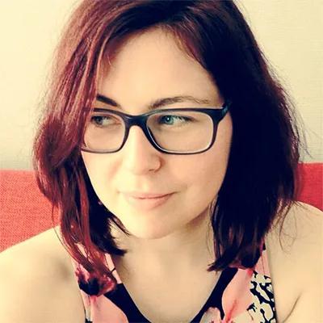
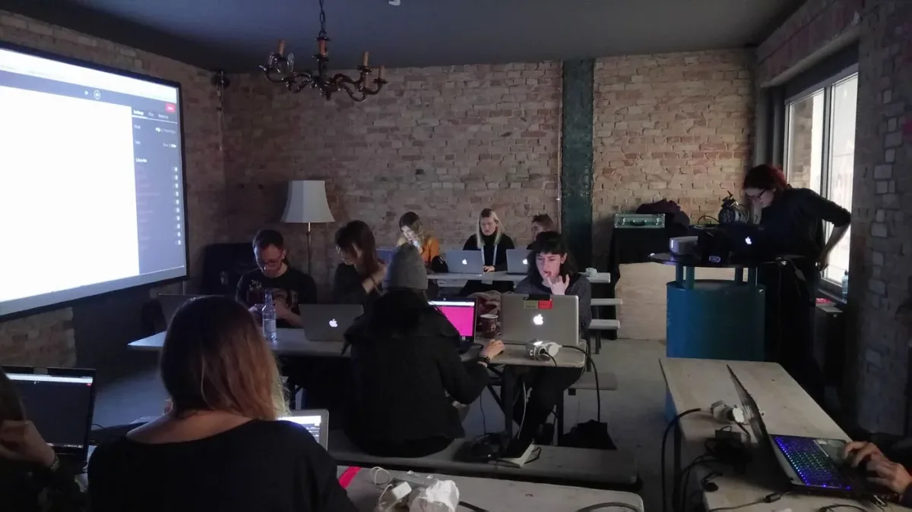
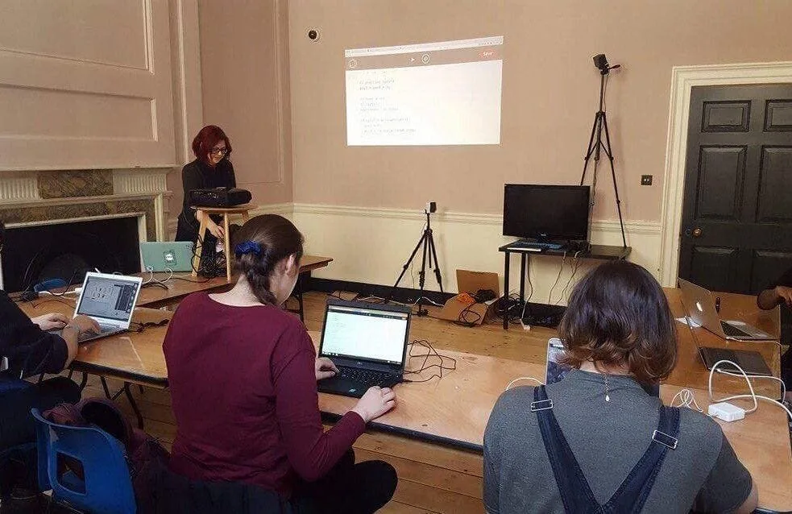

*The 2017 Processing Foundation Fellowships supported an unprecedented* [*seven research projects*](https://processingfoundation.org/fellowships) *that expanded the p5.js and Processing softwares and their communities. Fellows developed work ranging from bilingual zines, to accessible coding curriculum to be taught in prisons, to workshops aimed at teaching code to women, non-binary, and femme-identifying folks. Throughout the summer we’ll be posting a series of articles — some written by the fellows, some in conversation with Director of Advocacy, Johanna Hedva — that showcase and document the great work by this year’s cohort.*

---

*[Saskia Freeke](http://www.sasj.nl/) is an artist, creative coder, and interaction and visual designer. She is interested in creating playful experiences. She has been making daily art, mainly generated with code, since January 1, 2015. She is a member of Code Liberation and is doing her Master’s in Computational Arts at Goldsmiths University of London. For her Fellowship, Saskia was mentored by [Phoenix Perry](http://phoenixperry.com/) and [Johanna Hedva](http://johannahedva.com/).*

Last year, I joined the [Code Liberation Foundation](http://codeliberation.org) and am now the Educational Director. My fellowship was co-mentored by [Phoenix Perry](http://phoenixperry.com/), Code Liberation Foundation Founder and Processing Foundation Advisor, and the aim of my research was to create in-person workshop materials with [p5.js](https://p5js.org/), directed toward a specific, under-represented group: women, non-binary, femme, and girl-identifying people from all walks of life. Code Liberation’s mission is to teach programming to this group of folks, with a focus on games and creative work. We nurture community and create a safe space for learning new material by stressing that it’s not about how technically good you are but how open you can be during the process. Learning requires vulnerability, and we endeavour to create a community that makes this openness a little easier to achieve.

Even though I have been learning to code for several years, only recently have I started teaching programming. This fellowship has allowed me to research and practice new ways to explain code to creative individuals, particularly new developers coming from the arts. In addition to structuring and developing the workshops, I’m also mentoring a group of peers who are new to teaching programming through leading their first classes in this topic.

*Workshop at “A MAZE.” festival in Berlin, 27 April 2017.*

I organised and presented four-hour workshops at two games festivals, one at “Now Play This” in London, and the other at “A MAZE.” in Berlin. At the start of each workshop, I explained some general things about p5.js and programming. We did a short activity without a computer, such as sorting everyone by name, allowing students to embody and understand conceptually how a computer program would execute this process. This served as a good icebreaker, jostling the students together in the same physical space and getting everyone’s names into each other’s brains.

The workshop then split into multiple parts, each organized around core topics. After an idea was introduced, there was unstructured time for students to play and explore the topic on their own. Each topic included references to the p5.js documentation, as well as suggestions for further investigation. The example of a simple [ball catch game](https://www.openprocessing.org/sketch/418840) was used to explain all of the functions involved. The code for the game was written in realtime, with prompts to the students to think about the process, such as, “How do we know our mouse is clicking the ball?” Unexpected answers were given, which gave me important insights into the different learning styles and perspectives of the students. The goal of these workshops is not to make innovative, technically advanced games but to empower students with a new outlet for their creativity.

*Workshop at “Now Play This” festival in London, 7 April 2017.*

This summer, I will continue my work with the eight-part, free [workshop series](http://www.vam.ac.uk/blog/network/code-liberation-2) at the V&A Museum of Art and Design, in London. We will focus on game design in p5.js, game art, open-source prototyping, and digital fabrication. The series will end in an exhibition of participants’ work during the *Digital Design Weekend* on Saturday and Sunday, 23 and 24 of September, at the V&A. If you are curious or want to follow along this summer, check out [this website](http://codeliberation.org/CLF-slides/Classes_and_Workshops/p5_at_VA/index.html) where all the workshop material will be shared.

With code, there is always more to learn. Though I still feel like a newbie, the important thing is that we are here together to grow, no matter what skillsets are brought to the table. At Code Liberation, we aim to give our students and members tools to express themselves in a new way. Both Code Liberation and the Processing Foundation believe programming education works when it is supportive, community-driven, and inclusive by design. As the Code Liberation motto goes, “No programmer left behind!”
