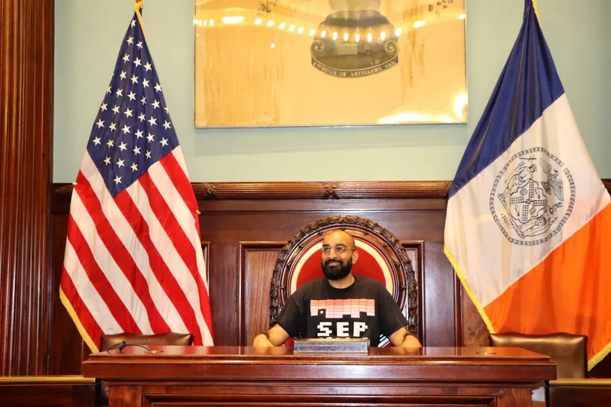
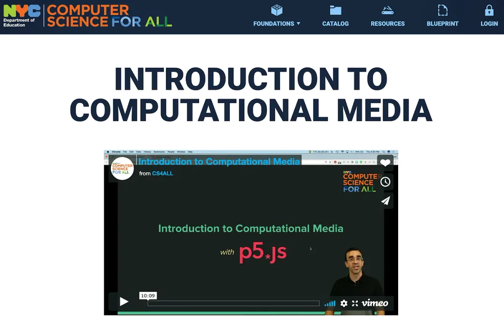
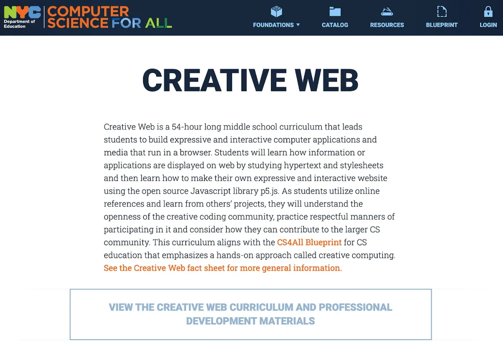

[*createCanvas*](https://soundcloud.com/processingfoundation) *is Processing Foundation’s education podcast, which focuses on teaching at the intersection of art, science, and technology. The podcast is part of our* [*Education Portal*](https://processingfoundation.org/education)*, a collection of free education materials that can be used to teach our software in a variety of classroom settings. Rather than endorse a specific curriculum, we’ve engaged with a variety of educators from our community, ranging from K12 teachers, to folks who lead workshops at hackerspaces, to university professors in interdisciplinary departments. We’ve asked them to share their teaching materials, which anyone can use.*

createCanvas *features monthly in-depth interviews with these innovative educators, so you can get to know their practices and what they bring to the classroom and why. Stay tuned here for transcripts of each interview, as well as to the* [*Education Portal*](https://processingfoundation.org/education) *for podcast episodes and teaching materials.*

[*This is Part 2 of our interview with Aankit Patel, which can be found on SoundCloud here*](https://soundcloud.com/processingfoundation/episode-3-aankit-patel-part-2)*. Below is the transcript (lightly edited for clarity). Part 1 was released in March and can be found* [*here on SoundCloud*](https://soundcloud.com/processingfoundation/episode-3-aankit-patel-part-1-or-2) *and as a transcript* [*here on Medium*](https://medium.com/processing-foundation/createcanvas-interview-with-aankit-patel-75d5fdca869e)*.*

*[Aankit Patel](https://aankit.com/) at New York City Council’s hackathon on April 17, 2019. Aankit Patel recently joined the City University of New York as Director of [STEM Education Programs](https://twitter.com/cunyteachered) to support the development of STEM technical, pedagogical, and content knowledge. Over the past five years, he worked to bring [creative, physical, and critical computing](http://blueprint.cs4all.nyc/curriculum) to K-12 classrooms (training over 2,300 in-service teachers) as a leader of the [Computer Science for All](http://cs4all.nyc/) at the NYC Department of Education. In part 2 of his interview with Saber Khan, Aankit speaks about the different scales of impact that open source software can have on education, as well as how to engage teachers in creating not only curriculum but a sense of community and agency for themselves.*

**Saber Khan**: Hey everyone. Welcome to *createCanvas*, a podcast about the Processing education community. I’m your host, Saber Khan, the Education Community Director of Processing Foundation. \[*intro is the same as above*\]

This is the second part of our conversation with Aankit Patel, Director of STEM education programs at the City University of New York. Previously, he was with the New York State Department of Education as the Senior Director of Computer Science Academics. Here we continue talking about how the city of New York is teaching computer science to students and teachers as part of the [CS For All](http://cs4all.nyc/) program, a program that seeks to provide computer science education to all one million students in the system.

One of the partners in this CS For All picture in New York is [Processing Foundation](https://processingfoundation.org/), and [p5.js](https://p5js.org/) is used. How does that fit into the picture you described? What are teachers and students doing with p5? And what are your hopes for a creative coding platform like p5?

**Aankit Patel**: That’s a really interesting question because a lot of what teachers and students are currently doing with p5 is starting to push on that idea of moving from impacting what p5 and Processing are doing — from just a curriculum and educational perspective (specifically a K12 educational perspective) — to potentially impacting the larger community in interesting ways. So to start, we started introducing creative computing with Processing to teachers with the Java-based library, because p5 didn’t exist back then. One example of a transition a teacher has made was from having a very specific way that she saw her practice — she was an art teacher, so she was approaching art and the way she was trained to approach art was with certain media to make art — and through the professional development around Processing, we’re able to see her realize, “Oh, this is very similar in a lot of ways to the media that I have been using.” I think credit there goes to the way that Processing was created with this sketchbook paradigm. Even using the word “sketch” helped with that transition for her.

That was the beginning of seeing that type of transition happening. When we started to get teachers really excited and interested in potentially doing more with that to create their own. It would start off with just a unit. So that art teacher, for example, had a unit, which is between 20 and 30 hours of instruction (totally depends, it could be shorter). Students doing explorations or analysis of color using Processing, where they can sort of iteratively, they can develop a sketch and interesting visual, and then see how adding color, or having color change, impacts the way that we view that piece of art, their own art that they created.

**SK**: Makes sense.

*New York City’s Department of Education Computer Science For All website includes the full curriculum for the [Introduction to Computational Media](https://blueprint.cs4all.nyc/curriculum/intro-to-computational-media/) course, which was created by Luisa Pereira and Jose Olivarez.*

**AP**: From there, we’ve been progressively moving teachers into developing more and more curriculum. At this point, we have an [Introduction to Computational Media curriculum](https://blueprint.cs4all.nyc/curriculum/intro-to-computational-media/). Very much stolen from ITP. Actually [Luisa Pereira](http://www.luisapereira.net/), who is now a faculty there, wrote that curriculum, in collaboration with [Jose Olivarez](https://twitter.com/joseolivares) on our team. And a number of teachers contributed at that time to providing feedback, either directly at professional developments, seeing how things went, or once they tried stuff out in the classroom.

Then we’ve included two teachers, [Courtney Morgan and Jose Area as Processing Fellows](https://medium.com/processing-foundation/making-processing-available-in-nyc-schools-b439eab71a9c) \[in 2018\], to specifically start writing pieces of that curriculum. I think they focused on a teacher guide, which is great, like, we have this curriculum, now how do you then take it and teach it? Because they were Fellows and because there is this idea in that like, well now there’s a curriculum that Processing can share, like, “Hey, here’s a way to teach p5 in creative coding and not just the technical bits of it, but here’s how to really get your students up to speed on using this in powerful ways.” We started to contribute to the larger community in that way. Now we have teachers, specifically [Layla Quinones](https://medium.com/processing-foundation/interview-with-2019-teaching-fellow-layla-quinones-3039f10ae761) \[2019 Teaching Fellow\], who is thinking about that curriculum and what it means for her students. She works in the Bronx, she was brought up in the Bronx, and her students are from there. It’s a really interesting potential here to contribute by the way that she’s trying to take creative coding — and there’s a lot of terms around this in education and I don’t want to use jargon here — but it’s not just “engagement.”

**SK**: It’s student-centered.

**AP**: Yeah, it’s student-centered. That’s one of the pieces of jargon —

**SK**: Culturally relevant.

**AP**: — that I wanted to use. But it’s authentic: here’s what this tool means to these kids. I’ve talked to her about it and she’s struggled. Early on, she was like, “I don’t know what to call this project.” And like, yeah, I know. Because what you’re trying to do just doesn’t quite have a name, maybe. Or you’re still figuring it out. You’re kind of doing it with your students, which is a really interesting piece. Can Layla connect her students to the community? Can young people be part of this community in a way that their voice has shaped what it looks like?

Processing has been very thoughtful about who it includes and has, I think, done a great job of not having to do everything. They don’t do everything. Yes, they might be the leaders, but they’re not — yes, Lauren now and Dan Shiffman \[have been project leads\] — but they don’t own it all, right. And you don’t have to be a technical whiz to own a piece of Processing and to be a part of that community. And so it’ll be interesting now, I think one opportunity is for students to start becoming part of their community in a meaningful way. I don’t quite know what that is, but that’s what I feel Layla is trying to do, or this is the larger potential of Layla’s project as a Processing Fellow.

With that, there might be some students that *are* technical wizards, and who will be like, “Oh this, this is buggy here.” And they’re going to ask, “Hey, is there a way to fix this? Or for me to tell somebody?” And then they’ll go on GitHub, and they might put in an issue and then they might see, “Oh, I can find the file.” And, “Oh, I know how to fix this.” I mean, it’s a long shot, maybe. Frankly, I don’t know. But I know that that becomes a very concrete manifestation, a representation of a student contributing, being part of the community. While them influencing the discussion or the conversation is a little bit harder to see.

**SK**: Yeah. What you’re saying pushes in a couple of directions. One is in creative computing. Everyone has an aesthetic sense that they can bring into a creative coding project. Like, how we feel about color, how we feel about sound, how we feel about visuals. And someone doesn’t need to tell you to care about that or to have an opinion. You have it innately. So you have some sort of buy in, especially if you’re making something yourself.

The bigger question is, so how do you participate? I think it comes up often in the open source community and, in one sense, they’re not that different types of projects, what you’re doing and then what a large open source project like Processing or p5, or some of the other bigger, larger ones, are trying to do, which is both to organize a community that has a goal and is working towards it, but also to bring more people in, make sure they know what direction they’re going in, providing people with the space. I see a lot of similarities with it, and even the way education is done is one very open source. Especially in a place New York where people are trying different ideas, sharing it out, contributing to it.

What are your hopes for the future of CS For All in a place like New York or elsewhere? What are the next hills to climb for you that we should be aware of or thinking about?

**AP**: Interestingly, what I would hope is that — and this I think goes back to this idea of a value statement inherent in CSforAll — is that we’re trying to be more equitable. But that is a really loaded term. There’s a lot of, again, layers and things behind that. And we are, I think really what CSforAll, the way that most people analyze it and look at it and are striving for and measuring it, is diversity. Just, what are the numbers of different types of kids participating, taking AP computer science exams and things that. But do those students actually then feel like they belong in CS?

**SK**: Yes.

**AP**: Do they feel that they can be part of these larger communities? There necessarily needs to be some level of initiatives. And the DOE is a huge organization, but there’s Central DOE, which does a lot of this work around initiatives, and that does a lot of this connective work between organizations like Processing, and the other community-based organizations that we work with, like Scratch and [Mouse](https://mouse.org/). And the reasons for that are both financial and bureaucratic and stuff.

But that power structure will need to be broken in order for these students and teachers to really feel like they’re part of the community. And that doesn’t necessarily mean that that’s not the right way to do it. That needs to start somewhere. You can’t just send out a memo to all teachers and be like, “Hey, everybody go check out all these cool creative coding things there.” There needs to be a plan. They need to have things to actively participate in and get paid for their time. And that requires some administration and some bureaucracy. But at this point, my hope would be that we can kind of pull back and give more power, more agency, to teachers and students to join. And to some extent, I don’t know, give some power and agency to these organizations, for these connections to happen authentically.

There are obviously a lot of different considerations when coming in and thinking about public schools, and just letting anybody connect with the public school. Again, another reason for bureaucracy. But from a sort of conceptual, from the content, from the creative coding, from the tool platform level — especially when considering the open source community, which by design doesn’t have a reason to push anything into schools, as opposed to sort of requesting more from — it’s by asking *of* people that it actually *gives* to those people. And so if the open source community is given opportunities to ask stuff *of* teachers and students, and teachers and students are given opportunities to add and contribute in meaningful ways, then that is really my hope of seeing how this coalesces into something that is really sustainable and equitable.

**SK**: I like this way of thinking. Just trying to imagine a student making their own function to add to the p5 library and writing specs for how the function should work. That leads to a question along the lines of: What do you think the open source community, the Processing community at large, needs to know and understand and empathize with, about this growing large K12 CS For All community? What are some things that you wish that people thought about when they thought about the teachers you work with?

**AP**: That’s a difficult question. Most of my time I spend thinking about what teachers need to learn, and there’s a lot they need to learn in order to then pass it on to their students. In terms of just being able to use — again, just use the computer, use the internet, and there’s a lot of rigid ways of using computers that I think might just be the general population. So this isn’t necessarily for the open source community when thinking about K12; I think the open source community, the people that are in it, don’t think that rigidly. The way that they approach using tools online is flexible. They’re able to question it and engage in this inquiry to better understand like, okay, how does this new platform that I’ve never seen before work? What can I do with it? How might this be useful to me?

A lot of people will point to, like, “Oh, GitHub is not accessible.” Well, it’s not accessible because people are just not ready to, when they come to a new thing, poke around, test it.

**SK**: Of course.

**AP**: They are either afraid of breaking it, or they’re looking at it and they don’t see the normal affordances that they’re used to, and then they give up, or whatever it is. There are numerous reasons but it all comes down to some fixed mindset, educational jargon, this rigid way of thinking. And the reason that I thought, initially, maybe it’s not advice for the open source community, but I don’t know who’s supposed to change that. Is the open source community supposed to change that?

**SK**: Right.

**AP**: It feels like the point of this whole CS For All initiative. Yes, these initiatives started with this idea of equity and the jobs gap in terms of computer programming and ground advocacy. But in the end, they don’t have a growth mindset about how they use the computer. And that starts in K12, and our computer education needs to teach that. Most of that type of work right now is, I think, the only place it’s happening is, in computer science classrooms.

**SK**: Well, maybe no one needs to change that. Maybe there’s some sort of hand-holding or shepherding, so that if you have a good idea, we can show you what to do with it. And that maybe creates the motivations to care about something like that.

**AP**: Yes. But I mean that’s kind of what [the p5.js Web Editor](https://editor.p5js.org/) does. Here’s a nice, clean, easy way for you to write code and immediately have stuff happen.

**SK**: Yeah. But if you want to be contributing to the GitHub library, you have to, one, understand that p5 itself is a library, that people are contributing to it, and that those contributions solve problems that other people are facing.

**AP**: So is that the only way to contribute, though?

**SK**: No, no, no. Just this one way. I was thinking out loud.

**AP**: Yeah. I mean you could write, like, an extension or a library. People write other things using p5.js that make it interesting in other contexts. So that’s a great way, I think, potentially — there are other ways to contribute that I think Processing is working on. But yeah, the larger open source community, if they would just — if you could provide shepherding or guiding like you’re saying in the different ways to contribute.

**SK**: Yeah.

**AP**: Not just necessarily pointing out bugs on GitHub.

I realize, as I was wrapping up my previous comment, that the problem with people contributing to open source projects is that they are not flexible enough in the way that they use computers, because they didn’t have a good K12 education that got them to think that way. It’s that, well, if the open source community *would* make easy, extensible, clean tools for K12, you will have lifelong fans and users, and you will build the skills for people to contribute. It’s almost like when we see Google and Amazon and Facebook creating all these things; Apple is a great example: they’ve created this whole K12 curriculum, and you have to use iBooks or Apple books or whatever called, and it’s all in Swift, and they’re basically training people to build apps for their platform. I mean, the K12 community doesn’t know any better because it’s like, “Oh, Apple, that’s great. Yeah, let’s teach kids how to build apps. That sounds awesome.” They don’t realize that they’re giving Apple the power to shepherd kids into their platform.

**SK**: Or closing enough doors that this door appears to be the only one. That there’s a whole wide world out there of all kinds of possible —

**AP**: — it’s a big glittering door right now, which is not easy to use though. I think that open source, the whole idea is that, boom, it works on multiple platforms, it’s generally easy to use, or it doesn’t cost anything. It’s not necessary for open source but there is an opportunity to — you don’t necessarily need to make curriculum, you don’t need to go and train a bunch of teachers. Really for Processing and p5, the key was a nice, clean editor. It was just thoughtfully designed. Like I said before, the paradigm behind it was the sketch book, the fact that that was Captain p5 was critical — it was just usable. Teachers can write lessons and curriculum, and districts and teachers can figure out how to train people on that. That isn’t the thing that’s absolutely necessary. It’s the tool.

With K12 education, there’s a time crunch constantly, in terms of how many hours, minutes do you have in the day? Adding in computer science as a standalone subject is not really a long-term solution — so, \[what’s important are\] editors and platforms that allow social studies teachers to incorporate computing, English teachers to incorporate computing in meaningful ways. p5 and Processing are great for our teachers. What about math teachers? Math education and science education, we’re really trying to push them towards this whole idea of letting students make hypotheses and then test those and get to conclusions, and to be able to really break down problems into components. A lot of that can happen with computers. They happen really well and much quicker, for the student to be able to go through that process much faster with a computer, rather than writing this stuff by hand and getting bored, or it not being engaging. But the computer can do a lot of those things for students, especially students that are struggling with the traditional modes of education that we’re stuck in right now. So there’s lots of opportunities potentially there for open source to play the long game in terms of getting people to contribute.

**SK**: Yeah. I think the challenge might be open source is under the similar strains of little money, little time.

**AP**: We don’t have a long game to play.

**SK**: \[*laughs*\] Yeah. Who *has* a long game?

A couple things to close: Is there anything that you would want to add to the Education Portal that we can link to that would help people see some of the work that’s been done by your team in the DOE? Is there something specific that our community can start with?

**AP**: Yeah, a great place to start, which has all of the curriculum that we use at the New York City Department of Ed for teaching computer science or computing, physical computing, is [blueprint.CS4all.nyc](https://blueprint.cs4all.nyc/). There’s a lot of other resources for teachers specifically, but the curriculum tab has all of our curriculum, which includes things from partners such as exploring computer science, but then also includes the Introduction to Computational Media high school curriculum which I referenced earlier, which is a high-school version of the ITP curriculum. It uses p5, and kind of takes you through, from very intro level all the way through to using functions. I believe there’s a bit of using outside data sources near the end there, depends completely on what context you’re using it. Lots of great content. It’s also constantly being tweaked and updated and worked on. Completely free. All of the curriculum on our site, except for some partner curriculum, is completely open source creative commons.

*The [Creative Web curriculum](https://blueprint.cs4all.nyc/curriculum/creative-web/) from the NYC DOE CSforAll team is a course for middle school students, that covers HTML, CSS, and p5.js.*

There is also a parallel middle-school curriculum that I don’t believe is linked just yet, but it will be up this summer, called [Creative Web](https://blueprint.cs4all.nyc/curriculum/creative-web/), a middle-school version of the Introduction of Computational Media. Both of those, in terms of p5 stuff, are worth checking out.

**SK**: How can people find you if they want to ask follow-up questions? Is there an easy place online to get in touch with you?

**AP**: Yeah, on Twitter, [@Aankit](https://twitter.com/aankit). A-A-N-K-I-T.

**SK**: Nice. You got hold of the first Aankit.

**AP**: Yeah.

**SK**: Thank you very much. Is there anything else you wanted to share?

**AP**: No, this was great. Thank you.

**SK**: Yeah. Thanks for doing it.

Thank you for joining *createCanvas*. Once again, I’m your host, Saber Khan. *createCanvas* is produced by Processing Foundation and supported by the Knight Foundation. Our editor is Devin Curry. Special thanks to Processing Foundation board and staff. You’ll be able to find many of the things discussed here today in the show notes.

And before you go, please visit [ProcessingFoundation.org](https://processingfoundation.org/) and checkout the [Education Portal](https://processingfoundation.org/education) for free and accessible education materials. Processing Foundation is on [Twitter](https://twitter.com/processingOrg), [Instagram](https://www.instagram.com/processingorg/), and [Facebook](https://www.facebook.com/page.processing/). You’ll find this and future episodes on our Medium channel as well.
