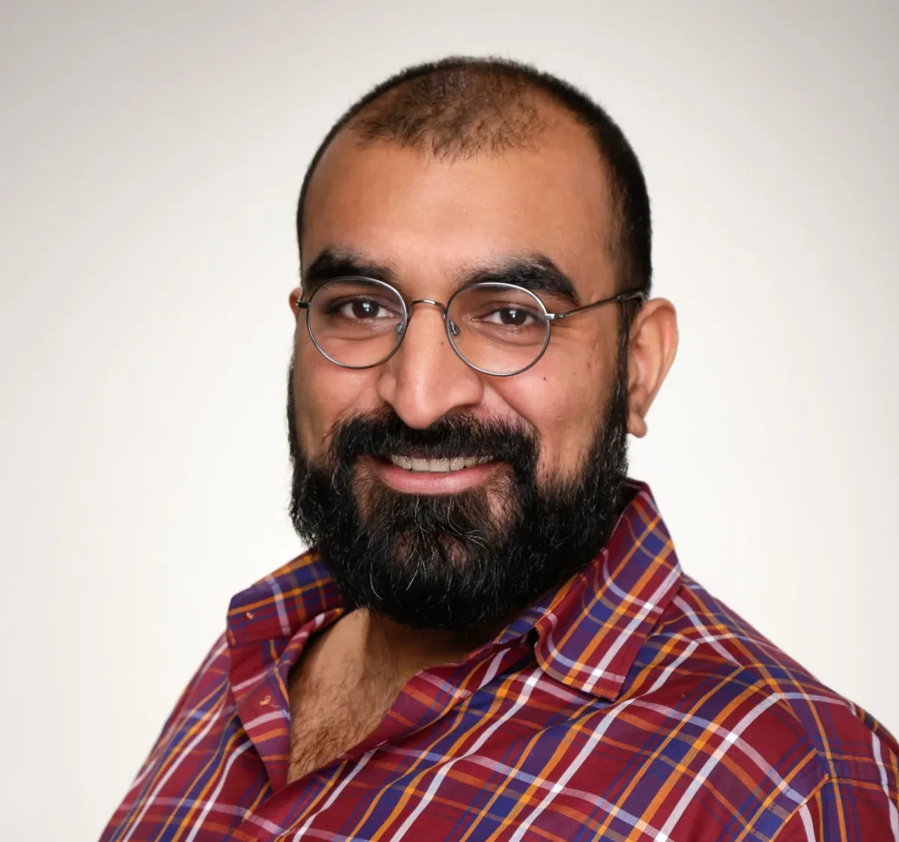
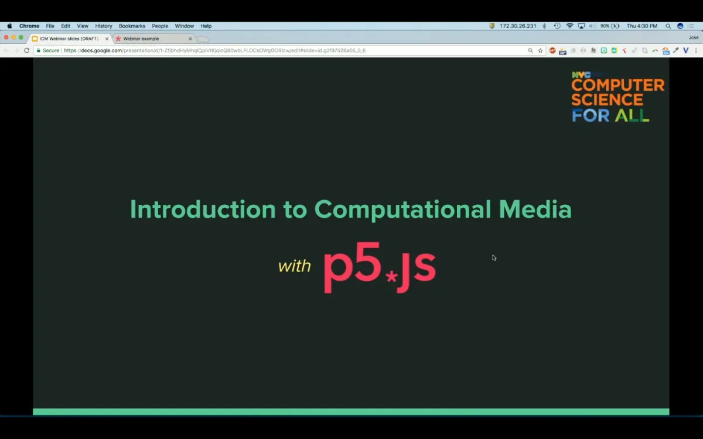

The podcast is part of our [Education Portal](https://processingfoundation.org/education), a collection of free education materials that can be used to teach our software in a variety of classroom settings. Rather than endorse a specific curriculum, we’ve engaged with a variety of educators from our community, ranging from K12 teachers, to folks who lead workshops at hackerspaces, to university professors in interdisciplinary departments. We’ve asked them to share their teaching materials, which anyone can use.

createCanvas *features monthly in-depth interviews with these innovative educators, so you can get to know their practices and what they bring to the classroom and why. Stay tuned here for transcripts of each interview, as well as to the* [Education Portal](https://processingfoundation.org/education) *for podcast episodes and teaching materials.*

[This is Part 1 of our interview with Aankit Patel, which can be found on SoundCloud here](https://soundcloud.com/processingfoundation/episode-3-aankit-patel-part-1-or-2)*. Below is the transcript (lightly edited for clarity). Part 2 will be released in April.*

*[Aankit Patel](https://aankit.com/) recently joined the City University of New York as Director of [STEM Education Programs](https://twitter.com/cunyteachered) to support the development of STEM technical, pedagogical, and content knowledge. Over the past five years, he worked to bring [creative, physical, and critical computing](http://blueprint.cs4all.nyc/curriculum) to K-12 classrooms (training over 2,300 in-service teachers) as a leader of the [Computer Science for All](http://cs4all.nyc/) at the NYC Department of Education, utilizing [co-design with teachers and community stakeholders](http://blueprint.cs4all.nyc/about) to develop a [NYC K-12 CS framework, learning objectives](http://blueprint.cs4all.nyc/what-is-cs), and [resources](http://blueprint.cs4all.nyc/resources) that could meet a range of differentiated needs. He forged a partnership with NYU and the [Processing Foundation](http://processing.org/) to help launch the [p5.js web editor](http://editor.p5js.org/), was co-PI on a grant with EDC and UC Berkeley to adapt the [Beauty and Joy of Computing (BJC)](http://bjc.edc.org/) curriculum for NYC high schools, and won an NSF grant with EDC to help lower-performing schools successfully implement CS.*

**Saber Khan**: Hey everyone. Welcome to createCanvas, a podcast about the Processing education community. I’m your host, Saber Khan, the Education Community Director of Processing Foundation. \[*intro is the same as above*\]

This is the first part of our conversation with [Aankit Patel](https://aankit.com/), director of STEM Education Programs at the City University of New York. Previously, he was with the New York City Department of Education as the senior director of computer science academics. Here, we talk about how the City of New York is teaching computer science to students and teachers as part of the [CS for All](http://cs4all.nyc/) program, a program that seeks to provide computer science education to all one million students in New York City public school system.

You can find the second part of the episode \[in April\] and other episodes on the *createCanvas* SoundCloud and wherever you download podcasts. By the way, these interviews are part of our new feature on our website processingfoundation.org called the [Education Portal](https://processingfoundation.org/education). The portal will have education materials and resources available for free.

Aankit, do you want to introduce yourself?

**Aankit Patel**: Yeah, sure. I am the Senior Director of computer science academics at the New York City Department of Education. My work revolves around developing curriculum and professional development for teachers K-12, and partnering with outside organizations to bring computing and computer science into every single New York City public school, in a way that will really prepare students to not just be computer programmers and software engineers, but to be citizens of the world that involves computing in really significant ways.

**SK**: And this is part of the CS for All movement? Do you want to give us a little history of your part in it, and how it started in New York? What’s happening nationally with this movement?

**AP**: Yeah, sure — so, I’ll start large and then get to my involvement, where it started. The larger movement was funded, and started with a bunch of smaller projects, by the National Science Foundation. Things like [Exploring Computer Science](http://www.exploringcs.org/), which was done out in LA. There’s a really interesting book about it called [Stuck in the Shallow End](https://mitpress.mit.edu/books/stuck-shallow-end) that focuses on these equity issues in computer science. Worth a read. That research pointed out this big gap between different schools, and even at schools that were well-resourced. This gap in all students having an opportunity to access computing, computer science, to be able to not just program, but to really be able to use the computer in meaningful ways, and see themselves as producers and users and power-users of computers, as opposed to just consumers.

A lot of that work led to people who have been doing groundwork advocacy. People like [Leigh Ann DeLyser](https://www.linkedin.com/in/leigh-ann-delyser), who is now leading the [CS for All consortium](https://www.csforall.org/), which is a national group that brings together the community of folks out there, that are organizations providing these types of services. They work directly with school districts to figure out, “Okay, what might your plan be? What are you already doing? Where do you want to go?” And then hopefully help them formulate a plan that connects them with providers that can help them get there.

Things are a little bit different in New York City, obviously. It’s like a small country. The school system serves 1.1 million students, has about 1,840-some schools, including public and charter schools (charter schools are public schools, technically). What happens in New York is different because there’s a lot of money behind it. New York isn’t necessarily relying on providers to come in and push into classrooms and train teachers and drive this educational change.

What happened was, in 2013 the [Academy for Software Engineering](https://www.afsenyc.org/) was founded right off of Union Square and that was largely funded as a Bloomberg-era initiative. [Fred Wilson](https://www.usv.com/people/fred-wilson/), who is a venture capitalist at Union Square Ventures, was behind that. I’m not exactly sure what the details of that are. At the same time, a pilot program for 20 middle and high schools was kicked off, called the [Software Engineering Program (SEP)](http://cs4all.nyc/programs/sequences/). The goal there was to see, “Okay, if we set up a high school that’s dedicated to software engineering, and then we start this pilot program to push this into a number of other schools, can we start to address this issue, this gap that we have?”

In New York City there is a need to build up the technology sector, and that needs talent. And yes, that means computer programmers. That was a big piece driving all of this change. Interestingly, how that has evolved and broadened past just feeding into the technology sector, is the people who were brought on for that Software Engineering Pilot. [Don Miller](https://www.linkedin.com/in/dmiller80/detail/contact-info/), who is a [NYU Interactive Telecommunications Program](https://tisch.nyu.edu/itp) (ITP) grad, was hired after a couple of directors came and went, to run that program at 20 middle and high schools. He focused on this idea that, “We can use computers to problem-solve — but we can also use them to express ourselves.” That really jived for teachers.

**SK**: Got it.

**AP**: It jived with teachers in professional development and that excitement, enthusiasm, and the curriculum and that approach jived with students as well. While SEP in the early \[period\], like six months to a year, was floundering with a lot of big ideas about teaching kids algorithms and advanced problem-solving computer-science techniques, it really hit its stride once we focused on this creative expression approach.

Don ended up bringing on a number of other ITP grads — we call it the ITP Mafia. That has really shaped what it looks like in New York City with a lot of our curriculum. Still, yes, dealing with advanced computer science, but being grounded in this creative expression. We do a lot of that curriculum development or professional development ourselves.

**SK**: So you attended ITP as well?

**AP**: Yes.

**SK**: What’s your creative coding background?

**AP**: Well, creative coding: I guess it depends on how you look at it. I think I began to be creative and hack in jobs using what I could figure out with Excel and Visual Basic to get things done, primarily for myself. It didn’t actually serve any real purpose of making things more efficient, but it was fun and that aspect of it really drew me in.

Going to ITP was — I guess if you would call my training in CS formal, though nothing in ITP is really formal — it started there with the [Intro to Computational Media](https://github.com/ITPNYU/ICM-2015) (ICM) class and the [Intro to Physical Computing](https://itp.nyu.edu/physcomp/) classes. Those are classes that have used a number of different technologies over the years. I guess ICM has moved from Processing to p5.js. It may have started with Flash or something like that. I know Physical Computing was using different types of boards before the Arduino came along.

*Aankit’s contribution to our Education Portal is the NYCDOE CS for All curriculum for [“Intro to Computational Media,”](https://blueprint.cs4all.nyc/curriculum/intro-to-computational-media/) which was developed by the NYCDOE CS education team. The ICM course “is a yearlong (108 hours) creative computing course for high schools using the open source Javascript library p5.js. By understanding how code can be a medium for creative expression, students will learn the fundamentals of computer science while designing and prototyping interactive projects that run on a browser. This course is currently being implemented in NYC public high schools via CS4All’s Software Engineering Program (SEP), CS4All ICM Cohorts, and it aligns with the CS4All Blueprint for CS education.”*

There was an ethos and an approach to computing that really made a lot of sense in those classes. When I was there, things clicked for me. A lot of what ITP is, is going and making and learning primarily on your own, and I learned a ton on my own. Having an interest in education, I needed some exposure and some practical ways to learn more and more about K-12 education, specifically for what I was interested in. Interestingly, Don and I hooked up with Dan Shiffman and said, “Hey, I have an opportunity for some ITP-ers to come in and help in K-12 classrooms ’cause we’re doing creative coding there.” I think there was like five of us that first semester, the first half of 2014, that ended up going into classrooms all around the city, in Staten Island, the Bronx, far out in Queens.

We just went in and were TA’s in classrooms, helping kids with their projects, helping them think through problems, coming up with new interesting projects kids could do. I had a bunch of middle-schoolers soldering components to a breakout board to make clocks, for a data logger. A couple of them deployed these around their school to see what the different noise levels were in classrooms, so they could complete an analysis of how different sound levels affect their mental and emotional wellbeing, which is really interesting. That experience gave me a lot of practical understanding of the power, and the challenges, of using creative coding in the classroom.

**SK**: So this is you going into this software engineering pilot program that predates — or is the starting of CS for All in New York City? Who are the teachers that you were working with then?

**AP**: I stayed in the same classroom for about a year and a half. [Ben Samuels-Kalow](https://www.linkedin.com/in/bensamuelskalow/) (oh man, he’s going to kill me for still not knowing how to pronounce his name) —

**SK**: \[*laughing*\] He’s known as Ben SK. I don’t think we have to know how to pronounce his last name.

**AP**: \[*laughing*\] So, I was in Ben SK’s classroom, and I walked in and thought, “Oh, this guy’s pretty young.” He ran an interesting classroom. I found out later that he’s 10 years younger than me or something like that.

**SK**: \[*laughing*\] That sounds awful.

**AP**: But I learned *a lot* from him. He was one of the teachers in that pilot cohort.

We had some folks that had left the DOE to work as computer-science coaches, or to go and work in the industry, folks that \[went to\] do community coordination, or some folks who left and are now programmers and helping build platforms that help other people learn programming or build projects and share them. That’s the minority.

Most of the teachers stayed because they’re teachers, they’re learning computer science or learning creative coding. It certainly *can* be transferred into and to another job, and often people think, “Oh, somebody knows how to code they’re never going to teach.” Well, if you really like teaching and that’s what you’re passionate about, or that’s what you do, that’s what you’re good at, then you’re going to stay teaching. And a lot of those teachers from that initial pilot cohort are still teaching. They came from a variety of backgrounds and schools all over the city. Some were special-ed teachers, some of them were ICT \[[Integrated Co-Teaching](https://www.uft.org/teaching/students-disabilities/integrated-co-teaching-ict)\] special-ed teachers. I forget what that stands for.

**SK**: It’s like technical training, right?

**AP**: No, I think it’s a DOE acronym. I forget all these. But it’s sort of a self-contained room where there’s just special-ed students, and we’re training *them* on computer science, and they’re in creative coding and —

**SK**: It used to be called self-contained classrooms when I was at DOE.

**AP**: Yeah. I think some of them still call themselves “contain,” and there’s also ICT, that term gets thrown around. But those teachers were part of the cohort and they were bringing creative coding to their students. We had teachers at schools where there were huge bilingual or multilingual populations that were bringing that to their students. Middle school teachers, high school teachers. We had teachers that had programming backgrounds, some teachers didn’t. Some were art teachers or math teachers. We get asked this question a lot, “Are most of these teachers young?” It’s like, no, we had a range of ages, and folks from a range of ages who were engaged and interested in learning. There’s a number of teachers that have said, “in my 20 years, my 17 years, my 15 years of teaching, I’ve never been this excited to teach. This has re-invigorated my passion.” Which is really cool to hear.

**SK**: So this cohort and this growing cohort since then are serving the students as part of CS for All. And then you’re serving those teachers. What’s that like? What do the teachers need? How do you provide it? How do you give them stuff that they need, or then the stuff that they don’t know they need but they’ll need in the future?

**AP**: Teachers need to know primarily what they’re expected — what they’re going to be doing in the classroom. When they show up at work, they’re essentially performers. They have to stand up in front of a class and keep this crazy group of kids entertained and then also teach them stuff.

**SK**: Of course.

**AP**: Which I think is not necessarily held in as high a regard as it needs to be. But I won’t get on that soap box right now.

\[*laughter*\]

**AP**: So we start there. Like, okay, you need to know what you’re doing, so that’s curriculum. Then you also just need to know how you’re going to run that classroom. Meaning what is the content that you’re going to be presenting, what are the goals for that content? What are you going to be doing? What are the kids going to be doing? There’s obviously a lot of depth behind that. I, as I said, most of these teachers — they come from lots of different backgrounds —most of these teachers do not know anything about computer science. A lot of them even just struggled to use the computer *well*.

**SK**: Gotcha.

**AP**: We needed to teach them on top of this, what I would call, what are you going to do in the classroom? The pedagogical piece that goes very deep, in and of itself, at a base level: What are you going to teach? How are you going to teach it? What are the kids doing? And then they needed some technical knowledge: What is programming? How do you actually do it? And then, what are the pieces that you might need as a teacher around that? Which is how this connects to the pedagogical piece: What platforms you’re going to use, how are you going to manage your student projects? Things like that.

And then probably one of the more difficult pieces, the ones that we constantly have to think about and look back on and reflect quite a bit on, is the conceptual, the content knowledge. A lot of the CS for All movement focuses on the connection of the content knowledge to the pedagogy, which is: What are you teaching? And just getting teachers to understand what exactly it is they’re teaching without necessarily giving them the deep content knowledge in computer science. I felt like, you can’t put these teachers up in front of kids without them feeling pretty confident in their ability or their understanding of concepts, like, you know, what is an algorithm? How is that different from a set of instructions, right? Like, what is data and how is it structured and why do we care? What is abstraction, and how is that important to computer science, and the most important concept of computer science?

There’s layers and layers below that, that we ensure that we spend some time with teachers addressing that. All of these three things typically happen in the course of — so it depends on, who the teacher is, and how much time they’re willing to spend within their school actually on this instruction — but it will be anywhere between 60 and a hundred hours in a school year. That will look like a couple of one-to-two week \[sessions\] in the summer, where it’s intensive training with back-to-back days. Teachers are making a lot of projects, they’re sharing, they’re getting deep into content, they’re doing things like simulations, where they get up in front of their colleagues, and they try teaching a lesson, and get feedback, and share and steal ideas from each other.

And then throughout the school year, meeting back up on Saturdays — so teachers are taking time out of their Saturdays — at least five times in the past, we’ve done it a lot, almost every month, to go back over the content, to learn some new content for curriculum coming later in the year (because in the summer you can’t cover the entire year) to connect about challenges, if they’re teaching courses or things that have tests associated with them, like advanced placement courses, to start addressing and preparing for how they are going to prepare students for that. A lot of the practical things get knocked out during the school year.

And that’s just *training* right there. That’s just the professional development piece. It doesn’t include us going onsite to schools, to talk with the teachers to help them unpack what’s happening in their classroom. To check in with their administrator — usually it’s very hard to pin down an administrator because they have so many different responsibilities — and talking to the administrator and being like, “Hey, this teacher’s teaching computer science. Do you know what that is? Do you care? What do you think about this? Are you seeing this as a critical part of your school? How do you see it continuing in the future? Is it going to expand? How are we going to make sure that the kids that are in the computer science classroom really represent the demographics of the kids in your school?” Because if you’re only going to offer one computer science class — which is certainly not the goal because we want it for all — we have to make sure that the representation in that room matches the demographics of the school. And that’s just step one of ensuring that we’re being equitable about this.

**SK**: Makes sense.

**AP**: And then you know, teachers also just need — and this has been the hardest thing, but it’s probably one of the more important — is a community practice, a feeling like they are part of something larger. That this is not just, “Hey, you’re going to get trained on this thing because it’s a big new initiative and you’re going to teach it for a couple of years and then nobody’s going to care anymore.” No, this is a big professional change. There’s a group of teachers in this city that care, and love learning this, and are defining what CS education is.

**SK**: Yeah.

**AP**: And we’ve done that. A lot of people will think that that’s, “Oh yeah, just you know, have meetups and things like that.” Well, those aren’t necessarily — one, teachers are super busy as I’ve just described, we’re asking them to do hundreds of hours of PD \[Professional Development\] every year, and this is on top of everything else they have to do. They have their own professional responsibilities, they have responsibilities with families and stuff, through the school, after-school programs and things like that, they teach other subjects too.

So what we’ve done is try to incorporate them into a larger initiative, big questions. Early on we had this thing, we needed to create a blueprint for computer science education, which laid out, What is computer science? What are the concepts? In education the way that things are broken down are concepts and practices. So you know, what are the concepts? We worked with teachers that had been teaching CS and had them share what do they teach, what are their learning objectives, how do they teach it, what are some of the challenges they face, what do they have students doing?

We were able to start gleaning concepts. We were able to start understanding and building patterns for practices. And we also started to understand that there’s this interesting issue that kids are all in different places right now. And so we needed a flexible way to talk about the progression of computer-science learning, because we can’t just tell teachers, “Okay, well, they’re going to learn these concepts and practices,” without there being any sense of how *much* of this should they learn, at what different stages of their computer science learning. Typically, that’s tied to a grade band because every kid is getting math and English, for example, every year, and we can be somewhat confident where they’re going to be in that progression.

With computer science, we’re not. We had to make a flexible structure where we chunked out, like, here’s the concepts and practices, here’s what you need to know about abstraction, and how to build something with abstraction. Prototyping is the practice that we use in K2, in kindergarten through second grade, and what does that look like in grades 3–5, 6–8, 9–12, without necessarily saying, “this is exactly when those things will happen to these specific grades.”

We added something called Perspectives, to this concept and practice framework, where students are moving from being able to play with computing as explorers, to being able to create as creators, to being able to build off of, and create and explore other people’s work, and to build off of that. And then finally to examine and build with a community, to understand how computers affect a community, as citizens.

We now are seeing some elementary school teachers using that [citizen perspective](https://blueprint.cs4all.nyc/perspectives/), because they have students moving quickly, and sometimes it makes sense to jump back and forth between the creator and citizen. We see some high schools starting students off with play, with computing as explorers, because they’ve never seen it, or they’re completely new to the country, they’re new arrivals at an international high school, and they can’t be expected to start building off of other people’s projects and consider the social impacts, while still trying to make sense of where they are and the school system.

**SK**: Of course.

**AP**: The only reason we were able to get to these frameworks and understand how to do this was by including teachers in that process. We did that over the course of a year and a half. We had at least 25 meetings with teachers; there ended up being a very core group that kept coming back and providing us feedback. And then we also included industry and researchers and academics and community-based organizations in that process, and invited teachers to connect with those organizations and with those folks during these meetings. So, giving teachers a sense of even the broader community outside of just education.

I feel that many of those teachers have stuck around as leaders, and have advocated for CS education in one way or another at their school, or even at the larger scale. New York City is made up — it’s one school district but it’s made up of 32, 34-some-odd districts, smaller districts. We have teachers advocating at their individual district levels, it would be them going to other schools and helping them get computer science off the ground, because we’ve included them in leading and shaping what CS for All is. I think that’s how to keep doing that as this progresses, and potentially how to give them a sense of ownership over the deeper \[concepts\], that creative coding is an approach to computing and using computers that most of our work with teachers has focused on the systemic, the educational piece. Now, how do we get teachers to take that next step into, “okay, what is actual computer science, or the computing piece,” and start impacting and shaping that. I think that is a potential next step. I don’t know how we get there just yet.

**SK**: Thank you for joining creativeCanvas. Once again, I’m your host Saber Khan. creativeCanvas is produced by Processing Foundation and supported by the Knight foundation, our editors, Devin Curry. Special thanks to Processing Foundation board and staff. You’ll be able to find many things discussed here today in the show notes and, before you go, please visit processing foundation.org and check out the education portal for free and accessible educational materials Processing Foundation is on Twitter, Instagram, and Facebook. You’ll find this and future episodes on our Medium channel as well.
