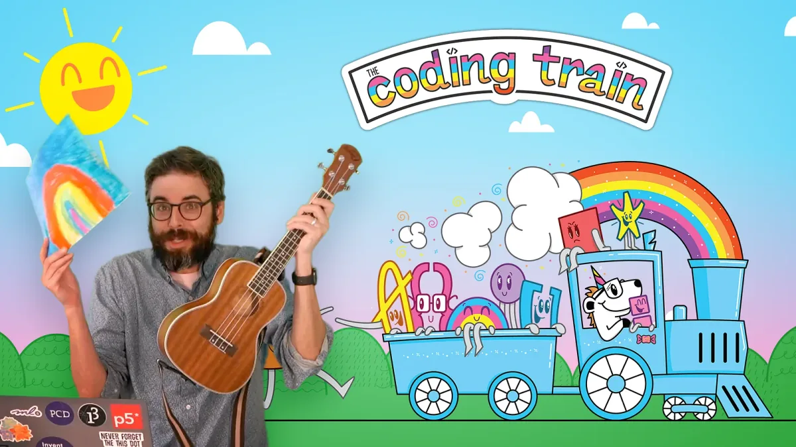
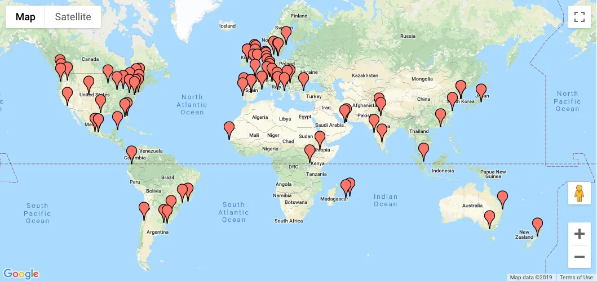

The podcast is part of our new [Education Portal](https://processingfoundation.org/education), a collection of free education materials that can be used to teach our software in a variety of classroom settings. Rather than endorse a specific curriculum, we’ve engaged with a variety of educators from our community, ranging from K12 teachers, to folks who lead workshops at hackerspaces, to university professors in interdisciplinary departments. We’ve asked them to share their teaching materials, which anyone can use.

createCanvas *will feature monthly in-depth interviews with these innovative educators, so you can get to know their practices and what they bring to the classroom and why. Stay tuned here for transcripts of each interview, as well as to the* [Education Portal](https://processingfoundation.org/education) *for podcast episodes and teaching materials.*

[This is Part 2 of Dan Shiffman’s interview and can be found on Soundcloud here](https://soundcloud.com/processingfoundation/episode-2-dan-shiffman-part-2-of-2)*. Below is the transcript (lightly edited for clarity). The first part can be found* [here](https://medium.com/processing-foundation/createcanvas-interview-with-dan-shiffman-eb22043882e6) *as a transcript and* [here](https://soundcloud.com/processingfoundation/episode-1-dan-shiffman) *on Soundcloud.*

**createCanvas* returns with Part 2 of our in-depth interview with Dan Shiffman! Dan is the beloved host of The Coding Train, the vibrant Youtube channel of weekly creative coding tutorials. Dan has been part of the Processing Foundation since before it was a foundation. In Part 2 of the interview, he talks to Education Community Director Saber Khan about different sustainability models for open source, the pros and cons of using YouTube as a platform, and how The Coding Train is more about community and documentation than it is about technical expertise.*

**Saber Khan**: Hi everyone. Welcome to createCanvas, a podcast about the Processing education community. I’m your host, Saber Khan, Education Community Director of Processing Foundation. \[*Intro is the same as above.*\]

This is the second part of our conversation with DS of Coding Train Processing Foundation and NYU ITP. If you missed the first part, I recommend you listen to that as well. You can find that and other episodes on the Creative Canvas SoundCloud and wherever you download podcasts.

By the way, these interviews are part of a new feature on our website, processingfoundation.org, called the Education Portal. The portal will have education materials and resources available for free.

You moved from Vimeo to YouTube, and YouTube is such a sort of cultural moment both of learning about the world, but also anxiety about what’s happening here.

Does that enter into *The Coding Train* world?

**DS**: It does and it doesn’t. It enters into my thoughts a lot because I have two kids who are eight and 11. They spend time watching YouTube. I’m always trying to figure out how to manage that; and “should they be watching YouTube?” and “how many clicks away are they from inappropriate material or conspiracy theories?” I worry about that. So that’s a concern of mine and, in a lot of ways, I might prefer to be on a platform, or have my own platform, that is less part of the giant corporate mess that is the internet.

However, for what I’m doing, I don’t know how I would reach that same scale of audience, and it has offered me opportunities to generate revenue, which make doing this more sustainable for me. So on the one hand, I talk about working for Processing, doing that without any additional income, \[and how that\] works because I consider it part of my research practice.

The same could be said about making video tutorials. I could put them out with no ads on them; I do put them out with ads on them, and sometimes I take the ads off, and sometimes I put them back on. I go back and forth between this depending on if I’m requiring them for a class. I’ll demonetize them for like a couple of weeks, then I’ll put it back on.

It’s allowed me a couple things. One, is I now \[at the time of the interview\] have two people \[as of this publication, it’s now 4\] that I work with who I pay. Having the income makes that possible. It’s also really a motivating factor for me. It helps me get excited about doing it in a certain way, because I know there’s that benefit to me coming back from it as well. I’m conflicted about this because I’m in a very lucky, privileged position to have a full-time salary job at NYU, but I also think of it as, if I can learn how to do this in a sustainable way, that generates revenue, then that’s something that hopefully I can model for other people who can do the same type of thing. The YouTube platform really affords me this possibility.

I have a backup of all of my videos. YouTube could go down, or YouTube could do something really terrible, and I feel like the irony here is, “where is my backup of all my video files?” Oh, it’s in my Google drive. \[*laughs*\] That’s also Google. So I don’t know how to manage this.

**SK**: \[*laughing*\] Yeah.

**DS**: I’m kind of like handcuffed in this situation: it’s of great benefit to me, and I really enjoy YouTube as a platform and the live streaming, everything that comes with it, but I’m concerned.

Anybody who has thoughts about this, I would love feedback, or to hear from \[you\], to make sure that I’m doing everything in the best way that I can!

**SK**: It also seems to have a very interesting, vibrant community of creators, especially in the area you work.

**DS**: Right.

**SK**: Have you met other peers doing similar work?

**DS**: Yes. This has been one of the most fun aspects of doing this on YouTube. I feel like I have been part of a community — whether it’s the ITP community, the Processing community, or open source — for years, but only in the last couple of years did I discover this other community of educators on YouTube. Most of whom are the most well-known ones \[who\] are not doing computer coding.

I’ve gone to some events: I went to something called EduCon, which is a gathering of people who make educational video content. I went to something called [ThinkerCon](https://www.youtube.com/watch?v=UXq1VFWTQE0&feature=youtu.be), which was in Huntsville, Alabama, which was, again, a sort of conference and gathering of people. I’ve met a lot of really amazing, phenomenal, talented people who make science, math, and other kinds of educational videos on YouTube.

Learning from them, meeting them, and trying to figure out ways to do collaborations has been great. That is also an answer to one of your other questions that I forgot about, which is that a primary way I get ideas is \[by\] watching a lot of other educational YouTube creators and thinking, “Okay, so I just watched….” For example, the image of the black hole was recently published, \[and\] a very well-known YouTube channel called Veritasium, which makes a lot of physics and science videos, made a whole video about that image \[which you can see [here](https://www.youtube.com/watch?v=zUyH3XhpLTo&feature=youtu.be)\]. Watching that video \[I thought\], “Is there a way I could code an example that would go along with it?” That’s how I see my role.

  <iframe src="https://www.youtube.com/embed/Iaz9TqYWUmA?feature=oembed" frameborder="0" scrolling="no"></iframe>

There’s a YouTube channel called [3Blue1Brown](https://www.youtube.com/channel/UCYO_jab_esuFRV4b17AJtAw), which does a lot of math and physics educational videos with animations and all sorts of amazing, beautiful explanations. My skill is never going to be making such beautiful, eloquent, concise explanations of really complex topics, but I can sit and struggle through coding one of those topics. In a way, what I can do, is be a companion service to some of these other YouTube channels, where people who are watching and learning and getting excited about a topic, could find a coding video that goes along with it.

**SK**: I think that’s really to another point about what coding offers. Someone’s worked out the math and the science behind it to play with it. It’s great to be in a coding base for a lot of people so that you can watch it happen or play with the variables and things like that.

**DS**: Yeah and for me it’s always been a way of understanding something that I thought I wouldn’t be able to understand.

**SK**: Maybe this is a good moment to talk about the thing you hinted at, [ml5js](https://ml5js.org/). What is that project? What’s happening there? How’s it connected back to some of the other things you mentioned?

**DS**: Yeah. So, [ml5](https://ml5js.org/) is a JavaScript library. It started for a couple of different reasons. One, is it started out of a grant that I applied for from Google (speaking of Google, everything in my life seems to tie back to Google!). Google has something called Google Faculty Research Awards, I think that’s the name of it, that you can apply for if you teach at a university.

  <iframe src="https://www.youtube.com/embed/jmznx0Q1fP0?feature=oembed" frameborder="0" scrolling="no"></iframe>

At the time, Google was coming out with something called DeepLearningJS, which is now TensorFlow.js, which is an open source JavaScript library for machine learning. I wrote a grant proposal to say we wanted to make beginner-friendly examples for people learning to code with things like p5.js, to be able to use TensorFlow.js and be able to learn about machine learning and creative coding.

That ultimately became more than just a set of examples. It also became a library called ml5, which is just a wrapper around TensorFlow.js that provides access to a lot of the functionality, but without the requirement to do some of the lower-level things you need to do when you’re working with TensorFlow.js directly. That library exists as a standalone project developed at ITP. Most of the contributors are ITP students or researchers, but there’s been a lot of outside contributors as well.

  <iframe src="https://www.youtube.com/embed/kwcillcWOg0?feature=oembed" frameborder="0" scrolling="no"></iframe>

Two students from Parsons this year joined the project and then helped design the new ml5js website. That project, it’s kind of grown and sits alongside almost as like a sibling project to p5. It’s not officially part of the Processing Foundation, but there are a lot of the same people working on both of those libraries and p5 and ML5 work well together.

**DS**: I’m teaching a new class this fall, and I’m hoping to use ML5 and TensorFlow.js and something else also called RunwayML, which is another separate project, but those three platforms as the primary engines for this course, in which case I’m hoping to make a lot of new video materials and make a lot of new tutorials about as well.

**SK**: That’s great. It seems like there’s a way to understand what it is that you do, which is this desire to create stuff for your classroom that has led you down many different roads, the Processing Foundation, Coding Train, ML5.

**DS**: Right.

**SK**: What’s your hope for the direction Processing Foundation’s headed in? Are there things that you’re looking forward to at Coding Train? I’d love to know what the future holds.

**DS**: That’s a great question. One thing that, it’s not really to answer your question, but one thing that just struck me, that’s come into focus through this conversation, is I feel like the common thread throughout all of these things, in a way, is that last mile (or kilometer, I try to use the metric system whenever I can!). There are so many things out there, like TensorFlow.js — to name the one that’s most recently talked about — that do all of these amazing technical gymnastics, and they shouldn’t necessarily. You can’t do it all. If you’re the people developing TensorFlow.js, you have to focus on what you’re focusing on to make that thing work, but there’s this little gap of somebody who’s a high school student, or a lifelong learner in their sixties who is sitting on the internet and knows a little bit about coding, and can’t figure out how to get what they’re working on to attach to this new thing.

I feel like, for me, my videos try to do — it’s not technically complicated work necessarily — it’s more community work and documentation work, and being thoughtful about the language you’re using to bridge that little gap there. I think the p5 Web Editor that Cassie Tarakajian leads \[[here’s a short video intro](https://www.youtube.com/watch?v=dtHxDggkBYc&feature=emb_logo)\], is a project that does this as well, because I’ve encountered so many people who are like, “Okay, I sort of get what you’re talking about in these four lines of code, but I don’t know how to put those lines of code on my computer and run them.”

**SK**: Mm-hmm \[affirmative\].

**DS**: Being able to do the work that’s that last distance is so fundamental and crucial. Thinking back to your question, my hope is for more of that, and especially more that’s targeted towards communities, of people who have historically been left out, or who don’t have access; or materials haven’t been written with them in mind; whether they’re not seeing themselves represented in the people who are presenting this stuff, or there’s just been no one who’s come to their city or community to do a workshop.

*Map showing the 100+ registered node cities of Processing Community Day Worldwide 2019.*

That’s one of the things that I know began with [Processing Community Day](https://processingfoundation.org/advocacy/processing-community-day-2017-2019), specifically [Processing Community Day Worldwide](https://processingfoundation.org/advocacy/processing-community-day-2020). Having these events in cities that are places that aren’t just New York and Los Angeles, or other similar international cities, but really being able to reach beyond the people that I’m used to seeing and talking to.

I think we have to find ways of bringing more people to the table, not just like, “oh, we’re running workshops in these cities,” but that there are people who are planning *which* cities, who are *from* those cities, and from those communities. That’s really what I’m hoping for.

I think YouTube does that in some ways, because it reaches people in international audiences. If you have a phone, but don’t have a computer, if you have an internet connection, or a mobile connection, you can find these videos and learn about this stuff. But it doesn’t reach people in other ways that having a local meet-up can. Or something that’s funding people to work on open-source contribution, paying them to do, like, a two-week project, and mentoring them. That’s not what Coding Train does.

I feel like the university, NYU as an institution, offers something to a certain audience, YouTube offers something different to a different audience, and Processing Foundation also, hopefully, can be a place that can bridge a lot of those gaps of audiences who are being left out of those two things as well.

**SK**: That’s great. One of the reasons we’re interviewing you aside to hear all these things, is to launch our [Education Portal](https://processingfoundation.org/education), which is on the Processing Foundation website, to help people get started by themselves or in their classroom.

From all that stuff you mentioned, is there a particular place \[someone\] should start? Is there a particular video or a playlist that you recommend?

**DS**: There are many places on the internet that you can find to get started. (I’m always speaking about my stuff because it’s on the front of my mind.) I don’t want to recommend it over the other wonderful tutorials and starting places that are out there. I do have a playlist. It’s called [Code! Introduction to Programming with p5.js](https://www.youtube.com/watch?v=HerCR8bw_GE&feature=youtu.be).

  <iframe src="https://www.youtube.com/embed/HerCR8bw_GE?feature=oembed" frameborder="0" scrolling="no"></iframe>

**DS**: That’s the playlist that is meant to be for someone who’s never done any of this before. The only requirement to follow along is that you have a web browser, because it’s assuming you’re going to use p5 Web Editor. At present \[the Web Editor\] doesn’t work on mobile or tablet very well (maybe in the future it will). So that’s the starting point.

One of the things that I’m most excited about with the Education Portal, is a way of aggregating more of these, because I know there are other people who either have written tutorials or video tutorials that are for total beginners. Being able to have a repository of some of that stuff for people to find things more easily is super important.

Also, I think what’s really important that we’ve been doing a better job with, especially with the work that you’re doing, is talking to teachers. Because when I found Processing in 2003, it was primarily being used in graduate school environments, art school environments. Especially with what Lauren McCarthy and the p5.js community have built being JavaScripted in the browser, again, and even Processing wasn’t that originally, it wasn’t JavaScript that was in the browser originally, it’s finding its way into K through 12 education. That wasn’t the expertise or the experience of a lot of the core contributors and developers of processing in p5.js.

There are things that a teacher will say to me, like, “If this was in the web editor, this would solve all these problems we have.” It seems obvious after a person has said that to me, but I never thought of it beforehand. Being able to have those kinds of conversations and feedback from teachers, and having them be part of the development and design process, through the educational portal, is a really important thing.

**SK**: Great. Thank you so much. Thank you for joining *createCanvas*. Once again, I’m your host Saber Khan. *createCanvas* is produced by Processing Foundation and supported by the Knight Foundation. Our editor is Devin Curry. Special thanks to the Processing Foundation board and staff.

You’ll be able to find many of the things discussed here today in the show notes. And before you go, please visit [processingfoundation.org](https://processingfoundation.org/education) and check out the Education Portal for free and accessible educational materials.

Processing Foundation is on [Twitter](https://twitter.com/processingOrg), [Instagram](https://www.instagram.com/processingorg/?hl=en), and [Facebook](https://www.facebook.com/page.processing). You’ll find this and future episodes on our [Medium](https://medium.com/processing-foundation) channel as well.

*More createCanvas episodes will be coming each month, both as* [a podcast](https://soundcloud.com/processingfoundation) *and here as a transcript! Stay tuned!*
