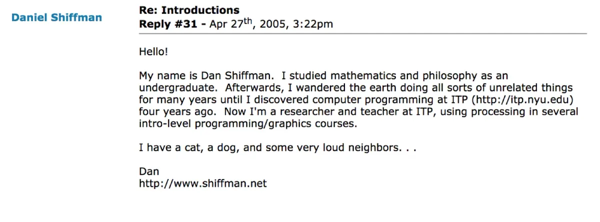

*The podcast is part of our new* [*Education Portal*](https://processingfoundation.org/education)*, a collection of free education materials that can be used to teach our software in a variety of classroom settings. Rather than endorse a specific curriculum, we’ve engaged with a variety of educators from our community, ranging from K12 teachers, to folks who lead workshops at hackerspaces, to university professors in interdisciplinary departments. We’ve asked them to share their teaching materials, which anyone can use.*

createCanvas *will feature monthly in-depth interviews with these innovative educators, so you can get to know their practices and what they bring to the classroom and why. Stay tuned here for transcripts of each interview, as well as to the* [*Education Portal*](https://processingfoundation.org/education) *for podcast episodes and teaching materials.*

*Below is the transcript of Episode 1 with Dan Shiffman (lightly edited for clarity). This is Part 1 of Dan’s interview. The second part will be released in a few weeks!*

---

*createCanvas kicks off with an in-depth, two-part interview with Dan Shiffman! Dan is the beloved host of The Coding Train, the vibrant Youtube channel of weekly creative coding tutorials. Dan has been part of the Processing Foundation since before it was a foundation. In this episode, he talks to Education Community Director Saber Khan about how and why he started making educational materials for creative coding, what open source contribution can look like (spoiler: almost anything!), and he takes us behind the scenes of his YouTube channel, which currently has 889,000 subscribers. Artwork by [Alon Chitayat](https://www.animishmish.com/).*

**Saber Khan**: Hi everyone. Welcome to *createCanvas*, a podcast about the Processing education community. I’m your host, Saber Khan, the Education Community Director of Processing Foundation. \[*Intro is the same as above.*\]

I’m here today with Dan Shiffman. Dan, do you want to introduce yourself?

**Dan Shiffman**: Oh boy. Okay. Yes, I definitely want to introduce myself. My name is Dan, and I’ve been part of the Processing Foundation since the start. The Processing project itself dates back 10-plus years before we started the Foundation. I started working with Processing in 2003, a couple of years after Casey Reas and Ben Fry started it. I started working with Processing by discovering it here where we’re sitting right now at ITP, which is a two-year master’s program at Tisch School of the Arts, NYU. I haven’t looked back since, and I’ve done a lot of things with Processing, teaching and making video tutorials and all that stuff, which I’m sure we’re going to get into.

**SK**: What do you do here at ITP?

**DS**: My official, fancy-sounding title is Associate Arts Professor, and most of the courses that I teach are — the way I think of them is they’re computer science-like classes. I look at a lot of topics that you would find in a computer science course, but through the lens of art and creativity and open source.

**SK**: How did you get involved? You said you discovered Processing when you came to the ITP.

**DS**: Yeah, so there were a couple people teaching with it, and doing workshops here. Amit Pitaru was teaching a class called “Code and Me,” and [JT Nimoy had done a workshop](http://cdn.jtn.im/itp/p5/workshop/) that introduced Processing to ITP. The curriculum here, the learning to code curriculum was, at the time, using primarily Macromedia director.

**SK**: Wow.

**DS**: And the lingo programming language. I took a course in Java, the actual Java programming language. I took a course from Danny Rozin about doing computer graphics and image processing with C++ and Windows at the time. It was right around when I was graduating that I discovered Processing through these other workshops that were happening at ITP. I thought, “Oh, this could be a platform to teach our intro to programming class.” I was then hired to be a research resident. It was kind of a third year of being here and doing workshops and helping students. We still have research residents at ITP today that do this work.

So I did some workshops with Processing and then ran a little pilot test. It was called, “[Procedural Painting](https://shiffman.github.io/Procedural-Painting/).” It was, basically, learn to code with Processing, and doing graphics and animation. So I did that course, wrote a whole lot of tutorials and handouts for it that I put online on our website. And then once I did that, it seemed to go well. Then we incorporated it the next year into our intro to programming class, and I kept iterating on those online tutorials, and those actually eventually became what is now [the *Learning Processing* book](http://learningprocessing.com/).

**SK**: It sounds like you’re involvement Processing \[happened\] by sort of taking it on, and in creating a lot of materials, and making it accessible in the classroom.

**DS**: Yeah. Who’s to say what’s an official contribution to Processing and what’s just a contribution to Processing. At that time, I was just any person on the internet who was interested and trying to get involved with the community. For a presentation we gave at Processing Community Day, I found my first post to the Processing forum, which is like, “Hello, my name is Dan, and I’d like to participate in Processing.”

*Dan Shiffman’s first post to the Processing forum in 2005. “Hello! My name is Dan Shiffman. I studied mathematics and philosophy as an undergraduate. Afterwards, I wandered the earth doing all sorts of unrelated things for many years until I discovered computer programming at ITP four years ago. Now I’m a researcher and teacher at ITP, using processing in several intro-level programming/graphics courses. I have a cat, a dog, and some very loud neighbords… Dan.”*

There were no books at the time. I don’t know that there were video tutorials, and there were just a few online tutorials and materials that were part of the Processing website. I was able to carve out a little niche there, of, “Oh, I’m writing beginner tutorials with Processing, and they were just flat HTML pages.”

Most of it was me being panicked and anxious about teaching. Teaching the class one or two or three times, I ended up accumulating this material, and over the years, other people started using that material, and I got in contact with Casey and Ben, and became more involved with the project as an open source contributor.

**SK**: There’s a lot of overlap between the Processing community, the NYU ITP community, and a few other ones. Do you mind explaining contributions that are sort of unofficial? How do you talk about the solutions?

**DS**: One thing that I’ve been really lucky to have, that not all open source contributors have, is institutional support. That support is financial, and it’s emotional, and it’s infrastructure. At the time \[when I first got involved\], I was just a research fellow, a research resident at ITP. In that sense, my role was to help offer students support, and I was doing that while \[I was\] teaching myself Processing.

Now, though, if you fast forward 15-plus years later at NYU, the job that I have here has multiple components. There’s teaching, and I use Processing and p5.js for a lot of that. There’s service to the university, which is running student clubs, or participating on committees, and all sorts of other kinds of things.

And then there’s research, or professional practice. If you’re going to be at an arts school, that component is less traditional in the academic sense. It’s not, “Oh, you must publish all these papers in these journals.” A lot of people that I work with are practicing artists, or do a lot of other kinds of things. I have always made the case that the open source work that I do on Processing, p5.js, and with the Processing Foundation, *is* my research and professional practice.

That’s one way that helps allow me to do this work in a way that’s sustainable. It has also helped Processing Foundation and Processing projects over the years. \[Since\] a lot of us who work at institutions have mechanisms for supporting this kind of work, we’re able to basically do it without additional pay. So, and I’m cautious about saying this, I don’t know that what I do is volunteer work for the Foundation. Maybe some of it is, maybe it isn’t, but I do consider it to be the research and professional practice component of my job at NYU.

That’s something that I feel is really important to be conscientious about in open source — because there are other people who are contributing to Processing, who are maybe freelancers or independent artists, and they’re doing the same kind of work, but don’t have that institutional support — and how can we make sure that \[those\] people can contribute. I want to make sure that being able to contribute is accessible to everyone: \[that\] people who need childcare, or people who have different kinds of abilities, can also participate.

**SK**: That’s a really interesting discussion happening. But before we jump there, p5.js also has a relationship with ITP as well.

**DS**: Yes. One of the things that I always try to do if I can, is funnel any types of funding or hiring opportunities from NYU towards the Processing Foundation. For example, in addition to the research residents who are recently graduated students, we have a program \[for people\] in residence. It’s a research fellow-like program, so independent artists or teachers, or somebody on sabbatical from another job for a semester, can come and do a residency at ITP for a semester.

One of the people who has been doing that over the last several semesters, and continuing this fall, is [Cassie Tarakajian](https://cassietarakajian.com/). Cassie is the lead developer of the p5.js web editor. This is a project that requires *a ton* of time and effort and expertise; a lot of that is technical expertise, a lot of that is community management. There’re so many aspects of the web editor project. It really requires funding to keep that project afloat.

  <iframe src="https://www.youtube.com/embed/dtHxDggkBYc?feature=oembed" frameborder="0" scrolling="no"></iframe>

One of the ways we’ve been able to fund that project, among others, is to have a residency for Cassie at ITP, where her primary work is developing the web editor. I can make the case for that because the web editor is the primary platform for all of our introductory programming curriculum. This is a way that works: for an institution to support an open source project that’s free for everyone, but isn’t free to make.

We need to find clever ways to fund those \[projects\] beyond just donations on the Processing Foundation website. This is one of them. And that’s not unique to ITP or NYU. [Golan Levin](http://www.flong.com/) and the [Studio of Creative Inquiry](http://studioforcreativeinquiry.org/) at Carnegie Mellon have provided lots of similar kinds of support. UCLA \[has too\], where both Casey Reas and Lauren McCarthy are full-time faculty. University of Denver and [Chris Coleman](http://www.digitalcoleman.com) have provided a lot of support.

Then there’re companies like Ben Fry’s company, [Fathom Information Design](https://fathom.info/). So this is something: having institutional partners. They might be writing a check, or they might be providing a residency, or they might just be providing free space. That’s something that’s been crucial and fundamental to how the Processing Foundation has been able to sustain itself. I say this because it’s something other people who work at institutions could think about doing. Providing residencies, or making sure that, when faculty are being evaluated, that if they put their open source contributions, those are equal to publishing in closed academic journal type things.

**SK**: Yeah, and so much of the work that has come out of these places with Processing Foundation has now found its way into schools, to high schools and middle schools. \[It may be\] totally unexpected, but it can happen through open source work. It’s hard to see that happen through writing papers, let’s say, or something else.

**DS**: Right, right.

**SK**: It’s had a very large effect.

**DS**: Yeah. And I don’t mean to denigrate the writing and publishing of papers. That work is very hard and important and meaningful, too. I just view it more as my role to advocate for open source contributions as professional research.

**SK**: It’s a known quantity versus “this is hard to capture.”

We should transition. It seems like a continuation in your journey, but a very interesting and new area: You started working on the [Coding Train](https://www.youtube.com/channel/UCvjgXvBlbQiydffZU7m1_aw). Do you want to tell us what that is and how you got started?

**DS**: Yes. Back to your original question about how these pieces fit together, this is one that I often struggle with the most, \[trying\] to figure out where this fits exactly. I have my work with the Processing Foundation, and my work at NYU, which is a very specific job. What grew out of these \[is\] this separate entity, this YouTube channel.

The origin story is that, at some point, I started making supplemental videos to go along with teaching my classes here at ITP. Those were in the form of screencasts, or in the form of trying to set up a camera in class. And none of that really worked effectively. I think both of those things were very useful. If I have a class of 16 students, recording the class was really useful for them, because they could go back and look at it. Or doing a screencast that was augmenting one aspect of discussion in class, that was super useful too.

But recording a class was problematic for bringing other viewers in. Number one is, I was always very concerned about privacy. I was like, “If a student’s asking a question, should I turn the camera off?” It also inhibited people. The classroom, whether it’s three students, or 16, or 50, or whatever the number, is a sacred space, in a way. Audio recording, video recording, other than for that community’s documentation, never felt right to me. So I started experimenting with trying to make similar videos that were more engaging and were produced outside of class, where I could be in them talking and engaging with whoever the viewer might be, but not the screencast and not in class.

I started makeshift, setting up some cameras in my office, and I painted a wall green, and I would try to composite a green screen with computer captures. I was making videos that way, uploading them to Vimeo. They were supplemental materials from the class, and they were also a public resource. I was doing that for about a year, and then two things happened, which really changed the way I was doing that process. One was, somebody emailed me saying they wanted to watch the videos at 2X speed, which was not a feature of Vimeo at the time, only on YouTube. I had a hundred videos that I then uploaded all at once to YouTube. And two, I started becoming interested in experimenting with live streaming.

  <iframe src="https://www.youtube.com/embed/sqkwHUyV-YY?feature=oembed" frameborder="0" scrolling="no"></iframe>

The system I was using to record videos was using software called Wirecast, although now I use an open source software called Open Broadcast Studio. Wirecast is commercial software for doing the same thing, for taking a bunch of different inputs. I needed a video that was on me, and I needed to record the screen; I had the audio from the computer, I had my audio; and then I wanted it to be in a green screen so I could composite, but I didn’t want to do any post-production. So I used software, Wirecast, or now Open Broadcast Studio, which is similar to what you would use if you were doing a sports broadcast, for example. It’s much simpler \[if you need\] 10 different cameras to broadcast live and switch between them. I wasn’t broadcasting live, I was just recording everything to disk. But then I realized, “Oh, I *could* broadcast this stuff live.”

Once I started doing that, two things happened. One is YouTube, for better or worse, was a platform that reached a much larger, more international audience. People would find the videos in ways they wouldn’t on Vimeo. So the audience started to grow that way. Then live streaming really created this community. It’s not the same as sitting in a class at a university, one teacher, however many students. It created this sense of knowing each other, or knowing me, and me knowing the audience in a different way. And so with both of those things together — YouTube as a platform and live streaming — the audience started to expand and grow very quickly at a certain point.

It \[became\] something of an obsessive addiction for me to keep doing it. Some of that is probably the things that I associate negatively with the internet: that I’m just optimizing for clicks and views, and you get kind of addicted to that.

**SK**: \[laughs\] Yes.

**DS**: But also it was, “Oh, wow, there’s a 13-year-old living in a country that I have heard of but know nothing about, who suddenly learned to code and made this whole project that they shared with me.” Those types of moments are really thrilling and exciting to be able to reach audiences in a totally different way.

Now, it’s become a little bit of a small business. It generates some income; I spend one day a week doing it. I started hiring other people to work with: a video editor, now a community manager. On the one hand, it’s an extension of my work at ITP and with the Processing Foundation, because the material is the same material that I’m using to teach. I’m also using Processing Foundation software and packages in it. But it’s kind of its own thing as well, in terms of being an entity that produces educational content on YouTube.

**SK**: One thing I really like about the live stream is watching you think through a problem. How do you pick a topic to cover? What kind of research do you have to do? Is it like a cooking show where you have a cake that’s ready? I mean, I know you’re live-coding it, but have you thought through where you’re going to go, those kinds of things? Do you have one example in mind about how you think through something like that?

**DS**: I really struggle with this also, because, on the one hand, the thing that I think people have enjoyed or related to the most in what I do in these live streams, is the working through it and getting stuck, and sometimes not being able to solve the problem. That is a thing that you do see more now. But when I was starting making video tutorials, more of what you would find would be well-produced, thought-through, curated lessons. \[Now, it’s that\] people are able to see somebody else who they think (whether or not it’s true) knows what they’re doing, getting stuck and *not* knowing what they’re doing.

That, I think, is empowering and helps people build confidence or realize that they’re not alone in struggling. At the same time, if you’re searching around the internet, and you want to learn how to load weather data from an API, and you find a three-hour video of someone trying to figure it out, maybe that’s less useful in the moment as a five-minute video that shows the steps. I have not figured out how to strike this balance. But I’m trying to do a little bit of both.

Picking topics for a while was easy for me, because I had 10 years of teaching material, and I’m like, “Let me just go through all this stuff.” But, at a certain point, I’ve run out of that. I’m always interested in learning new stuff myself, so machine learning has become a bit of that area that I’ve been teaching myself, and then making videos about. That’s been driving a lot of the new topics. And I get a lot of requests or suggestions from viewers and from the community.

A good example of this would be the most recent thing that I did: [Tic Tac Toe](https://www.youtube.com/watch?v=GTWrWM1UsnA). \[It was a coding challenge,\] just making a simple interactive version of playing the game tic-tac-toe. I felt like, “I understand the game tic-tac-toe in my head. Maybe I’ve programmed it as an example in a class. This is something I should go in and do without thinking about in advance to show that process.”

  <iframe src="https://www.youtube.com/embed/GTWrWM1UsnA?feature=oembed" frameborder="0" scrolling="no"></iframe>

So, it’s on a case-by-case basis. That’s what I’m doing these days: picking topics that people suggest, which are either a standard topic that you might find in a computer science class, or otherwise a fun game or creative idea that somebody threw out there. That’s how I approach these coding challenge videos, and those, ideally, range between 10 minutes and an hour, the sweet spot being 20 to 30 minutes.

I’ll do those during the live stream, but then I work with a video editor. We don’t remove any of the actual writing of the lines of code. It’s important, I think, for people watching it after the fact to be able to see the whole process from start to finish. But there’s often a moment where I’ll be coughing, or I went down a rabbit hole of trying to figure something out, which is really not important in the end. So that will get edited down. That’s, these days, how I’m trying to think about these coding challenge videos.

**SK**: Thank you for joining createCanvas. Once again, I’m your host Saber Khan. createCanvas is produced by Processing Foundation, and supported by the Knight Foundation. Our editor is Devin Curry. Special thanks to the Processing Foundation board and staff.

You’ll be able to find many of the things discussed here today in the show notes. And before you go, please visit [processingfoundation.org](https://processingfoundation.org/education) and check out the Education Portal for free and accessible educational materials. Processing Foundation is on [Twitter](https://twitter.com/processingOrg), [Instagram](https://www.instagram.com/processingorg/?hl=en), and [Facebook](https://www.facebook.com/page.processing). You’ll find this and future episodes on our [Medium](https://medium.com/processing-foundation) channel as well.

*Part 2 of Dan’s interview will be coming, both as* [*a podcast*](https://soundcloud.com/processingfoundation) *and here as a transcript, in a few weeks! Stay tuned!*
