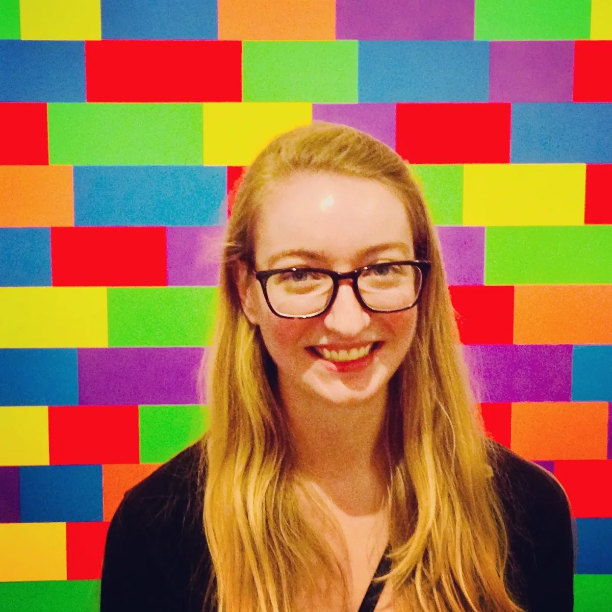

The podcast is part of our_ [_Education
Portal_](https://processingfoundation.org/education)_, a collection of free
education materials that can be used to teach our software in a variety of
classroom settings. Rather than endorse a specific curriculum, we’ve engaged
with a variety of educators from our community, ranging from K12 teachers, to
folks who lead workshops at hackerspaces, to university professors in
interdisciplinary departments. We’ve asked them to share their teaching
materials, which anyone can use._

createCanvas _features monthly in-depth interviews with these innovative
educators, so you can get to know their practices and what they bring to the
classroom and why. Stay tuned here for transcripts of each interview, as well as
to the_ [_Education Portal_](https://processingfoundation.org/education) _for
podcast episodes and teaching materials._

[_This is Part 1 of our interview with Kelly Lougheed, which can be found on SoundCloud here_](https://soundcloud.com/processingfoundation/episode-4-kelly-lougheed-part-1-of-2)_.
Below is the transcript (lightly edited for clarity). Part 2 will be released in
June._

_[Kelly Lougheed](http://www.kellylougheed.com/) is a computer science teacher
in Los Angeles, CA, with experience teaching all levels of secondary CS, from
Scratch to AP-level Java. Previously, she worked as a web developer and a Latin
teacher. Teaching computer science has been the best of both worlds, as well as
the subject of the Master’s degree she is currently pursuing. A graduate of an
all-girls’ middle and high school, she is particularly interested in girls’
computer-science education and the integration of computer science with art,
math, and the humanities. She can be found on
[Medium](https://medium.com/@kellylougheed),
[Youtube](https://www.youtube.com/channel/UCBjmnjJYoLtMMg2JmhgGUEg), and
[Twitter](https://twitter.com/kellylougheed)._

_**Note:**_ _Kelly’s creative-coding curriculum can be accessed on her_
[_Medium_](http://medium.com/@kellylougheed)_. Here are two beginner-friendly
tutorials that use p5.js:_
[_Pong Game_](https://medium.com/@kellylougheed/javascript-pong-with-p5-js-3ae1b859418c)
_and_
[_Rainbow Paintbrush_](https://medium.com/@kellylougheed/rainbow-paintbrush-in-p5-js-e452d5540b25)_._

**Saber Khan**: Hey everyone. Welcome to _createCanvas_, a podcast about the
Processing education community. I’m your host, Saber Khan, the Education
Community Director of Processing Foundation. \[_intro is the same as above_\]

Today I’m here with Kelly Lougheed, a computer science teacher in Los Angeles,
California. Kelly, do you want to introduce yourself a little bit more?

**Kelly Lougheed**: Sure. I teach computer science in Los Angeles. I teach both
middle and high school. My previous lives include being a web developer and
being a Latin teacher. I was originally a Latin teacher, and then when I became
a developer I missed teaching, which is how I got into computer science
teaching.

**SK**: I’m glad you mentioned that because that’s a really good reason to talk
to your career a little bit, because I think there’s a lot of interesting
choices and decisions that I think would be helpful for people to think about.
Let’s start with your teaching at an all-girls’ school. And you went to an
all-girls’ school? What’s that like, and then what’s that like in relation to a
field where women and people who identify as women are underrepresented? What
can you tell us about that?

**KL**: Teaching in an all-girls’ school is great, and it’s especially great for
computer science because we don’t have to worry about any of the gender dynamics
in the classroom. I can just focus on pedagogy. The students can just focus on
coding. That’s a huge advantage.

**SK**: Then you experienced that as you were going to your high school, which
was all-girls’ as well?

**KL**: Right. I went to an all-girls’ high school, which I loved. I did not
take computer science at that school, because they didn’t offer it then. This
was the 2000s. When I did take computer science it was at Stanford, because I
grew up in Palo Alto, and it was definitely a shock to be one of just a few
girls in a room of, like, 50 guys. It was the reverse of what I had always
experienced.

**SK:** Yeah. I think it might be good for people to actually know why a
situation like that can be difficult for underrepresented groups. Do you want to
talk a little bit more about, maybe not direct from your experience, but what’s
known about there being a particular male affinity for showing expertise that
can be hindering? I wonder if you have anything to share about that.

**KL**: Right. At [Harvey Mudd \[College\]](https://www.hmc.edu/) they call this
macho behavior, which can be exhibited by any gender, but I’ve seen it more in
boys. It’s when they like to shout out, “Oh, I’ve learned Java before!” or
something like that. Or, “I’ve done C++!” They might mean that they did this for
a week at a game design camp, not necessarily that they’ve done data structures
in C++ at the college level.

It has the result of making other people in the room who might not have any
coding experience feel like they are underprepared or don’t belong, when in fact
maybe this is a class geared towards beginners and there’s no expertise
required, and everyone really does belong.

**SK**: Yeah, yeah. Then I think, maybe adding to that, oftentimes that
expertise doesn’t really offer support to others. It’s mostly a very
self-centered or selfish expertise, or it’s like, “I have the knowledge and I’m
going to hoard it, so that you are going to live in scarcity, and I’ll be the
source of answers, but not in a way that I’m going to help you grow. We’re not
in this together.”

**KL**: Right.

**SK**: It’s this competitiveness that ends up excluding others. I think there’s
ways to have expertise and even express it that brings people together and says,
“Hey, I’m going to be a resource.” It seems like many boys haven’t learned how
to channel that energy into something community-minded. I wonder what should be
happening at all-boys’ schools or in boys’ education in general.

So, you went to an all-girls’ high school, you took an undergrad course at
Stanford. What happened next in your relationship with tech and tech education?

**KL**: Well, I was pretty turned off from computer science because of that
class. It was fine, I passed the class, but I guess I didn’t particularly enjoy,
one, constantly being obsessed with problem set answer, trying to figure out the
solution. I also didn’t have very many connections in the class. My friends were
all from my dorm, outside of the class. I wasn’t super attached to computer
science.

After that, I actually majored in Latin in college, which I really enjoyed, and
I didn’t return to computer science until I decided to make a career change. I
wanted to move back to California, where I grew up. I started a career in web
development. That involved me returning to my education, taking lots of computer
science classes online, and those were all enjoyable, but I always felt like I
missed out on the computer science major in retrospect.

**SK**: Yeah. The whole time, you’ve been making your own websites, and while
you’ve maybe gone in and out of formal CS, the whole time you were doing
creative tech projects. Do you want to say what you were making when you were a
kid, and what that has given you?

**KL**: Sure. My dad was a software engineer, so that’s how I was into
\[computers\]. I was on a computer at a very early age, and online as well. When
I was in elementary school, I’d be making these websites about Harry Potter
([Harry Potter RPGs](https://worldofpotter.com/) \[role-playing games\] were
very common at the time) . I made my own, using message boards, and nobody else
was on it. That’s the kind of stuff I was making in elementary school.

Then in middle school I got into making personal websites, a phase that has not
ended since. I really used them to show my photography, air quotes, which is
very low quality. I also wrote poetry that was rhyming. That all went up on my
website. My favorite part was making the layouts for the website. You’d use
Photoshop and brushes. It was the time where websites were fixed width, like
this layout is going to be 600 by 800 pixels. That kind of style. And yeah, I
just loved making layouts. I was always updating it constantly. I am similar as
an adult, still updating my personal website and its layout.

**SK**: That’s great. Maybe that’s a good segue to the classes you’re teaching
and what you’re having those students do and make. How do you marry that
creative impulse to the need to learn some basic fundamental CS concepts and
skills? What are you doing in your classes?

**KL**: Last year I taught four different classes. Two were middle-school art
classes, and two were more traditional high-school computer-science classes. In
middle school, the seventh grade was Web and App Design, and the eighth grade
was Computer Graphics and Virtual Reality. The seventh grade class, in
particular, I was able to be like, “Well, I liked doing all this stuff when _I_
was in seventh grade, so I’m going to have my students learn how to make
websites, picking colors and fonts.”

Those classes are art classes. The seventh grade is pass/fail. The thought there
is not really — like we do a little JavaScript, but my thought is not to become
JavaScript programmers. It’s more to let them have fun, create things that
they’re proud of. The code that they learn is kind of incidental. I’m just
hoping to give them a positive experience, so that they associate coding and
computer science with fun, art-type activities.

In my upper-school classes, in my Advanced Computer Science class, we started
out the first semester, they programmed in
[C](https://en.wikipedia.org/wiki/C_%28programming_language). It’s not super
creative, and they’re writing pretty serious algorithms. Then, because that
class sort of follows
[AP Computer Science Principles](https://apcentral.collegeboard.org/courses/ap-computer-science-principles),
when it got into computer graphics and internet programming, I was able to bring
in p5.js, HTML, CSS, JavaScript.

In particular, p5 was great for teaching about graphics and how they’re all made
up of pixels, and looping through each pixel and manipulating colors. Then they
also did some pretty serious JavaScript, but HTML, CSS, JavaScript that also has
a visual output, which the students really enjoy. For every project, the code
was pretty serious, but they’d also be like, “Oh, I have to pick the right
gradient background and the best font that goes with it.” That was really great.

**SK**: Yeah. It seems like creative coding offers a way to bring an art
mentality or an art perspective into CS material. The two middle-school classes
are art classes in the art department, let’s say. What does art education have
to offer creative coding, computer science, and the education world in general
that might be different than what formal CS currently does?

**KL**: I can give a design framework, I guess, to give a little bit of
structuring guidance for what the kids are doing with web design. In that
seventh-grade class, we do talk about best practices with fonts and colors, like
you don’t want to have that many colors. Ideally it’s all shades of one color.
You don’t want more than two fonts, maybe just one font. We also talk about
white space too, and how different website designs can make the user feel. I
guess where I’m going with that is, instead of having it be a free-for-all,
giving a framework to the creativity we’re letting the kids have.

**SK**: Yeah. That makes a lot of sense in that, like you said, they’re not
problem sets like traditional CS courses. It’s open-ended, what’s possible. In
that area, you do have to offer the students support to get to a particular
vision that they have. There’s not going to be a map, the right answer.
Oftentimes they’re going to have to judge if they’re on the right track, which
can be intimidating but also freeing, hopefully. And maybe that will sustain
them longer too? Like in your life, you said making websites kept you sort of
intact and gave you a creative outlet.

It seems like a lot of our hopes in the creative coding world is, maybe they
will not become coders, but they’ll have this very personal relationship with
technology that will keep them engaged and keep them making stuff, and keep them
in dialogue with tech. These creative coding projects can in some ways feel very
open-ended because there’s no clear solution. It’s not a, “Use the formula and
get the answer and let’s check your work.” It’s like, “Make something that
references something or remixes something.”

How do you offer students advice, feedback, assessments, so that they can get
better and you have a sense of how they’re doing?

**KL**: For assessment in the middle-school classes, I tended to grade in mostly
two categories, which are scope and correctness. Scope is like, Did they meet
all their requirements, just basic requirements? Did your website have three
pages? If we spent three days on this project, does your work represent three
days of work, or just maybe half a day of work? The correctness is like, Does
your code run? Do you have any noticeable bugs?

That sort of erases me grading their creativity or design, because that can be a
personal thing, but it’s definitely something I want to develop, because these
are performance tasks. I feel like the fairest grading for our performance task
is a little more clear than that. If I’m going to spend time talking about
design, colors, themes, fonts, maybe I do want to hold students accountable
towards demonstrating that they created their website with an awareness of the
design principles.

**SK**: Maybe it’s too soon, but what might that entail? How do they, for
example, show that they have considered color schemes? Do you have any rough
ideas as to how to bring some of these things in?

**KL**: I guess the most obvious way to tell would be, does their website follow
the rules of what we did in class. Are there five different fonts or just one or
two? Is there a color palette with shades and maybe the theme color, or is it
just totally crazy, like, “I don’t know why you did this psychedelic thing”? The
reason that I hesitate to go there is that maybe kids want to break the rule for
whatever their vision is.

**SK**: Thank you for joining
[_createCanvas_](https://soundcloud.com/processingfoundation). Once again, I’m
your host, Saber Khan. _createCanvas_ is produced by Processing Foundation and
supported by the [Knight Foundation](https://knightfoundation.org/). Our editor
is Devin Curry. Special thanks to the Processing Foundation board and staff.
You’ll be able to find many of the things discussed here today in the show
notes. Before you go, please visit processingfoundation.org and check out the
Education Portal for free and accessible educational materials. Processing
Foundation is on [Twitter](https://twitter.com/processingOrg),
[Instagram](https://www.instagram.com/processingorg/), and
[Facebook](https://www.facebook.com/page.processing). You’ll find this and
future episodes on our Medium channel as well.
