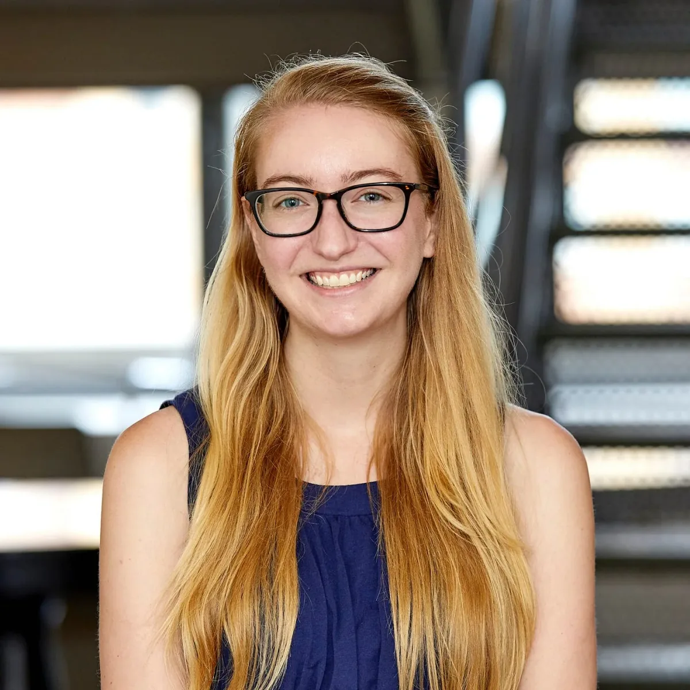
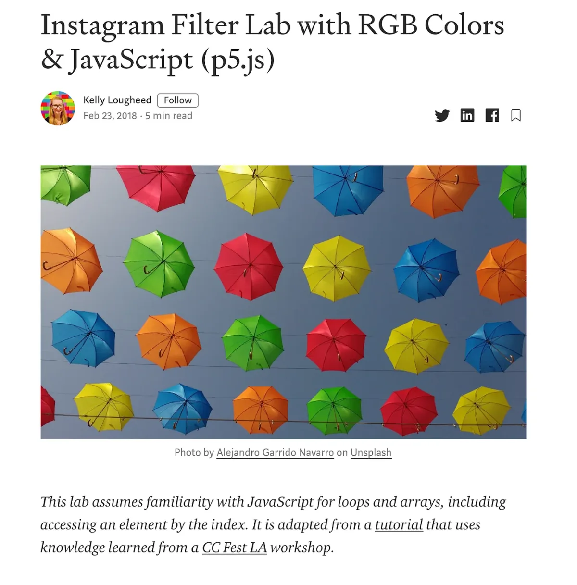
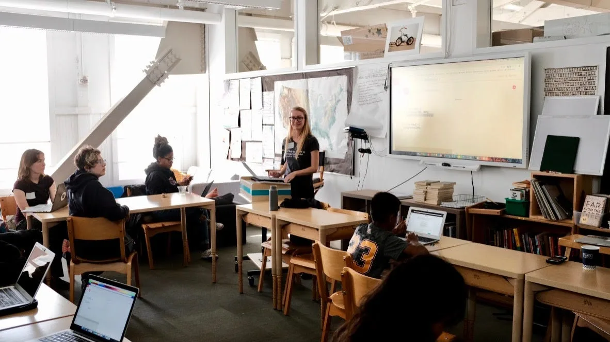
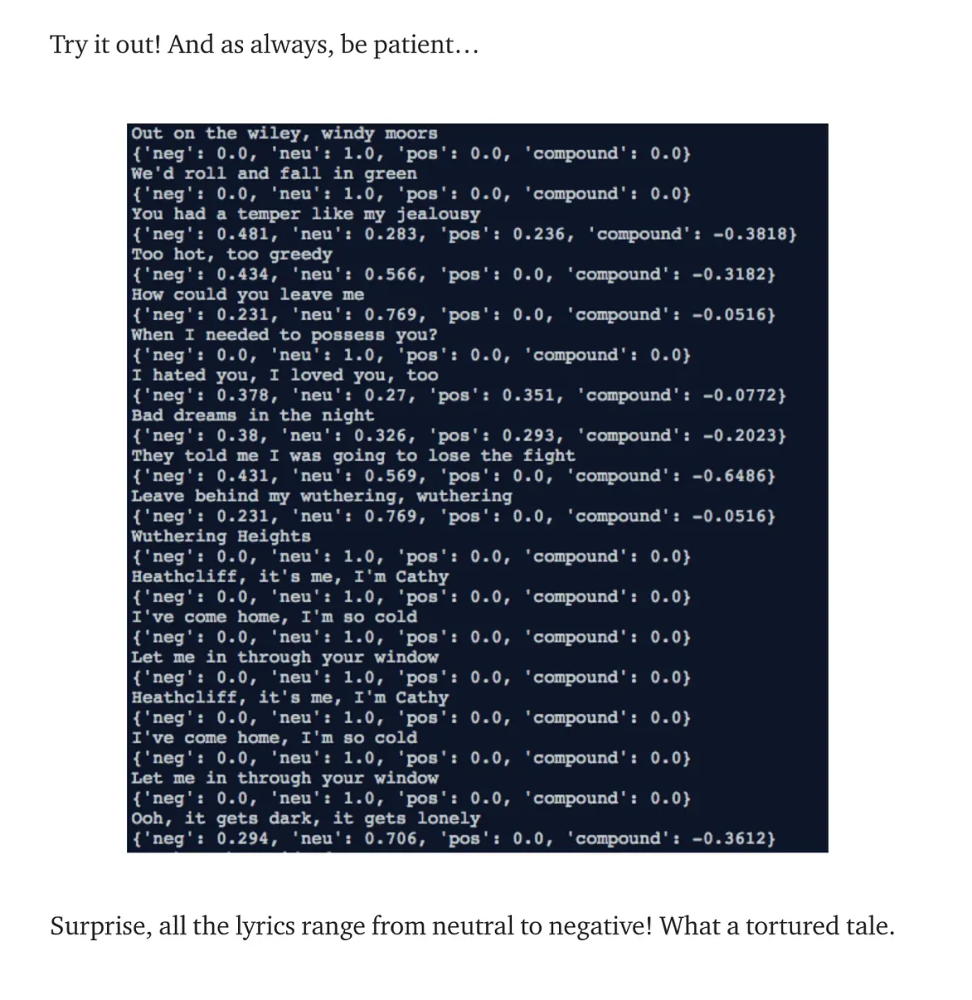

In September 2020, we will kick off Season Two! Stay tuned!_

[createCanvas](https://soundcloud.com/processingfoundation) _is Processing
Foundation’s education podcast, which focuses on teaching at the intersection of
art, science, and technology. The podcast is part of our_
[Education Portal](https://processingfoundation.org/education)_, a collection
of free education materials that can be used to teach our software in a variety
of classroom settings. Rather than endorse a specific curriculum, we’ve engaged
with a variety of educators from our community, ranging from K12 teachers, to
folks who lead workshops at hackerspaces, to university professors in
interdisciplinary departments. We’ve asked them to share their teaching
materials, which anyone can use._ createCanvas _features monthly in-depth
interviews with these innovative educators, so you can get to know their
practices and what they bring to the classroom and why._

[This is Part 2 of our interview with Kelly Lougheed, which can be found on SoundCloud here](https://soundcloud.com/processingfoundation/episode-4-kelly-lougheed-part-2-of-2)_.
Below is the transcript (lightly edited for clarity). Part 1 was released in May
and can be found_
[here on SoundCloud](https://soundcloud.com/processingfoundation/episode-4-kelly-lougheed-part-1-of-2)
_and_
[as a transcript here on Medium](https://medium.com/processing-foundation/createcanvas-interview-with-kelly-lougheed-part-1-ea2ee45abbf0)_._

_[Kelly Lougheed](https://www.youtube.com/watch?v=3EH-6j0jV5E) is a computer
science teacher in Los Angeles, CA, with experience teaching all levels of
secondary CS, from Scratch to AP-level Java. A graduate of an all-girls’ middle
and high school, she is particularly interested in girls’ computer science
education and the integration of computer science with art, math, and the
humanities._

_**Note:**_ _Kelly’s creative-coding curriculum can be accessed on her_
[Medium](https://medium.com/@kellylougheed)_. Here are two beginner-friendly
tutorials that use p5.js:_
[Pong Game](https://medium.com/@kellylougheed/javascript-pong-with-p5-js-3ae1b859418c)
_and_
[Rainbow Paintbrush](https://medium.com/@kellylougheed/rainbow-paintbrush-in-p5-js-e452d5540b25)_._

**Saber Khan**: Hey everyone. Welcome to createCanvas, a podcast about the
Processing education community. I’m your host, Saber Khan, the Education
Community Director of Processing Foundation. _\[intro is the same as above\]_

This is the second part of our conversation with Kelly Lougheed, a computer
science teacher in Los Angeles. Here we talk about creative applications of
coding in the classroom and professional development and pedagogy for educators
teaching coding. You can find the first part of this episode and all the other
episodes on the createCanvas SoundCloud and wherever you download podcasts. By
the way, the interviews are part of a new feature in our website
processingfoundation.org called the education portal. The portal will have
education material and resources available for free.

Kelly, you’ve made a lot of tutorials and shared them out. What prompted that?
What do you get out of that? Is there one you want people to jump into as a
gateway to get to see the work you’re doing, and put it up on the Processing
Foundation Ed Portal so that people can take a look? Let’s start with what
prompted you to make these tutorials and then we can get to the other parts.

**Kelly Lougheed**: I wrote my first Medium articles because, for
[Hour of Code](https://hourofcode.com/) at one of my schools, we were going to
do it in advisory. An advisory only had 15 students, and it was only me who knew
how to code in p5. We wanted to use p5 for Hour of Code. So to sort of put
myself in all the rooms, I published a tutorial on Medium — it was based on a
[CC Fest LA](http://ccfest.rocks/) session about making your own Instagram-style
filter of your image. That was how one of my early coding tutorials went up.

I just kept writing them because I always want to — especially with people who
have limited coding experience — I want to share my knowledge and get other
people into it. My favorite audience is beginners, people without much
experience. So I try to make my tutorials as accessible as possible. I’m not
sure, I probably forget to define function sometimes, but yeah, I just like
sharing my knowledge and putting it out there.

**SK**: Yeah. So let’s talk about how you try to be accessible in a tutorial,
let’s say the Instagram filter one. What steps have you taken to make the
tutorial accessible to beginners?

**KL**: Whenever I’m writing I try to act like I’m talking to someone who
doesn’t know much about computer science. At this point in my career, I have my
canned way that I define loops and functions, so I’ll try to throw those in.
I’ll also try to remember to include details about, this is the button you press
to run the code, it should appear in your canvas on the right-hand side. Notes
about how to use the editor itself.

_Kelly’s tutorial,
[available here on her Medium channel](https://medium.com/@kellylougheed/instagram-filter-lab-with-rgb-colors-javascript-p5-js-9fcb9a7b7acb),
for how to make an Instagram-style filter for images._

**SK**: Stuff that people either shorthand or skip explaining, you’re taking an
extra minute or two to be like, “this foundational idea.” They came to make the
Instagram filter, they didn’t come to learn about functions, but once they’re in
the middle of it, they need to have a working definition of what a function is,
so they can troubleshoot or have a sense of where the program’s headed.
Sometimes I think we skip the taking-a-quick-second to be like, “a function is a
block of code that you can call anytime,” that kind of thing. And you, say,
putting that in should help beginners find their place, especially as they get
bigger questions. What’s the response been to putting these out there? Have you
gotten feedback? Have people used it? What’s that been like?

**KL**: It’s pretty positive. I guess part of why I kept doing it was that
people would somehow find them (I mean, I also tweet them), but people would
find them and comment and seemed to appreciate them. That was nice. When I
taught larger classes at my previous school — I had a class of 24 — I would
sometimes have my own tutorials as extra things you can do if you finish early,
which was nice. And then the kids get excited because they’re like, I coded this
magic eight ball, which is neat.

**SK**: I’ve used your tutorials in my classroom and I testify to how accessible
they are, because it’s very rare. I’ve been like, here’s the tutorial, follow
it, try it out. Getting a student to read everything is really hard —

**KL**: Definitely!

**SK**: — but if they read it, I think they’re in the right place. Sometimes
that’s how I know if they’ve read it or not. Or they get into a copy-pasta mess,
where they copied more than they should have.

**KL**: Yeah, I’ve seen that happen. _\[laughs\]_

_Kelly leading a session on creative coding at
[CC Fest SF, Creative Coding Festival San Francisco](http://ccfest.rocks/)._

**SK**: You mentioned [CC Fest](http://ccfest.rocks/), something that we’ve done
together. Do you want to tell the listeners what it is, and how you got
involved, and what you get out of it?

**KL**: Sure. CC Fest is a free event in Los Angeles, San Francisco, and New
York, where there are workshops on coding with p5 (and I think other things
sometimes too). There’re sessions for all levels — so total beginners, all the
way through advanced, like, are you ready for a challenge. I just saw it on
Twitter and I signed up in 2017, and it was definitely worth my time. It was
really fun.

**SK**: Great. You’ve both been an attendee and you’ve also led sessions. What
have you learned with giving a session to a group that you don’t really know at
all, and a group that can be students and teachers? What has doing tutorials in
an environment \[been\] like that versus in your classroom? What can you say
about that?

**KL**: The kind of tutorials or workshops at CC Fest are a little more
hands-on. In a classroom you teach students this one little thing, and then they
spend the rest of the time doing a lab or activity where they build on their
preexisting knowledge using that one new thing. But for CC Fest you have to
front-load a lot of stuff, and be like, go along with me. But I also try to
incorporate little mini challenges. Like, okay, now try changing the colors,
play with this number, play with that number. How does it change? to still get
the same playtime to the attendees.

**SK**: So you plan them until you pause for five minutes, and give them a
chance to get back on the road to the thing they’re making.

**KL**: Yeah.

**SK**: That’s a really interesting, important idea of not letting the end-goal
be the only time that they get to make their own creative choices. Let’s talk a
little bit about the materials you’ve made. We’re going to present one of them
on the website. Which one do you think people should check out? Why? What are
they going to learn, do you think?

**KL**: Let’s see, that’s a tough question. I guess it depends what you’re
interested in.

**SK**: You can offer a few, you don’t have to pick one.

**KL**: Okay. My CC Fest session last year was the rainbow paintbrush tutorial:
making a paintbrush that paints rainbow on a canvas. Which I think is pretty
accessible, even if you don’t have that much experience, I think it’s
accessible. There’s also lots of creative freedom with colors — it talks about
HSL colors, which is something that I didn’t learn about till later. I think
mostly people are familiar with hexadecimal and RGB, but HSL is great for
rainbows.

I’m also proud of one that is about natural language processing and Python, that
analyzes _Wuthering Heights_ using the Python Natural Language Toolkit, which as
a literature person I really enjoyed writing.

**SK**: That’s a great one too, yeah. I guess there’s the creative coding that’s
about art and fairly obvious, especially on platforms like p5; and then there’s
the ones much more steeped in the science world, but which also have lots of
creative potential, like natural language processing or data analysis on words
and word frequencies. There’re so many things you can do with creative coding.

Let’s say someone’s not into making two-dimensional art: what do you suggest
they do? Let’s say there’s a student who’s really into a book and you’re trying
to get them interested in coding: what do you do to bring people who aren’t
immediately excited by the possibilities of art-based creative coding? What
other things do you suggest to them so that they can find their own place in
coding?

_The “Wuthering Heights” tutorial from Kelly’s Medium post is
[available here](https://medium.com/@kellylougheed/coding-english-lit-natural-language-processing-in-python-ba8ebae4dde3).
This image, a screenshot from the tutorial, shows output in the terminal
application of sentences and phrases with sentiment analysis. Most of the
sentences are in the neutral to negative range of sentiment._

**KL**: Book analysis is a great thing for anyone interested in literature. You
can analyze sentiment, like positive or negative, and word frequency. I
sometimes find that students who are not super jazzed about HTML, CSS,
JavaScript, or p5 (though they are rare), might enjoy algorithms, mathy-type
puzzles, challenges about writing a program that generates stars that look like
a piece of asterisk art, and just more mind-bendy.

**SK**: Do you have to offer them up or generally the students are fairly happy
with —

**KL**: Generally I find that most students are really into the visual stuff and
they might prefer that, but there is the occasional student who’s like, “no, I
don’t like design. I want some challenges. I like writing text-based code.”

**SK**: Yeah, that’s sort of funny that the table has been overturned a little
bit, where they are the traditional CS student. It seems like they would thrive
in a traditional CS classroom, which would offer lots of algorithm puzzles to
solve, and now they find themselves in this creative-coding world, which has
taken over large parts of K-12, where it’s much rarer to have stuff for them.

**KL**: Right.

**SK**: It’s more like, “make art that makes you happy.” No, I want to solve
puzzles. And you’re like, well, we don’t have any for you.

**KL**: I have had luck with puzzles as a stretch activity. Like, if you did
these problems that are more creative, and then, here’s a challenge problem.
That’s been a success.

**SK**: Do you have one that you can remember right now?

**KL**: I usually take them off
[freecodecamp.org](https://www.freecodecamp.org/). A lot of the stuff I took
last year was regarding arrays. Yeah. I can’t remember them last year, but sort
of —

**SK**: Like, re-sort an array?

**KL**: Yeah. And stuff with sets, that are a little more mathy.

**SK**: It makes sense to offer that because I think potentially the complexity
of the art base, they’ve sort of reached a point where they’re ready to take on
more mathy stuff, where you could represent it visually too. But generally it’s
done purely on the abstract algorithmic level with no physical output. Maybe
they’re signaling by being done with the visual stuff that they’re ready to take
on more complex stuff that could go back to being visual again. Math doesn’t
exist about geometry, it’s about solving physical representational puzzles.

You’ve also been doing lots of summer training as a summer camp instructor. Do
you want to talk a little bit about what you learned about pedagogy related to
teaching this stuff? What can you say about how we should be teaching creative
coding, and what’s not known just by picking up a book, but you kind of have to
practice it to know or get trained to know?

**KL**: My biggest takeaway from teaching summer camp has been the importance of
pair programming: that students have a more enjoyable experience, and therefore
are maybe more likely to stay with computer science, if there is a social
element to it. With pair programming, there are two people programming on one
computer. One’s the driver typing all the code, one’s the navigator, who’s
telling the driver what to type. I did this in my classroom all last year, and
most of my students loved it. They found it very enjoyable. In my seventh-grade
class, the students were more skeptical about it, which I wonder is related to
being that age with all the social drama that comes with being a seventh grader.

As a teacher, I feel like it really makes a difference in the classroom. It
feels different when everyone’s programming silently alone on their computer,
versus when people are talking, and friendships are being formed. The really
important thing with pair programming is that students realize, when _they’re_
challenged by this problem and their partner is _also_ challenged, they realize
they’re not alone in being challenged or finding it hard.

**SK**: I think the thing that it could help with a lot is — there’s this moment
where you introduce the concept, you say, “hey, we’re going to make something.”
You start the live coding, maybe you finish it, maybe you don’t. But there’s
the, “oh, I got the bug problem,” like, “hey, hold on, I need help right there.”
And I think there are many different ways to engage with that as a teacher.
There’s the, “just wait, keep going, we’ll come back to it.” There’s the, “let
me help you right now.” Which, if it’s quick, it’s maybe not too detrimental to
classroom culture, but often that’s when you may lose everyone else, or they may
get lost or they may get distracted. Ultimately I think the goal of that moment
is to, and some teachers do this well, which is like, talk through what the bug
is so they can be like, “first of all, where should you be looking?” Those kinds
of things.

I guess what I’m trying to say is pair programming and how it works with
debugging —

**KL**: Uh-huh.

**SK**: — is going to be a very rich area, where if you just focus on debugging,
you can go really, really far because that’s going to be the number one thing.
You may understand everything conceptually, you may have the code but it doesn’t
run, and it becomes a complete mystery. And if you can talk through and look
together and rely on each other, and not have the answers immediately presented
to you but sustain yourself through it, it seems like pair programming really
highlights those skills and offers a little bit more than — there’s this teacher
technique of “ask three before me,” which is basically, “don’t bother me
until….” _\[laughter\]_ Whereas pair programming formalizes and offers some more
support. Because there’s always this tendency where I see students ask \[each
other\], and other kids are not interested. They’re like, “I don’t know,” they
didn’t even hear the question, they just want to be left alone. Just like the
teacher does.

What is that kid supposed to get out of “three before me,” when a sustained pair
relationship could be so much richer? Especially if they’re practicing similar
kinds of, like, “we learned that we should probably look here first, and then we
should do that.” I would love to see those types of conversation happening more
in my classroom and pair programming seems to offer a nice formalization of it.

**KL**: Yeah, definitely.

**SK**: It’s culturally understood.

Okay, maybe we’ll pause here. Are there any final thoughts that you want to
share with the Processing community, or anything to young educators or people
jumping into teaching or learning creative coding?

**KL**: I guess as far as Processing goes, I want to say I’ve never had a
student react negatively to p5 or Processing. Everyone’s happy when you start
doing it. I highly recommend doing it in the classroom. As for teaching computer
science, I know in the computer science teacher community, and I see this on
Facebook, I see this if you’re teaching summer camp, a lot of teachers are new
to it, intimidated by the subject. I just want to say, stick with it, it’s for
everyone. We really need more computer science teachers.

**SK**: That’s great. That’s a really positive message to end on. And if people
want to find you, how should they look you up online?

**KL**: My website is [kellylougheed.com](http://kellylougheed.com/), and
that’ll link to all my social media and
[GitHub](https://github.com/kellylougheed) and everything.

**SK**: Great. kellylougheed.com. Thank you so much, Kelly. And we’re excited to
have your stuff up on the Processing Foundation website.

Thank you for joining
[createCanvas](https://soundcloud.com/processingfoundation). Once again, I’m
your host, Saber Khan. _createCanvas_ is produced by Processing Foundation and
supported by the [Knight Foundation](https://knightfoundation.org/). Our editor
is Devin Curry. Special thanks to the Processing Foundation board and staff.
You’ll be able to find many of the things discussed here today in the show
notes. Before you go, please visit processingfoundation.org and check out the
Education Portal for free and accessible educational materials. Processing
Foundation is on [Twitter](https://twitter.com/processingOrg),
[Instagram](https://www.instagram.com/processingorg/), and
[Facebook](https://www.facebook.com/page.processing). You’ll find this and
future episodes on our Medium channel as well.
