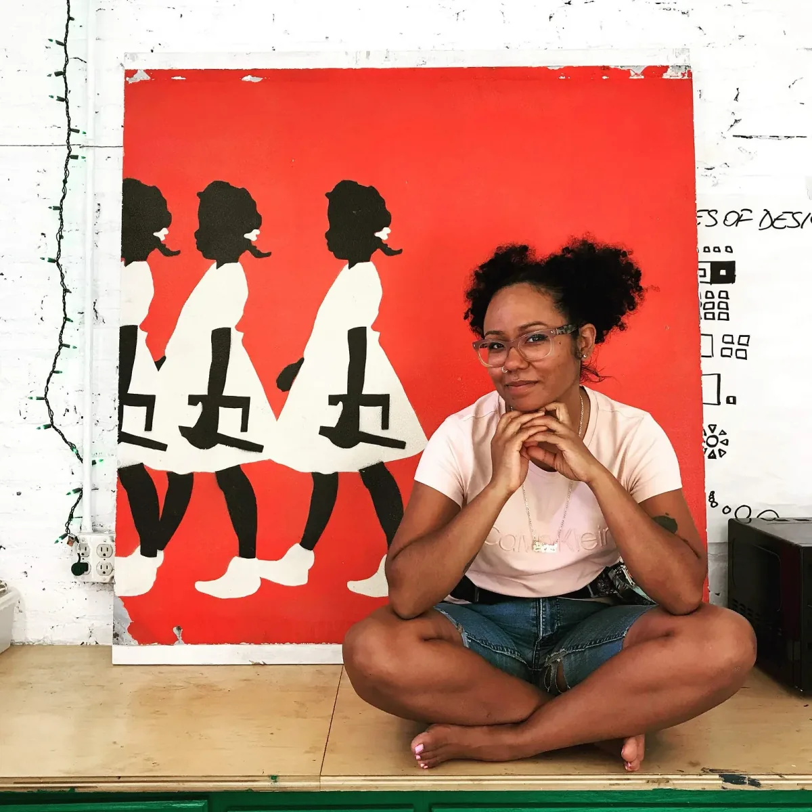
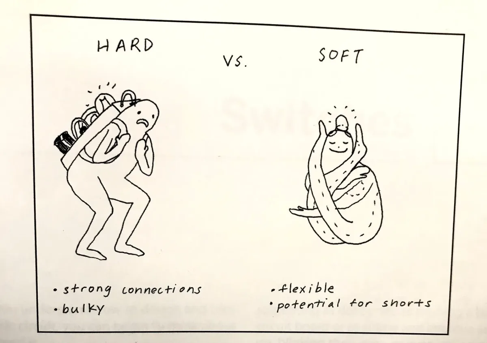
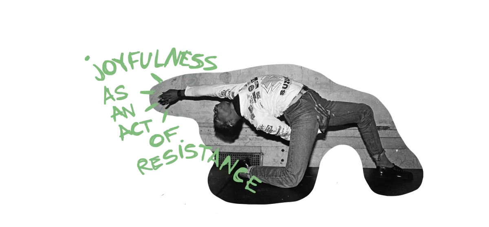

The podcast is part of our new [Education Portal](https://processingfoundation.org/education), a collection of free education materials that can be used to teach our software in a variety of classroom settings. Rather than endorse a specific curriculum, we’ve engaged with a variety of educators from our community, ranging from K12 teachers, to folks who lead workshops at hackerspaces, to university professors in interdisciplinary departments. We’ve asked them to share their teaching materials, which anyone can use.

createCanvas *will feature monthly in-depth interviews with these innovative educators, so you can get to know their practices and what they bring to the classroom and why. Stay tuned here for transcripts of each interview, as well as to the* [Education Portal](https://processingfoundation.org/education) *for podcast episodes and teaching materials.*

[This is Part 1 of our interview with Sharon De La Cruz, which can be found on Soundcloud here](https://soundcloud.com/processingfoundation/episode-3-sharon-de-la-cruz-part-1-of-2)*. Below is the transcript (lightly edited for clarity). Part 2 will be available in January!*

*[Sharon De La Cruz](https://unoseistres.com/) is a multi-disciplinary artist and activist from New York City. Her thought-provoking pieces address a range of issues related to tech, social justice, sexuality, and race. De La Cruz’s work ranges from comics, graffiti, and public-art murals to more recent explorations in interactive sculptures, animation, and coding. In Part 1 of her interview with createCanvas, Sharon talks about joyful resistance and what decolonizing freedom might look like. She discusses her focus on restructuring the dynamics of the classroom, to ensure that POC and other marginalized students don’t have to rely on luck to have access to education.*

**Saber Khan**: Hi everyone. Welcome to createCanvas, a podcast about the Processing education community. I’m your host, Saber Khan, Education Community Director of Processing Foundation. \[*Intro is the same as above.*\]

Today I’m here in the Bronx with [Sharon De La Cruz](https://unoseistres.com/).

**Sharon De La Cruz**: Hello!

**SK**: Do you want to introduce yourself?

**SDLC**: My name is Sharon De La Cruz, and I’m just going to stare at you and tell you about myself. So, Sharon: artist, maker, educator from the South Bronx.

**SK**: And we’re not in the South Bronx \[right now\], we’re in the Bronx.

**SDLC**: No, we’re in center Bronx. We’re basically smack in the center of the Bronx in Fordham, actually on [Fordham Plaza](https://en.wikipedia.org/wiki/Fordham_Plaza,_Bronx), but the Bronx is — all of it is my home. I’ve lived several places in the Bronx. It’s all one.

**SK**: Very cool. Maybe we should rewind a little bit to earlier in your career: how you got into what you’re doing now? How you got into things like the Processing world, etc.?

**SDLC**: Yeah. This is all by mistake and all pure imagination where I started. My background is in fine arts, and there was once-upon-a-time where I felt stagnant in my art making. I didn’t feel like anything was evolving. I was having really profound images of movement in my work — not just animation but interactive animation, things that were triggered by bodies, and spaces, and people around. I knew I would have to learn some sort of coding, but I refused to go back for a CS (computer science) degree. And then I refused to sit through any traditional CS classes.

I have a friend who I explained this to, and I was like, “Look, this is what I’m envisioning and how I want to move forward.” And she was like, “Look, you have to look into \[NYU’s department\] [ITP](https://tisch.nyu.edu/itp).” Her husband, Shawn, graduated from ITP (Interactive Telecommunications Program). She was like, “You have to go to ITP, there’s a [Winter Show](https://itp.nyu.edu/shows/winter2019/) coming up in a week, let’s go.” So I said, “Hell yeah! Of course I want to know what’s going on.” We went to the Winter Show, which is the end of the semester show, and they’re free, and it’s a whole bunch of folks showing off their work. I went in and I was like, “*this is it*. This is what I want to do, this is what I want to learn.” I didn’t know exactly what it was, but I knew it looked like what was coming out of ITP. So I applied and I got in. I must have paid off someone, I’m not sure, but they accepted me. Immediately I was like, “Oh crap, what am I doing?” Because the learning curve, for me, was so real.

I cried so much my first semester! I was like, “Ah, ooh, what is going on?” It just really didn’t make any sense to me. Then, when I realized I am not a computer programmer, and, “Sharon, you are an artist,” it was like everything clicked. I was like, “Oh, cool, I can do this.” It became so much better once I let go of any idea that I was going to turn into an engineer. It’s like, “no, that’s not the point.”

I learned that lesson my first semester. I was like, “Wait, these are just tools.” Cool if this becomes your new career pathway, which has happened to plenty of folks who come out of that program, but also cool if it’s not, because it’s a literacy tool. It’s a tool for you to advance any and literally everything that you already do.

What was really sweet about ITP, and continues to be amazing about ITP, is that it’s not a CS program, right? You’re learning these tools as what they are, which are just tools: different mediums to advance what you care about already, which goes beyond the actual medium.

That’s my little love story of ITP. From there, \[I\] was getting over the idea that I will be this other \[engineer or CS\] person. I was like, “No, actually, what I want to do is make art.” I was able to free myself from a lot of things, especially the not-knowing part. A couple of concepts that came out for me and my time at ITP was, “I’m an artist. Get over it.” Right? It’s fine. You’re allowed to mess up. And, you’re forever learning. You have so much to unlearn! There’s so much to unlearn because of a lot of my learning before higher education, and even a little bit in undergrad, was memorizing.

**SK**: Yeah.

**SDLC**: I wasn’t actually learning a lot, I was just memorizing. I got pretty damn good grades off memorizing, you know. But that doesn’t help anyone in the long run. So, just unlearning a lot of that. That’s how I’ve formed my pedagogy around teaching and around making.

You came into the studio today, and I’m having trouble with this [Riso printer](https://en.wikipedia.org/wiki/Risograph) and connecting technologies and, you know, only a maniac would sit through anything that I’m sitting through, but in fact I am, right? That stupid grit, and willingness— honestly, that it’s fun to connect things that maybe shouldn’t connect. To talk to each other, to make things in ways that challenge you, is exactly how I want to aspire to teach folks.

  <iframe src="https://www.youtube.com/embed/P6Mk40mX6ek?feature=oembed" frameborder="0" scrolling="no"></iframe>

**SDLC**: Rather than not be able to, because something is hard, you stop doing it, but instead, when something is hard, to *keep* doing it. You’re like, “No, I’m going to figure this thing out.” Although it’s annoying and sometimes you need help. I need help all the time — and I’m a Leo, so it’s hard, you know, it’s my ego — and it’s hard to ask for help. But when you ask for help, and you realize, again, the fun thing about tech, when you find those good people (like folks that I found at ITP), and the willingness to help each other, you take that with you. You exercise that. Because you understand that there’s something about someone not just being kind, because maybe perhaps, you know, they felt like being kind that day, but that deep in their core and in their pedagogy —

**SK**: It’s part of their ethic.

**SDLC**: It is totally a part of their ethic, yeah! And you’re like, “Oh shit, wait, this is awesome!” Because they’ve helped you, that becomes a part of your ethic. And then you’re helping other folks, and then you can circle back with each other, and that’s the fucking exciting part. Right? That’s the part that I get the most pumped about. I’m like, “Wait, I’m going to have another crazy issue with this printer, call me.” Or if someone else gets a Riso EZ390, I will be there.

**SK**: You need each other.

**SDLC**: Right, right, you need each other, and that’s great. And that is something that we don’t quite, I think in traditional education, don’t quite learn. Or we don’t learn how to learn in that way.

**SK**: Yeah. Community through tech-

**SDLC**: Oh, it’s major!

**SK**: That seems like a powerful idea for you.

**SDLC**: Yeah, it’s major. I think it makes a lot of sense as someone who keeps learning and wants to keep learning, as someone who wants to build more community, as someone who just likes to be challenged. Yeah, for sure. And technology has all the potential for that because it always breaks anyway, right, you know what I mean? Like there’s always someone to talk to, don’t you worry, right?

**SK**: Do you feel like this is the thesis for your work? What projects have you gone on to do since this time? What year was this, when you went to ITP?

**SDLC**: Now you’re going to age me. Okay. I graduated from ITP in 2015 and then was a resident for a year from 2015 to 2016.

**SK**: Okay.

**SDLC**: It’s been, what, four years? Feels like a century though.

It is really fun to become a better teacher because I see the magic in making. When folks tag me to teach that back, especially coming fresh out of ITP, I didn’t know I could teach any of this back. And in fact, maybe I could not have, or maybe I didn’t teach it back in the best way possible. But then, you really want people to get it, because it’s really powerful. So you become a better teacher by teaching it more, and by figuring out how you would want to teach it. And the intergenerational aspect, I think, is important to this piece too.

**SK**: How so?

**SDLC**: Because you’re going to get people who, whether they’re eight, 18, 48, they’ll know a little something about electricity, they have enough experience to have touched metal before, and know, hey, that might be conductive. Okay, cool. And those different age ranges will have different experiences with them.

**SK**: Yeah.

**SDLC**: For example, it took me a really long time to get the idea of voltage and ground. I was like, “What the fuck is a ground?” All I know is that I needed to plug that in. If not, this is going to blow up. Just plug in the ground. But now, teaching that back to people, I’m like, “energy transfers!” Do you know what I mean? Kind of like that.

Earlier this week I taught “Intro to Arduino,” and I was like, look, this is two peas in a pod. I’m shooting voltage, it needs to land, to literally ground, right? I don’t have ground, you’re just shooting up a whole bunch of fucking energy and it has nowhere to go.

So drawing this circular motion. I felt like, even though I got it at ITP, there were still things that, afterwards, I learned more profoundly by teaching it.

**SK**: By being in the front of the room.

**SDLC**: Oh yeah. Because you could take it for granted. You’re like, “Okay, I got to do this thing, whatever, finish this assignment, whatever.” You take it as truth because you know this teacher is smarter.

**SK**: Right.

**SDLC**: You know they know what they’re talking about. Fine and cool, because there has to be some level of trust, but if you want to teach that back, then you actually got to know what the hell you’re talking about.

Especially when you’re debugging. Fuck, I properly learned how to use a multimeter after ITP. I did what I had to do, I blew a couple of circuits, whatever. But it was only afterwards where, when someone else has a problem and you happen to be the person in the room that, not even knows more, just like a little more, all of a sudden you’re like, “Oh shit, okay wait, maybe I should use that thing called a multimeter, cool, I picked that up once upon a time.” You just start fidgeting with it. You’re like, “Oh shit, actually, I *can* debug this, this makes a lot of sense.”

I now teach Intro to Electronics through wearable electronics \[[curriculum available here](https://github.com/unoseistres/INTRO-TO-WEARABLES)\] because you have to sit with it. You’re forced to meditate, you’re forced to — you’re literally making connections. \[Like with\] the breadboard that becomes a little abstract is no longer abstract— the thread isn’t that abstract, the connections you’re making are not abstract. Although it takes longer, and although you need a lot more patience, the amount of people that have come out of my wearables as an Intro to Circuit class, know way more about circuits than when I do the breadboard stuff. Although that is changing because I’m forced to use a breadboard because we don’t have all the time in the world to sew. For example, I led a wearable workshop last Saturday, and there were a couple of folks who, their connections were a little janky, or maybe they cross somewhere. And I was like, “Well, you just got to snip the whole thread and fucking you got to resew it.”

*From Sharon’s Intro to Wearables curriculum, which is [available here](https://github.com/unoseistres/INTRO-TO-WEARABLES). Although the course is not “Intro to Circuits,” Sharon has found that students learn more about circuits in her Wearables course because they have to work with circuits in different contexts and can see the connections between things in a narrative way. Students are able to understand why a circuit would be used for something in a real-life context and to tell a story with it.*

**SDLC**: And they looked at me, and I was like, “I mean. That’s literally — I can’t tell you anything else, this is what you have to do.” So they sat down and they resewed it. And the little stars that came out of their eyes, I was like, “Yes! You understand!” Not only were they resilient about it, which to be honest, I was kind of like, I was very surprised. ‘Cause sometimes I definitely don’t have the patience, so I really don’t expect other folks to have the patience. And they sat through the understanding of this circuit. They sat through their frustrations, and channeled that into making this thing work, and they wanted to see it work. They’re like, “No, I started this, I’m going to finish it and I’m going to figure out how to finish this.”

That’s why with the wearable electronics, I feel like — with a breadboard it’s just a little easier to do, the copying. With the wearable electronics, you’re like, “Well you got to sew this sucker in together, and you got to figure out if it works.” You know, there’s just so much. It’s so tangible that you’re actually sitting with it.

I’ve learned little tricks like that where I’m like, “Oh wait, we can switch up mediums, and we can actually show truly how things are conductive in the world that maybe aren’t, like, your jumper cables.” Obviously, I tell folks I would not connect my house with conductive thread, right? Cool. That’s not right, let’s not do that. But why would this be applicable everywhere, right? Thinking about context to where this would live gets them to start thinking quicker.

Like, oh wait, there are a whole bunch of things that are conductive, but where could they actually land? What is the context for them? Where do you see them in real life, in space? I do that when we did the photocell, a simple circuit. I tell them, “Where do you see this photocell in real life?” And sometimes folks will quickly get the streetlamp, or if not I’ll say, “Look, what about your streetlamps?” Then they’re like, “Wait, how’s that measuring any light? What’s happening there?” And I’m like, “If there was a job, and a guy was looking at dawn and dusk, ready to push a button to turn on or turn off these lights, that’d be a pretty fucking tedious job.” And that’d be a waste of money, right? I was like, “Look, you have this stupid little photocell, a sensor that you can plug in, that you can build a circuit for, and that does that automatically so that we don’t have to worry about Daylight Saving Time. We don’t have to worry about where in the world we are. No one has to press a button, it’s an automatic thing. Getting them to think about narrative and placement of where and why you would want a thing is where we get the most excited and how I teach back.

**SK**: We talked about being here in the Bronx. Where are you doing this teaching? Who are you working with? What’s their view of the world?

**SDLC**: Right now I’m working with an organization called [BCDI, or the Bronx Development Cooperative Initiative](https://bcdi.nyc/). BCDI’s practice is rooted in economic democracy and what that means for the Bronx. Which means cooperative, local resources, a local economy, and training folks in technology because that’s where we see a field where POC folks are not particularly in, not because of any lack of — what’s the word?

**SK**: Talent, or —

**SDLC**: Right, it’s not any lack of talent. It’s definitely structural racism, right, your whole traditional story of just under-resourced bullshit, right? Like racism, that’s all over. And so what does it mean to think about economic democracy when it comes to digital fabrication, when it comes to making. I think those were the things that I was hinting at in graduate school where I was like, “Oh wait, I’m unlearning a whole bunch of things, including how I’ve learned in the past.” I think that’s where a lot of people are, where they still have to unlearn and unlearn how to be in community, how to learn, and wanting to learn. Because there’s a lot of trauma around education: who’s smart enough and who’s not smart enough. Letting go of those ideas as well.

What BCDI does is think about economic democracy for the Bronx. I particularly work in the line of digital fabrication and making as a form of thinking about economic democracy. Taking back what making and local resources look like and local talent looks like. Great if you want to work at Apple, amazing, but really awesome if you don’t, right? What does it mean to perhaps build your own tech cooperative? What does cooperative thinking, what does that economic structure look like and how does that benefit POC folks? Especially marginalized folks who don’t benefit from an eight-to-six \[job\] to make ends meet, right?

That’s the lens through which I’m looking at making, especially when it comes to what I believe in: *joyful resistance*. I believe that the current talent pool has all it needs to problem-solve locally, but the resources are lacking. So it’s about providing resources and pairing that up with imagination. We have a lot of folks in marginalized community who have never either asked to be at the table or asked to exercise their imagination about what they want. It’s always been this hierarchy of top-down approach to a lot of their life, including their education, which is a major part. And that’s rooted in a whole bunch of stuff that we don’t have to speak about. But it definitely is traumatizing.

*Joyful Resistance: one of Sharon’s art works.*

**SDLC**: I am definitely lucky enough to have had a high school and undergrad and a graduate school that were amazing. But honestly, it’s luck. And not to say that I didn’t work hard for what I have, but I know talented folks who didn’t have that same luck, or didn’t end up in spaces where the professors actually cared. Either they found a different route or just stopped, unfortunately. So a lot of it, again, although I worked for the stuff and the things that I’ve learned, a lot of it is this weird luck that you end up in a place where people care.

And though NYU has, like any other historically white institution, has its issues, ITP gave me the space to explore what my relationship to technology is and for that forever, I’m grateful.

**SK**: Yeah. So, I mean, what I’m hearing is this story of people of color within tech, and how they get there, and what they can do with it that seems to be driving a lot of your work these days. You’ve mentioned how wearable is helpful in undoing some things that traditionally have been excluding people.

Do you have more thoughts about what, in the past, you’ve called “decolonizing the space.” Are there more thoughts about what it means to decolonize this type of tech education that everyone seems to want a piece of?

**SDLC**: Yeah, so I am not going to pretend that I’ve decolonized anything about my life, however, baby steps, baby steps. A lot of it has been through thinking about teaching and thinking about making at Princeton, a very privileged space.

**SK**: Sorry, before we get into that, what were you doing there?

**SDLC**: At Princeton University I was the assistant director of the [StudioLab](https://cst.princeton.edu/studiolab), which is a creative tech lab that’s open to all faculty, undergrad, and graduate students. It’s a really rad space because it’s interdisciplinary, and the whole point is that everyone can be building at the same time. It’s safe for novice and safe for advanced users. You’re building community through building in the same space. I was in charge of that space, which holds a big space in my heart.

But it was really interesting to think about privilege in this space. I was only at Princeton for two-and-a-half years, but in those two-and-a-half years, I saw that space really grow, especially because, by the time I left the space, there were more women down in the space.

We definitely need much more diversity at Princeton. But in that little bit of time we got, I could definitely tell the difference. That got me to think about luck: How does one get lucky to be in such a space? It shouldn’t just be luck.

**SK**: Yeah.

**SDLC**: That’s shitty, right?

**SK**: Well, if you don’t belong there, it’s luck.

**SDLC**: Right. Right.

**SK**: If you’re someone else, it’s not luck. It’s something else.

**SDLC**: Yes. True. Very, very true. It almost feels like, I happened to just stumble in there. I was like, “I want to make my art move.” Then all of a sudden it’s this whole other world. I don’t want to discredit anything that I’ve done or be overly humble, but understanding that, well actually there was enough percentage of luck that went into that too. Thinking about people, places, and being in spaces, and being lucky or being normal. Like a rite of passage almost.

There was one day and — I swear this is going to make sense by the end, but I have to go into a little hole real quick.

**SK**: Let’s do it.

**SDLC**: There was one day I was listening to a podcast called *Hidden Brain* on my way to Princeton. Shout out to Shankar Vedantam, who’s the best ever. He’s the host of the podcast.

**SK**: We don’t acknowledge the existence of other podcasts on this podcast.

\[both laughing\]

**SDLC**: He is great because he’s super humble about what he knows, and he’s this scientist journalist, and it’s so adorable, really adorable. Anyway, so there was some segment — honestly I can’t even remember what episode it was — but he had someone come in to talk about feminism, specifically to talk about how white feminism failed everyone, especially POC women. What this woman said was something around the idea that the feminism that white women were fighting for was for white women. They didn’t include anyone else. That got me thinking about who I look at. What are my examples of feminism? They’re very much queer and Black, right?

But then something struck me as well, and I started thinking about decolonizing freedom, which eventually goes into decolonizing success (but that comes later). Decolonizing freedom. I was like, “Hmm, that’s interesting.”

I thought about when I was younger, the really unsafe things that I did, which included, like, unsafe sex, right? Just like exploring my body, which I had the prerogative, and still have the prerogative, and anyone does, to do so in a way that’s sexual. However, I was using it as a tool of liberation, which is totally fine. The only thing that sucked about that is that my idea of freedom —

**SK**: This is a white woman’s vision of freedom.

**SDLC**: Yeah. Right. But even further than that: it was a white *man*’s idea of freedom.

**SK**: Yes. Yes.

**SDLC**: So although —

**SK**: Making it on their terms.

**SDLC**: Right. Knowing what I knew when I was younger and caring to “be liberated,” but with no real sense of what liberation was to me, just looking outward to see what *other* people were looking at for liberation — was what made things unsafe. That has been a lot of what I’ve been thinking about for a long time now.

Decolonizing freedom: what does freedom look like to me? That being almost the same or basically in the same vein of decolonizing success, what does it mean to be successful? Who’s going to be that person that says, “Sharon, you made it,” and I’m going to be happy that they said that? Who is that person? Trying not to make it about people, but about feelings or actions that come out of what I do, and *that* being the success. I am not near close to enlightenment when it comes to that. However, I do think about it a lot, especially as I get rejected or accepted to residencies, as I get rejected or accepted to things whether I know things or don’t. When it comes to success, I’ve been trying to let go of names to the point where I’ve almost shunned myself into a little hole. And also that’s not great either.

I saw [Fred Moten](https://tisch.nyu.edu/about/directory/performance-studies/3144950) speak a couple of months ago now, with my partner, and he was talking about something similar, where he didn’t name “decolonize freedom,” but I think that’s what he was talking about. He said this beautiful thing where he said, “God bless my mom who sent me to Harvard with no armor.” He was like, “I needed armor, and there was no armor because she didn’t know how to prepare me, and God bless her.” Because she did the right thing, she knew what success was to her, and that’s to go to Harvard. Although that might be a little bit of what success could have been to Fred Moten, that most definitely is not his truth right now. That was an experience and it was a very white experience and it was a traumatizing experience.

So I think about Fred Moten, and I think about [Audre Lorde](https://www.poetryfoundation.org/poets/audre-lorde). I think about a couple of people when I think about decolonizing success, which to me is like, sometimes success is just getting your LED to light up!

**SK**: Yeah.

**SDLC**: Cool. Call it a day. Other days it’s doing some offset laser cutting and that shit working like a charm. Then I’m like, “All right, time to go home, right?” What does it mean to enjoy those little successes and enjoy the huge ones too. But that they’re, I think, one in the same. They don’t make me less happy. Could they fill your heart in different ways? Sure. But they’re not less successful. I hope to keep developing what that means to me.

The way I know how to do it is by teaching back as many skills that I know. I want people to know how to make things because that brings me joy, and also it stops me from drinking alcohol. You know what I mean? I’m like, “Okay, cool, I don’t have to find hardcore adrenaline rushes from random shit.” I’m like, “Look, I make something blink and I’m cool.” Call it a day, right? Like “whoo, Grandma made it!” That is it!

Through art making, and through making through tech, I’ve been able to just have so much fun and think deeply about storytelling and get excited about storytelling and aliens and monsters. You know what I mean? Like, totally into it. My imagination has expanded tenfold.

  <iframe src="https://www.youtube.com/embed/6RpWLWPSUqY?feature=oembed" frameborder="0" scrolling="no"></iframe>

**SK**: Thank you for joining *createCanvas*. Once again, I’m your host Saber Khan. *createCanvas* is produced by Processing Foundation and supported by the Knight Foundation. Our editor is Devin Curry. Special thanks to Processing Foundation board and staff. You’ll be able to find many of the things discussed here today in the show notes and before you go, please visit processingfoundation.org and check out our Education Portal for free and accessible educational materials. Processing Foundation is on Twitter, Instagram, and Facebook. You’ll find this and future episodes on our medium channel as well.
