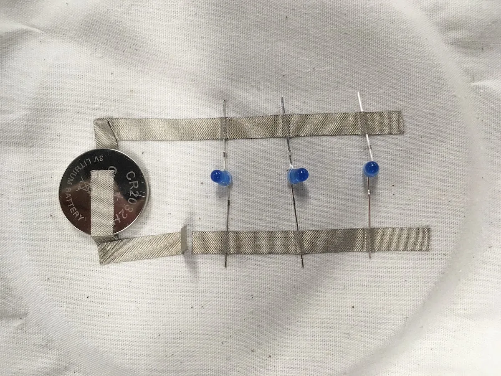
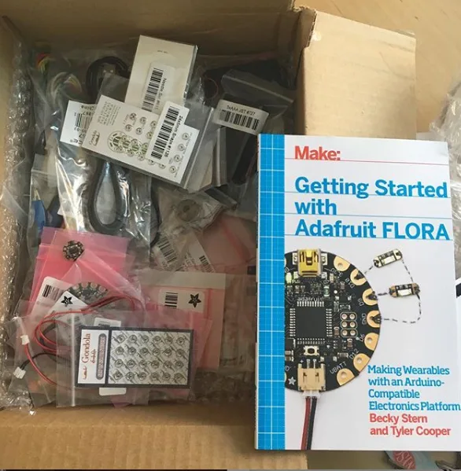

The podcast is part of our [Education Portal](https://processingfoundation.org/education), a collection of free education materials that can be used to teach our software in a variety of classroom settings. Rather than endorse a specific curriculum, we’ve engaged with a variety of educators from our community, ranging from K12 teachers, to folks who lead workshops at hackerspaces, to university professors in interdisciplinary departments. We’ve asked them to share their teaching materials, which anyone can use.

createCanvas *features monthly in-depth interviews with these innovative educators, so you can get to know their practices and what they bring to the classroom and why. Stay tuned here for transcripts of each interview, as well as to the* [Education Portal](https://processingfoundation.org/education) *for podcast episodes and teaching materials.*

[This is Part 2 of our interview with Sharon De La Cruz, which can be found on SoundCloud here](https://soundcloud.com/processingfoundation/episode-2-sharon-de-la-cruz-part-2-of-2)*. Below is the transcript (lightly edited for clarity). Part 1 was released in December and can be found* [here on SoundCloud](https://soundcloud.com/processingfoundation/episode-3-sharon-de-la-cruz-part-1-of-2) *and as a transcript* [here on Medium](https://medium.com/processing-foundation/createcanvas-interview-with-sharon-de-la-cruz-part-1-78a9448beffc)*.*

*[Sharon De La Cruz](https://unoseistres.com/) is a multi-disciplinary artist and activist from New York City. Her thought-provoking pieces address a range of issues related to tech, social justice, sexuality, and race. De La Cruz’s work ranges from comics, graffiti, and public-art murals to more recent explorations in interactive sculptures, animation, and coding. In Part 2 of her interview with createCanvas, Sharon gets into the nitty gritty of what decolonization looks like in the classroom. She discusses how educators with privilege can approach working with marginalized communities, and how folks from those communities themselves are impacted by systemic racism in practice and ideology.*

**Saber Khan**: Hi everyone. Welcome to createCanvas, a podcast about the Processing education community. I’m your host, Saber Khan, the Education Community Director of Processing Foundation. \[*intro is the same as above*\]

This is the second part of our conversation with [Sharon De La Cruz](https://unoseistres.com), a multidisciplinary artist and activist from New York City. Here, we continue talking about what decolonization looks like in the classroom in terms of freedom and in practice. You’ll find the first part and other episodes, including this one, on the [createCanvas SoundCloud](https://soundcloud.com/processingfoundation) and wherever you download podcasts.

There’s a lot of threads to pull from \[from our last conversation\]. Let me think about it which one we should pull on. To add to what you’re saying, maybe decolonizing success or freedom is also something we don’t know yet.

**Sharon De La Cruz**: Yeah. Oh yeah. Yeah, yeah.

**SK**: As someone who thinks about this in my life, it feels like a very reactionary thing. I’m at a place of privilege in life where I can kind of look back and say, “This is what my decades in whiteness has done for me.” Decolonizing it even to this point feels very reactionary. On its own terms, I wonder what it will be for each of us when it isn’t just trying to react to the trauma that the world has inflicted through mechanisms like that.

**SDLC**: Right. Right. I don’t know if I’ll see that in my lifetime, which is interesting. But if [Harriet Tubman](https://www.pbs.org/wgbh/aia/part4/4p1535.html) thought about slavery in her lifetime… fuck. She wouldn’t have seen it either. You know what I mean?

**SK**: Knowing that there’s something more, but not knowing what it is, is something that I think a lot of us are very aware of. I think someone else will have to live it out, perhaps. Or dream it up, even.

**SDLC**: Yeah, for sure. But we’re all pushing towards it, right? We’re all a part of it. And I don’t know what it looks like now, but it doesn’t mean I can’t push towards it, right? That is imagination. That is faith. That is trust that people are going to see the work. It makes me excited to leave something in this universe. I’m like, “All right, I will leave several artifacts that maybe someone will see one day.”

I’m excited about that, and honestly I don’t know what it looks like yet. I know I’ve gotten glimpses of it, which looks like making. When I make, I feel decolonized there. Sometimes when I’m teaching, it’s there’s then, because I’m performing. It’s all a performance when you’re teaching.

  <iframe src="https://www.youtube.com/embed/yGnA6fixLUY?feature=oembed" frameborder="0" scrolling="no"></iframe>

**SK**: Absolutely.

**SDLC**: That feels a little bit closer.

**SK**: It’s community-minded too, which is I think — not that that’s inherently POC versus white. Maybe it’s an untrue stereotype, but the individualism of the Western white perspective versus the community-minded Indigenous way of looking — I think teaching always appealed to me for that same reason. Like, “how do *we* see this?” Which is really, to me, a very fun, exciting question to think about.

**SDLC**: Right. I’m a fan of storytelling, so this is 101 storytelling. I get to story-tell all the time and get people to start thinking about their own stories. Again, I don’t know what it’s going to look like in the future, but I’m super excited for folks in the future. I’m like, “Oh, you don’t have to go through the trauma? Thank goodness!” It’s just too much work, and too many loans. I’m like, “Don’t do that.”

**SK**: That’s so optimistic. I love it.

**SDLC**: I’m like, “Don’t take out a loan, please.” Just getting folks to think more deeply, but definitely allocation of resources, and really understanding that this is not a joke. This is not theory. When I say [systematic racism](https://www.benjerry.com/whats-new/2016/systemic-racism-is-real), there are clear examples. These very clear examples are not just me trying to make up a story. I’m like, “No.” There are very clear examples of how communities of color have been, like, purposefully marginalized in property. Like, in shelter with food and education. Unfortunately, it’s not a shock that there are still not enough POC \[people of color\] folks in tech. It’s not a shock, but it definitely is disappointing.

**SK**: As someone who taught in a public school in Brooklyn, and now teaches at a private school that’s very white, it is undoubtedly true that who you are, your race, is a determiner of how you get treated, how your teacher looks at you, what kind of school you go to, how you feel about it, how you feel about it when you make it out. And what happens to the people that don’t make it out? Even the idea of “making it out” means that the listener is unaware of this kind of perspective on the world. This podcast is probably not a good place to start, but it’s definitely worth thinking about. Especially if you’re an educator and you’re thinking about what kids bring to the classroom, and the baggage that comes with them when they go to the classroom.

**SDLC**: Right. And even simple, big things like, “Have you eaten?”

**SK**: Yeah. Do people smile at you on the street?

**SDLC**: Right. Right.

**SK**: Do people make eye contact with you in the street?

**SDLC**: It’s true. It’s true. Yes.

**SK**: Or do the police come and shoo you away when school gets out?

**SDLC**: Like, what is what going on? It’s all of that that may not happen to you directly day-to-day, but it’s literally in the back of your mind all the time. You carry that trauma with you all the time.

**SK**: To maybe complete the circle here: you see making and fabrication as a small step to create a space outside of that. You have some curriculum that we’re going to put up on the website. Do you want to talk a little bit about what’s in it?

**SDLC**: Yeah. [This curriculum \[available here\]](https://github.com/unoseistres/INTRO-TO-WEARABLES) was meant for a class that’s called STC 209, taught at Princeton, which is a semester-long course that teaches the fundamentals of making, which include coding, fabrication, and thinking about narrative. I was in charge of the wearable module. That module was supposed to be the intro to circuits for that particular semester. I had help from the wonderful [Shefali Nayak](https://shefalinayak.com) and [Aatish Bhatia](https://aatishb.com) to put together a curriculum that would make sense for wearable electronics for intro to circuits. It includes a step-by-step for how to make your circuit. And then lots of example codes with different sensors attached to them. Some are knitted sensors and then some are accelerometers.

**SK**: Great. And then how should people — they open up the website, and then how should they start? Do you have any advice on how they might engage with the curriculum?

**SDLC**: I base this curriculum on a particular board. So, the [Adafruit FLORA](https://www.adafruit.com/index.php?main_page=category&cPath=92), which to me seems to be a pretty accessible, really straightforward, a very basic but powerful board … a micro controller. If you needed somewhere to start, I would start with their [starter kit](https://www.adafruit.com/product/1405), which brings everything that you would need … which includes your needles, conductive thread, some sensors, and your board to start. From there, you can go really, really far with the curriculum.

I should add this actually to the website, to the GitHub. I know where you can get conductive yarn, where you can get … the conductive thread is easier because it’s on Adafruit. But for conductive yarn and just fabric samples of conductive fabric, which is super sweet. Again, I didn’t know there was conductive yarn. There is silver spun conductive yard. Just super rad.

**SK**: I guess we should mention Adafruit is a New York-based —

**SDLC**: — electronic suppliers.

**SK**: They make really fun maker, educational, professional, \[and\] semi-professional tools and kits and boards, that go right into a maker-space, or a maker-classroom very easily.

**SDLC**: Right. They have really awesome tutorials \[[on YouTube here](https://www.youtube.com/adafruit)\], and then you can take it up a next level with some conductive yarn, or whatever the case may be. Just something else.

**SK**: Great. Any parting thoughts? Anything we didn’t get to cover, or anything you wanted to say that we missed?

**SDLC**: This time I didn’t cry! The first time we had this interview, I was just like, “Ahh, this is …”

**SK**: You were going through a lot.

**SDLC**: I know. I was like, “Oh my god, decolonizing success!” Although I still feel that in my heart, I’m really glad this time I didn’t cry.

**SK**: You want to sit back and talk about it from a distance, as though, you have learned something, and it’s in the past, or you mastered it. But this stuff is very personal.

**SDLC**: Yeah, it’s really personal. Honestly, if it wasn’t this personal, I don’t know if I would have the grit to keep going with it, because it does take a lot of patience and time. Because again, as we mentioned earlier, we’re not just dealing with electronics 101. I wish it was just that simple. \[But\] it’s trauma, it is patriarchy, right? It’s so much that’s built into teaching in marginalized communities that you have to take in consideration. Then on top of that, you need to make sure that they’re actually coming out with technical skills. And on top of that, you need to make sure that they feel seen, that folks feel seen, and feel wanted in a space.

That’s hard, that’s hard. But with making, I do feel like I have caught and retained attention, and the want, and the desire for imagination, and building a better universe, a better community, without beating it over a young person’s head. I don’t ever want a POC person to think that they have to solve the problems they didn’t even fucking create. They didn’t create it! However, I do, in the same vein, believe that if they wanted to solve those problems, they are the ones that should be solving for their community, for sure.

I believe in a nice, equal balance of both. To me, that’s called joyful resistance. I want to leave folks with the idea of joyful resistance. That we’re not beating up kids, or beating up POC young people to think about the solution for the problems that they did not cause, versus the… like, just be joyful. In these privileged spaces, folks can just be joyful and not be attached to anything so serious. Right?

  <iframe src="https://www.youtube.com/embed/CFT6w9NKfCs?feature=oembed" frameborder="0" scrolling="no"></iframe>

**SDLC**: I obviously do think there’s value in a young person understanding that they too can be the problem-solvers. They’re creative problem-solvers for their own communities, but they can also easily just make an LED light up, and be done for the day, and be super satisfied with that. So, a little bit of —

**SK**: — make art for art’s sake.

**SDLC**: Yeah. And you’re learning through that, and you’re experiencing, and building through making just for making’s sake.

**SK**: Just your story. It doesn’t have to be part of a movement, or tell a parable.

**SDLC**: Right, exactly. Which is \[what\] we need more of. Unfortunately, where nonprofits are getting their money\[is from\] if it creates a structure where everything has to be calculated and tangible to a story, to a problem, and that is … unfortunately, that’s just such a fucking disservice.

**SK**: It’s the “[solutionism](https://en.wiktionary.org/wiki/solutionism)” that tech is so absorbed in.

**SDLC**: Yes. And that I cannot handle. I’m like, “Fuck you. I want to dance now.” It has nothing to do with tech. You know? God bless.

**SK**: Is there anything you want to say about educators that work in white spaces, white educators that work in white spaces? Do you have any thoughts about it? \[As someone\] working in marginalized communities, is there a flip side to what other people should be thinking about?

**SDLC**: Right. Thank you for asking that question, because there definitely is. So, there’s two things. One is when I first heard the words “human-centered design,” I was like, “Fuck. We’re fucked.” Isn’t everything supposed to be human-centered? Obviously not. Great.

That also got me thinking about something that I’ve noticed my whole life, which is the idea of when white folks come into marginalized communities, but then also when they are teaching in their own communities: how are you teaching about problem-solving in marginalized communities? It doesn’t mean that a white person could not come to, let’s say, Florida and be helpful. That is not what I’m saying. What I am saying is that through design thinking, through “human-centered design,” you are the hope and the idea. The theory is that this is not coming from the ideas, or the design is not coming from the person facilitating anything, but rather from the community that you’re serving. that you’re building for.

**SK**: Yes. Get away from a deficit mentality that you’re going to fix something by teaching them something.

**SDLC**: Believe me, there was \[already\] (and I don’t even believe in him) one Jesus Christ, we don’t need another one. You know what I mean? Stop with the savior mentality. You’re not saving anyone. I don’t need any saving. And if I need saving, I can do it myself. So, stop that shit immediately.

This design thinking, human-centered design, it’s supposed to help facilitate that, but that also takes ego. I do enjoy design thinking, because it is a nice way to say, “This is not about you,” and puts it really nicely, structurally in a way that anyone can digest. I would suggest, yes, if you are inclined to help a marginalized neighborhood, think about yourself as a facilitator. I’d even think \[the word\] “facilitator” is a little too much. Hmm. Maybe you can think of yourself as a moderator. Maybe moderator, but also a moderator that is like checking in with themselves all the time. And that you’re not moderating, you’re — hmm. All of these words still have too much power implication.

**SK**: You know, what [Bryan Stevenson](https://eji.org/bryan-stevenson/) would say is just proximity. Like, just be present.

**SDLC**: Yes. Okay. Yes, I like that.

**SK**: Just downplay what you’re doing, and you stick around long enough to possibly one day come to a better understanding of what’s happening, rather than this fly-by-night, “We need a program tomorrow to train 10,000 kids to code.”

**SDLC**: Oh my God. We don’t need any more fucking programs! No more fucking programs, coding programs, please! Yes, if you genuinely want to be a part of the community and genuinely want to see change, yes, it is understanding — honestly, a lot of people don’t do research about existing programs. If we’re going to talk about programs: How about fundraise for those existing programs that have been doing this for 20 years? Before you were born? Get *them* fundraised.

And yes, I think you just said it so nicely. Just stick around enough to listen to someone else. This is not about you. This is definitely not about you, and your ego. If you are inclined to do something that’s super action-specific or something that you want to see now, you help out a group that’s been established before from the community, that is from the community. Because they don’t need any saving. They’ve been doing this, and they’ve done this years before you got there, and will continue to do it years after. The best thing that you can do is help the existing community and listen to them. Perhaps you could maybe build a mesh network with them. Great. That’s a great way to start writing. But it doesn’t start from you believing and thinking that you are the problem-solver. You are not the problem-solver, and that’s okay. Right? That’s fine.

**SK**: That’s a good title for the episode. “You’re not a problem-solver.” For everyone!

**SDLC**: Yeah. It’s a good thing. It’s a good thing to think that way, and just step back, and also a way in which you can think about your implicit bias. We all have it. We’ve been funneled through this racist system, right? It is easier to say white and black, right? But then it gets really muddy quick. I basically have been funneled through white education since high school moving forward, and I’ve had to learn a lot of fucking racist shit. A lot of shit that did not take me into consideration, and then I acted out because of that. I learned how to memorize — you learn these tactics to these spaces that don’t actually care about you. They just care to funnel you through this idea of success that they’ve made for themselves. And if you don’t measure up to that, then you’re not good enough. That’s a scary thing. That was always my scariest thing, you know? You don’t want to fail. You don’t want to seem not worthy.

**SK**: Well, because the price of failure is so high in some communities that it can seem life or death.

**SDLC**: Oh, yeah.

**SK**: People being treated like garbage. I think the kindness that protects failure is not available to everyone at the same rate at the same time.

**SDLC**: Right. Right. Yes.

**SK**: Cool. Thank you so much for getting into all the nitty gritty with me, Sharon. It was great to talk to you today.

Thank you for joining createCanvas. Once again, I’m your host Saber Khan. CreateCanvas is produced by Processing Foundation and supported by the Knight Foundation. Our editor is Devin Curry. Special things to Processing Foundation board and staff. You’ll find many of the things discussed here today in our show notes. Before you go, please visit processingfoundation.org and check out the Education Portal for free and accessible educational materials. Processing Foundation is on Twitter, Instagram, and Facebook. You’ll find this and future episodes on our Medium channel as well.
