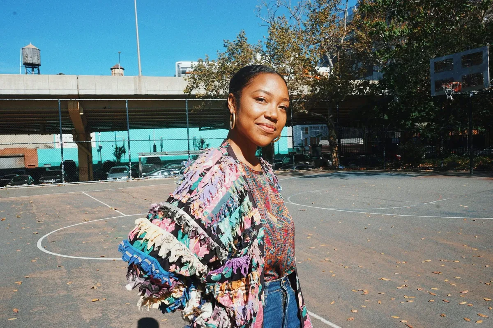
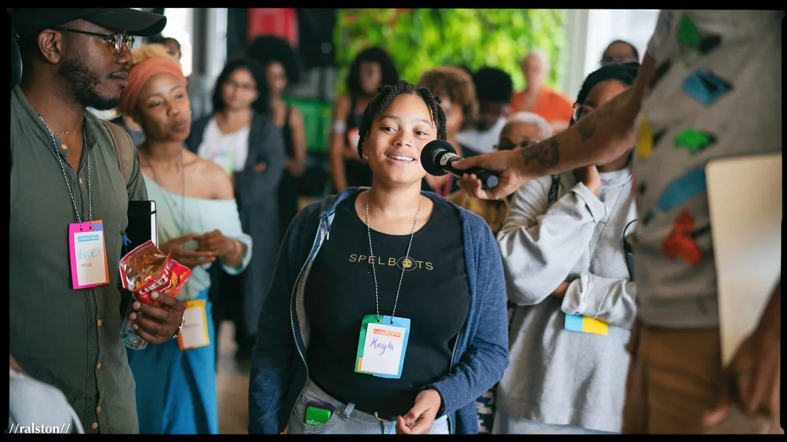
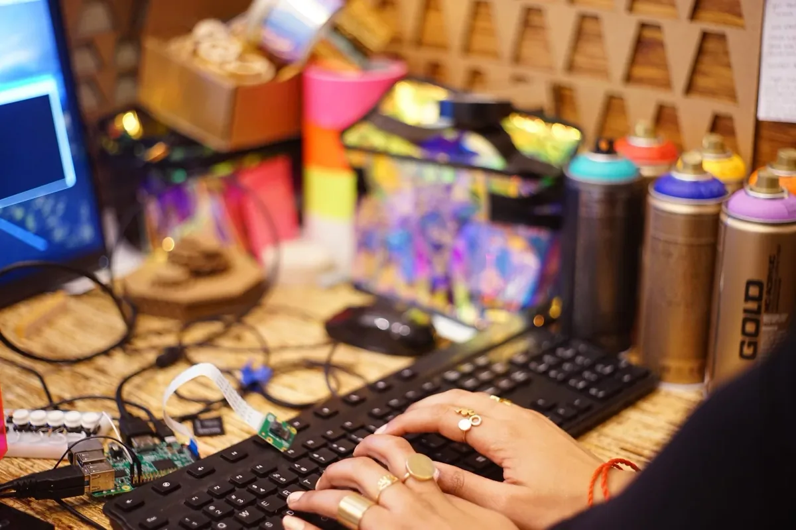
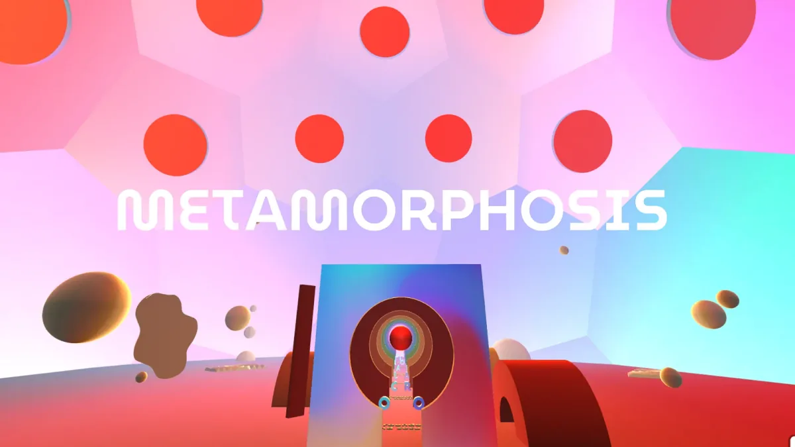
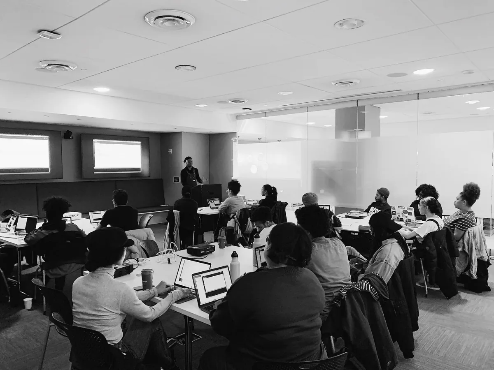
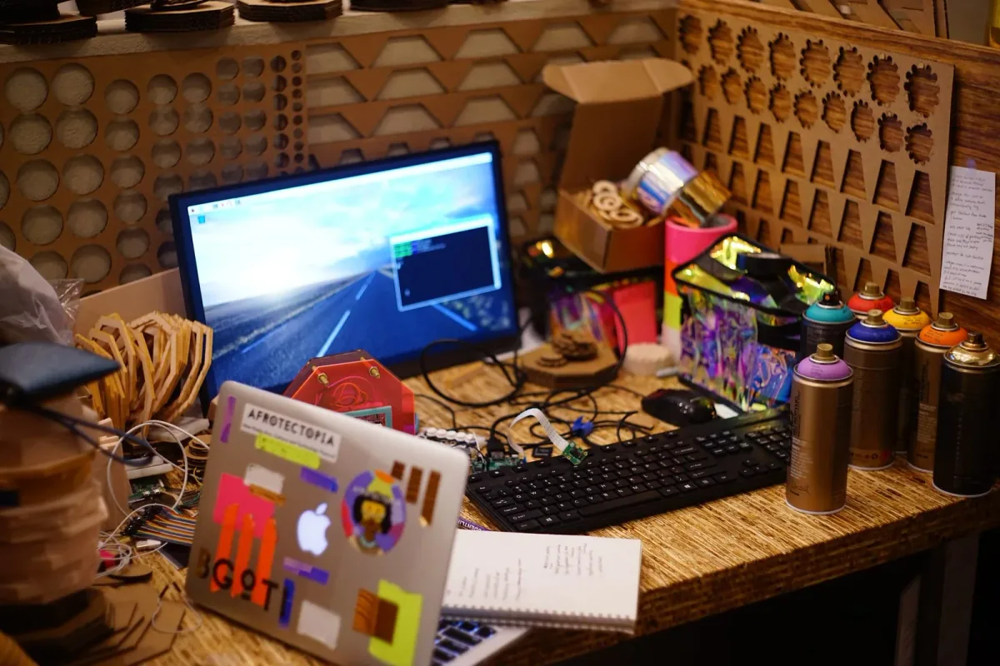
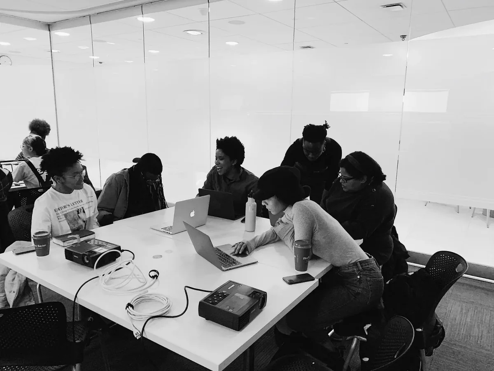

It’s hosted by Saber Khan, our Education Community Director, and is part of our_
[Education Portal](https://processingfoundation.org/education)_, a collection
of free education materials that can be used to teach our software in a variety
of classroom settings. Rather than endorse a specific curriculum, we’ve engaged
with a variety of educators from our community, ranging from K12 teachers, to
folks who lead workshops at hackerspaces, to university professors in
interdisciplinary departments. We’ve asked them to share their teaching
materials, which anyone can use._

createCanvas _features monthly interviews with these innovative educators, so
you can get to know their practices and what they bring to the classroom and
why. Check out the transcripts of past episodes_
[here](https://medium.com/processing-foundation/education/home)_._

[This episode can be found on SoundCloud here](https://soundcloud.com/processingfoundation/s02e02-createcanvas-melenciano-v07-16lufs)_.
Below is the transcript (lightly edited for clarity)._

_[Ari Melenciano](https://www.ariciano.com/) is a Brooklyn-based artist artist,
designer, creative technologist, researcher, and educator who is passionate
about exploring the relationships between various forms of design and sentient
experiences. Currently, her research is a synthesis of human-computer
interactive technologies, architecture, Afrocentric design practices,
counterculture, audiovisuality, biomimicry, experimental pedagogy, and Black
radical imagination. Ari is the founder of
[Afrotectopia](https://www.afrotectopia.org/), a social institution fostering
interdisciplinary innovation at the intersections of art, design, technology,
Black culture, and activism through collaborative research and practice. She
currently teaches creative technology and design at NYU’s Interactive
Telecommunications Program, NYU’s Dept. of Digital Photography and Imaging,
Pratt Institute’s Communications Design school, and Hunter College’s Integrated
Media Arts MFA program._

**Saber Khan**: Hi everyone! \[_intro is same as above_\]

Today, I’m here with Ari Melenciano. Ari is an artist, designer, creative
technologist, researcher, and educator who’s passionate about exploring the
relationship between various forms of design and human experience. How are you
doing this morning?

**Ari Melenciano**: I’m well. Thank you for having me.

**SK**: Great. Is that how you like to be introduced?

**AM**: Yeah, that’s exactly it. That’s exactly it.

**SK**: I pulled that from your website, but I was wondering where you like to
jump to after that. If you do the next sentence, what do you usually go to?

**AM**: Pulling from my website, it usually says “currently, my research lies…”
and then a bunch of different mediums like design, and multi-sensorial
experiences, and speculative design, and experimental pedagogy, and those sorts
of things.

**SK**: Yeah, and folks should definitely check out your wonderful website,
[www.ariciano.com](http://www.ariciano.com), which we’ll link with the podcast
as well. But I have some questions for you that would be great to hear your
responses to. It’ll also explain the material that we’ll present on the website
from you. The first thing to start is this very big, ambitious, exciting project
that you lead called [Afrotectopia](https://www.afrotectopia.org/). Do you want
to introduce that project to us?

**AM**: Yeah. Afrotectopia, as it currently stands, is a social institution that
fosters innovation at the intersections of art, design, technology, Black
culture, activism, and race in general. It’s done through collaborative research
and practice. It started while I was a graduate student at
[New York University’s Interactive Telecommunications Program](https://tisch.nyu.edu/itp),
and going into the second year, I decided that I wanted to create a space that
was thinking about technology and race in tandem, because I was often in tech
spaces that didn’t consider people of different cultural or racial backgrounds
at all, or the societal impacts of tech. That was something that was really
important to me.

I also just didn’t have mentors or didn’t know Black people that were doing the
kind of work that I was doing, so I just wanted to be able to find a community
of people that were doing similar things. I told the program ITP that I wanted
to do this, and they immediately got behind it and supported it, and offered
space and assistance in any way. It happened in March 2018. That was the first
one, and hundreds of people were gathered on ITP’s floor.

We were thinking about technology and race and design, but it was also a space
to not be… A lot of tech kind of events are very catered to a certain kind of
person, like people that are specifically developers or engineers, or people
specifically of a certain socioeconomic standing, and this one was really not
about that at all. It was more about bringing a whole bunch of different kinds
of people together. Like, we had panelists talking about law, and policy, and
economics, and health, and all sorts of things, so it was really about bringing
a wide spectrum of practices to come together and think about how we can really
design the future that we want to live in. Because if we’re designing futures,
it’s important to be holistic and comprehensive.

So, that was one, and then it was also a space where people have many different
socioeconomic standings. It’s not an elitist space. It’s very much embracing
people from all different backgrounds to come together. That was the first
event, and shortly after that, it just continued to build and grow into finding
other ways that pedagogy and research can be shared and collaborated on.

We’ve had a summer camp, after the first one: we had a summer camp for New York
City public school students. And then after that summer camp, we had the second
festival that was hosted by Google. The second festival was even more vibrant
than the first, I felt, because we were really specifically thinking very much
about the future. It was very much a space of full agency, full Black agency.
\[To\] consider what kind of healthy future do we want to live in and how do we
design it? How do we make sure _we’re_ the ones that are designing it?

Then after that one, Verizon hosted us for our two weeks as
[School of Afrotectopia](https://xd.adobe.com/ideas/perspectives/interviews/ari-melenciano-school-of-afrotectopia/),
so we had about 250 students, Black professionals that were also interested in
art, and technology, and design, and Black culture and activism. So, we had 10
different teachers teach really interesting courses at the different
intersections.

Now we’re in 2020, and we’re thinking about how we can continue the work of
building a space that is vibrant. The most important thing is making sure that
our community is strong, and they’re being catered to, and that we’re creating
opportunity for people to collaborate in research.

So, right now, we’ve been in the midst of
[our fellowship](https://medium.com/afrotectopia-imagineer-fellowship-2020/afrotectopia-imagineer-fellowship-2020-27a07a2a1ebb).
It’s our first fellowship, where we have 10 different fellows, and they’re all
from different parts of the world, and all from every part of the United States.
Someone from San Antonio, Texas, someone from California, Miami, and then even
outside the country, France, UK, Ghana. So, they’re all over. They’re coming
from many different growing geo locations, but also again, socioeconomic
standing and ethnicities.

We have someone that is Honduran, someone that’s French, Beninese, Cuban, all
coming together; even different sexualities; and just generally even practices:
urban designers, architects, community organizers, machine-learning
practitioners, all sorts of people coming together. We’re thinking about, How
can we build these rapid prototypes and design features that we want to live in?
It’s growing and it’s expanding, and we’re constantly experimenting and seeing
what does the community need, and how can we be a guiding light and investment
into the Black society?

**SK**: And this is the
[Black Futures Manifesto](https://www.eyebeam.org/events/manifesting-equitable-futures-building-an-anti-racist-technoculture/)?
Is that what this is leading into?

**AM**: The Black Futures Manifesto is one of the projects, out of a few, that
the fellows are engaged in. The fellowship, for one, it’s different from normal
fellowships in that, I mean, I’m someone that generally does a lot of different
fellowships and residencies, and usually, the way that that’s structured is
someone gives you a lump sum of money, and then you go off independently and
work on your own project.

But with Afrotectopia being so community-oriented, and specific to
collaboration, this fellowship is designed for the fellows to come together, and
they work on four to five different projects collaboratively all throughout. The
four to five different projects — they include designing future cities, Black
radical techno culture, designing culturally relevant pedagogy for
remote-learning amidst poverty, like a bunch of different projects, and also the
Black Futures Manifesto. They come together, and they research on different
topics. Then on the Sundays, when we gather from 10:00 to 3:00, they then build
out rapid prototypes of what that might look like.

_Participants at Afrotectopia Festival in 2020. Photo by Ralston Smith.
“Afrotectopia is a social institution creating at the intersections of art,
design, technology, Black culture, and activism. We cultivate spaces for Black
radical imagination through annual festivals, think tanks, international
fellowships, alternative schools, and more. Our work is rooted in collaborative
research practices and outputs for Black agency and empowerment.”_

**SK**: Okay. That’s fascinating. I’d love to hear what wisdom you have about
managing communities and projects like that. Do you have things that you’ve
learned building something like this, like a community project like this?

**AM**: Since the beginning of Afrotectopia, it’s really, for me, about
designing a space and then people kind of just run with it and make it their
own. With everything that I’m doing with Afrotectopia, it’s very much just
creating a space for people to be curious and imaginative, and just have the
agency. But then it’s really just stepping back and being a fly on the wall, and
just listening and observing.

It’s especially happening with the Imaginarium. We have Imaginarium’s weekly,
every Tuesday, that accompanies the
[Imagineer’s Fellowship](https://medium.com/afrotectopia-imagineer-fellowship-2020/about)
process. The Imagineers have developed a syllabus that’s public that anyone can
engage with
\[[which can be viewed here](https://docs.google.com/document/d/1yMrCSUtj_8Nh5jxXZegSYt1NtJ9NhVqssKxyA_Z8QIE/edit?usp=sharing)\].
So, in having conversations with so many people that applied to be Imagineer
fellows, I found a common thread that really, Black people just want a space to
talk about art, designs, tech, Black culture activism, and in both a scholarly
and a colloquial kind of way, of just being comfortable, and not being the only
Black person within the space that they’re in. Often, they’re the only Black
student in their program or community. So finding that need and then with the
Imagineer Fellowship, that was able to quench that thirst for a select few, but
again, with everything with Afrotectopia, it’s not about being exclusive. It’s
about finding ways to get as many people access. The Imaginariums are a way for
anyone else that wants to engage in this kind of conversation to be able to join
for free. Even with that, it’s bringing in a presenter, giving some prompts, as
far as things that we can think about, and then it’s just sitting back and
letting people have that space to just take the conversation wherever they want.

I think with community organizing, and building, for one, it’s recognizing
different voids and trying to find ways to fill them, but it’s also making sure
that you’re servicing the things that you need yourself as an entrepreneur. Some
of the greatest entrepreneurs have built things that they’ve needed themselves.
I needed a community of Black technologists and innovators, and so that was
built — and a lot of other people who needed that community as well. Creating
those solutions for your own problems for other people, and giving them the
space to turn it into what they want.

**SK**: I can hear how you’ve changed some of the way things are done in this
space normally, \[regarding\] the isolation, the technical barriers, and it’s
really great to hear that. Maybe we should back up a little bit. You said
Afrotectopia started when you were at ITP. What led you to a place like ITP and
a place thinking about Afrotectopia? I wonder if you could speak to your
previous educational experience and lead up.

_Working on “Ojo Oro,”
[Ari’s graduate thesis at NYU](https://vimeo.com/270187242), where she developed
“neo-retro experimental cameras.”_

**AM**: I grew up as an artist. I’ve been an artist all my life. That’s
something I’ve identified as, so… but also, since a kid, I’ve just loved
technology. Technology, I believe, expands the possibilities of art. But I also
grew up not feeling very comfortable with technology, as far as being someone
that’s at the back end of it, in creating my own tools or machines, but more so,
being someone that’s using tech as an end user to create and enhance the art
that I was already doing.

That got me into the world. I always was drawn to it. Like, I read in middle
school an article on Steve Jobs, and he was just one of the most inspiring
people for me, because he was thinking about technology and design in a way that
was very centric to the experience of the person that is engaging with whatever
he’s building, but in a beautiful way. Like, creating things that are beautiful
that people are engaging with every single day. Paying close attention to that,
and that also inspires people to be creative. So for me, I knew that that was
really what I wanted to do, was to find ways to nurture other people’s
curiosity, and imagination, and creation, and really love the relationship
between art and tech.

I didn’t see much of that at all in growing up. I didn’t know of any people or
spaces or communities that were doing that, so I didn’t have any examples. It
was more of just an inkling. Then in high school, I ended up getting accepted
into a science and tech magnet school, which was nice, but I never really wanted
to do it. I still didn’t feel confident in myself, as far as being a
technologist and being able to create, so it wasn’t a space that I really got to
grab much from. I mean, I had some engagement with different softwares and
stuff, but I still never felt confident in doing it.

So, in undergrad, I ended up studying abroad in Barcelona, Spain, for a year.
That was where I really was able to experience something that was so
transformative for me. It’s called
[La Mercè](https://www.barcelona-tourist-guide.com/en/events/la-merce/barcelona-la-merce.html),
which is a week or two-week long festival in Barcelona, with all this free,
public, really cool programming. One of them was on the
[La Sagrada Família](https://en.wikipedia.org/wiki/Sagrada_Fam%C3%ADlia), which
is like the most famous church in Spain. They did projection mapping onto the
church and it completely transformed the space, and it made the church look like
it was something that was alive — like, plants were growing out of it — I had
never seen anything like that. It was done by
[Moment Factory](https://momentfactory.com/home). Instantly, after I learned of
who Moment Factory was, I was researching them and learning more about, like,
what is projection mapping, and I was so engaged with the fact that — and so,
just, invested in, and admiring of the fact — that they could transform a public
space with just light and sound.

That, for me, inspired me to find spaces that I could do art and tech. I ended
up finding New York University, and loved it. ITP was completely life changing.
It’s just been one of my favorite times in life, of just being able to explore
and research art, and design and tech, but being at ITP, it was very isolating,
as far as racially. I mean, I was one of maybe 10 Black students in the entire
program. There were no full-time Black faculty. It was racially just… I just did
not enjoy how it was constructed racially. And I wanted to find ways to change
it.

And it was especially because I grew up in a space that’s predominantly Black,
and so it was just odd for me to be in a space that was in the middle of Lower
East Side, where I also grew up as a kid, that’s predominantly people of color,
to then enter a space that’s so exclusive to mostly white and Asian people. I
struggled with that, and just the power imbalance of it. For me, it became
really important, because I was also sharing the work that I was doing on social
media while a graduate student, and so my friends back home are also… they’re
excited about the work and they see these cool things that are able to be
created, but we didn’t have access to that kind of learning back home, none of
that kind of training.

I often thought of the amazing things my friends would be creating if they had
access to this kind of stuff. For me, it was really about gaining a community,
and also showing Black people that these are things that we can easily do. It’s
not like a white person kind of thing, or an Asian thing. It’s something that’s…
it’s not restricted to different races, ethnicities, and something we can really
bring our culture and insight into. That’s kind of what developed Afrotectopia.

**SK**: This is a little bit off topic, so I wonder \[about\] your racial
identity development, and I wonder if you’re able to see that in your past.
Often, people struggle in these spaces or thinking about this kind of stuff,
because they don’t have a fully developed sense of their own racial identity.
Especially often white people, who have given themselves the default racial
identity, and it’s often a form of oppression to often remind them that they’re
not just themselves, but are in this category. You talked a little bit about
growing up in a predominantly black space when you were a kid. I wonder if you
wanted to say anything about how your racial development has progressed through
your life, because it would track a lot to the work you’re doing now.

**AM**: Yeah, that’s a great question. Growing up, it’s really interesting. I
definitely noticed my own political and racial consciousness develop a lot in
the time that I was at NYU. I was getting a Master’s in Human-Computer
Interactive Technology, but I was also personally getting a master’s in critical
race theory. I was researching that a lot, because I had never been exposed to
that kind of thinking, even growing up in a predominately Black space. Like,
it’s a predominantly Black space, but it’s… for one, I was in high school while
Obama was president, so we’re thinking that we’re in a post-racial society.
That’s already one thing.

Then also, just generally, I didn’t grow up reading books from Black authors.
It’s like, it’s this Black space, but it’s still very colonized and sticking
with the status quo. It was culturally Black in some ways, but it wasn’t
politically Black. I had to learn a lot about my own identity, and what
Blackness means, and social justice, and all of those things. I did a lot of
that. Generally, I was always someone that was doing social justice work growing
up, but I really gained a much more comprehensive political consciousness while
at NYU, and so that change and development of liberal consciousness also changed
the work of Afrotectopia.

Initially in creating it, in addition to creating a community of Black people,
and us being able to see each other, it was also an attempt to diversify tech
companies. To make sure that Afrotectopia is kind of like a direct pipeline into
these tech companies. In some ways, it still is, but my personal investment is
much more about cultivating Black, thriving, and healthy communities. It’s not
nearly as focused on creating healthy tech companies, because I think that’s
just not what I’m interested in. I’d much rather pay attention to what Black
people are doing, and finding ways that we can build with each other. I’m not
against us building in other systems — it’s something I’m doing, too — but it’s
not something I’m personally investing much time into.

_[Metamorphosis](https://www.metamorphosis.fm/), created by Afrotectopia
collectively, is an “audiovisual healing virtual environment that uses sound
frequencies and light waves directly tied to energy centers, as well as African
drum patterns and instrumentation of diasporic revolutions to nurture the people
of the diaspora.”_

**SK**: Yeah, that was going to be the next thing I wanted to know about. A lot
of this work requires interaction with predominantly white institutions and the
resources that they have available, and their interests and your interests. You
talked about one divergence there, of, “Am I just here to provide more Black
people they could hire, or am I here to support the community that those Black
people might want to build?” I wanted to see if you had anything else you wanted
to say about building Black spaces in predominantly white institutions, and what
you’ve learned about it, and any wisdom you want to share with other folks doing
this, either at their school, or at their tech company, or wherever?

**AM**: Yeah. I mean, it’s interesting. I mean, my perspectives will probably
change in a few years from what they are now. It’s something that you kind of
have to figure out as you navigate through, but one thing that I knew
immediately, even with people advising me not to do, not to create Afrotectopia
while I was a student, even Black people, because for one, they’re older Black
people, and they know what it’s like to constantly be put into diversity and
inclusion initiatives just because they’re Black. It’s like this constant: Black
people are being always the ones that have to do this kind of work.

There was a fear of me putting myself in that kind of position, where it’s
taking me away from my own work, my own art practice, but for me, I wanted to do
it while specifically at NYU. I wanted to do it while I was a graduate student,
because I knew that I could use NYU’s resources. I’m not coming out-of-pocket to
create anything for Afrotectopia. For me, that’s important, of always making
sure that… and building things that I’m testing it with other people’s money,
generally. I mean, using the resources that I have access to, using the fact
that NYU has a more prestigious name that I could tap into other communities
with, for me, that was really important.

I think, generally, in building Afrotectopia, thankfully, a lot of other, what
would be considered kind of prestigious communities and companies, have been
invested early on. That’s helped build what we are, but it’s never at a point
where anyone is delegating or demanding that Afrotectopia operates in a certain
way. Afrotectopia is completely independent of any control, other than the
community and myself, of being the designer of it. I think it’s always about
creating a healthy balance of: I can get support for people that are aligning in
different ways, but it’s never to the extent that they’re controlling what we’re
doing.

**SK:** Yeah. I imagine that’s a question that people doing similar work have to
think about, is how much control they might be giving up, to have those
resources and to be in those spaces, to have that prestige.

But we should keep moving. There’s a lot more that you’re doing. You’re both a
student and an educator. You’ve done work at a place… I’m not sure how to
contextualize [Eyebeam](https://www.eyebeam.org/), an artist’s collective
foundation, but maybe you want to get into that. And your work at
[Pratt Institute](https://www.pratt.edu/). Then you’re also becoming a student
again, so I’d love to hear about that.

**AM**: Yeah, I don’t even know where to begin. Where should I begin?

**SK**: Well, I’d love to hear you as a teacher because I think that’s a big
interest. A lot of the listeners —

**AM**: Cool.

**SK**: …I imagine, are teachers, so if you want to talk about your teaching
history.

**AM**: Yeah. For one, my parents are both educators, so education has always
been something that’s close to my heart. My mom, I would always, growing up in
elementary school, would be at whatever school that she worked at late at night,
and would even write lesson plans on teacher’s boards, and they would leave it.
They would let their students work with it as, like, a third grader.

**SK**: Wow.

**AM**: Yeah. Education has always been something I’ve really been interested
in, just because I’ve watched my mom do it for so long. And then when I
graduated undergrad, and was figuring out what I wanted to do, like, I had had
the experience in Barcelona, but I still didn’t know where and how to do all of
that, so I spent a year being a substitute teacher. I grew up in Maryland, PG
County, and was a substitute teacher in Montgomery County for about a year. I
taught every grade level, every subject, from
[AP Computer Science](https://en.wikipedia.org/wiki/AP_Computer_Science) to
kindergarten and P.E. It was a lot of fun.

It was very interesting. It was great at times, but it was also the worst time
of my life, like! \[_laughter_\] When I was working with third graders, for one,
every third grade class, at the end of the day, a few students are crying for
whatever reason. Kindergarteners are hugging you, like all over you, all day.
Middle-schoolers are the worst, I had a long-term position with middle schoolers
for two months, and some days I would turn around and have pencils thrown at me.
They wouldn’t even be scared if the security guard came into the classroom. It
was chaos, but it was a lot of fun just to be around different communities,
grade levels, see the things that they’re interested in.

Also, to find ways to… like, you learn a lot when you’re working with kids. In
being so challenged working with middle-schoolers, I think often, people,
adults, especially, when I was maybe 20, 21 years old, so I look young, and they
are looking at me like, “Who are you?” It’s hard to get respect from them. It’s
definitely about figuring out how to get respect from younger kids, especially
when they’re the kind of kids that aren’t scared of security guards. What I
learned was that it’s not about demanding their respect. It’s really about
earning their respect. It wasn’t about disciplining them and getting angry at
them for behaving in certain ways. It was much more about, how can I reward the
good kids, so that the bad kids or the kids that are just acting out, they are
inspired to do better?

In the first few weeks, it was the worst. I was crying in my car and just
wanting all of this to be over. But then I decided, I just ended up going to
[Party City](https://www.partycity.com/) and buying a bag of starbursts, and all
these other candies. For the rest of the time, during my time in a middle
school, I just gave candy to the kids that answered questions, that were quiet,
that behaved, that created a healthy learning environment. All the other kids,
they want candy, too, and so they started acting better. It was just creating a
more fun and engaging environment where everyone felt respected, and everyone
was inspired to perform the best that they could. So, I learned a lot with
working with them.

Then after that, while teaching in a high school art class, I found out that I
got into ITP. ITP, which is completely transformative, and it allowed me to also
teach after having exited to teach at a graduate and undergraduate level.

After ITP, the first few classes that I taught were at NYU’s Photography
Department and also at ITP. The photography department was undergrad, so it was
great to be able to work with undergrad and grad students, and see the
differences. Undergraduate, you definitely have to hold their hand a bit more,
but graduate students are also kind of intimidating, especially when you just
exited grad school. It’s nice to just be able to work with different groups and
see the differences, and find ways to use the best of both to help.

With ITP, I taught
[Designing Club Culture](https://www.denverstartupweek.org/schedule/6974-designing-club-culture-featuring-ari-melenciano),
so that was the first course that I created and was able to teach myself, and
that was a lot of fun, but it’s also… For me, I realized I really try and
squeeze a lot of different things into one area. It was a short class, seven
weeks, but we were thinking and talking a lot about counterculture movements,
sound, architecture, lighting, psychology, all of these things, and then also
learning a variety of different technologies. One thing that I’ve really tried
to hone in on is how can I make sure that I’m not covering too much, and we’re
able to develop things.

It’s interesting because I also teach at the Pratt Institute now, and I teach in
the design school. Those courses, they’re four hours long, which is insane to
me. It was insane in the beginning, but then you realize in studio, it’s really
great time to kind of just dive deeper. Those are the spaces where I could
introduce a whole bunch of different topics, but when you’re working more in a
kind of lecture seminar, kind of class, it’s really about — you just learn a lot
when you’re in different spaces, and see what fits and what doesn’t fit. But
yeah, it’s been really interesting teaching at the graduate level.

Then also, before I even taught at the graduate level, I was teaching full-time.
While a researcher at ITP, I was teaching full-time at a prep school in Upper
East Manhattan, all girl’s school, doing creative technology. That was a lot of
fun, and just being able to create a whole bunch of all sorts of curriculum,
from physical computation to creative computation, and finding ways to make it
engaging for students.

I think, for me, having grown up, even in high school, feeling so intimidated by
tech and never feeling like I was capable, I’m always very sensitive to make
sure that everyone sees themselves in the work that we’re doing, and feels like
they can do it. It’s really about finding things that they are already
interested in, and weaving that into the pedagogy.

Whenever I teach the introductory course in creative technology, I usually use
sound because that’s something that’s kind of universal, \[that\] people get
excited about. Usually, I start off with, all right, let’s use p5.js to create
sound interactive visualizations. Then they’re able to bring in their own music,
and then it’s immediately gratifying when you can see this screen change based
on your sound. Then, once they have that, and it’s also about realizing — I’m
sorry, I feel like I’m jumping all over the place.

**SK**: No, this is great. Please go ahead.

**AM**: Okay, good. It’s also while at ITP — ITP was transformative in so many
ways, but one special way that it was transformative was the fact that I went in
having a dream project. I had always wanted to create my own camera and I’d
wanted to do that for years, but I had no idea how to do it. Then in just the
first semester of ITP, in physical computation, which I struggled through for
the first half of (like so much of it just went over my head), but then we were
allowed to create our own project, whatever we wanted for our final project.

I ended up deciding I wanted to create the camera, and even my professor didn’t
know how to use the tools that I was trying to use, so I could only get but so
much help, but because I had learned enough foundational knowledge to be able to
know what I didn’t know, and know how to ask other people and Google how to do
this, I was able to build the camera. I think the most important thing is when I
realized how important general foundational knowledge is, across anything, but
also that ability to just know, because it allows you to have that ability to
know what you do not know, so you can ask.

I think that’s such a big barrier that people really overlook in education, of
just people not being able to express what they don’t understand. I might have
been doing project learning before ITP, but it definitely emphasized and
reaffirmed the project learning style of making sure that people are able to
have a vision of something that they are excited about as the end goal. Then, in
having that vision, they will do anything. I did anything, whatever it took, to
figure out how to get this camera working, I tried to figure it out. Just having
that inspiration at the end, I think, is really important for students.

Whenever I teach classes, I’m always showing them that this… I make it as fun
and engaging and colorful as possible, and show them that, this is a potential
end goal that you can create, and now we need to learn all of these different
steps to get there. I think that was so different from how I learned in high
school. We were doing electrical engineering, but it was really, “you put this
resistor here, and then you put this wire here,” and why are we doing it? I
don’t know. But that’s just what they’re saying to do. I think when you have an
end goal, you allow students to ground and grasp what they’re doing, and it
inspires them to build something that they’re excited about.

_Day five of Afrotectopia, in January 2020, where a Projection Mapping course
using Processing was taught by Bomani McClendon, who was a
[2020 ml5.js Fellow](https://medium.com/processing-foundation/making-ml5-js-accessible-b28ae295af4a).
Hosted by Verizon Media._

**SK**: Yeah, nodding my head to a lot of what you said. Also, lots of questions
that come to mind. One is this idea, we know, of project-based learning, of
nurturing a passion that you described, about wanting to make the camera.
Something that I think a lot of folks who are on the outside don’t know how to
do, or never have had the experience, where an educator or the institution has
ever really cared about their passion or invested in it. It’s like, “Learn this,
and if you don’t learn it good enough, we don’t care about you.”

**AM**: Exactly.

**SK**: It’s a really interesting thought about how to help people develop their
passion, and to build classrooms and institutions that cater to that. Like, the
institution’s goal is to help you build your passion. How rare is it to hear
that in the types of places that we know exist, where that’s not what’s being
presented, or that’s not why the learning is even important? It’s not so you can
make your thing. It’s so that you can do these things that we want you to do.

I also just want to defend middle schoolers. \[_laughter_\]

**AM**: \[_laughter_\] Oh, no! My mom will be very unhappy to hear this!
\[_laughter_\] because she’s been working with middle schoolers for the past,
over maybe 20 years. They’re not the worst. I had a really bad experience, but I
also had great experiences with them, too. I just think that’s a really
challenging period of people’s lives, so they can act out.

**SK**: No no, I mean, \[_laughter_\] I say that kiddingly because my baptism of
fire with education was… and I, to this day, still work with middle schoolers.
Yeah, I’m coming up, not to your mom’s number, but I’m coming up to 20 years of
middle schoolers soon.

**AM**: Yeah.

**SK**: It’s a crazy thought. Maybe it’s
[Stockholm Syndrome](https://en.wikipedia.org/wiki/Stockholm_syndrome), where
I’m on their side. \[_laughter_\]

**AM**: \[_laughter_\] I guess.

**SK**: Maybe we should jump a little bit to COVID and remote learning, since
we’re still talking about pedagogy (and before we jump to your artistic
practice). You’re still doing a lot of programming and community building. Have
you thoughts about how to do it in this remote-learning world that we’re in now,
and if you have any advice or questions that come up for you?

**AM**: Yeah, with the fellowship, Afrotectopia, the first project that we were
engaged with was designing culturally relevant pedagogy for remote learning
amidst poverty. For one, that was generally a very challenging prompt, because
we’re dealing with so many different aspects, from race and culture, to the
internet, learning online, and then poverty and the lack of access to those
things. We couldn’t have direct solutions.

We had a lot of really interesting ideas at the Imaginarium. People offered a
lot of really interesting insight. One person said, they were just mentioning
how, I think, they have family in Africa, and all they really have access to was
the radio, and kind of just dismissing that technology, but for me, I was like,
wow, the radio is actually something that is really about using what people
generally have access to, and how can we build off of that? I think it’s
something that definitely has to be thought out a lot more, but when we’re
considering the lack of access to certain things, we also have abundance of
access to other things, like radio. How can we use what we do have access to now
share resources, knowledge? It would be very centralized and a one way street as
far as communication, but thinking outside in that way.

In moving to remote learning, I’m doing it only with university students, but
I’m also talking to my mom all the time about how she’s going to do it with
middle-school students. I think it’s just going to be challenging for everyone.
For me, I had a great time this past spring semester, moving from being in
person to quickly shifting online. Thankfully, because all the students, for
most, like maybe 95% of my students, had access to the internet, had their own
laptop, so we were able to move seamlessly. But also, in teaching at schools
like Pratt, which is so international, many of the students flew home. So we
were at different time schedules, some had to quarantine for weeks, so I
couldn’t even engage with them. Difficulties like that arose, but I think it’s
going to be challenging for different people from where I am, in working with
university students.

I’m not too worried about it, because personally, I’m very comfortable with the
internet, and I think it can be a tool that’s a lot of fun to use, and creates
experiences that we couldn’t easily do in person. With the Imaginariums, we
always break out into breakout rooms. We have a larger amount of people that are
coming in and being introduced to the work that we’re going to be doing that
evening. Then for half of that time, everyone is dispersed into these smaller,
intimate breakout rooms where they can discuss, and I think just being able to
organize people that quickly through Zoom in breakout rooms is so different from
being in person where everyone has to move around the room. I think it allows
some comfort. I think even, for people that have access to the internet and have
their own laptop or device, you can now learn from the comfort of your own home,
if your home is comfortable.

It’s great for people that are in stable conditions, but it’s definitely very
troublesome for — especially when I’m talking with my mom, and she’s dealing
with students who don’t want to show their camera, because they don’t like their
home environment, or they just don’t feel comfortable. I think there’re so many
compounding issues that students are dealing with of, just being stuck in their
home environment. School was that escape. Those kind of things, I’m really
concerned about, I don’t know how to deal with them or address them, or even
just the lack of internet access, or stable internet access, or just lack of
motivation and engaging. For me personally, I love learning through the
internet. It’s not a problem, but I know that for other people, it can be
challenging. So, I don’t know, it’s a lot. I just feel like my experience has
been more of an anomaly and has just been so great with remote learning.

I’ll be going back to school and studying architecture completely remotely for
at least the first semester, and I’m not worried about it at all, because I
generally have spaces where I can spread out and do work, but I know that it
would be very stressful for other architecture students who need a dedicated
studio space. I don’t know, I don’t know how to answer it. I just know that
everyone’s going to have a different experience, and it’s really being sensitive
to people on all ends, even teachers that are older and just don’t have comfort
with the Internet, and they’re trying. Just, students being sensitive to that.

**SK**: Yeah, it is very challenging for a lot of people, but there are some
ways things are easier and better. I was talking with a special ed teacher. My
nephew has special needs, and he’s thriving in remote learning —

**AM**: Wow.

**SK**: — in a way that his mother has worried about for years. There are these
little pockets of very positive that, I think, are good to remember once we move
on from this crisis, which for most people is a crisis, that for some people,
there are some really nice things happening in a way that has been very hard to
have.

But we shouldn’t forget that you’re also an artist. I really want to give you
time \[to talk about that\], and you started talking about your cameras. I’ve
seen those exhibited. I feel like they’re maybe the same cameras that you made,
and that’s part of your — I don’t know, do you call that part of your artistic
practice? How do you think about your artistic practice? What is it, and how
does it connect with the other things you’ve already mentioned would be good to
talk about.

**AM**: It’s interesting. I mean, I think I’ve probably included it as what
might be considered an artistic practice, but I think artistic practices, in
general, I have a really — I don’t know, it’s hard to really put a finger on,
but I feel like, as someone that has grown up as an artist, I have learned about
the art world in ways that feel kind of uncomfortable, and just don’t feel like…
It’s just not the way that I practice art. For me, the way that I practice art
is just through life, like the way that you move through life is an art
practice. Even little things, like I used to obsessively design my groceries on
the conveyor belt in some sort of artistic design, just because I wanted
everything to look beautiful around me. But I’ve never really been interested in
being exhibited in a gallery. There’s a weird perception of the work of an
artist that I feel like is very removed from just life. I don’t know. It’s hard
to describe, so when I hear “art practice,” I’m like, I don’t know. I don’t know
how I feel about it, but I know I’ve _used_ it.

_Ari’s studio, taken while developing Ojo Oro._

So, but yeah, I would say that the cameras are technically part of my art
practice, but I think, because the work that I do — like sometimes I’m
researching about trees, or sometimes I’m designing a WebEx experience — I think
when I think about art practices, I think I assume that I need to divide all of
those things; but really, all of the research, even being in a classroom; and
being both a student and turning in my assignments, on my blog; and being a
teacher, and creating lesson plans, and creating a community; all of those
things are an art practice.

It took me a while to figure out that they were because I was trying to define
myself in a way that we typically think of an art practice, but they are, and
that made me enjoy and made me appreciate creating Afrotectopia more, because I
felt like in creating Afrotectopia, it was something I was doing for my
community.

Also within ITP in that time, because I was becoming so much more conscious
politically, and racially conscious, I became obsessed with bringing politics
into all of my work, because I was so angry, and I wanted everyone else to be
exposed to what’s going on, if they weren’t already, and just have a space to
talk about it, but I found it extremely draining, maybe a semester in of doing
that kind of work, of making everything political, in a very like clear, direct
political way, like, everything’s political. It made me exhausted because I grew
up as someone that, as I mentioned earlier, being an artist was the first thing
that I identified as, before identified as being a woman, or a Black person, or
a person of Latin descent, any of those things. It was about being an artist,
and so I think that made it harder to appreciate Afrotectopia, because it was so
specific to politics, and it wasn’t purely about just creating beauty, which is
just all I want to do.

I think once I realized that, no, this space of creating a community and
creating the ways that we’re engaging is also thinking about it in a way that
you’re creating art, I think that just makes it a lot more comfortable for me. I
think if we kind of separate, or just realize the fluidity, of an art practice,
and not it being something where the end goal is to be recognized, so that we
put into a museum, but it’s about feeling fulfilled, and creating and expressing
the way that your soul wants to express itself, then I feel like art might
materialize in a lot more exciting ways. But all of that is to say, yeah, the
camera is part of the work. \[_laughter_\]

**SK**: \[_laughter_\] No, that’s the answer I was looking for. I think for
anyone that has seen your work, I think, one, I get that sense because I do
think you have a visual sense, and a sound sense that extends out, that people
can see. It’s clearly on your website. Yeah, it is very different from the very
formal, hyper-capitalist art world that places that we talked about feed into.

Again, I’m also nodding my head to who gets to call themselves an artist, and
what kind of work is artwork? How good it would be to extend that and expand
that to essential work, like community-building, and then doing it the right
way. Art is doing it the right way. That’s the performance of it. I actually
appeal to that one, because I also do some of that same kind of work. I interact
with people who call themselves artists, and I’m like, am I an artist? I’m not
really, but I guess in one sense, I want to think of — I guess the word that
“practice” is thinking about communities and sustaining them, and being
sensitive to their needs. As you’re saying, pivoting to things you wanted to do,
and then things you think that space needed, like freeing people from politics
at a certain point, too, so they can actually hear themselves and create for
themselves.

**AM**: Yeah.

**SK**: That kind of work is — yeah, and it’s definitely work. Why not call it
artwork?

**AM**: Yeah.

**SK**: I think we’re almost done. The last thing is, we wanted to introduce
you, but also introduce materials that educators may look at and bring into the
classroom. Of all the things you mentioned, or something new, something you have
to offer up, that we can link from the Processing Foundation Education Portal,
that you’d like to share?

_From Bomani McClendon’s course Projection Mapping at Afrotectopia,
January 2020. Hosted by Verizon Media._

**AM**: Yeah. For one, everything that has been created, most recently out of
the Fellowship for Afrotectopia, all of that is meant to be open source. We have
a syllabus where, for each week, there’s a new prompt of: we’re designing a
future city, or a pedagogy, culturally relevant pedagogy. And we have a whole
bunch of different readings on things that you can learn and engage with, and
videos and other resources, like different communities that are doing similar
work. I think, just, generally, the syllabus, it has a lot in there. Then each
week, we’re releasing the work that the Fellows were doing. They’re creating
these rapid prototypes for each of the week’s prompts. That’s also on
[Afrotectopia’s Instagram](https://www.instagram.com/afrotectopia/?hl=en).

So that, if you’re looking for anything related to art, design, tech, Black
culture, and activism, it’s all on our social media platforms in our syllabus. I
also have developed, through
[The Center of Open Source Arts from Denver University](https://www.du.edu/ahss/opensourcearts/),
they supported me in creating a few different things, one being a creative art
and technology introduction page. Often, I’m asked how to get into the world of
creative technology, like where do you begin? That gives a few sources of a few
different directions of places to start with, whether you want to do physical
computation, or creative computation, or sound design, or 3D modeling. It just
lists down different software and places that you can look to learn, and also
different institutions that are doing that kind of work.

**SK**: Wonderful. That runs the gamut from very technical stuff you need right
now, to much deeper ways of looking at the art and tech world we find ourselves
in.

**AM**: Exactly.

**SK**: Thank you so much. This is such a great opportunity to hear from you. I
think for a lot of people that follow your work, it might also be really great
to contextualize it and hear you talk about a large breadth of it, too. I really
appreciate you taking this time with us today.

**AM**: Yeah, thank you for having me. It was really nice to talk with you, and
such thoughtful questions. I appreciate it.

**SK**: Thank you for joining
[createCanvas](https://soundcloud.com/processingfoundation). Once again, I’m
your host, Saber Khan. _createCanvas_ is produced by Processing Foundation and
supported by the [Knight Foundation](https://knightfoundation.org/). Our editor
is Devin Curry, music by Lysha, \[available on\]
[lysha.bandcamp.com](https://lysha.bandcamp.com/). Special thanks to Processing
Foundation board and staff. You’ll be able to find many of the things discussed
here today in the show notes. And before you go, please visit
processingfoundation.org and check out the education portal for free and
accessible educational materials. Processing Foundation is on
[Twitter](https://twitter.com/processingOrg),
[Instagram](https://www.instagram.com/processingorg/), and
[Facebook](https://www.facebook.com/page.processing). You’ll find this and
future episodes on our Medium channel as well.
