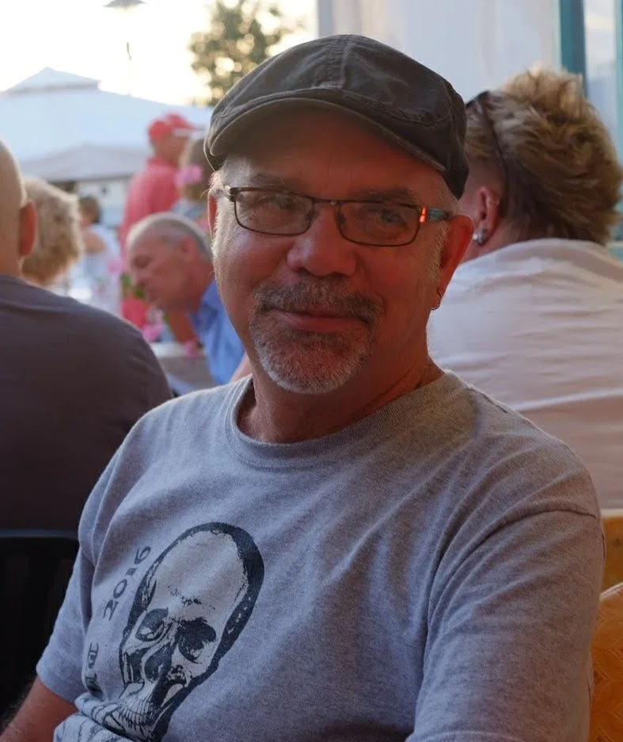
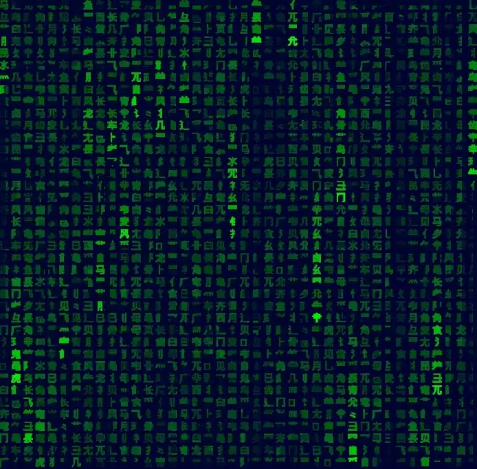
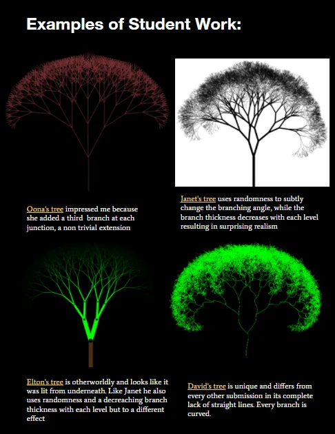
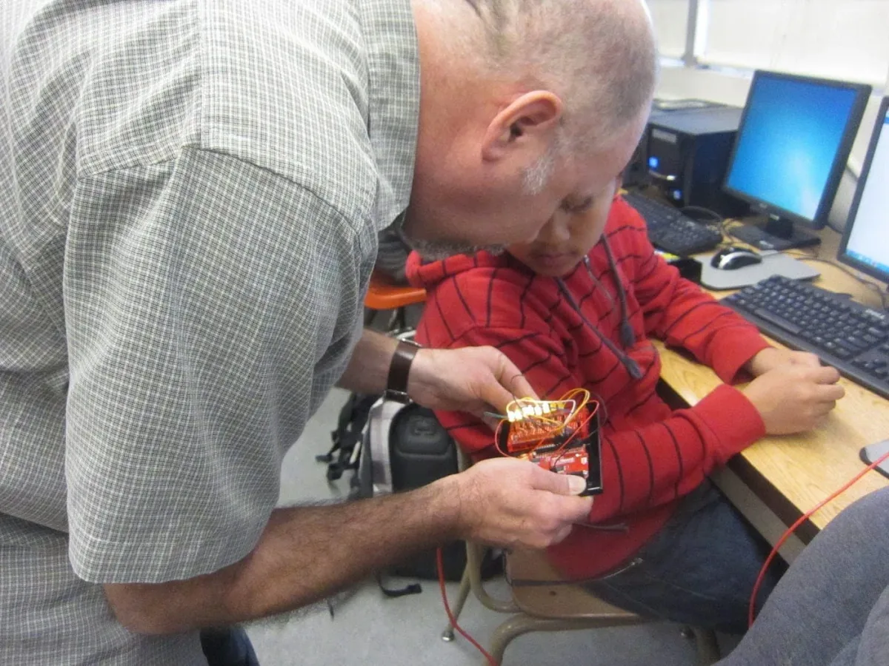
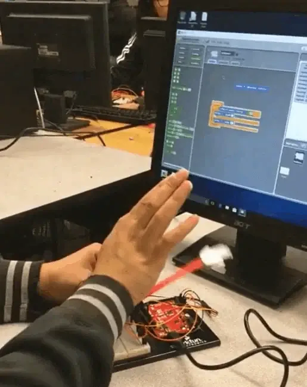
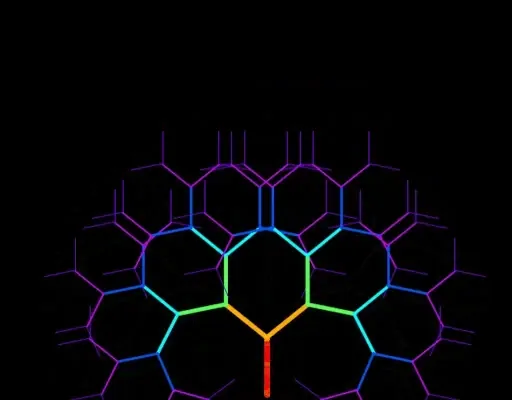

*Saber Khan, our Education Community Director, discusses what these teachers bring to the classroom and why.* createCanvas *is part of our* [Education Portal](https://processingfoundation.org/education)*, a collection of free education materials that can be used to teach our software in a variety of classroom settings.*

*In 2020,* [createCanvas was a podcast](https://soundcloud.com/processingfoundation)*. Check out the transcripts of past episodes* [here](https://medium.com/processing-foundation/education/home)*.*

*Art Simon is a computer science instructor at Lowell High School in San Francisco where he teaches Advanced Placement Computer Science A and Principles. He has been teaching in the public school system for almost 30 years. He graduated with Masters in Fine Arts in Electronic Music from Mill College in 1985. The curriculum to his classes, which use Java and Processing, is [available on his GitHub here](https://apcslowell.github.io/).*

**Saber Khan**: Hi, everyone. Welcome to createCanvas. Today, I’m here with [Art Simon](https://www.linkedin.com/public-profile/in/art-simon-9758a873?challengeId=AQHthnsYJEAjTAAAAXdKOfXIZ0EKg6uF-qS-GY-xbzBGOC3EE29S9IQ626Epvk8_u5h4RCb5KwmwSbrhhD16JN2DPZ7TAmY5kg&submissionId=b6af97d4-5a78-5e16-ab4f-2718dd19e024), a [computer science teacher](http://apcslowell.github.io/) at Lowell High School in San Francisco. How are you doing, Art?

**Art Simon**: I’m doing good. Thanks for having me.

**SK**: You have a long career in teaching, so I’d love for you to back us up a little bit and tell us about your journey in education.

**AS**: Sure. I started as a substitute teacher because I was working on my [Master’s in electronic music in Oakland, California](https://www.mills.edu/academics/graduate-programs/music/mfa-electronic-music-recording-media.php). I got my Master’s in 1985 and I started teaching junior high in Oakland. I taught there for a number of years, and then in the early ’90s I was hired in San Francisco, where I also taught math until roughly ’97, ’98, when I had the opportunity to start teaching computer science. I haven’t looked back. It’s been awesome.

**SK**: That’s great. In another conversation, I’d love to ask you more about electronic music but let’s stick with computer science. How did you get started in computer science? How’d you get into teaching it? And how did you make your way to the world of Processing?

**AS**: At the school I was teaching, they’d had a computer-science teacher since at least back to the ’70s, who was about to leave. They were looking for somebody to replace them. The school counselor approached me, so I started taking classes at San Francisco City College in [C++](https://en.wikipedia.org/wiki/C%2B%2B) and [Java](https://en.wikipedia.org/wiki/Java_%28programming_language%29).

**SK**: Oh, great. Eventually you found Processing as a user of Java?

**AS**: Yeah. One of the best things I’d done before Processing was in the Java class, I had the kids make [applets](https://en.wikipedia.org/wiki/Java_applet). They could make graphics and things that were interactive. That’s when light bulbs started to click when I was taking classes. The computer-science projects I’d be given always had very strict sets of requirements in terms of inputs and outputs. And if you ran the program, and you took the inputs, and you got the correct set of outputs, you were done. I never looked at those programs ever again. Once I turned them in, I was done and it wasn’t something I was going to show people or say, “Hey, check this out. This is really cool. I got all the correct outputs from those inputs.”

But applets I loved. I really love the opportunity for creativity, and I found that that’s when the classroom experience started to improve, like when you could give kids a chance to make the program, to do what they wanted to do, to make it into their own.

**SK**: Back to the point you were making before that, about how Processing or creative coding changes the way you work as a teacher: I’d love to hear more about how you started using Processing in your classes and then how your class has started to evolve.

**AS**: I started using Processing when it was still in beta. I had a really great colleague and friend in the [San Francisco school distric](https://www.sfusd.edu/)t, Ben Chun, who at that time was teaching at [Galileo High School](http://galileoweb.org/). We talked about a lot of stuff, and he was always aware of what was happening in the world, and so he said, “There’s this thing called Processing.” And I just absolutely loved it.

It made a lot of the things that the kids really enjoyed doing much more straightforward. As a teacher, there’s a couple things that I feel Processing hides from students that’s confusing, but by and large, it really lets kids start to build programs they’re interested in from the beginning.

I found it really improved the classroom experience because one of the big challenges as a teacher, as you know, is time management. How do you keep everybody on task, focused, and productive? What works for me are projects where students can invest themselves and do what they want to do.

*A student project from Art’s AP CS A class.*

**SK**: And then you turned that into a curriculum and a class that is your [AP CSA or AP Java](https://en.wikipedia.org/wiki/AP_Computer_Science_A)? Do you want to tell us about the curriculum, and how to engage with it?

**AS**: Yeah. I’ve got it up on the web at [apcslowell.github.io](https://apcslowell.github.io/). It’s a series of lessons, projects, and other materials, and the sequence starts at the top and goes down. We start with a project where we simulate [lightning bolts](https://github.com/APCSLowell/Lightning#lightning) with a random walk, and that’s a fun one. Kids go in all directions with that. My premise was to simulate lightning bolts, but kids have used it to make noodles, and hair, and death rays from the Death Star, all using that same random walk algorithm. That’s what makes it really fun, to see where people take it and what they come up with.

**SK**: It’s a fairly large class with lots of sections, and students are going at their own pace using the materials and following instructions. Do you want to talk about how you use the curriculum in the classroom yourself?

**AS**: I’m a visual person, so I like clear instructions that are written down. I try to have lots of examples of working code, and then I’ll give lessons, and try to keep them short, around ten minutes. Then I give students time in the classroom to work on their projects. I try to circulate and troubleshoot, and compliment, and encourage, and just have a good time.

**SK**: I’ve definitely seen that in action when I’ve visited your class a Lowell. Since then, you have started adding some new things to your curriculum. It reminds me of when you asked me earlier what my own Processing story was, how I made my way into the community. For me it was p5.js. You teach p5.js in the intro course. Do you want to talk a little bit about that?

*Four samples of student work for Simon’s fractal tree assignment.*

**AS**: For years, I was the only computer-science teacher at my high school, which has a population of about 3,000 students. Now I’m one of four, and our program’s really grown. It grew to the point where I was only teaching the AP Java class. I hadn’t taught an intro class for about eight years, and then I got the opportunity to teach an intro class this year and I’m doing p5.js, which is new to me. I haven’t taught a course on p5 before. So I’ve been having a lot of fun learning about the differences. I think there’s a lot of improvements in p5.js. We’re doing 3D graphics right now and that’s been a lot of fun too, the kids have been loving that.

**SK**: Are there differences between the intro course and the advanced course that you’ve noticed?

**AS**: The big important one is that the AP Java class is really a test on Java programming using [object-oriented programmin](https://www.w3schools.com/java/java_oop.asp)g techniques. That’s very different from the intro class where the goal would be to show students, “This is how you make the program do what you want. This is how you make the computer produce the images or the output that you’re looking for.” In the intro class, we’re going to focus on variables, functions, sequence, selection, and iteration. That’s where you want to start, with the building blocks.

But the cool thing is when you have graphics, you can take a loop that would otherwise be boring, and you can make it produce interesting output. You can take relatively simple structures in the language and create engaging programs. In the AP Java class, we think about everything from an object-oriented perspective. We get really into [types](https://www.learnjavaonline.org/en/Variables_and_Types), and [public and private access](https://www.javatpoint.com/public-vs-private-java), and [encapsulation](https://www.tutorialspoint.com/java/java_encapsulation.htm) — a lot of things that would make most anybody’s eyes glaze over. So it’s nice to create a context that’s meaningful, where you want to make the program successful, you want to make the program work. It’s not just another assignment where you check the boxes and turn it in and move on.

**SK**: We’re talking now in the middle of October 2020, and I imagine for you, it’s a couple of months into the school year, which is challenging coming out of social distancing in the spring and a year that’s been very disrupted. How did things go in the spring? What did you learn? And how are things going now with remote learning?

**AS**: The spring was very challenging. We’re on the West Coast and I think we might’ve been affected by the pandemic maybe sooner than other parts of the country. My school closed in the middle of March, and it did so very suddenly. I have not been able to go back into the classroom. I can make an appointment, and I can show up and I can grab a few things and leave, but basically all the furniture, all the computers, everything’s in the exact same place it was in the middle of March. I just walked out of the room and left.

It was incredibly challenging to get my course up and running online, and get students access so that they could do their work online. It was a big, big change. This fall has gotten better because I’ve had a lot of practice, and we started out that way, so we can set the structure as an online course at the very beginning. I really miss the classroom, and I think that, when you are doing creative coding, the opportunity to share your work with others, especially the other students who are in your class, is really valuable. That’s where a lot of the excitement comes from.

The nice thing about p5.js is that we can share our work online relatively easily, so that’s nice, but it’s different than being in a room as things happen. Sometimes you can even hear a little bubble of laughter, or interest, when somebody does something cool, and so you look around the room like, “Ooh, what’s going on? I want to check that out.” *I really miss that terribly*. If anything, I think the subject matter of computer science should lend itself to online learning better than most subjects. But it’s been a struggle. I’m looking forward to going back.

*Art Simon working with a students on an Arduino project*

**SK**: On the flip side of the creativity that creative coding encourages, there’s also a lot of trust and community that has to be in place. That’s the part where, although I think remote-learning should be easy with computer science, I think the classroom you described does require that warm sharing space that doesn’t immediately happen online. I’d love to know your other thoughts about remote learning, or things you’ve done to make things easier for yourself or for your students with remote learning.

**AS**: Something unexpected, and unexpectedly positive, is that we teach on Zoom, and it’s possible for students to share their questions privately with the instructor. I didn’t realize the extent to which students were afraid to ask questions in front of their peers. I’m disappointed to realize that I’d been teaching without being aware of that. But the online environment has opened my eyes to the importance of being able to ask your questions in a low-stakes way. I don’t know what I’ll do about that when I go back to the classroom, but that was an unexpected benefit of online learning.

**SK**: There are quite a number of bright spots and positives that are worth remembering when we all do go back, and it’s good to think of what we’re going to do to accommodate them. That’s a good one to remember: that it can be difficult to be heard in real life. Whereas online, you can create some systems that make it easier for everyone to have equal access in some ways.

**AS**: Yeah, absolutely.

**SK**: I imagine that the move to digital must have been challenging for you and your students. Did everyone have a device handy? Was everyone able to get the internet easily, or was that complicated too? Are there other things that play into who’s able to focus in class and engage in class?

**AS**: It’s really challenging. At my school, about 40 percent of the students [qualify for free or reduced lunches](https://nces.ed.gov/fastfacts/display.asp?id=898). So before we could do anything online last spring, we needed to make sure every kid had a Chromebook, or some other device, and a hotspot. That’s been super challenging because, as people might be aware, p5.js works great on Chromebooks, but if you’re writing Java, it’s a real challenge to find an environment that’ll support Java or the Java flavor of Processing on a Chromebook. And the whole WiFi hotspot has been an issue.

I post all my assignments on GitHub.com, but the district has blocked access to GitHub.com on the WiFi hotspots they provide students. So I’ve had to make alternatives. There’s been a lot of frustrations.

**SK**: Yeah, it’s difficult.

**AS**: I would love to see an equivalent. I’m speaking as an AP Java teacher, so I think I’m in a pretty small group here, but I’d love to see the equivalent of p5.js, where you could type Java consistent with what’s tested on the AP exam in an online editor, and run it and share it. That would be really wonderful.

**SK**: We’ve talked a lot about computer science, and Processing, and p5.js, but you started talking about the length of your time in education, and I think that’s worth looking at as well. Do you want to take a moment to reflect on that career and what you’ve learned from it?

**AS**: Wow. Okay. Reflecting on my career. First off, project-based learning has been so much more fun for me than when I was a math teacher. But I also feel like I made the right choice by switching from math to computer science. I’m so much more happy with the subject matter, the projects, and the classroom experience.

If there are people out there who are interested in teaching computer science, I would say that it’s more fun than most classroom experiences, and there’s a lot more demand for it right now, and there’s a lot more freedom. If I were teaching math, I wouldn’t have necessarily had the freedom to design my own curriculum for the AP class. For me, it’s definitely been a positive trajectory in teaching computer science and teaching Processing.

**SK**: I’m nodding my head. I don’t have the same career journey you have, but I have a similar trajectory including time in the Bay Area as a teacher. I was a science teacher, which is a lot of fun too, but computer science now, especially this more modern [Computer Science for All](https://www.csforall.org/) movement, is exciting for a lot of those reasons.

Not to lead you on, but can you reflect a little on how the position of teachers in this country feels increasingly marginal?

*A student project from Art’s AP CS A class.*

**AS**: Yeah, it’s really tough. It’s frustrating because the message I get from our district or the administration, at least in terms of the volume of emails or whatever, would be that the most important thing I do is take attendance, followed by giving out grades. But in terms of valuing what I bring into the classroom, as opposed to what somebody else might bring into the classroom, I feel like it’s become harder to bring creativity into the classroom because of the increasing standardization.

I don’t know if people are still using scripting, but I was around when many curriculums in math would provide scripts for you to read as a teacher. I don’t have any problem with scripts, unless you are *requiring* me to read the script. I’d love to use the script as a starting point, but I still hope I can bring in something of myself into the classroom. I think that’s been harder in general. There’s a lot more concern about the district making sure everybody does the same thing and doesn’t make any mistakes, as opposed to encouraging creativity and trying to bring out the talents of the people who are in the room.

I don’t want to be too negative, but I do think that the polarization of our country is reflected in our discussions about education as well. It’s harder and harder to keep everybody happy, and to work together and build the trust that you need that really makes education work.

**SK**: This may be a good jumping-off point for one of those areas that’s fraught, which is selective high schools, which Lowell is. Do you want to describe what that is, and what that means, and what the argument is about?

**AS**: I’m not part of the process that selects students for the school, so I’m only aware of it indirectly. But there’s three, what they call, bands or tiers. The primary one is based on grades and test scores. We have a number of kids who are admitted on those criteria. And then we have other criteria, which includes socioeconomic diversity, and diversity in terms of what part of town people are from.

We have a competitive admissions policy to look at the big picture. We’re a selective public high school, which is really unusual. We’re the only one I know of on the West Coast, but maybe somewhat analogous to [Stuyvesant on the East Coast](https://www.nytimes.com/2019/03/18/nyregion/black-students-nyc-high-schools.html). That’s always been controversial and it is certainly right now. There’s a lot of arguing about that whole process and what we should do about it.

**SK**: It often results in schools that are ethnically much different than the cities that they serve.

**AS**: Yeah. It’s really strange too. I’ve been at Lowell for a while now, and you can look at the yearbook or at the class pictures, and you can see that we’ve become more segregated in the past 30 years. I’ve been told that this is something that’s been happening at many public schools, that there’s been a self-selection maybe, I don’t know. But segregation is not something that I personally would have expected to increase, and that’s a real frustration. You can see that especially in the schools that have the competitive admissions process.

*An Arduino student project.*

**SK**: I think the trend is similar, especially the reporting, around places like Stuyvesant (which is a selective high school in New York), and that the problem is much worse now than it even used to be 10, 20 years ago. The number of Black students is much smaller than it used to be in the past, for example.

You probably think about it to a certain degree. I think about this as an educator as myself. I work at a private school, which is to take that and make it even worse in some ways, by having this other selection of bearing the cost of education. It contributes to a larger problem that plagues my city and plagues San Francisco too, which is that most of the places of high achievement are white and Asian, often to the exclusion of Hispanics and African-Americans.

**AS**: It’s a big deal. Obviously this is a big deal. If you talk to the principals who’ve been here over that time of segregation. They’re very frustrated that we’re not able to address that with a change to the admissions process.

**SK**: It seems like they tried a formula and it didn’t work.

**AS**: Yeah.

**SK**: This may be a larger point about imagining that formulas and algorithms and computation can solve a bad data problem. If your overall education system is broken in so many ways and the opportunities are just available to a few, you can add in as many factors as you want, but you’re not able to overcome the underlying problem of unequal opportunities.

I’m thinking of all the bad AI examples that you see nowadays where they let some algorithm run amok on bad data. Turns out it’s racist, and sexist, and Islamophobic, and homophobic. That is what happens when you do computer science critically. I’m wondering if you weigh your students’ conversations around creativity and ethics after they participate in your classes?

**AS**: My discussions have always been focused on creativity, and fun, and making the computer do what you want it to do. Ethics have been a bigger challenge for me. Your example of bad AI is a really good one.

*Student fractal tree project from Art’s AP CS A class.*

**SK**: To be honest, talking about ethics in CS class is not easy to do. Where fun and creativity are really pleasant things to bring into the classroom, ethics conversations, especially if a teacher is bringing in this bad AI thing — I do wonder how it will play for the students, and I wonder about ways to give them some agency in the conversation. I think it requires a lot of creative work from CS teachers to have fun, but also to make sure that we’re putting our brains together and writing good lessons on ethics, because rushed conversations and ethics are going to be so bad and damaging too.

How do you think a conversation about bad AI might go with your students?

**AS**: I think the first thing is to tell a story and create context. That’s what makes it meaningful. And that’s what I’ve found so moving about this [TED talk](https://www.ted.com/talks/joy_buolamwini_how_i_m_fighting_bias_in_algorithms?language=en), because it was not just an abstraction about philosophy, it was the difficulties that a particular person faced. That’s the kind of context that makes the discussions interesting and relevant to the students in the room. As the teacher, you don’t want to seem like you’re channeling the discussion or you’re looking for a particular result.

**SK**: Is there anything else that you want to reiterate before we end?

**AS**: Just to encourage people to visit [my website](https://apcslowell.github.io/) that I’ve got for my classes. I’ve got my email address up there. I really enjoy sharing what I’ve got. I’ve been really lucky to benefit from Processing and I’m really happy to give back and share.

**SK**: My closing question is, what’s in the future for you? What are you looking to be doing? What are you thinking about doing?

**AS**: I’m getting ready to retire. I’m pretty close here, I have just about 30 years in the public school system. I’m looking forward to doing something else and I’m not sure what that is. Certainly, there are a lot of options to continue teaching and I think that it’s likely that I’ll find something related to what I’ve been doing prior to retirement, but I’m also looking forward to maybe doing a little bit less too.

SK: That sounds great. Thank you so much.
