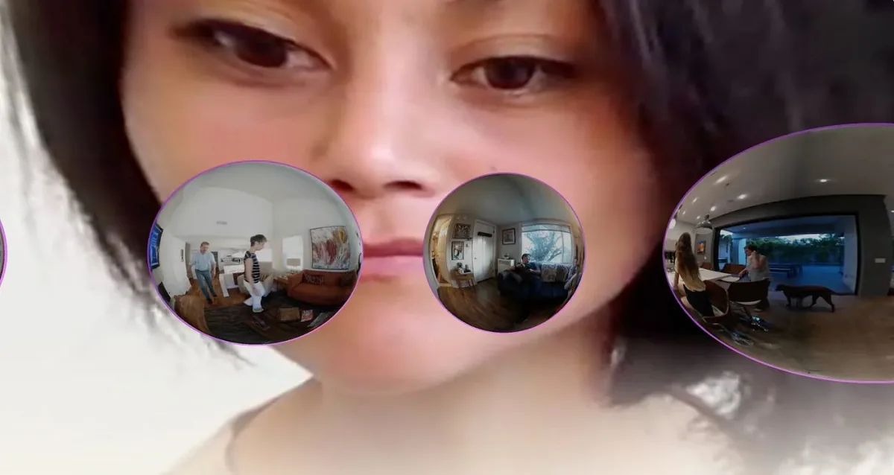
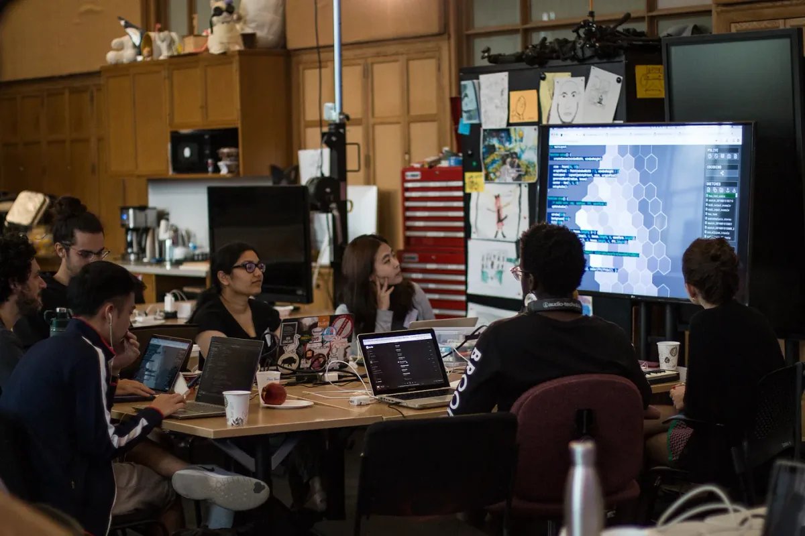
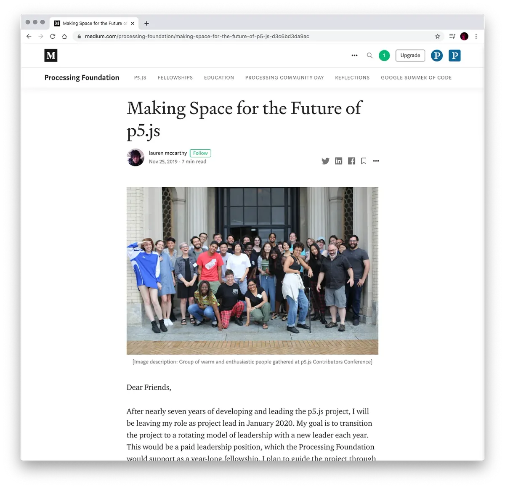
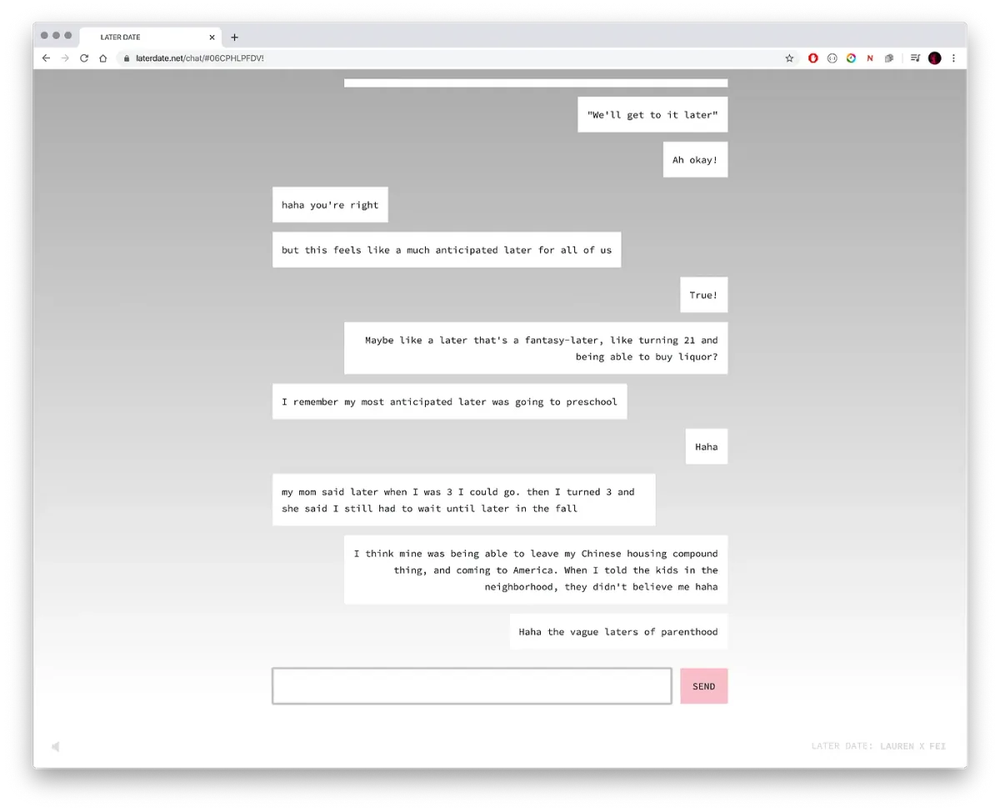
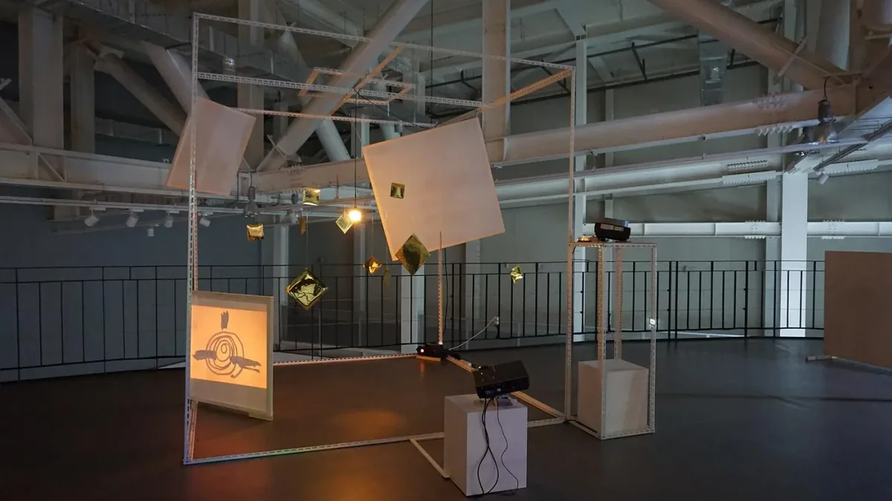

*Welcome to Season 2 of* [*createCanvas*](https://soundcloud.com/processingfoundation)*! We are thrilled to begin with* [*Lauren Lee McCarthy*](https://lauren-mccarthy.com/)*, an artist, open-source contributor, associate professor at UCLA Design Media Arts, and the creator of* [*p5.js*](https://p5js.org/)*. Lauren is also a member of the Processing Foundation’s* [*Board of Directors*](https://processingfoundation.org/people)*.*

[*createCanvas*](https://soundcloud.com/processingfoundation) *is Processing Foundation’s education podcast, which focuses on teaching at the intersection of art, science, and technology. It’s hosted by Saber Khan, our Education Community Director, and is part of our* [*Education Portal*](https://processingfoundation.org/education)*, a collection of free education materials that can be used to teach our software in a variety of classroom settings. Rather than endorse a specific curriculum, we’ve engaged with a variety of educators from our community, ranging from K12 teachers, to folks who lead workshops at hackerspaces, to university professors in interdisciplinary departments. We’ve asked them to share their teaching materials, which anyone can use.* createCanvas *features monthly interviews with these innovative educators, so you can get to know their practices and what they bring to the classroom and why.*

*For the first season of* [*createCanvas*](https://soundcloud.com/processingfoundation)*, we interviewed* [*Dan Shiffman*](https://medium.com/processing-foundation/createcanvas-interview-with-dan-shiffman-eb22043882e6)*,* [*Sharon de la Cruz*](https://medium.com/processing-foundation/createcanvas-interview-with-sharon-de-la-cruz-part-1-78a9448beffc)*,* [*Aankit Patel*](https://medium.com/processing-foundation/createcanvas-interview-with-aankit-patel-75d5fdca869e)*, and* [*Kelly Lougheed*](https://medium.com/processing-foundation/createcanvas-interview-with-kelly-lougheed-part-1-ea2ee45abbf0)*, each in two parts. For Season 2, we’ll be doing shorter interviews with more interviewees, with a new episode each month. Stay tuned!*

[*This episode can be found on SoundCloud here*](https://soundcloud.com/processingfoundation/s02e01-createcanvas-mccarthy-v06-16lufs)*. Below is the transcript (lightly edited for clarity).*

*Image from McCarthy’s performance piece, *LAUREN, where McCarthy “*attempt\[ed\] to become a human version of Amazon Alexa, a smart home intelligence for people in their own homes.*”* Lauren Lee McCarthy (she/they) is an artist examining social relationships in the midst of surveillance, automation, and algorithmic living. She is a 2020 Sundance New Frontier Story Lab Fellow, 2020 Eyebeam Rapid Response Fellow, 2019 Creative Capital Grantee, and has been a resident at Eyebeam, ZERO1, CMU STUDIO for Creative Inquiry, Autodesk, NYU ITP, and Ars Electronica. Lauren’s work has been exhibited internationally, at places such as the Barbican Centre, Fotomuseum Winterthur, Haus der elektronischen Künste, SIGGRAPH, Onassis Cultural Center, IDFA DocLab, Science Gallery Dublin, Seoul Museum of Art, and the Japan Media Arts Festival. Lauren is an Associate Professor at UCLA Design Media Arts. She holds an MFA from UCLA and a BS Computer Science and BS Art and Design from MIT.*

**Saber Khan**: Hi everyone. Welcome back to *createCanvas*. *\[intro is same as above\]*

Today I’m here with Lauren Lee McCarthy. Lauren is an L.A.-based artist and educator, examining social relationships in the midst of surveillance, automation, and algorithmic living. She’s the creator of p5.js, an open-source platform for learning creative expression through code online. How are you doing today, Lauren?

**Lauren Lee McCarthy**: I’m good. It’s so nice to be here. Thank you. How are you doing?

**SK**: Pretty good. At least for us on the East Coast, we’re almost at the start of the school year. But you’re not starting for a little bit later. I’m wondering how you’re spending your time these days.

**LM**: Yeah. UCLA, where I teach, starts around the end of September, so I always feel like I have to try to tune out everyone talking about back to school a little bit, so I can get my full summer. But no, really, this summer has been weird because it’s not been a break from school at all. There’s so much to plan and think about in terms of classes, but then also, there’s been a lot of work within our department, and within the school, to hopefully try and address something of the issues in terms of racism and inequality. So I’ve been in a lot of meetings and projects, trying to work on that in really concrete ways.

**SK**: It feels like there’s both the huge challenge of how to do “learning in COVID,” but also this call for action on Black Lives Matter and so many other issues that are coming to a head at the same time. Maybe we should start simply with what courses you teach, and if you have a specific way you like to teach. I would love to know what it’s like to be in the class with Lauren McCarthy.

**LM**: Sure. I teach a few different classes. The one that I teach most often is called [Network Media](https://lauren-mccarthy.com/Networked-Media). When I came in, I was tasked with teaching that class, it felt very broad. It could be everything from web design, to [APIs](https://medium.com/@perrysetgo/what-exactly-is-an-api-69f36968a41f), to thinking about the politics around the internet, or making internet art. And so I feel like my goal with that class is: What is the internet? Where did it come from? What’s the history behind that? And why should we care? What are the social and political issues that arise out of this medium or platform? And then, on the more pragmatic side, how do you make things for the internet? Learning the basics of JavaScript, HTML, [CSS](https://www.w3.org/Style/CSS/Overview.en.html), et cetera. How do you use that as a platform for expression? What do you have to say, and how do you get it out there? So those are the main things we’re trying to cover.

The class itself is an interesting mix of learning technical skills, but also having a lot of conversations and discussions and readings. I assign some readings, and \[the students\] are also able to contribute things they’d like to read. They lead discussions that are mixing things they’ve read, things they’ve found or researched, and also, their own kind of personal experiences. We have a lot of good…kind of class discussions like that. And then they’re making creative projects that are responding to those discussions and those questions that come up in class.

**SK**: That sounds great. And this is part of their graduate program for a Master’s in fine art?

**LM**: This is actually part of the undergrad program. The program’s called [Design Media Arts](http://dma.ucla.edu/). That’s one specific class, but that kind of mirrors a lot of my goals with teaching both at the undergrad and grad level, just getting into these questions of: How do you make the thing you want to make? What are you trying to say with it? And how does that fit into the larger context in which you’re working? What are the why’s and the who’s of the work that you’re making? And how does it get out there? I think there’s been an assumption in art programs, some art programs, where it’s like, okay, there’s these defined modes of working through the art world, or through galleries, et cetera. And I think all that is shifting, with the times and with COVID, and with artists working with technology, where there’s a lot of different ways to work and build your practice. I’m really interested in helping students find new ways of doing that.

**SK**: I wonder when you’re helping students interrogate that about the stuff they’re looking at — do you have ways that are helpful, especially for young people who might be new to thinking about art and technology in this way, of looking for the why’s of it, that helps students?

**LM**: Yeah. I mean, I think it’s different for every student. Some, you just show them the first “hello world” with code, and that already sparks a lot of ideas for them. It’s also possible to come to something like coding, where there’s a lot of intimidation, or you’ve had a bad experience in the past, or all of your previous education has taught you that this isn’t a space for you, or you haven’t seen people that you relate to, or that look like you, doing this. So often you need to find different ways in for people, starting with things that they’re interested in. I think that’s one reason that my approach to teaching coding is not so much just, well, here’s how you put the thing on the screen, here’s how you make it move, but really trying to weave in: What are you making? What’s the idea behind this? What are you trying to explore here? And how do you bring in other skills, or talents, or experiences that you have into that?

I sometimes have students give feedback that they say, “The class is really challenging, not because of the coding, but because I felt pushed to do multiple things at once. I have to learn something technical, but also figure out what I’m making.” And yeah, it’s hard. But I think that is the challenge. Or when I hear that I think, “Great, that’s what we all need to keep doing throughout our practice.” It’s to keep making the things and to think about: Why are we doing this? And also, how does the way in which we’re working, tools we’re using, or the people that we’re working with, or the references that we’re looking to, how does all of that inform what’s getting made and what comes out in the end? Because the end product doesn’t just exist in a vacuum.

But yeah, how did I start? Well, I’ve always enjoyed learning and being in school. I think I knew from really early on that I was interested in being a teacher. But I think that sense was solidified when I was in college and I had a couple professors that really just opened my mind to what was possible for myself and my practice, and also for the potential for artists to effect change in the world. I wanted to pay that spirit forward in some way. But I also found that a lot of the educational experiences that I had were… It often depends on the student seeking something out. Then that depends on them believing that they can, or that they deserve to, or knowing the question to ask. I think that is the hard part.

Being in some of these spaces, and as I got into [open source](https://en.wikipedia.org/wiki/Open-source_software) too, seeing the ways in which there is a demographic that’s mostly straight, white, and male that fits with the common archetype of what a coder should be, or what a programmer should be. When I was studying computer science, that was very much the demographic that I encountered, and the people that seemed to have the most confidence in the space speaking up, or asking questions, or going after opportunities. It didn’t feel like there was ever a point where it was really clear to me, that these are pathways you could take, or here’s the question to ask to get to the next step of this. When I am thinking about how to work in the classroom, and just how this plays out in general, I’m really thinking about: How do you keep offering that invitation really, really explicitly?

It comes down to giving students language sometimes. When I start to demonstrate code for the first time, for example, I’ll say, “If you have a question, please ask. Please raise your hand. And chances are, I know there’s intimidation because you might feel everyone’s going to think you’re dumb, but probably there’s someone else in the class that has the same question. They’re going to be grateful. And then even if nobody else has that question, just other people getting to see me repeat it, and then having the feeling of, oh, I understand that, they’re going to be feeling great. They’re not going to be thinking about you and thinking you’re dumb. They’re just going to be having this moment of happiness. Right? So it’s all-around positive.”

But then I also say, “If you’re confused, here are some things that you could say: If you don’t know the exact question, you could say, ‘Will you repeat that last thing you said? Could you do another example? Could you go through that again slower? Will you explain that in a different way? Could you please speak slower? I’m confused and I don’t know what my question is, but I need you to explain that again.’” And it’s amazing because students will literally raise their hands and say that. “I’m confused and I don’t know what my question is. Could you explain that in a different way?” I wonder if they hadn’t been given that language, how many people would stay silent, feeling like you have to have a really well-defined question.

That’s just one example. But also trying to be aware of who in the classroom is already stepping forward, and who might need some help doing that. Another thing that I talk about is office hours, because I remember when I was a student, I thought you had to have a very specific question or reason to go to office hours. I never felt confident enough in that to go. What I realize now as a teacher is, you don’t have to have any reason. It can be a chance to get to know your professor, or to get some advising. I give students example reasons why they might come to office hours, including just saying, “I wanted to come and chat with you a little bit more and get to know more about your practice, or your thoughts on mine.” And students will come and say that. So I think about these different ways, or just I found this really nice document from [Dr. Cynthia Lee](https://twitter.com/cynthiablee), who teaches in the Stanford CS department.

**SK**: Yeah. I know her. She’s great.

**LM**: Oh, that’s awesome. Yeah. It was called: [What Can I Do to Create a More Inclusive Classroom](https://computinged.wordpress.com/2015/09/28/what-can-i-do-today-to-create-a-more-inclusive-community-in-cs-guest-post-from-cynthia-lee/)? And there’s just this long list of different suggestions. A lot of them were \[things like\], email those students that are really quiet, or those women, or people of color, that may not consider themselves for an internship or scholarship application, and just say, “Hey, I think you should apply for this.” That sort of thing, I’m trying to think about that as an additional layer on top of just the teaching the code stuff.

**SK**: Yeah. I really love that. You would think, working with young adults, that everyone would have access to that assumption, and repeating those things are so powerful at all different ages. Teachers are doing it with young kids. But you would think you don’t have to do it with older people, but practicing that is so important.

**LM**: It’s funny because, when you think about software, my first experience in college was there was something about this embrace of the implicit of the coded, this idea that there’s this logic to it. And there’s even when you look at how people vary in terms of their preferences for writing comments for code. And there’s one school of thought that your code should be so elegant that it doesn’t even need commenting, it’s just clear from looking at the source code itself, which I think in the p5 world would be a really…. For me, that idea really deviates. I appreciate the idea that you should write clean, well-written code, but that idea seems so much understanding of code and so much shared knowledge and vocabulary for how code should be written. It assumes so much expertise on the person of writing the code, that they could…

There are so many people I know and see in myself sometimes, writing code, where we’re just trying to make it work. So I think, “Why not just write comments? Why not just explain, try to explain, what you’re doing with language? And be explicit and verbose and inviting in that.” I don’t know. That’s something I’m interested in, in terms of software projects. How do you bring that communication and the basic needs of what a lot of humans need to understand into the project, and not just bring it in as an afterthought, but make that core? How can documentation and tutorials and these different modes of helping people understand what’s going on, how can that be integral to the project?

**SK**: Absolutely. To me, I can definitely see the thread between people who implicitly know how to be a student, and folks who may not have the cultural capital to know that you can just stop in at a professor’s office hours without an agenda, and still be treated with respect, or whatever you’re worried about. In so many ways, p5 has been successful in that. I wonder if you can draw on some of the lessons as you’ve led this project. How many years now have you been leading the project?

**LM**: It was about eight, and we just went through a [leadership transition](https://medium.com/processing-foundation/making-space-for-the-future-of-p5-js-d3c6bd3da9ac), so I’m no longer leading it, which is cool.

**SK**: Do you have any reflections from anything that you’d love to share about what worked and what can be learned from that, from these eight years?

**LM**: Oh my gosh, so much.

**SK**: Or is that too weighty of a question?

**LM**: Where to begin? I guess the starting point is that you never know it all. You’re never going to get it all right. There’s just a limit to what one person can understand and know. And so working with the community and bringing people into that process of decision-making and leadership in all aspects of the project has been so necessary. To just be open. We sent out this [community statement](https://p5js.org/community/) saying that we are trying to make diversity and inclusion access core values of the project. But that is a mission statement. It’s not an accomplishment statement. It’s a community statement that we’re trying to strive towards. What that means in practice is being open and hearing people when they’re saying, “Look, you’re not doing that. This isn’t working for me. Here’s the problem.”

I’m so grateful for all the people that have done that, and taught the project and the community and me those things in so many different ways. It also tuned me into the need to try to make a space that feels open for people to be able to do that. I think another lesson or thing I’ve thought a lot about is: What does it mean to be involved in a project like this? And how can we make that boundary way more permeable, so that it’s barely a boundary at all? So that means: How do you break down the barriers that people meet when they want to engage? Whether that’s needing better documentation, or needing better representation in outreach, so people from different communities feel invited to be a part of it, or needing translation, so people that speak different languages can interact with this project.

*Participants at the 2019 p5.js Contributor’s Conference, hosted at CMU STUDIO for Creative Inquiry in Pittsburgh, PA.*

Yeah, how to make it easier for people to get in, and also, breaking that down. What does it mean to be in, or to be involved? Does it need to be, you are a [GitHub maintainer](http://opensource.guide/best-practices/) that has push access? Maybe not. What does it mean if we start to treat teaching as being a contributor, making things as being a contributor, reporting a bug as being a contributor? How does that start to shift our understanding of what involvement in the project means? And who are the people that really have the power to shape this, where the project goes?

And then on the other side, it’s: How do you make the exit feel just as easy as the entry? Because people have all sorts of reasons they want to move away from the project, whether it’s lack of time, or lack of interest, or other things come up, or whatever priorities shift. I’ve seen so many open-source projects or communities, where it feels like, oh, well, you left, so you’re not a part of it anymore. Or you’ve let the community down because you’re not upholding the thing that you were in charge of anymore. I think that becomes a barrier to getting involved in the first place, because people are worried about: Am I making some kind of lifetime commitment here? What if I can’t uphold that? So trying to make it very casual like, “Okay. I’m not going to be involved anymore. I need to step back, or I need to just not be involved for a little while. And maybe next summer, I’ll be down for this.” And that can be celebrated too, that person’s contribution.

It’s funny thinking about this. As we were doing this open call and thinking about this leadership transition, and at one point, we didn’t know if we would have the money… Basically, it started a year ago when I was like, “It’s time for me to step back from leading this project.” I think there’s more to be learned from someone else doing it. I think the project needs a fresh voice and fresh leadership. And I also need to focus on other projects myself. I had done this as a volunteer capacity for the majority of the time that I was doing it. But I felt like if someone else was going to come to the project, it needed to be a paid role, so that, again, that’s a barrier, right? If not, then only the people that can volunteer this much time could have access to that position.

We didn’t know if we would have the funding to do that. I kind of put it forward: We try to fundraise, and if we don’t, maybe we just archive this project. I don’t think that many other people were very excited about that idea. But for me, I was thinking, like, “Sometimes there are these long-running theater shows, or TV shows, or whatever, that at the very end, everybody applauds each other and cries a little bit, and hugs, and then everyone has really warm, happy feelings and memories.” And obviously, I didn’t want the project to end, but I was like, “Why is it that when an open-source project ends… it’s always, ‘Oh, it failed. That’s why it stopped’?” Can’t we just hug each other and cry a little bit, and applaud, and then the lights go out? That was something I was thinking about. But of course, I’m really happy that’s not the scenario at this moment.

**SK**: But that you need to be open to that idea and that maybe suggesting that helps give the project some perspective, or your role some perspective. What if this doesn’t need to continue?

**LM**: Totally, yeah. I feel like there’s this dynamic a lot of times, where it’s like, we just have to make it work in one way or another. And I was seeing, as we were working on this project, things would break down. Or whenever you’re stretching beyond the limits of your time, or energy, or capacity, then you can’t attend to everything. Something will break down. People will feel frustrated because they’re being asked to do more than is really possible. Everyone feels like they’re letting each other down. These are some of the dynamics I see a lot in open source.

I think that leads you to feel like, “This is the scenario: We never have enough resources, or money, or time. We just have to keep trying, pushing this through.” I think that’s one thing that really leads to burnout. So with this project, and with the Processing Foundation in general, I just started being like, “What would it look like if we were just totally aspirational about what we want to happen?” I was like, “I want to have this role. This is what I want to pay them. This is what we want to see happen in terms of access. This is the functionality we want to happen next.”

Obviously, that doesn’t always work, but I’ve found just having that different perspective has shifted a lot, because when you put the intention out there, then some things do start to happen, or everyone suddenly feels a little more freedom to think. Instead of: “What’s the minimum viable way of scraping by?” It starts to be like: “What would it look like for this to be sustainable? What does that actually look like?” I think you have to have a vision. It’s not going to happen without ever imagining how that could look.

**SK**: Now that maybe it’s a little bit in the rear view, or some of you have a little bit more bandwidth to think about, I wonder if things have occurred to you more recently about what’s possible, and what that ideal world looks like. I wonder what your hopes for p5 are in a way that, now that you’re not the lead anymore, you can talk about in a different way. I wonder if there’s anything you think about when you think like that.

**LM**: I’m really excited about this new leadership model we have, where it’s a rotating lead, and it’s a yearlong term. As we were going through the process with the open call — which was a volunteer team of about 15 people from the community that were involved in the decision process; and some of them were long time contributors from the start; and others, this was their first real engagement with the project beyond maybe using it as a tool. So it was a really interesting mix of people. I think there were moments in that process where there was this feeling of, I don’t know, wanting someone that they could feel very certain about, that they would check every kind of box, or that it felt at times like people were looking for someone that would be, whoever was the closest kind of replication to me, would be the safest bet, or something.

*[*Making Space for the Future of p5.js*](https://medium.com/processing-foundation/making-space-for-the-future-of-p5-js-d3c6bd3da9ac), announcing the plan for the new leadership model.*

And I was feeling like, if we really want to see where this project can go, that means letting go of the conservatism that we have to try to repeat what’s already been done. I think the excitement of p5 has been trying things that haven’t been done before, and this kind of radical trust and opening possibilities for people to lead that aren’t relying on traditional models of, first you have to prove yourself in very specific ways, or fit into certain systems already to do this. I think one of these ideas that we’ve had all along has been \[that\] just being interested and willing to learn should be enough. You don’t have to elbow your way into the space.

I’m really just excited to see where that goes this year and the following years. What different ideas could people bring to the project? What could p5 be that I never imagined? It’s less about hindsight of, “this is where I hope it goes, or this is what I would’ve done,” and more just an excitement about what I wouldn’t have imagined.

Another thing I’m really excited about is thinking about access and accessibility. Last summer, there was a decision at the [Contributors’ Conference](https://processingfoundation.org/advocacy/p5-js-contributors-conference-2019) that p5 would not add any new features except those that expand access. We just finished documenting that in the repository, so it’s official policy now. The point of the statement was not to… Well, it came out of this feeling that we had [reached a 1.0 release](https://medium.com/processing-foundation/p5-js-1-0-is-here-b7267140753a), which was a big milestone. So where do we go from here? There’s an endless number of things we could add to the project. The goal of that statement was not to shut down feature requests or ideas, but to open up conversations about what access means. So people might propose features that, at first glance, you wouldn’t understand how that relates to access in any way. But then through a conversation, it might become clear and it might open up other people’s understanding or ideas of what access really looks like.

It goes back to this understanding of being this continuous process of learning, in the same way when you learn to code as a student. It’s never like there’s a moment where you’re like, “Now I know how to do it.” Right? You’re constantly learning and shifting. And the tools you’re using are shifting, and the language is shifting, and you’re updating your knowledge of what coding means. It’s been the same with this project and thinking about access and inclusion. What are the tools we have now that we didn’t have eight years ago? How has our understanding shifted? How will it continue to shift? And how do you make space for that so it doesn’t become fortified? \[Not\] “Oh, these are all the check boxes of things we do,” but instead, to be in this continual process of engagement that never really gets easier. It’s a practice.

**SK**: We’re in the middle of COVID. I wonder, since you think so much about social interactions, I wonder if your mind is going to places about how we act towards each other now, the face masks and the social distancing. I’m wondering what thoughts are informing you, or pushing you in a different direction.

**LM**: Yeah, totally. It’s interesting. I feel like, I don’t know, I feel like a lot is shifting my practice. And I can’t say exactly where it’s going yet, but I’m okay just letting it shift. I’ve been making these more focused pieces that are just trying to respond to some of the things I feel. One of them I did at the beginning as things shut down. It’s called [Later Date](https://lauren-mccarthy.com/Later-Date). I’ll just read the two-sentence description here to give you an idea. It’s this website you can go to, which says, “I think one day, we’ll be able to go outside again. Honestly, I’m fantasizing about this later date. Seeing you, reaching out and touching, shared surfaces, breathing, talking, anything really. This is a performance in two parts. And the first, we chat online. We will imagine together our first meeting, where we’ll go, what we’ll say, what we’ll do. This future plan will be saved as a sort of script. One day, when we’re allowed out again, you’ll receive requests to meet, and we’ll enact the script. That will be part two of the performance.”

It was thinking about this idea of what later means, and how our understanding of time was shifting in general, and how in March and April, it felt like everything was canceled and everything was put off until this sort of ambiguous later. It’s funny now, here in August, it’s like we are again having to shift our understanding that, oh, we’re not waiting for one later date, but instead, the later is kind of here, and now we have to figure out how to deal with it, and deal with the fact that we don’t… It’s very hard to plan what will happen later at any point because everything is so uncertain. So just doing that, it’s been nice. It’s funny because my practice previously was so much about streaming and these live feeds and all that. And then as we were all moved to Zoom, it felt like the last thing I wanted was another stream. I didn’t want to watch anyone else in their home or anything like that.

*Screenshot from *Later Date*. \[ID: Gray website with text chat reflecting on what “later” meant as children, from buying liquor at 21 to moving from China to the US to going to preschool.\]*

This project, it really moves it to the imagination, it’s just a very simple text chat. It’s s very low-fidelity way of interacting, instead, kind of relying more on the internal program that runs in your head, where you’re thinking about how this might play out. For each person, that might be different. That’s one.

In general, I think it’s been weird to work remotely, which is something I was doing a lot already. But now, it’s extremely amplified, where I’ll teach a workshop, or do an exhibition, where I never go there in person. I’m just doing it all over Zoom.

**SK**: Yeah. I wonder where your art practice will be in a year from now when maybe you can look back at this time, and also for the project, Later Date, I wonder when part two will happen, and what that might look and feel like. There’s a hope that at a later date, everything’s fixed, and everything’s okay again, and we can move on. But that’s not certain either.

**LM**: Right.

**SK**: Thank you so much, Lauren. It’s been really great to hear you take time to explain it. The last thing I wanted to see is if there’s something you’d like for us to share from your teaching practice, or maybe pedagogy, that we could put on the Processing Education Portal.

**LM**: I have two things. I have this reading list that I’ve been working on for this [Network Media](https://docs.google.com/document/d/1UAG9XZZHb35sbVo_wr3lXP4_3otEs3jiQKNvf149zcc/edit) class that I’m excited about. I don’t know if it’s geared more towards university level, so I don’t know if that’s appropriate.

And then the other thing is I did this workshop in Gwangju, actually, last year, called “[Smarter Home](https://lauren-mccarthy.com/Smarter-Home).” It was bringing in a lot of the ideas I was thinking about related to home, but then also teaching p5.js. We ended up making these interactive smart rooms that we all put together into one home installation by the end. I think it could be interesting to share some of the kind of materials from that workshop.

*Smarter Home / 더 똑똑한 집 workshop, Gwangju, South Korea, 2019. III-iteracy / 커뮤니티 프로젝트명 by Nawon Paek, Gae Yang Bang, Taeguen Lim, Inhwa Yeom.*

**SK**: Both those sound lovely. We’ll figure out what goes on there when we release the podcast.

**LM**: Cool. Sounds good.

**SK**: Thank you so much, Lauren. Any final things you want to get out to the community out there?

**LM**: Oh, man. I’m just so excited to be in community with all of you. It’s an honor to be on this podcast. After having listened to the other episodes of teachers and educators participating in that, yeah, it really gives me a lot of hope, especially as we move to, not move, but as we endure this remote learning, just seeing all the things that different educators are putting online, especially in the art or code spaces, and education spaces. Really, I don’t know, it gives me some sense of hope that all’s not lost, and that we’re still able to build some community around these ideas, even if we can’t be together in person, so thank you.

**SK**: Yeah. And to thank you the same way, as someone who’s joined the community through things like the mission statement, the diversity statement, and the community that you’ve built, I think a lot of educators, like myself, I really appreciate that, and it has really given us a home in computer-science education when we felt like it was a little bit inhospitable. So I also want to thank you for that as well.

**LM**: Thanks, Saber. Talk to you later.

**SK**: Thanks a lot, Lauren. Have a good day.

Thank you for joining [*createCanvas*](https://soundcloud.com/processingfoundation). Once again, I’m your host, Saber Khan. *createCanvas* is produced by [Processing Foundation](https://processingfoundation.org/) and supported by the [Knight Foundation](https://knightfoundation.org/). Our editor is Devin Curry, music by Lysha, \[available on\] [lysha.bandcamp.com](https://lysha.bandcamp.com/). Special thanks to Processing Foundation board and staff. You’ll be able to find many of the things discussed here today in the show notes. And before you go, please visit processingfoundation.org and check out the education portal for free and accessible educational materials. Processing Foundation is on [Twitter](https://twitter.com/processingOrg), [Instagram](https://www.instagram.com/processingorg/), and [Facebook](https://www.facebook.com/page.processing). You’ll find this and future episodes on our Medium channel as well.
