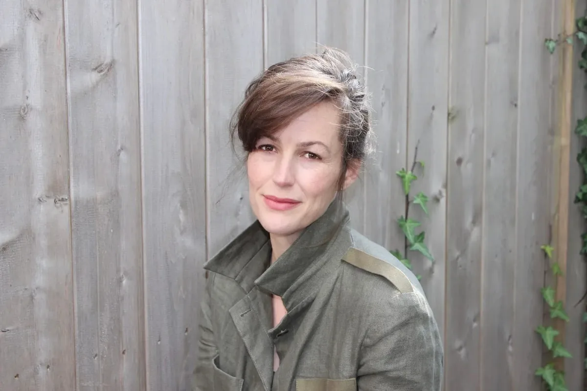
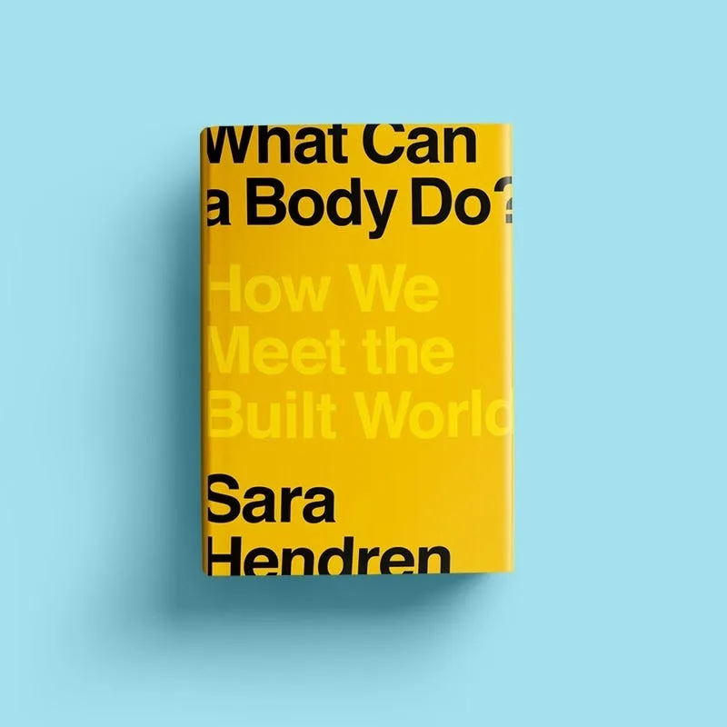
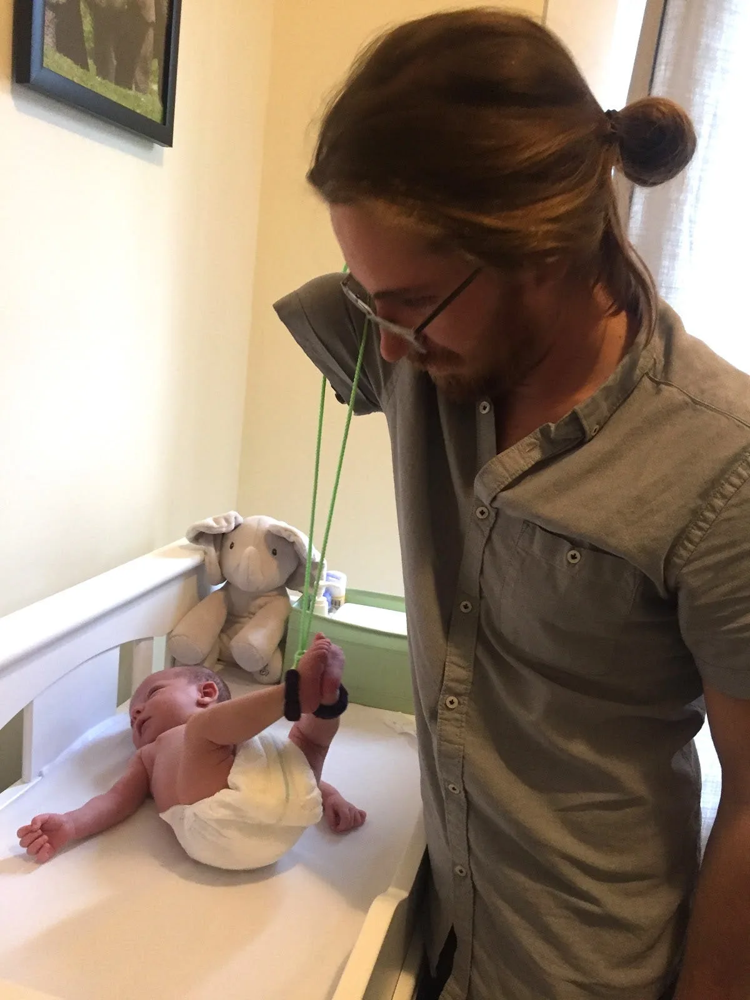
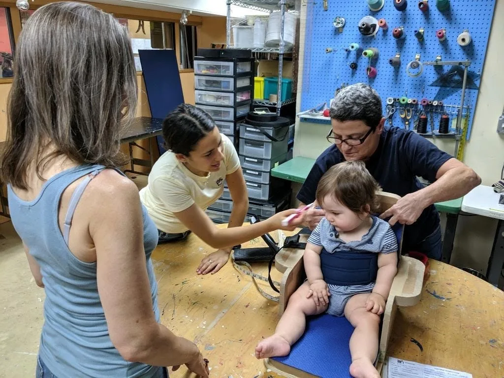
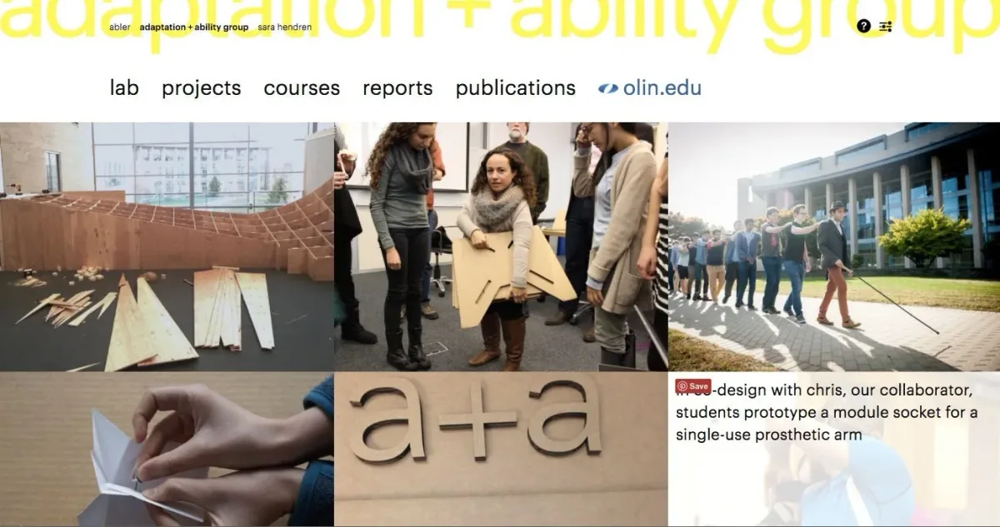

It’s hosted by Saber Khan, our Education Community Director, and is part of our_
[_Education Portal_](https://processingfoundation.org/education)_, a collection
of free education materials that can be used to teach our software in a variety
of classroom settings. Rather than endorse a specific curriculum, we’ve engaged
with a variety of educators from our community, ranging from K12 teachers, to
folks who lead workshops at hackerspaces, to university professors in
interdisciplinary departments. We’ve asked them to share their teaching
materials, which anyone can use._

createCanvas _features monthly interviews with these innovative educators, so
you can get to know their practices and what they bring to the classroom and
why. Check out the transcripts of past episodes_
[_here_](https://medium.com/processing-foundation/education/home)_._

[_This episode can be found on SoundCloud here_](https://soundcloud.com/processingfoundation/s02e03-createcanvas-sara-hendren)_.
Below is the transcript (lightly edited for clarity)._

_Sara Hendren is an artist, design researcher, and writer who teaches design for
disability at Olin College of Engineering. Her work has been exhibited widely
and is held in the permanent collections of MoMA and the Cooper Hewitt museum.
Her writing and design work have been featured in *The New York Times* and Fast
Company and on NPR. Hendren has been a fellow at the New America and Carey
Institute for Global Good. She lives in Cambridge, Massachusetts, with her
husband and children. Her new book is
[*What Can a Body Do? How We Meet the Built World*](https://www.penguinrandomhouse.com/books/561049/what-can-a-body-do-by-sara-hendren/)_.**

**Saber Khan**: Hi everyone! \[_intro is same as above_\]

Today I’m here with [Sara Hendren](https://sarahendren.com/about/). She’s an
artist, design researcher, writer, professor at Olin College of Engineering.
She’s the author of
[_What Can a Body Do? How We Meet the Built World_](https://www.penguinrandomhouse.com/books/561049/what-can-a-body-do-by-sara-hendren/),
published by Penguin Random House on August 18, 2020. Sara, thanks for joining
us.

**Sara Hendren**: Thanks for having me. It’s good to be here.

**SK**: One thing I wanted to start with you is part of this work that you’re
doing involves thinking about design differently and responding to different
needs. I wonder if you could talk about why we often focus on certain areas and
perhaps not other areas? Is there a way to make sure we’re looking at design and
innovation broadly, so it isn’t just focused on people who are at the center of
the built world?

**SH**: There are a couple ways to think about that. One is that a lot of times,
perhaps, because people think in terms of mass manufacturing, they think, “Well,
the only things that matter are the things that will matter at a numerical
scale.” And so then maybe they turn their attention on the middling mainstream
and think of that place as a place to make, quote, unquote, “impact.” In the
history of design,
[human-centered design](https://en.wikipedia.org/wiki/Human-centered_design#:~:text=Human%2Dcentered%20design%20%28HCD%29,of%20the%20problem%2Dsolving%20process.),
of course, there has actually been a whole tradition of looking, not at the
middling mainstream, but actually looking at the so-called margins of
experience, precisely because there’s often insight in the margins that tells us
something deep about being human that often is to the benefit of many people.

So, in that tradition specifically, in my research area, in disability, often
people think of this as a
[universal design](http://universaldesign.ie/What-is-Universal-Design/). To tell
a couple of the famous stories in this that people may or may not know, the
[OXO Good Grips](https://www.google.com/search?q=oxo+good+grips&source=lnms&tbm=isch&sa=X&ved=2ahUKEwiLoMKQv6PtAhWmpFkKHaMvB90Q_AUoAnoECBMQBA&biw=852&bih=1016),
those kitchen tools that have that chunky rubber handle on your vegetable
peeler, perhaps, or your can opener, that ergonomic handle — and it’s really
quite elegantly done, the way the grip and squeeze of that, and there are these
little fins etched on the side that tell you right where to put your thumb and
where to press down — and those were actually designed from an insight gained
from the condition of arthritis.

[Betsey Farber](https://www.oxo.com/blog/behind-the-scenes/behind-design-oxos-iconic-good-grips-handles/),
who was on vacation with her husband, Sam Farber, was in a rental house
somewhere in Europe, and was sort of complaining about the old-school vegetable
peelers, like, “Why can’t I use this? Shouldn’t there be a better mousetrap in
the form of this kitchen tool?” And
[Liz Jackson actually told the story in the _New York Times_ opinion section](https://www.nytimes.com/2018/05/30/opinion/disability-design-lifehacks.html) — it’s
great little vignette about how that happened — and
[Sam Farber](https://en.wikipedia.org/wiki/Sam_Farber), her husband was a
retired entrepreneur, and came out of retirement, and they worked together with
smart design to overhaul kitchen tools as we know them. So now, since those
three decades ago, or whenever it was, The Good Grips line has become a more
ergonomic kitchen tool that’s more comfortable, actually, for everyone. Most
people who use them, it’s been a sensation. And that’s a tool that does scale in
mass manufacturing, in that industrial sense. In other words, you can make its
parts efficiently in a factory, and therefore, they arrive at the big-box store
for under $10. And that’s the kind of thing that you want to work at that kind
of scale.

[Curb cuts](https://medium.com/@mosaicofminds/the-curb-cut-effect-how-making-public-spaces-accessible-to-people-with-disabilities-helps-everyone-d69f24c58785)
is another one in the built environment: the ramp that is now cut into the curb
at the corner where the sidewalk meets the street, and then back up again. Curb
cuts were won by legal mandate of the
[Americans with Disabilities Act of 1990](https://en.wikipedia.org/wiki/Americans_with_Disabilities_Act_of_1990),
not that long ago. People point to curb cuts as a universal design because it
was argued for in the interest of wheelchair users to have free passage to the
built environment. But of course, if you wheel luggage through the built
environment, if you push a stroller, or a big double stroller like I did for
years, through the built environment, if you are temporarily on crutches,
wheeling a bike through the city streets, you also participate in those politics
in a way that people think of as universalizing, right?

A lot of times people think that that’s the whole story of design and
disability, that it’s a universal design, and that’s the only place that we
should be looking, that only things matter where there’s insight in disability
that can affect all of us. But of course, the Americans with Disabilities Act
was an anti-discrimination law because it named the idea that not only is
discrimination based on not giving people chances, because they’re thought to be
less able, but also that the very built environment itself has discriminatory
features in it.

If you cannot get down the street, if you can’t get onto the sidewalk into the
building, you cannot be then in the public sphere, you cannot get to the
transportation, to your workplace, to the voting booth, right? So that’s really
interesting when you think about it, that discrimination may be _built_ _in_
then to the built environment.

_“In a series of vivid stories drawn from the lived experience of disability and
the ideas and innovations that have emerged from it — from cyborg arms, to
customizable cardboard chairs, to deaf architecture — Sara Hendren invites us to
rethink the things and settings we live with. What might assistance based on the
body’s stunning capacity for adaptation — rather than a rigid insistence on
“normalcy” — look like? Can we foster interdependent, not just independent,
living? How do we creatively engineer public spaces that allow us all to
navigate our common terrain? By rendering familiar objects and environments
newly strange and wondrous, *What Can a Body Do?* helps us imagine a future that
will better meet the extraordinary range of our collective needs and desires.”
—[Penguin Random House](https://www.penguinrandomhouse.com/books/561049/what-can-a-body-do-by-sara-hendren/)_

**SH**: So it’s not just, in other words, the responsibility of people working
in the logic of markets and industry in scaled manufacturing, it’s also meant to
be a legal guarantee. People who are designers can think in a civic way about,
“What is the right thing to do?” Well, if you want to build a democracy, you
need to make it work for everyone. Some of those things arrive to us in the form
of markets at the big-box store. Some of them are the work of laboratories and
classrooms, at engineering schools. Some of them are the work of urban planners
working at the behest of cities and municipalities. There are lots of roles for
design to take a look at the margins of experience, including the bodiedness of
our own lives, and to think about how to make the built world do a little bit
more flexing and bending and elasticizing its own structures to make it
friendlier for us.

I think a lot of people listening will have plenty of experience, turning their
own bodies into a pretzel to try to meet the built world, to try to make it work
in this chair on the bus, to try to sidle up to somebody and grab a scrap of
pole in the subway. We all turn ourselves into adaptive creatures in the built
environment. But history shows that the built environment can also move a little
toward us, too. Each of us, no matter our body, what we learn when we look at
these lessons in all their places is to say, okay, when and if my body
changes — and we know that it does, we know that bodies come with needs, right,
full stop — then what is the next right question that I’ll ask? Will I bring my
body to the world and adapt in this way?

I tell lots of stories of people who do that in the book. But also, can I ask
the built environment to move toward me? And what are the resources I would draw
on to do so?

**SK**: Sounds like there might be quite a bit of a journey to do, especially at
engineering school to think about this stuff. What’s it like for someone new to
these ideas entering your class?

**SH**: That is such a great question. Because, of course, people listening will
not be surprised to hear that engineers are really quite eager to dive into
what’s been known as rehabilitation engineering. That’s a World War Two
phenomenon of the realm of prosthetics and big government funds and
[DARPA research](https://en.wikipedia.org/wiki/DARPA) and so on, toward
prosthetic limbs. This is a real draw for engineers, they go into engineering,
because it’s not bench science, it is applied technology, it’s where technology
meets people. It’s not hard to get people interested in the idea of, for
instance, replacement parts in the form of prosthetic limbs, or in better
software for text-to-speech for blind readers of their email or something. My
students tend to come to me with that very eagerness.

But the role then for me is to actually do a very subtle thing, which is to say,
“Okay, young person, take all of that energy and that will to be on the helper
end, right, the helper end that provides the technology, take that, but dial
back a little bit to your own experience, and actually locate your own body in
your own experience in the receiving of help as well.” Right? For me, that’s
critical. In other words, to try to say to students what disabled people have
said for a long time, which is that all technology is assistive technology, that
is to say, “What is technology doing if not giving us help?”

It’s a redundancy to say, “Over here in rehab engineering, we’re going to make
this special kind of technology which is assistive in nature.” Right? As though
it’s for a special subset of people who are not fully human, that they are kind
of subset who actually need the help. No, no, take a look at your smartphone,
the utensils with which you ate your lunch, the glasses or the contacts that you
wear every day, the orthotic shoe on one side that’s helping you with a more
comfortable gait — and call that all technology, find yourself in that big plane
of existence, which is just an extended body with stuff that has needs.

That, to me, is a very productive place to start building stuff together,
because it means that my students don’t get that kind of heroic tech savior
complex, that, “Oh, I’m on the bestowing end of this thing that’s going to
rescue this poor person’s body.” Right? We dial way back from that and say, “No,
this is the most fascinating human experience possible.” What is the great
humanist refrain? In the humanities where I come from, one of the great humanist
refrains is, “Nothing human is alien to me.” In other words, the insight is to
say, “Any human experience I can find some recognition in, I can do the
perceptive work to see myself in it, to see my connection to it.” Okay, now
we’re getting to some good questions.

When Amanda, who is a little person who has a form of
[dwarfism](https://en.wikipedia.org/wiki/Dwarfism), came to my classroom asking
for a lectern at her scale, you can imagine how the lecterns of the world are
not to her scale. Or when my friend Alice Shepard came to my classroom, a
wheelchair dancer who wanted a ramp, not for getting into a building, but a ramp
for stage, that’s just rearranging all our categories at once, right? What is
the engineering, and who is the engineer, and who’s getting and receiving the
help, and what is the kind of help that’s being asked for? To me, there’s
nothing better than that encounter in the classroom. But it’s not a kind of
bleeding heart, engineers-to-save-lives kind of deal.

_“Chris was born with one arm, and for him, a “universal” prosthesis hasn’t been
useful. But he did rig up this clever tool for changing his baby’s diaper.
Chris’s tool is one instance in a \*vast\* fascinating history of prosthetics.”
—from [Sara’s Twitter](https://twitter.com/ablerism/status/1295733057228623872)_

**SK**: Yeah, there’s a part of being human and humble there. I wondered, it
also must impact their identity, some folks find it easy to sort of connect
through their own feelings of marginalization, or having to bend, and \[there
are\] folks just haven’t practiced that muscle. I wonder if, even if they have
been marginalized, they just have not had the language to think about it, or put
it to words. Do you do things there in those moments to help them find
themselves? I’m sure, often when they meet a disabled person, the differences
have become very clear and stark. How do they draw connections back in?

**SH**: Yeah, one of the best things that I’ve done in the classroom, which was
the idea of [Alex Truesdell](https://www.macfound.org/fellows/948/), who’s the
now-retired head of the
[Adaptive Design Association](https://www.adaptivedesign.org/) in New York City,
which is a storefront in Manhattan and appears in the “Chair” chapter in my
book. So the Adaptive Design Association builds radically bespoke customized
furniture, mostly out of triple-wall cardboard, and other low-tech tools and
materials, for kids with disabilities all over New York City. And it’s a
fascinating, absolutely ingenious practice. We can talk more about that if you’d
like to, but Alex came to my classroom and introduced my students to triple-wall
cardboard, to its incredibly robust qualities, to reframing their idea of what
high tech and low tech really is. But the thing that she launched in my
classroom that then I repeated several times after, was to actually have the
students go back to their dorm rooms or their workspaces, and think, “What’s a
fitting, what’s an adaptation that I can build out of cardboard, or some
similarly modest material, that actually would bridge a misfit between my own
body and the world?”

So people who don’t think of themselves as disabled — of course, I have students
with disabilities and accommodations of various kinds, but a lot of them are
invisible disabilities — but I had students who, for instance, were quite a bit
shorter than average, they were not little people or have dwarfism, but they
were quite a bit shorter than the average desk, for instance, is scaled for. So
I had a student who built for the exercise ball that she would sit on, instead
of a regular chair, and she built a cardboard stand that raised it up even more.
Now she was able to meet the scale of the desk at a more comfortable stature.
Could she have made it through the year without it? She could. But that moment,
right, where she went and built something for herself was the moment for her to
turn her attention to her own body and to the universality of misfitting.

And so that puts her in a much better frame of mind to then turn her attention
to somebody else, for instance, Amanda, or that same student, Grace was her
name, who built the exercise ball stand, went on to work with a man named Chris
with one arm on an extension for rock climbing. But she had a much better sense
that she was involved in these human stakes too. And that’s the moment where
discovery can really happen, where we see our own lives and those connections,
and then we see the strangeness, perhaps of disability, as a little bit less
strange. And as both as an urgent matter, politically, but also a creative
matter to say, “Whoa, here’s this person doing…” All of us are doing this
incredible adapting to the world all the time. Where can we watch it happen? And
slow down the tape and say, “What’s the role for the tool or the technique and
where it might find its good life?”

**SK**: Yeah, I think about that — I’m from Bangladesh — and I think about the
innovation that people at the margins have to practice to get by, and how we
often don’t pay attention to those things. Does suffering sort of become a
virtue in some places? And do you think about that it as a design thing of, I’m
trying to phrase this correctly, but often people are very innovative when
they’re dealing with oppression, basically something that really just — they’re
sort of gracefully, and intellectually, and physically overcoming it, but in
reality it’s still a problem. And in one sense, design might fix that moment.
But ultimately, as you alluded to, with the ADA, it’s a political thing. Is
there a part where your students are ready for that jump, or is that part of
your classes in thinking about them?

**SH**: Yeah. Well, you’ve said so much there. I mean, one is we look, for
instance, at the [Jaipur Foot](https://www.jaipurfoot.org/), that’s a phenomenon
of multiple cities in India originated in Jaipur, and the Jaipur Foot for people
who don’t know, is a lower-limb prosthesis that’s made in a super elegant way
out of high-performance plastics and made for about $50 per limb, but
distributed for free. I do try to show students the socio- and political context
into which the Jaipur Foot enters, and how many folks from rich Western
countries don’t think of that as technological innovation. They might think of
that as kind of good enough or appropriate technology for a condition where
poverty is more widespread, but my invitation there is to say, “Let’s look at
all those categories, right? And what are all the conditions that give rise to
this incredible technology?”

So that is one way of trying to think about our hierarchies of high and low
tech, and all the messed up ways that we, in rich Western-context privilege, a
certain kind of innovation that’s born of labs and professional expertise. So
that has to do with economies and class and so on, we can get into more of that
if you’d like to.

But the other thing that you’re naming is something that in disability studies
is called “super-cripping,” which is to say, there’s a fairly rigid set of
stories to which non-disabled people would like disability to conform in order
to be acceptable. In other words, the overcomer story that you hinted at, where
we would like to have a nice ending to a story, even if it’s by technology, or
some other insight, where people say, “I am no longer defined by my disability,
I have overcome it by, let’s say, athletic prowess at the Paralympics.” Right?
Or by being, in the case of Down syndrome, a lot of people want to say, “Oh,
well, this person is an enlightened being and happier than the rest of us, and
therefore exists to teach the rest of us.”

All of that’s a really — that’s a deflection from letting people be actually
fully human, right? All of that is a way for non-disabled people to say, “That’s
a separate experience over there. It is for me to be inspired by… It is for me
to be grateful for my life.” Right? It’s a way, still, of distancing ourselves
from the condition of disability. I often say that my classroom tries to be like
a critical theory seminar housed and smashed into a design build studio, right?
Which is hard to do. I mean, but that’s the work of kind of — science and
technology studies is often the seminar where you write the papers, and you’re
quite critical of the role of technology and the over-claims and the hype that
it makes for itself. But rarely do you see some of that critical discourse enter
into the rough and ready like, “Okay, what are we going to patch together and
make together? And can we make something that’s got those questions involved in
it?”

In the case of Amanda, we ended up building a lectern with her that was a
collapsible, portable lectern for short stature that she could take with her
when she traveled. And to me, that was a way of having an engineering challenge
that had very mechanical requirements of it. I mean, it was a very engineering-y
problem — “problem,” quote, unquote. But it had a question that didn’t end with
the result. In other words, anytime Amanda walks into the room and unfolds that
lectern, she is enacting a question in the technology, which is to say, that
doesn’t conform to that super-crip story, or that overcomer story, or that noble
suffering story. Instead, it says, I’m here with my gear at my scale, and every
time I use this, I point in neon with big arrows to the standardized dimensions
of the world, and I just let the audience live with that dissonance a little
bit.

I hope that what that does is try to point to the unfinished work of the ADA,
for example. I mean, the unemployment statistics, even in this country, with all
its riches and resources, the unemployment statistics for disabled people is
still really high, right? And so, I do want students and I want readers to live
with the unfinished dream and the very real limitations of designed anything. At
the end of the book I get into this. The end chapter is called “Clock,” not
because it’s about a physical clock, but it’s about design for slowness in time.
There is no substitute for politics that design or technology will touch.

I guess the challenge to all of us teachers is to say when and where technology
might do the reparative work, either through culture and symbols and the way
that those operate, or through very modest, very handy, garden-variety
problem-solving in the engineering way. But also to say, “What are the limits
that any built thing is going to bump up against?” Now we’re in the realm of
policy governance, economics, and more. It’s hard to get those things right. I
mean, where does this come up for you in the classroom?

**SK**: Oh, wow, I didn’t think you were going to ask me a question. I mean,
yeah, just the one image that I’m sticking with is, often you learn about
something at the assembly, and someone from that community is there, present,
and then everyone claps and wants to move on, but they’re still there packing up
all their stuff, and the difficulty of their reality is still there, doesn’t
have this very pat, like, “Yay, we won that battle,” and how to leave people
with that discomfort and that crisis, our failures for disabled people continue
daily.

**SH**: And my hope is, right, that again, some of those — that’s why it’s so
important to me not to have folks… I don’t want students to be animated by this
sense that the need is so urgent, they need to wake up every day and not forget
those disabled people. What I want for them is to say, “I find myself in a body
that has needs for assistance in all kinds of forums, and over my lifespan,
those needs will wax and wane and change in lots of ways. And I will be
connected in an ecology of care to young children or to my elder parents, or
whatever, but that I live in that world, too.” That’s where you say, so even if
that person is packing up their bags at the end, and where you’re saying there’s
real difficulties, you recognize it as human, right? And that you say, you live
on that same planet, and so then you do genuinely wake up and say, “I want a
world in which help and needfulness and assistance is not only natural, but can
be a dignified form of a life.” Right? That’s to me, where you get the real
sustainable change.

But also, the wonder, and I’m not sure, I think sometimes — there’s been a lot
of criticality about hackathon approaches to disability stuff, because it does
frame it in this kind of like, “Oh, well, if you just get enough energetic
people in the room for a concentrated amount of time, we can just whip this
thing out!” As though any misfit condition is reducible to a kind of mechanical
fix.

I do think one should be wary of some of the frames of those things. But the
wonder of a sustained engagement and building something together, especially
something that comes from someone’s wishes, as in Amanda’s case or Alice’s case,
in addition to their needs, I do think — that’s Sara’s kind of Operative Theory
of Change. That when our wonder is activated, and when our sense of connection
is activated, you don’t have to think of this, “Oh, those poor people out there,
let me go and sustain my energy to save them.” No, if it comes from you, from
that real place of finding your own body in that same interaction, then you
don’t have to fake it, you know it, because you know it in your bones.

**SK**: Yeah, I can definitely see that as such a wonderful way to both always
know what to do, because I think we have a sense of when people are being
treated like a human and when you’re being treated like a human, and I think
that barometer is very trustworthy, so I think it helps in this process.

And reflecting back to your own life, I mean, I’m thinking about, when are
moments where I’ve felt most disabled. They’re often probably moments I’ve felt
most humiliated or most angry at the world, and also it makes it the hardest to
talk about because I saw myself reduced to something that I think I’m above or
beyond.

I have two little kids and everyone says their life is so great, but them not
being able to talk and seeing a world of talking around them, as I know, is very
difficult and painful for them. And not to just infantilize them. We have
another layer of assistive technology with voice and a lot more things coming
on. What’s your sense of the role that’s playing in both how we feel more able
than how we relate to disabled people?

**SH**: Yeah, and let me just, if I can just pick up on that one thread that you
were talking about, about experiences in your own life. I do think that there
are people who — there’s some really revealing evidence, right, of when we say,
“Oh, that’s when I felt the most shame.” That internalized sense that the
moments where we needed help and assistance were associated with shame: that’s a
really revealing moment of understanding how culture has shaped our ideas about
ability and disability.

I guess I’m just thinking about members of my own extended family who would
rather not visit the museum, than visit the museum with the use of a wheelchair,
right? Even they were semi-ambulatory, but they were not able to walk or stand
for long periods, but instead of going and using a wheelchair, and the
association was shame and stigma, they would rather sit that out. And these are
people who are related to me! I’ve been working in disability design for — and
with my son with Down syndrome, it’s so interesting.

Or you see the resistance among older adults to take up hearing aids, for
example, whereas glasses are utterly thought of as a very normal extension of
assistive technology. Hearing aids carry this kind of stigma of needfulness
about them that people resist, because they knock out our sense of being
independent in a narrowly defined way, right? That our independence hinges on
doing things for ourselves by ourselves, rather than saying that a more
capacious, broadly encompassing notion of independence could include help in it;
that our self determination and our agency could also include the forms of
assistance, medical assistance, technological assistance, personal assistants,
and otherwise.

I’m glad that you admitted that there was a kind of shame register to that,
because I think a lot of people don’t talk about that, right? And that where, as
much as they want to say, “Oh, yes, disability is natural and normal and a part
of human diversity,” it still carries with it those markers.

So can you just say again, then the segue to assistive technology once more?

**SK**: Yeah, and thank you for that. And also not to keep adding, but I think a
lot of the discourse on toxic masculinity hovers around that same place of being
unwilling to sort of unearth that shame and fear, just so they can be healthier
and put on a mask or whatever is needed to not…

**SH**: That’s right.

**SK**: …to face these calamities.

**SH**: That’s right. And just that, I mean, because I think it’s so interesting
to talk about, feminist philosophers have given us this idea of the “derivative
dependence” that comes to any parent, right? So we talked about our children as
dependents with a “ts” at the end. But I think too little, we really realize
how… the kind of political change that happens when you become a parent, is… the
derivative dependence, that accrues to you, right. You are now dependent on the
state or some other community environment for the child care that you’re going
to need in order to perform your job, you now have to materially keep alive
these human beings, and you can’t do it alone. I mean, fundamentally, you can’t.

And when your child is sick, you cannot go to work, the state dependence that
that brings to you and I think — yeah, a lot of that masculinity is kind of the
polarity opposite end of that, of this kind of repulsion about dependence of any
kind. If we could reframe dependence and assistance as a natural part of our
lives, I think we’d be a lot better off.

_The team at the Adaptive Design Association working with Niko to get the
dimensions and features of his cardboard chair just right._

**SK**: There is a certain level of quote, unquote, “assistive technology” that
has found its way very deeply into our lives and even more with ubiquitous
internet access. Where do you see that playing out? And is that doing the
universal thing that you talked about, universal design thing, where it’s great
for everyone? Must be much more complicated.

**SH**: I mean, it is complicated, but it’s fun to note it. I think a lot of
people don’t realize that
[closed captioning](https://en.wikipedia.org/wiki/Closed_captioning), for
instance, came to us by the long legal fight of deaf watchers of television, who
said they wanted closed captioning, not to be an extra little box that you would
plug into your TV, but built into every stock manufacture of all TVs themselves.
And there was a lot of pushback from the industry who said it’s going to be too
expensive. But at scale, it’s like infinitesimal, it’s impossible to calculate.
And I think people forget how useful captions have become, and how much we’ve
come to rely on them. Even on a social media feed, they become a kind of pull
that grabs you on a autoplay video, for instance, but that you can also watch
that autoplay video on silent if your kids are in the next room trying to get to
sleep, or if you’re in a public place and don’t want to disturb others with the
sound, or you’re watching the game across the restaurant and so on. Closed
captioning is one kind of electronic technology that people forget is disability
tech that has arrived in the mainstream.

But yeah, I mean, it’s impossible to put a value on some of the out-of-the-box
accessibility features of the iPhone — much as I hate to sort of glorify Apple,
they don’t need it from me — but it is quite remarkable among my disabled
friends to see the way that speech-to-text has come along, for instance. Like my
father uses speech-to-text exclusively, he is a seeing person, but just the
sheer typing for him, which has just never been natural, and never part of his
work, is almost impossible. He’s using speech-to-text all the time, and I know
an increasing number of people who do so.

I think when the iPad came out, people forget this, but the iPad, in the tech
community kind of got poo-pooed for being this kind of passive technology, the
touchscreen interface. People sort of said about it, in a certain stratum of the
tech community, people said, “Oh, well, this is for magazine readers who are
going to consume content only, and they’ll never really make content.” At the
time, nobody was critical enough about, like, well, there’s nothing natural
about a mouse and a cursor. Think about how abstract that is, the idea of moving
a mouse off to the side that then corresponds to the 2D flat-screen environment
and the button and everything that it’s meant to do.

I have in the book a story about a man with ALS
\[[Amyotrophic lateral sclerosis](https://en.wikipedia.org/wiki/Amyotrophic_lateral_sclerosis)\]
who designed a whole residence for himself and other people with ALS and MS
\[[Multiple sclerosis](https://en.wikipedia.org/wiki/Multiple_sclerosis)\]. And
I’m telling you, an iPad with a touchscreen interface that you can manipulate
with your fingers, but also with a soft-ended stick that you hold in your mouth,
I mean, I would call that nothing short of liberatory technology, Saber. And I
am not a tech hype kind of person. But that is _remarkable_. The touchscreen
interface, the immediacy of it. To say nothing of its use for kids on the autism
spectrum, my own son with Down syndrome. The logic, right, the logic of the
touchscreen: I touch this thing, I drag it here. All of that incredible
sophistication has done a huge amount for us in the digital space. And it’s
impossible to overstate it.

Maybe you’re hearing a kind of in between disposition that I have, right,
because I am critical of the kind of tech savior-ism, and the idea that tech
will somehow solve what are actually political challenges. And yet, nonetheless,
the market does deliver some things that build bridges between bodies and worlds
that have been absolutely revelatory. So I find myself trying to seek evermore
specific and disciplined languages to keep characterizing when and where and how
and for whom, and at what scale, and high tech or low tech, and for what wishes,
and so on? I want all of us to have a rich vocabulary for this stuff.

**SK**: Yeah. I was just going to say in the absence of movement on the
disability front, but really, the ADA is the exception.

**SH**: Yeah.

**SK**: It’s always been a lack of action on the disability front. And the ADA’s
a very remarkable thing that happened, and it took a generation of folks to
enforce it.

**SH**: Yeah. It’s also a law that arrives in a culture deeply organized around
individualism too, Saber. I mean, we have to say that, right, it is really
important that with curb cuts, the slope is calculated for a curb cut that
presumes a wheelchair user _on their own_, right, not being pushed in the built
environment. So it needs to be traversable in a reasonable way by someone either
pushing wheels or using a motorized wheelchair, but you have to presume the
absence of a person who would help.

And so, good, right? Rightly so. But that peak individualism is also why elder
care in our country is really in a still sorry state overall. Whereas in other
parts of the world, it would be unthinkable that older adults would be
warehoused and kind of managed in the older parts of their lives, that they
wouldn’t be part of an ecology of care, in a context where individualism is not
the reigning paradigm of how people live their lives. In other words, other
cultures presume that the family structure and indeed the extended family
structure is the normative way in which we live our lives. And that, of course,
comes with compromises too, about who the caregiving falls to, and the
obligation that arises. I mean, it’s deeply complicated.

Atul Gawande opens his book,
[_Being Mortal_](http://atulgawande.com/book/being-mortal/), with a really
fascinating discussion of this very thing, of being the son of immigrants from
India, with extended families still in India, who thought very deeply about his
grandfather who lived to be, I want to say 110, I mean, really had a very long
life, and all of the decisions about care and family governance and so on that
happened in those complicated dynamics.

**SK**: Yeah, yeah. You can almost imagine in a society that sort of accepts
individualism to its max and capitalism to its max, you also need this sort of
assistive technology, because you’re left on your own devices.

**SH**: That’s right. But you need legal guarantees, and also, it leaves aside
the question of poking at that individualism itself, right? At the presumptions
of it, and the trade-offs of it. Without romanticizing, either, it’s just really
interesting. It’s political philosophy at its core: what is the node of a
person? And where does that person start and stop? And what do we owe each
other? And in which material goods, and so on? It’s really interesting.

**SK**: Yeah, but I’m glad you noted the idea that families are superior, that
there is an oppression and inequality within a family. I’m sure everyone knows
that, but I think it’s worth pointing out that a lot of people choose
individualism because families are a source of oppression or marginalization for
them.

**SH**: That’s exactly right. And that’s what Gawande really grapples with, his
parents were determined to leave that culture, and yet they understood the
virtues of the family structure that they came from. So it’s very much a, “Let’s
be as specific as possible, right, without making an ‘other’ out of each other.”

**SK**: We’ve covered so much ground and so much big-picture stuff, I’m
wondering — and our audience is a motley crew of educators doing all kinds of
things — I wonder if there’s something you want to encourage them or offer them
to do or try in their classroom that helps along this way. And it’s something
we’d like to feature on our website. So if we could talk about it before they
look at it.

**SH**: Yeah, I mean, I think one of the things you could do with almost any age
of a child, and I’ve presented this subject to my own kids’ classrooms, as young
as fifth grade, is to help kids think about not just assistance, but
adaptations. So if you want to launch, for instance, a STEM exploration of
design and disability, you might help kids think about the difference between
purely assistance and adaptation. And by that, I mean, it’s a really simple way
to help kids understand that if they’re going to work with somebody, for
instance, in their classroom who is disabled, they could think about the things
that that person is doing with their body as deeply adaptive _already_.

Everything that that person is doing with their gear is adaptive. It’s not just
that this person needs special help, and so we’re going to come along and do
more special helping with them. It’s that they’re already doing the work that
_you_ _also_ are doing, young person, which is adapting every single day. We
know this from the science: it is the quality of our entire lives to be deeply
plastic and adaptive in any of our environments.

If you can help students shift their thinking to adaptive technology, not as a
kind of making one word a bad word to say, but just pointing out to them the
difference between saying, “Oh, we’re going to build some _assistive_ technology
today,” and then saying, “Oh, no, we’re going to explore the big realm of
_adaptive_ technology. What’s the technology that’s adaptive for you, young
person? Okay, where might we come alongside someone else, and think about an
adaptive technology they might be wanting?” And aren’t we all going to look at
the end and say, “Where is our attention? Is it on the tech? No, no, it’s on the
_body_, it’s on the _person_, right? It’s on the miracle of that adaptation.”

If we see it as miraculous, then we see ourselves in it. Our wonder is engaged.
And then yes, the tool comes along, and might be very clever, it might be just
the right thing at the right time. But it’s never the protagonist; always,
always it’s _people_, it’s people at the center.

So I think there are ways to show students that stuff that doesn’t do the, “Gee
whiz, what a disruption and what an amazing feat of engineering,” but to say,
“Look at these people in their lives with their stuff intact. Let’s ask them
their name and what they like to do. And let’s focus on the dimensionality of
their lives, not just on the cleverness of their gear.”

**SK**: Yeah. And doing that at a young age can be so powerful —

**SH**: Yeah!

**SK**: — such an exciting and healthy way to look at the world and to guide
your learning.

_“The [Adaptation + Ability Group](http://aplusa.org/) is a technical and social
lab for creative engineering and design on the subjects of disability. \[Sara\]
directs the lab, but it runs on an occasional and as-needed basis, with student
teams and outside collaborators as opportunities arise. Our projects have
included: a
[ramp for wheelchair dancing](http://aplusa.org/projects/ramp-alice-sheppard/),
a
[lectern for short stature](http://aplusa.org/projects/alterpodium-amanda-cachia/),
a sonic
[white-cane instrument](http://aplusa.org/projects/acoustic-mobility-device-carmen-papalia/),
and more.” —from
[Sara’s website](https://sarahendren.com/projects-lab/adaptation-plus-ability-group/)_

**SH**: Yeah. And there’s a wonderful film on adaptive design, on
[adaptivedesign.org](https://www.adaptivedesign.org/), that’s the storefront
that I mentioned to you that makes the cardboard furniture. There’s a wonderful
short film that will be great for a lot of different ages, and it does this work
in lots of ways by showing a protagonist working together to adapt her gear. And
I think that would be a great prompt for folks if they’re looking… to start, to
kick off a module, that’s a great one.

**SK**: COVID and social distancing has really wreaked havoc on a lot of things,
especially those guarantees of publicness, and being able to be in public, and
thinking about all the kids that have accommodations, that they’re not getting
them. I’m wondering if you want to share any of your experience on that side,
and also, how you’re thinking about moving ahead in this challenging world? How
do we keep the bodies of those other people that we don’t see much anymore in
our heads?

**SH**: Alice Wong, who just released an edited book of her own, called
[_Disability Visibility_](https://www.penguinrandomhouse.com/books/617802/disability-visibility-by-alice-wong/),
has said, and I think this is so right, that disabled people are actually way
out in front on this stuff with COVID. In other words, she calls disabled
people, like herself, modern-day oracles. She says, look, we’ve been asking for
a long time for things like telehealth, much more strong telehealth practices,
because as people who may be immunocompromised, or for whom getting out the door
for any little doctor visit is quite onerous, we’ve been asking for flexibility
on that for a long time.

Same thing with work-from-home options, right? That, up till now, has seemed
like, well, “gosh, we sure would love to, but we just can’t quite afford that
accommodation.” And look, oh, my goodness, it turns out, we can. It turns out
that the shifting shapes of the world are able to be made more malleable and
more mutable than we often think. So there’s a really interesting way in which
disabled people are, again, a resource out in front. If we ask them, what are
the other kinds of ways that you’ve done workarounds? We might learn quite a
lot.

I do think we’re seeing the innovative ways that people have had to figure out
new service designs for shopping, for instance, protected elders-only shopping
hours. I mean, that just seems like a good idea in deep winter to do anyway,
right?

If we’re just talking about making our structures — folks forget that services
are also designed, right? So that’s another realm of thinking. How do we
rearrange the constituent parts in a way that’s more human and humane? I mean,
one of local bookstores has, not just elders-only shopping hours, but vulnerable
community shopping hours. If you are somebody with a pre-existing condition,
you’ve got this protected couple of hours a week. I thought that was a beautiful
provision. It costs them nothing to do that, right? To take a couple of hours a
week and say, “We’re just going to make sure if you’re here, you got emphysema,
or some other kind of chronic low-lying condition that makes you vulnerable,
here’s a way to rearrange our services.”

People are seeing now that acute crisis is always a moment to say, “Oh, what are
the things that we thought were locked in place that were just locked in place
because of the sheer inertia of the way things have always been?” This is the
moment to say, “How do we pry open the seams and cracks of the world and see
what else can be shifted around?”

We’ll see. I mean, for my own son,
[Cambridge Public Schools](https://www.cpsd.us/) is doing a good job of trying
to prioritize kids with disabilities because of the incremental supports that
they need. It’ll be interesting to see how this school year goes. But I’m
cautiously optimistic at the moment and really grateful.

**SK**: Oh, that’s great to hear. Yeah, and thank you for reminding me that it’s
not… they’re missing from my life, that’s the important thing that often — yep,
lots of people have been social distancing for a very long time.

**SH**: That’s right.

**SK**: And now we’re finally taking their thoughts and concerns and their ideas
seriously.

**SH**: That’s right. It’s so often the case that we think, “let’s not forget,”
and we forget where native expertise resides. Yeah.

**SK**: Thank you so much. This was so helpful. I feel like what you’ve said
really gives folks a way to think about disability in a much more thoughtful,
personal, helpful way, that they can actually grapple with and do some work on.
I think that’s really to be appreciated. So thank you.

**SH**: I’m so glad. I mean, no one’s more inspired than I am by folks who love
and are capable with technology and that malleability of the built world. It is
my great joy to find partnerships. I know folks who are listening also like to
create those situations, so it’s great to be here. It’s inspiring.

**SK**: Thinking for myself, I know there’s a lot of learning and work to be
done. So over at Processing, we’re excited to learn and do that work.

**SH**: Yeah, thank you.

**SK**: Thank you for joining
[_createCanvas_](https://soundcloud.com/processingfoundation). Once again, I’m
your host, Saber Khan. _createCanvas_ is produced by Processing Foundation and
supported by the [Knight Foundation](https://knightfoundation.org/). Our editor
is Devin Curry, music by Lysha, \[available on\]
[lysha.bandcamp.com](https://lysha.bandcamp.com/). Special thanks to Processing
Foundation board and staff. You’ll be able to find many of the things discussed
here today in the show notes. And before you go, please visit
processingfoundation.org and check out the education portal for free and
accessible educational materials. Processing Foundation is on
[Twitter](https://twitter.com/processingOrg),
[Instagram](https://www.instagram.com/processingorg/), and
[Facebook](https://www.facebook.com/page.processing). You’ll find this and
future episodes on our Medium channel as well.
