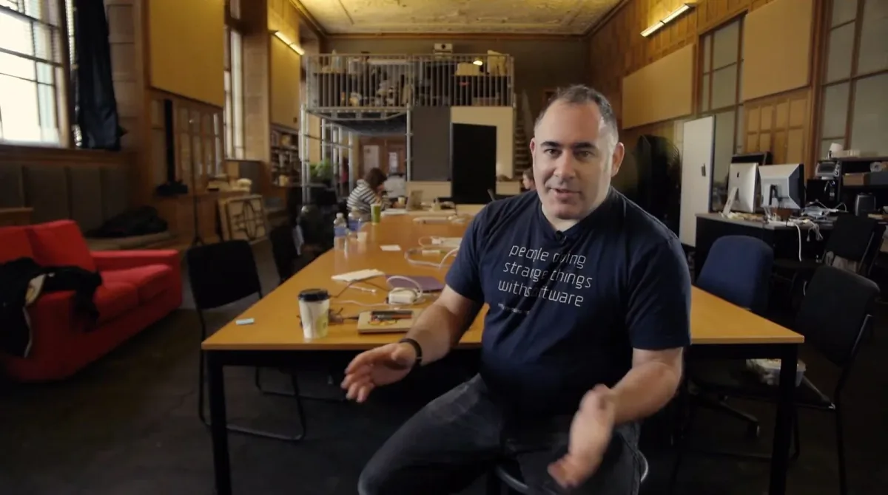
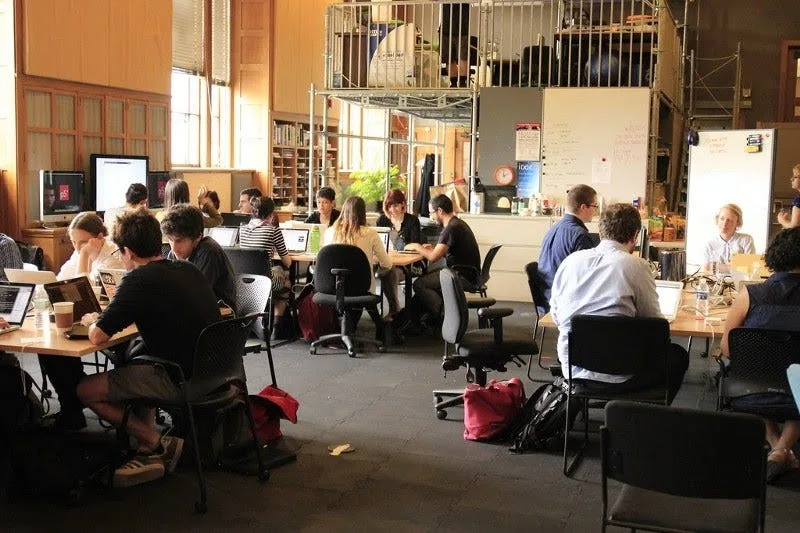
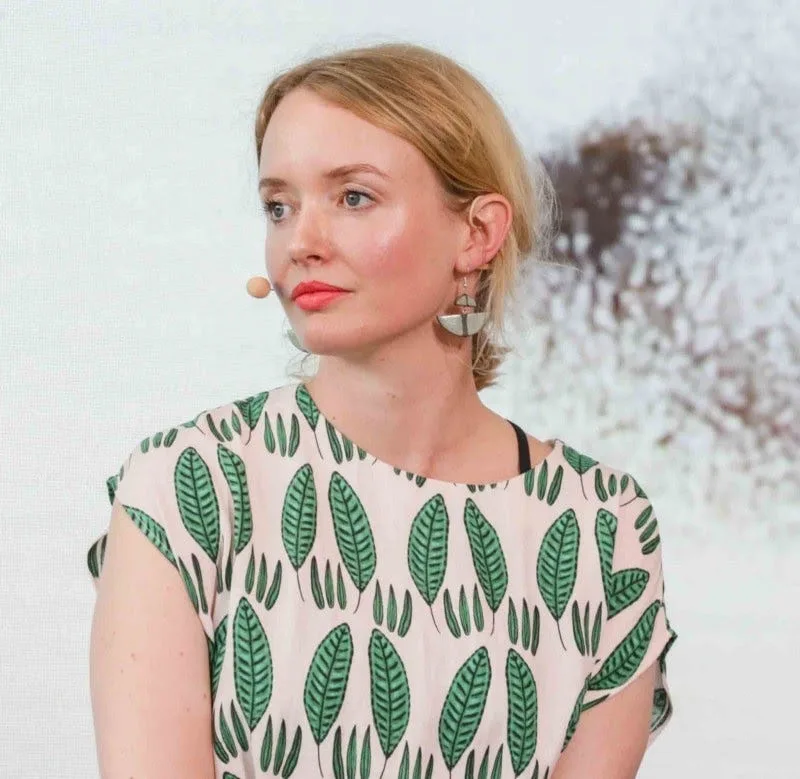
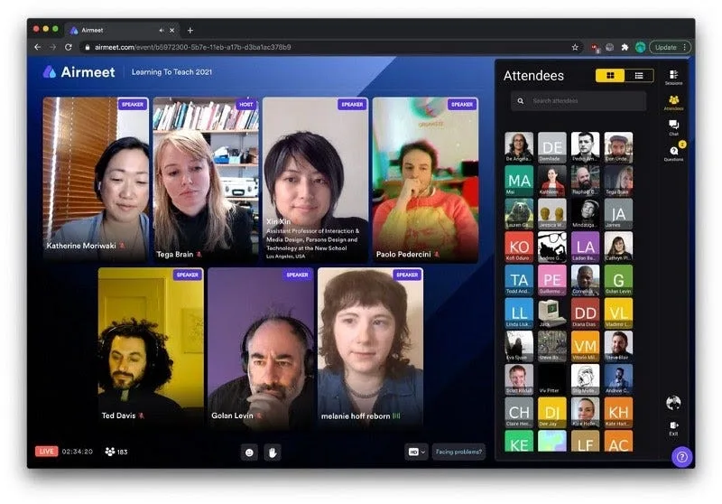
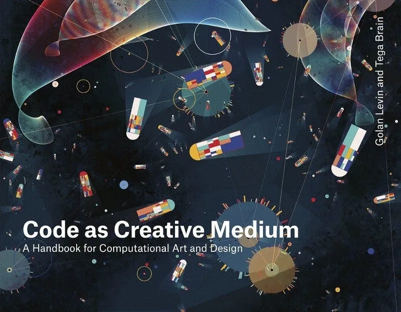
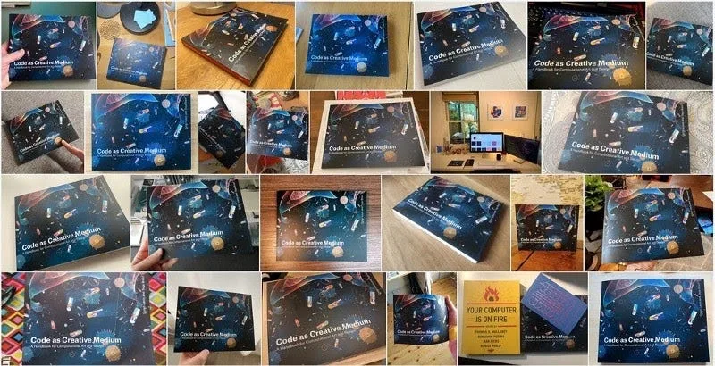
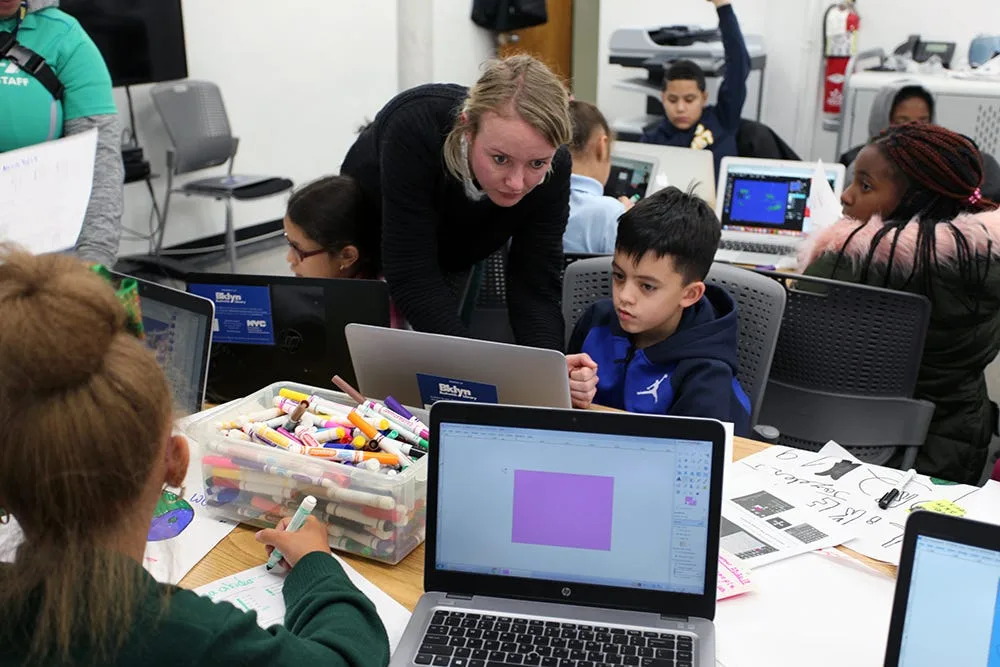

createCanvas *is Processing Foundation’s series of interviews with educators teaching at the intersection of art, science, and technology. Saber Khan, our Education Community Director, discusses what these teachers bring to the classroom and why.* createCanvas *is part of our* [*Education Portal*](https://processingfoundation.org/education)*, a collection of free education materials that can be used to teach our software in a variety of classroom settings.*

*In 2020,* [*createCanvas was a podcast*](https://soundcloud.com/processingfoundation)*. Check out the transcripts of past episodes* [*here*](https://medium.com/processing-foundation/education/home)*.*

---

**Saber Khan**: Hi everyone, welcome to createCanvas. Today I’m here with Tega Brain and Golan Levin to talk about their new book, [*Code as Creative Medium: A Handbook for Computational Art and Design*](https://www.penguinrandomhouse.com/books/669487/code-as-creative-medium-by-golan-levin-and-tega-brain/), which features a wide range of curriculum and exercises for teaching creative coding, among lots of other cool stuff.

To start, Golan, do you mind giving us a short intro of yourself?

*Golan Levin at the Frank-Ratchye STUDIO for Creative Inquiry at CMU, wearing a Processing shirt from 2010 that says “people doing strange things with software.”*

**Golan Levin**: Hi everyone, hi, Saber. Thank you so much for inviting us to do this. My name’s [Golan Levin](http://www.flong.com/), I’m a [Professor of Electronic and Computational New Media Art, at Carnegie Mellon University](http://www.art.cmu.edu/people/golan-levin/), in Pittsburgh. I teach across a variety of departments — my home appointment is in the School of Art, but I also teach in our departments of Design, Architecture, Computer Science, and Entertainment Technology. I direct something at Carnegie Mellon called the [Frank-Ratchye STUDIO for Creative Inquiry](https://studioforcreativeinquiry.org/), which is a research lab to support interdisciplinary arts research. I started making new media work around 1995, and my work has been mostly concerned with the nature of interactivity. I’ve also touched on generative art, software art, net art, information visualization or data art, and audio visual arts.

I was privileged to go to grad school with Casey \[Reas\] and Ben \[Fry\]. I’ve been teaching as an educator with Processing and Processing-like tools since the very beginning. I think I taught my first course with Processing in 2000. I still teach with those tools today, and through the STUDIO for Creative Inquiry at Carnegie Mellon, I’ve been supporting [open-source software tools for the arts](https://github.com/CreativeInquiry/OSSTA-Report) in a [variety of ways](https://studioforcreativeinquiry.org/project/spring-2021-ossta-residencies), using whatever means I can.

*The 2015 p5.js Contributor’s Conference at the [Frank-Ratchye STUDIO for Creative Inquiry](https://studioforcreativeinquiry.org/). Tega is on the right side of the image.*

**SK**: The [p5.js Contributor’s Conference](https://processingfoundation.org/advocacy/p5-js-contributors-conference-2019) was hosted there a few times (in [2015](https://processingfoundation.org/advocacy/p5-js-contributors-conference-2015) and [2019](https://processingfoundation.org/advocacy/p5-js-contributors-conference-2019)). Do you mind talking about your more direct connections with Processing and p5?

**GL**: I’ve been teaching with them for some time, and since I have direct experience with them I know many of the principal people involved. I’m also in some ways a bridge between the [openFrameworks](https://openframeworks.cc/) community and the Processing community.

The STUDIO for Creative Inquiry at Carnegie Mellon is a laboratory that provides resources to our faculty, staff, visitors, and students, many of whom, but not all, work with electronic media. Through the STUDIO, I have supported development sprints, contributor conferences, other kinds of conversations around and fundraising for open-source software tools for the arts, of which Processing, and the Processing family of tools, is a really important exponent.

**SK**: Thanks for explaining that for folks who might not be clear on the larger role you play. Tega, I would love to get a similar type of intro about what you do, your art practice, and your more direct connections with the community.

*Tega Brain.*

**Tega Brain**: I am [Tega Brain](http://tegabrain.com/), and I am an artist and an educator. I teach at New York University (NYU) in a program called the [Integrated Digital Media Program](https://engineering.nyu.edu/academics/programs/integrated-design-media-ms). I teach a lot of computational arts, using p5.js and Processing. Like so many of us in the community, I come from an interdisciplinary space. I originally trained as an engineer, and I was lucky enough to be taking a few courses in a Master’s program in Australia, about 12 or so years ago, and stumbled into a Processing class.

It was really this moment when I realized that this technical education that I’d had could be applied to expressive and creative practices. It was a world-altering experience, and super exciting because my education up until then had used technology in a very utilitarian, industry-focused orientation. I began teaching with these tools, and have been doing this over the past decade. I use them in my own art practice, which deals with questions of the politics of technology. It very much responds to the culture of engineering and practices in engineering. I’m often playing around with building prototype infrastructures that embody different sets of values. I have a practice that often exists online: working on the internet as an art form, examining issues of data-driven systems, how we experience massive data sets, what it means to see the world through those sorts of knowledge practices.

In terms of Processing and p5 work, I had also worked with the Processing Foundation, through a Fellowship in 2016. That came out of having attended the [first p5.js Contributor’s Conference at the STUDIO for Creative Inquiry in 2015](https://processingfoundation.org/advocacy/p5-js-contributors-conference-2015), where I was working with the education team, developing tutorials, and thinking about how we could make resources for students and educators.

The other thing worth noting is, for the last five years, I’ve run a conference called [Learning to Teach](https://processingfoundation.org/advocacy/learning-to-teach-teaching-to-learn) that’s affiliated with the Processing Foundation. It is a once or twice a year event, where we invite educators to share their experiences and what they’re doing in their classrooms. It’s a place to exchange syllabi and resources and ideas around how to teach technology and the arts in the same classroom, in the same curriculum.

*From the [Learning to Teach conference](https://processingfoundation.org/advocacy/learning-to-teach-teaching-to-learn), a once or twice-yearly event that began in 2016. It was held online in 2021.*

**SK**: You two have a new book out that you co-wrote, called [*Code as Creative Medium: A Handbook for Computational Art and Design*](https://www.penguinrandomhouse.com/books/669487/code-as-creative-medium-by-golan-levin-and-tega-brain/).

**TB**: For a quick summary of the book: it’s got four main sections, and consists of 23 curriculum modules in the form of assignments. It has a section of [exercises, which are available on GitHub here.](https://github.com/CodeAsCreativeMedium/exercises) They are short homework-style exercises dealing with technical topics such as using arrays, or color, or machine-learning, or dealing with text. We have a section of interviews, where we talk to about a dozen different educators and leaders in our field. There’s also a provenance section, which looks at some of the history of these assignments and these practices.

*[*Code as Creative Medium: A Handbook for Computational Art and Design*](https://www.penguinrandomhouse.com/books/669487/code-as-creative-medium-by-golan-levin-and-tega-brain/). Cover image: Manolo Gamboa Naon, created using Processing.*

**SK**: Can you tell us what brought the book about?

**GL**: Back in 2013, Tega and I connected with the Code Ed Summit at [Eyeo Festival](http://eyeofestival.com/). We were thinking about teaching creative coding that fall and asking each other about the assignments we wanted to teach. We realized that we had included many of the same ones, and that there was an unwritten curriculum, or an uncanonized canon, if you will, of creative-coding assignments that were understood to be classic, but that had not been distilled in a way that we sensed our peers would find helpful.

**SK**: What does that distilling look like, of taking different versions of the same assignment, and making decisions as to what details are worth keeping? I’d love to hear more about the compilation of the book.

**TB**: The assignments section of the book consists of 23 syllabus modules, which have the project brief, some learning objectives, and a “making-it-meaningful” section, which discusses the conceptual questions and explorations in the assignment. There are ways to extend the assignment for beginners or more advanced students in different contexts. And each assignment is accompanied by a group of what we call “aspirational artwork,” which are examples.

For the examples, we took the assignment brief and looked at our field and said, “So many of our peers have done this assignment in their practices. What are the different approaches that have produced work around this particular brief?” That was the bulk of our research project, collating that work. We chose examples that weren’t maybe the most famous or renowned projects. We wanted examples with pedagogical value, how they demonstrated to students different approaches and different takes on the brief.

**SK**: The third part of the book contains interviews with members of the community. Do you want to talk about the context for including that, and how all three parts combined together to make the book?

**TB**: We wanted to try to capture people’s lived experiences, and their techniques and strategies, what they were doing to actually teach in this interdisciplinary way. We had the bright idea: Why don’t we start interviewing a few people who we really admire for their teaching practice?

**GL**: It’s a funny section of the book. It’s not a bunch of assignments, but a bunch of human voices. I think it humanizes the book in a way that makes it less a set of index cards, and more of a cultural moment.

**TB**: The reader we were thinking about when we were writing this project is someone who’s just finished their MFA \[Master of Fine Arts\]. They may be one or two years out, and NYU, or some fancy school, calls them up, and says, “Would you like to teach our Creative Coding class? It starts in two weeks.” This is a very common situation for adjunct professors. We thought, “How could we make the most useful resource for that person?”

The institutions we work for don’t provide that much support on how to teach these topics. We wanted to create something that would be useful, and also speak to the fact that everybody has challenges, or similar stories, about what works and what doesn’t. What happens on your worst day — how do you deal with that?

**GL**: From the very get-go we knew we wanted to create a book for the educator. Most textbooks are made for the students; for example, we know that there are a bunch of great books that teach people about for-loops and if statements. Our book came from our own feelings of seeing educators who, on August 15th, days before the semester starts, are saying, “Does anyone have any examples of such and such a project?”

Also, we found ourselves saying, “That old curriculum by my friend — the site no longer exists. It’s [404](https://en.wikipedia.org/wiki/HTTP_404), its website is broken. The courseware is no longer working.” The continual collapsing of these educational resources, as servers would go down or paywalls would go up.

What was infuriating to me was how fragile everything seemed. There’d be really great example projects that I would want to share with students, and I go to look for it, and it’s gone. It doesn’t even exist in the Internet Archive. It’s terrifying actually. In our book, there’s 170 illustrations of artwork by other people, and then there’s another 200 mentions of other artworks and design works. Of those, let’s say 400 or so artworks, finding them online now has become a real challenge. It took eight years to write the book, and during that time so much has gone and disappeared.

**SK**: That problem is probably large enough to include the coding languages themselves? Did that inform your decision to not include any code in the book?

**GL**: The idea of committing code to paper seemed a bad idea to me. It was like, “We could have a GitHub repository, where people can find a version of some code in a language that works, in a year that they’re looking for it.” But I was offended, ecologically almost, by the idea of committing something as ephemeral as a programming language — which I’ve seen come and go at this point now many times — to something as permanent as paper. So we wanted from the very earliest days to design a book that would still be useful in five or ten years. Which is almost unheard of.

*This image is a collection of photos of **Code as Creative Medium** posted to Twitter by @alfredocalosci, @AndrewASink, @annygakh, @arambartholl, @arctic\_sunrise, @biologytodesign, @dmitricherniak, @fleshandcircuit, @heathercmiller, @incre\_ment, @jonano, @junkomix, @lscherff, @Mamboleoo, @markcmarino, @msawired, @neuralbricolage, @nicolehe, @noelwelsh, @olofster, @sableRaph, @siusoon, @stungeye, @sugi2000, @thomasp85, @timstutts, @whoisbma, @zachlieberman.*

**SK**: You had previously mentioned the poor adjunct struggling to get ready for teaching class. I wonder if you’ve heard of folks using your book? What has the reception been like? What reception were you hoping for? Where have you hoped for the book to end up? I’d love to hear more about how the book is finding its way.

**TB**: The reception’s been really warm and enthusiastic, which is such a relief. It’s been amazing. I think it’s because it is a very pragmatic project at heart. Not only is it a project that documents this decade or two of work, but it is helpful for educators who are teaching this stuff. Golan and I are very privileged in terms of how many resources we have for our own teaching: we’re in the United States, and we’re in communities who are doing a lot of this stuff. I’m in Brooklyn, where there’s an abundance of people who are engaged in this work, but I come from Sydney, where there’s maybe only a handful. For educators who are not in the North American cities, for example, I think it’s a real resource for positioning them in a community, as well as helpful feedback for what they’ve been doing in their own contexts.

**GL**: It’s a book for educators. It’s a book that’s *from* the community, *for* the community. I think that this “conduit” aspect of it is something I’d love to emphasize, which is that the assignments in the book, for the most part, are literally collected from the community. In many cases, they come from fragile resources, and are encoded here in a distilled form. We’ve done our best to try and harden the book against what I should call inevitable obsolescence.

Although the book came out in February of this year, 2021, already I feel there are two areas we’ve missed. One, we didn’t talk enough about remote education, because we had to turn in our last draft right before the pandemic really hit. A second thing that doesn’t appear is what’s happening right now with [non-fungible tokens](https://en.wikipedia.org/wiki/Non-fungible_token#:~:text=A%20non%2Dfungible%20token%20%28NFT,other%20types%20of%20digital%20files.), and what it means for this art to connect with marketplaces. This is quickly evolving.

**SK**: What do you feel you’ve learned, or what questions are you still left with, about remote learning? What would you like to investigate more about remote learning? Can the medium of art offer some community feeling that can get you through a hard time?

**TB**: The community stuff is so hard. It’s not only the remote-learning challenge, it’s also the challenge that students are in all sorts of difficult situations in their home lives, and with workspaces, with access to resources. The pandemic has laid bare these kinds of inequalities. I think that’s something worth acknowledging, because, obviously, access to reliable, good computation is a privilege, and not one that everyone has.

I’ve been running my classroom much more as a workshop, where we work through people’s issues. But that said, debugging is super hard remotely. That’s something that I really struggle with. You just don’t get that sense of where the student is, what their computational literacy level is like, because you get so many cues about that from the way they handle their machine, and looking at the way they’ve organized their files, all of these things that are hard to see remotely.

**GL**: I can’t wait to get back to real life. In the course that I’m teaching, for example, this coming fall, which we believe will be an in-person class for the first time in a year, it will literally just have people be in the same room together, writing code to move these [AxiDraw](https://www.axidraw.com/) draw plotters around, so that it’s a drawing class. We’re going to be sitting next to each other, writing code in the same room, breathing the same air, and making real things with real machines and real materials, so that we can actually be together.

I think my students are not as far along as I would like them to be, and as they typically are in previous years, because they’ve not been in the same room studying together.

**TB**: Learning is social.

**GL**: Learning is social.

**Tega teaching “Bushwick Analytica,”* a series of workshops held at Bushwick Public Library in 2019, that invited local middle schoolers to harness the power of data-driven advertising and develop and promote their own targeted campaigns. *Photo by Cassidy Haney.**

**SK**: The other part worth mentioning is how challenging the pandemic has been on teachers. To be all kinds of things to all sorts of people, in all sorts of conditions, or starting a YouTube studio in some cases, to meet their students’ needs — that’s no small feat. My hope is, when we are back together, there’s an opportunity to, like you’re saying, not just be back together, but that something will become apparent about being back together. I wonder what things will occur to people about sitting at a table that were not visible before.

The other thing that’s been pressing at the same time is a larger demand for justice, especially at these elite institutions that you are a part of. This is a very open-ended, broad question: How has that shown up in your classroom, and your school? And where do you hope it’s going?

**GL**: All throughout the book, we definitely made an effort to try and make sure that the voices we were presenting were diverse. But putting this book together last summer, in 2020, we realized we owed it to ourselves to do an audit. We were like, “Let’s bite the bullet, take a hard look, and audit the diversity of the voices we’re presenting.”

**TB**: I remember us thinking about a quote from [Heather Dewey-Hagborg](https://deweyhagborg.com/), about how the field of new media arts or computational arts has suffered from this terrible combination of the white masculinity of the capital-A art world, and the white masculinity of the computer science world. It comes to a head in the intersection of both.

**GL**: When we did the audit, we discovered some things about this like, “Oh, wow. Okay. This has been revealed to me. There are big omissions here.” It was a tough confrontation for me. To say, “Okay. Let’s make a spreadsheet, and see how this shakes out.” And realizing, “Wow. This is pretty white. This is pretty male.”

All these great examples that we think illustrate these topics point to who we think the great players are, and also something about the assignments themselves — that was biased. Confronting one’s own bias is really tough.

In my department we’re working on that. We’ve brought in outside consultants. We’ve had a lot of conversations about it. There’s a lot of introspection. There are new committees. There’s a lot of reorganization and it’s affecting everything in good ways, from our hiring, to our admissions, to our curriculum.

**TB**: There are a lot of efforts being made where I am as well. I think it very much differs from department to department. Obviously, prestigious schools have people who have been there for a really long time, and so organizational change is challenging. Also with the tenure system, there’s a real inertia that we’re dealing with. The events of last year, I think, really progressed into a public understanding that these issues are systemic. They’re not bound to individuals, and we need to deal with them in a systemic way.

The other thing is the philosophy behind projects like p5.js, which is that building technological, computational literacies through an arts practice, and through the humanities, means that inevitably they’re understood as having a political dimension. One thing that I’m really excited by, and proud of in our field in general, is the emphasis of this arts literacy in technical fields. The arts have so much to contribute, in terms of how programming or how technology is taught.

I teach in an engineering school, and the idea that technologies have politics and are not neutral is still something that is very challenging for engineering disciplines, and the professors and students in those communities. Arts literacies should be emphasized in the same way that coding and programming literacies have been the focus in the last decade or two — this is a conversation we still really need to be surfacing and promoting.

**SK**: Thanks for bringing that up, because I wanted to segue to talking about where computer-science education is, where K-12 is, and where a lot of these cultural battles, if you will, are being waged. How do you see the current state of computer-science education, in regard to this question of ethics and politics?

**TB**: There’s this big push to improve the ethics components of the engineering curriculum in many engineering schools right now. I think the idea that you can just tack on ethics to a technical education is deeply problematic. I keep talking about this idea of arts literacies or humanities literacies. What I mean by that is the capacity to be able to speak to the way that technologies enact values, and enact certain worldviews and perspectives, and the way that they produce certain agencies and pathways for action, that have ended up feeling very natural and normal.

**GL**: Let me share something I’m really excited about, which is that [Nettrice Gaskins](https://www.nettricegaskins.com/about), who is an educator at [Lesley College](https://lesley.edu/) in the Boston area, has a [book](https://mitpress.mit.edu/books/techno-vernacular-creativity-and-innovation) coming out from the same publisher as us — her book is about STEAM education, particularly for [BIPOC](https://www.vox.com/2020/6/30/21300294/bipoc-what-does-it-mean-critical-race-linguistics-jonathan-rosa-deandra-miles-hercules) youth. I’ve been having a lot of conversations with Nettrice, and a lot of the wonderful emphasis of her forthcoming book is about how to connect with youth in teaching them technical skills, by understanding their interests in a culturally contextualized way. I would say that’s where a lot of overlap with our book happens, which is about meeting artists where they are.

What we see now is that programming is a 21st-century skill. It has a lot of different meanings for a lot of different people, whether it’s based on their discipline, like arts, or journalism, or poetry, or humanities; or it can be based on their cultural background, in terms of how code fits into their life and culture, and how it refracts through their culture. It’s also about what it can mean to use code in ways that may not look familiar to somebody who is teaching people how to make bank software. What I hope to see is programming education taken up by lots and lots and lots of communities, whether that be communities of color, or whether it be communities organized by discipline, like poetry, where they say, “Programming is ours to use. And we’re going to teach it for ourselves.”
