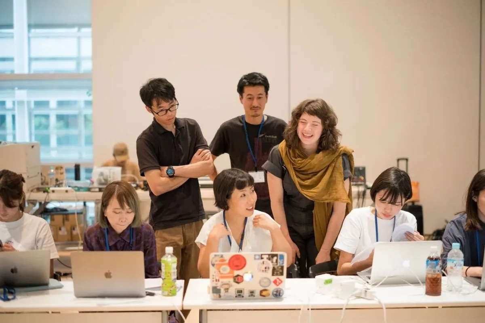
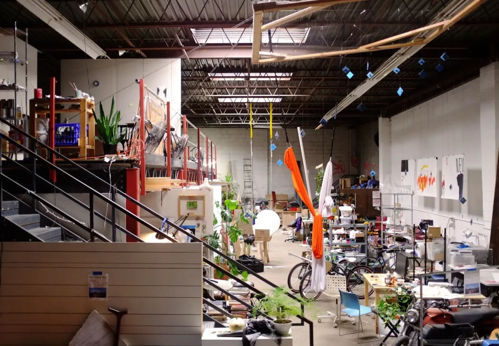
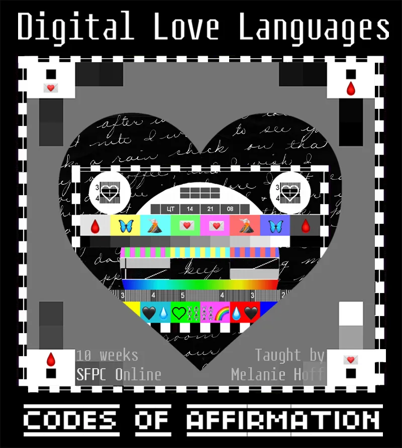
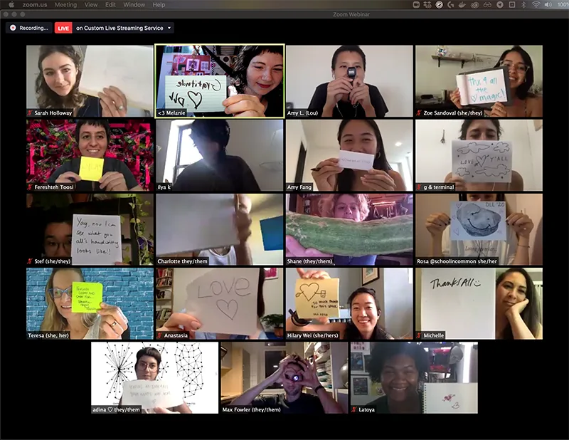
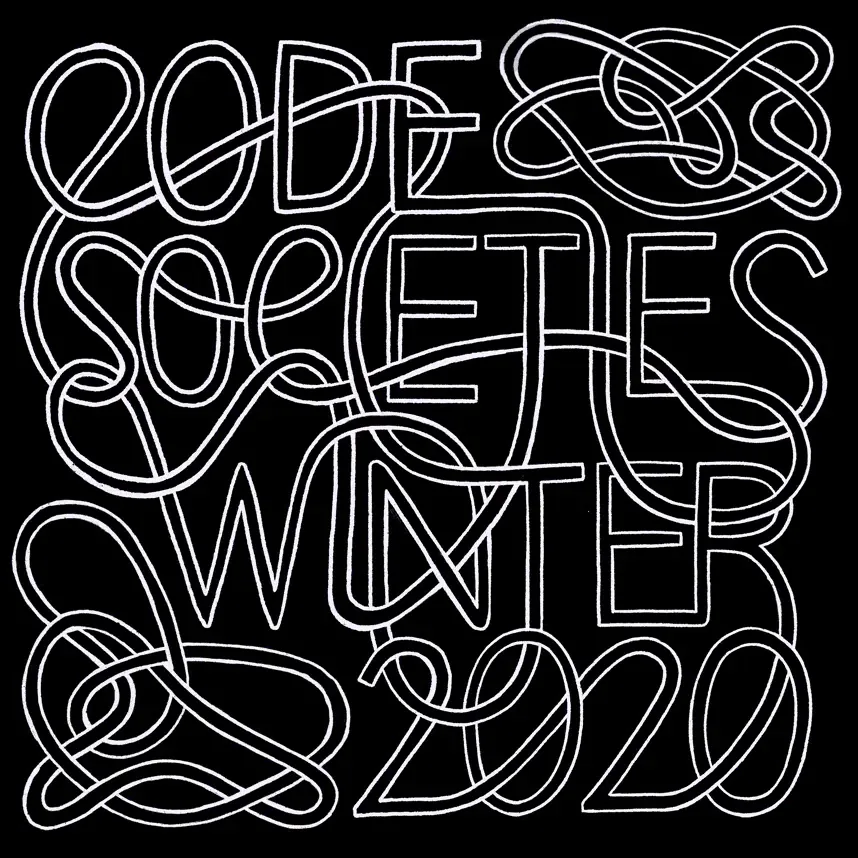
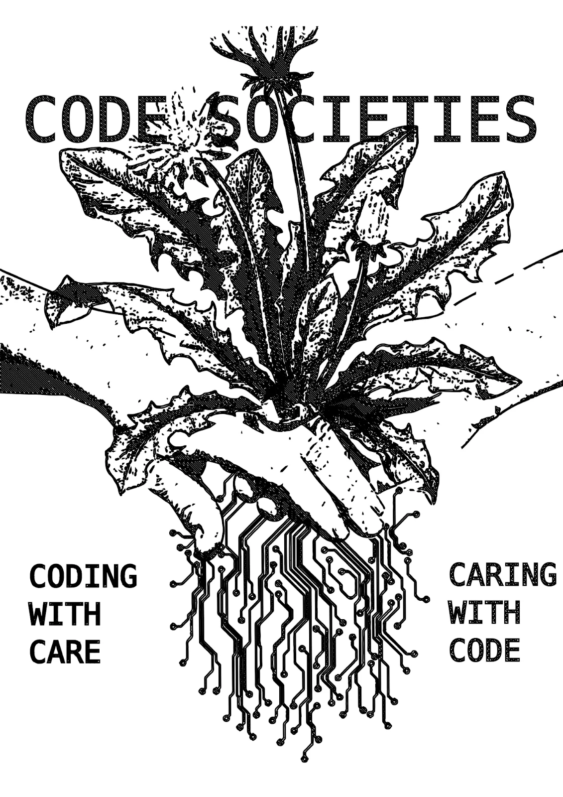
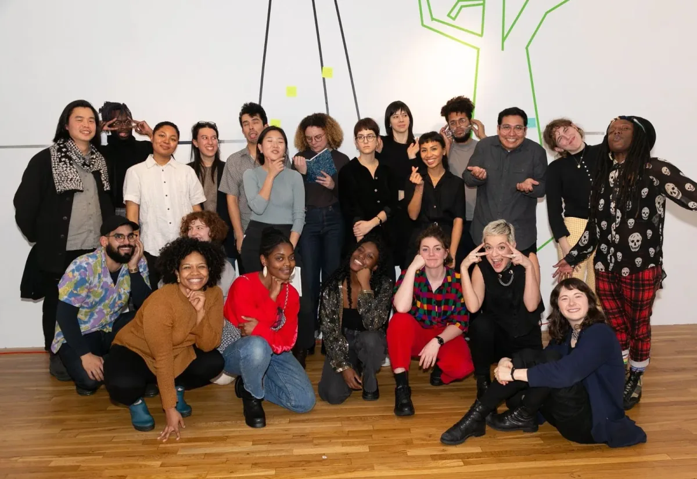
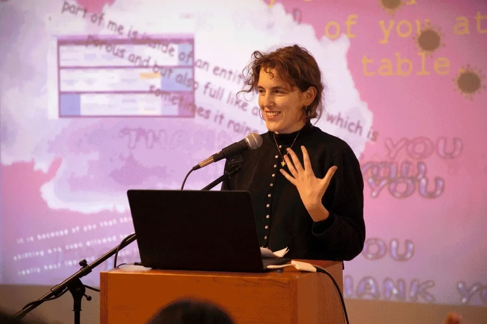
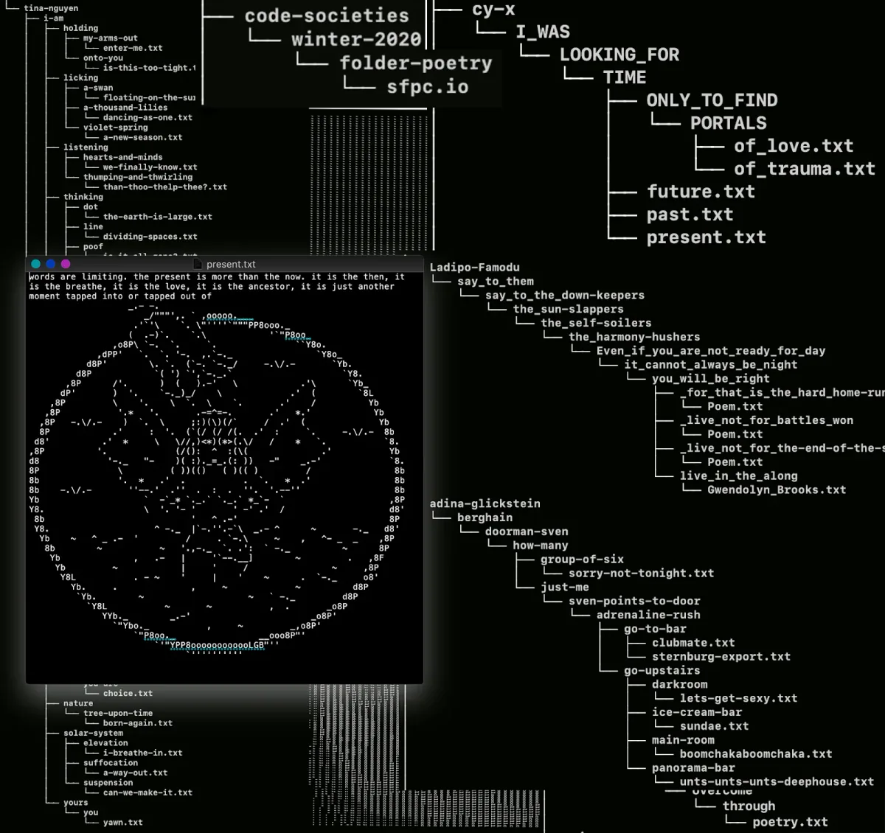
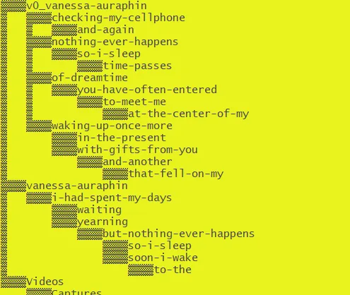

*Saber Khan, our Education Community Director, discusses what these teachers bring to the classroom and why.* createCanvas *is part of our* [Education Portal](https://processingfoundation.org/education)*, a collection of free education materials that can be used to teach our software in a variety of classroom settings.*

*In 2020,* [createCanvas was a podcast](https://soundcloud.com/processingfoundation)*. Check out the transcripts of past episodes* [here](https://medium.com/processing-foundation/education/home)*.*

---

**Saber Khan**: Hi everyone, welcome to createCanvas. Today I’m here with [Melanie Hoff](https://www.melaniehoff.com/). Hi, Melanie, how are you doing?

*Melanie Hoff, smiling and laughing with the brown scarf, with some students, who they prefer to call “participants” and fellow teachers. Melanie is an artist and educator whose work recodes conventions of norms, interfaces, and sex, through software installation and new choreographies of exchange. They’re committed to creating spaces that foreground pleasure and celebration that models sustainable support systems and make it possible for people to grow socially, ambiently, and holistically. They are also a founding member of Cybernetics Library and the collective [Soft Surplus](https://www.instagram.com/softsurplus/). Resources are available here for their 10-week course “[Digital Love Languages](https://lovelanguages.melaniehoff.com/),” and for the intensive “[Code Societies](https://sfpc.io/code-societies/),” taught at [School for Poetic Computation](https://sfpc.io/).*

**Melanie Hoff**: Hi, Saber. I’m doing okay. How are you?

**SK**: Welcome, thanks for making time with us. I thought we’d start with telling us about yourself, and Soft Surplus.

**MH**: Yeah, absolutely. Soft Surplus is a collective studio space that I started with [Austin Smith](https://twitter.com/_newcubes_) and [Dan Taeyoung](https://dantaeyoung.com/) in East Williamsburg. A large, empty — or it was empty, now it’s filled, overflowing with so many plants and boats and surf boards and artist materials — it is a place that is governed by a lot of different collective decision-making processes. We started this space to create an environment where people could learn together by making things near each other.

*[Soft Surplus](https://www.instagram.com/softsurplus/), a collective studio space started by Hoff with [Austin Smith](https://twitter.com/_newcubes_) and [Dan Taeyoung](https://dantaeyoung.com/) in East Williamsburg.*

**SK**: That’s such a wonderful spirit. I’ve been there. It’s such a beautiful space too. We’re talking in late October, Halloween Day actually. Are you all able to work in that space again or what’s the situation in there now?

**MH**: It’s a really good question. The situation has really changed because of COVID and we are still there. For a while, we took a break and a lot of people weren’t coming to the space because it’s lockdown, and we’ve slowly been coming back. But I will say that as we were not physically present, we continued and even increased our virtual presence through our different online communication platforms, primarily Slack.

I’ve organized two new special projects that came out of pandemic urgencies. One is a creative entity that takes on client work called Surplus Plus, where a percentage of all of the work we take on goes to subsidizing spaces, and to each other because a lot of us were affected negatively, financially, by the pandemic. The other one is a not-yet launched educational project called Soft Fall. It was Soft Summer then became Soft Fall, maybe it will become Soft Winter, where we’re going to be teaching all the different kinds of online things, like reading groups and one-day workshops.

I’m interested in doing one on a reparation’s working group because I’ve become more interested in talking about money in a way that is held and where people feel supported and open. In a lot of my work I’m interested in talking about things that are hard to talk about, and money is one of them.

The other class that I am planning to teach at Soft Fall, that is more related to the contents of createCanvas, is called Consensual Hacking. I’m planning on co-teaching it with a member of Soft Surplus named [Nahee Kim.](https://nahee.app/) The class is both a technical class and a psychological, social class, in the sense that half of it is going to be about making a social contract, like a code of conduct on steroids. This code of conduct will be created by people in pairs who have agreed to consensually [SSH](https://en.wikipedia.org/wiki/SSH_%28Secure_Shell%29) into each other’s laptops. Half the class is about the technical aspect of how to enter through the terminal to someone’s personal computer, and half of it will be about a social contract that we create in the class to make that feel more comfortable for people. I wasn’t going to say safe, because it’s not safe.

**SK**: What you are asking people to do is to do hacking right in front of someone they know, to someone they know.

**MH**: Yeah.

**SK**: That makes the stakes very clear, versus making hacking abstract. This is a good time to help people contextualize these workshops that you’ve talked about so far. Where are they taught? Who’s the audience for them? What kinds of people make their way to these types of things? And where does it fit in with all the other things they’re learning? Also, where does that fit in with all the other things *you’re* doing? It might be good for folks who aren’t as familiar with this type of space to guide them a little bit here.

**MH**: At Soft Surplus when I’m thinking about creating workshops, it’s actually thinking about workshops in quite a different way or one extreme of the spectrum. The spectrum being, on the one end, a workshop I would teach at Soft Surplus would be one that I really believe in, that I think is really important, that is really exciting for me to do research for and prepare for, because it’s I’m really interested in it and I think others will be too. Whereas, for some contrast, the other side of the spectrum for me would be to create a class that fits within a particular department or a class that people will pay a lot of money for. That’s the other side.

I definitely like to stay on that first side more, but teaching at Soft Surplus would be the place in which I would most be able to do that. I’m not really teaching it to make money; I’m teaching it because I think the material’s interesting and challenging and kind of risky, but risky in a way that I feel there’s a lot of value in, because often growth comes from stretching your comfort zone.

The most similar place to Soft Surplus where I can teach very close to what I truly believe in and care about, is at the [School for Poetic Computation](https://sfpc.io/), where I was a student in 2017, and then a TA for three different sessions, and then I started teaching and organizing my own programs there, and then most recently, teaching in the most classic SFPC session.

**SK**: I’d love to spend a few minutes talking about SFPC. It’s such a special, interesting, cool space, having both been there as a student and on the inside. I’d love, one, to introduce it to folks who don’t know about it. Then Code Societies and some of your projects there would be fascinating to hear about. Now that things are remote, maybe opportunities for folks to join in a way that they couldn’t in the past would be good to hear as well.

**MH**: The School for Poetic Computation is primarily the place in which I developed my voice as an educator and an artist. I have never been asked to separate those two identities, which is really important to me, because I do see my teaching work as part of my artist practice, and that feels very welcome at the School for Poetic Computation.

The School for Poetic Computation is a space based in Westbeth, a really long-running subsidized artist housing in the West Village. It’s a really beautiful, really special physical space. It was started by [Taeyoon Choi](http://taeyoonchoi.com/) and [Zach Lieberman](http://zach.li/) and a few other people, including [Jen Lowe](http://jenlowe.net/), and came out of Occupy ethos. Some schools that had popped up around [Occupy](https://en.wikipedia.org/wiki/Occupy_Wall_Street) were really inspiring to them.

I think the school started in response to a kind of ubiquitous code education that is all about learning code to get a job, or learning code to make a tool or a service, and less about code as poetry, computation as an expressive medium capable of expressing a full range of feeling. Just like you can use other forms of technology to make great poetry and art, like film and video, so can you use code. There’s actually a lot of code in making film and video, so people already are familiar with this idea even if they don’t think they are.

One of the two biggest projects that I have led there is [Code Societies](http://sfpc.io/code-societies/), and most recently, [Digital Love Languages](https://lovelanguages.melaniehoff.com/). Code Societies is an intensive session that I organize, about code and society and the way that they inform each other, but it’s also about the many meanings of the word “code.” I kind of touched on this with the consensual hacking class, that the class is both about the code of the social contract, as well as the code of SSH’ing and hacking into each other’s computers. Code Societies is about the many kinds of code — the digital codes, the codes that augment how you text your mom that you love her, the codes that augment how you check your bank account, what news you’re exposed to, what social media, what your social media feed looks like — these kinds of codes, as well as the social codes, like how we greet each other if we were in person. I may have reached out my hand and maybe you would have shook it and we maybe would have made eye contact. These are a kind of social code that we practice and the act of performing that code has a result. The result is that we have established that we acknowledge each other as human beings, that I am willing to not only get close enough to you that you could physically reach out and touch me or hypothetically hurt me. I’m willing to get close enough to you and I’m willing to actively touch you. These are all the things that happen in a handshake that are social codes.

*Flyer for the [Digital Love Languages](https://lovelanguages.melaniehoff.com/) class.*

We also talk about legal codes, like who can marry who, who can live where, who goes to jail, how long do they go to jail, what hospital are you sent to, what kind of insurance you have, and then other ways that those inform each other. Even in the examples I gave of digital, of social, of legal codes, already you can see the social is embedded in the legal, the legal is embedded in the social, the social is embedded in the digital, and the digital interacts and often spreads in ways with the legal.

*Digital Love Languages class meeting on Zoom.*

Finally, Code Societies is a directive hidden in the name, to code the society that you want to be in.

**SK**: That leads into a question: Not that every education has to have a certain amount of value, but is the value that the audience gains from these experiences to know that you have to be able to see things in their grayness, in order to have things work the way you want them to work? Is that the goal of something like Code Societies?

**MH**: I think the goal of something like Code Societies is for people to walk away experiencing the world as more malleable than they knew before, to see things that seem fixed as more malleable. Like, when you formally couldn’t make eye contact with certain types of people, now maybe you could try to start. Or, you didn’t formally think of yourself as having access to calling yourself a programmer, and now you actually can, and it’s not dependent on whether you completed an intro level course in JavaScript.

> “It’s being able to see the ways that our lives are altered by codes that other people have written. When you understand how other people wrote them, then you can start to write your own for yourself and for the people that you care about around you.”

That is both writing the social codes, establishing what are the social agreements that govern the space you’re in, and then seeing which ones you want to keep and which ones you do not want to keep. It’s much harder to take out the ones that you don’t want to keep if you can’t see what was defaulted to begin with.

*Promotional material for [Code Societies](https://sfpc.io/code-societies/) course, taught at the School for Poetic Computation.*

*Promotional material for [Code Societies](https://sfpc.io/code-societies/) course, taught at the School for Poetic Computation.*

**SK**: Do you have an example here?

**MH**: Yeah. When thinking about defaults, it’s like, if I don’t understand what was written by someone else, then I might think that computers always had to be square, and I might think that women always have to have long hair, and I might think that if my name is Melanie and people perceive that as being a woman’s name then I’m not able to say that I’m not a woman. Those are examples of defaults that feel so entrenched, but we can start to loosen them as being just made up of a combination of alchemical, social, digital, and legal codes.

Even your name, for example, your name is given to you as a first marker of a mechanization, a way that your self can be mechanized into a larger bureaucratic system.

*The Code Societies group.*

**SK**: You’re part of a big project to extract that history of computer science. A lot of that research was done right by where SFPC is based, at the [Bell Labs](https://en.wikipedia.org/wiki/Bell_Laboratories_Building_%28Manhattan%29), which is such a cool part of the whole story.

**MH**: Yeah, it is in the old Bell Labs building and [Claude Shannon](https://en.wikipedia.org/wiki/Claude_Shannon) was there. Thinking about computation’s difficult history: a big part of a lot of what I do is recognizing the way that things harm and the way that those same things can hold. Anyone who is interested in learning computation I hope would also be willing to recognize its history and put in the effort to move it past its history, because otherwise what are we doing here?

When I teach people computation, I assume that people are coming with that frame because, if they didn’t think that it was possible to express love with code, to make something that can care for people with code, then why are they learning code? I just refuse to believe that people would believe code wasn’t capable of that, but then still want to learn it.

*sties participants presenting for the class.*

It’s connected to the other big project that I do at the School for Poetic Computation, which happened in response to COVID. I had the opportunity to develop the course, Digital Love Languages, right as COVID hit, and we were going online and thinking about how we are relating to each other online and how we are now more dependent on these digitally mediated spaces to feel connected to each other. I thought, more than ever, it was important for people to feel empowered to create their own systems of communication and care and love with code online.

Digital Love Languages is a 10-week class based on the premise that a world where all of the software we use was coded by people who love us is possible. It is possible that every algorithm that changes what news I see, that alters how I communicate with my parents, even the one where I check my bank account, it is technically possible that those codes could have been written by someone who loves me.

This is a fun thought experiment. What would my bank account app look like if my partner had coded it, had access to my bank’s API or whatever in a secure way, and then asked me a couple of questions, like how am I doing. Just thinking about how that world really is possible, that all the software we use was made by people, it just so happens those people don’t love us. I also have a lot of people who love me and who I love who *do* know how to code, and we have and can and can continue to make software for each other that we depend on, that we communicate on.

**SK**: How do you bring that into your own life? How do you practice that and where have those sorts of things found a place in your life, beyond just the desire itself? Do you have any examples?

**MH**: Yes, of course I do. There are quite a few, but I will start with Manila. Manila is a Chrome extension that my partner and I made. It takes over the default new tab of our browser and there’s a little button in the top right, the icon for the browser extension, and any time that we see a page, a tweet, an article, a photo that we think the other person would like, we push the button for that Chrome extension and then it sets the default new tab to that URL. So the next time one of us opens a new tab, we see, “Oh, my partner wanted to show me this, that’s cool.” And then I find one, set it, change it to something else.

We created this because we wanted to share things with each other that didn’t necessarily demand a response. We found that the affordances of texting each other links or emailing each other links requires the other person to acknowledge it and respond. Sometimes we don’t need that, and we also don’t want to put that pressure on the other person. It’s a kind of ambient communication tool where we can just passively share the world with each other. That’s one example.

**SK**: That’s a great one. Thank you for sharing that. I have a question now, maybe less fun and more a little bit to the reality of what we’re in. You did your workshop in the middle of COVID remotely. I work in K12, and it’s such a challenging time to teach and be a teacher. I’m wondering what wisdom you’ve gleaned, what you’ve learned from doing that workshop and other things that have happened in this remote-learning era.

**MH**: Teaching at all during a pandemic or this global catastrophe really heightened and crystallized for me something that I believe in, which is in creating spaces of learning that are open to the possibility of trauma. That is, of course, not to say these learning spaces create trauma, but that they are open to the possibility that people are showing up with that. And, more so than open to that possibility, are at the very least resolutely determined to not punish people for having trauma.

What I see normally in educational spaces is that people’s personal lives, what’s going on with them, with their family, with money, or with abuse, governing spaces that are supposedly supposed to support us, like the home, the school and the law, not only do they not support, they actually punish if you have experienced this, which creates this self-perpetuating and exacerbated situation.

It’s really important to me to teach in a way that people feel like they could be honest with what’s going on with them, and that at the very least they would be listened to and not punished, which unfortunately is just so extremely not what the case is normally, so much so that people have learned not to bring that kind of stuff up in educational spaces. This is such a loss, because not only are they, by not bringing it up, closing off the possibility that they could be cared for, but they are also closing off the possibility that the community or the collective of the class could learn from that experience.

Often, personal events have a relationship to education. I mean, education and theory is developed from people’s personal experiences. Ultimately, that’s where it all starts. The idea that people would be learning about theory, learning about technology in a way that’s divorced from their own lives, and not only that, but their own lives would be explicitly not invited to the conversation seems such a loss for collective education.

**SK**: I’m nodding my head to a lot of what you were saying. I think I understand what you’re saying, which is that a lot of educators are very nervous and allergic to hearing things that, quote-unquote, “cause concern” in moments like that. Privacy, liability, and those things take the foreground, versus care and community. Do you have advice here on how to create a space that is more open to the possibility of trauma?

**MH**: I think the first thing is making sure that a space of education is not punitive. Especially teaching at larger universities, in the syllabus itself, there are very clear punishments outlined, and I really wish that we could find a way to not need to have that in syllabi. If you find that, without enforcing punitive measures, people don’t show up and don’t want to do the work in your class, then maybe you should change your class, because it should be about learning. Learning happens when people feel listened to, feel cared for, feel like they are welcomed and their whole selves are welcomed, that they don’t have to leave part of themselves at the door. So if learning is the goal, then there’s no place for punitive measures in learning as far as I’m concerned.

When I think about students enforcing punitive measures on other students, I think there’s just something else going on. They didn’t come up with that themselves. If students want to enforce that on other students, it’s because it has been unfairly enforced on them in the past, and so they want to be treated the same. But if you break the cycle, then you break the cycle. Then they won’t want that for others because they will have been treated with respect and as peers.

I’m really interested in treating students as equal participants in co-creating the environment of the class, because they are. I also am *not* interested in teaching classes where I am the expert, like capital-E expert, and I have nothing to learn from the students — because I have *so* much to learn from the students. I have a very specific perspective based on growing up in D.C., based on growing up with upper-middle-class parents, based on being an only child, based on being white and American. Just because some of whatever led me to be able to occupy a position of professing, that may or may not have any bearing on whether I have more to share than my students have to share with me.

I actually try to not say “my students.” It’s a common phrase that teachers will say, “Oh, my students.” I’ve been trying to wean myself, or more like cut that language completely out of my repertoire. I will say “participants” as opposed to students because I think student/teacher is a very hierarchical role relationship.

**SK**: Yes.

**MH**: I have a story that happened just recently: a good friend of mine started teaching for the first time this semester, teaching undergrad students, and they asked me for advice a couple of times. The semester got started and they texted me saying that they have a student who shared a very obviously plagiarized homework assignment. When my friend, the teacher, asked them to explain it, the student made a joke at the teacher’s expense. My friend was really upset about this because it was definitely a rude comment and the student clearly plagiarized. My friend said, “This really, really bothered me. I don’t know what to do, because to be honest, I’m really mad and I want to definitely fail them on this homework assignment. Or should I do anything else?” My friend was really interested in helping them take accountability for what they had done wrong.

My response was along the lines that asking someone to take accountability for something that they have done wrong is actually really, really, really hard. You can’t force it. If a person isn’t ready to take accountability for plagiarism, for being insulting, then you’re not going to be able to make them. My advice was to send the student a private email saying, “Hey, do you want to talk some time? I just want to check in on you.” To email them from a place of care, and not to mention the insult, not to mention the plagiarism, but instead offer a check-in because you care about them, and you want to see how they’re doing.

My friend decided to do that and when my friend met with the student, they told me that the student said they were actually going through a lot personally, and they were struggling with addiction, and they were at a loss, and they don’t know what to do about continuing school. My friend was really grateful for that advice, because if they hadn’t reached out in that way, they would never have known that this student was struggling with addiction, and in the end, they would have failed them on the assignment and then the cycle would have continued.

**SK**: Yeah. It’s hard for teachers and educators not to take it personally — but it really is important to not cause more harm. Especially plagiarism, you can ring the alarm bells pretty damningly on a student if that’s the charge. Thank you for that. That’s a helpful reminder.

Did you want to talk about the terminal lesson?

**MH**: Sure. I have been developing this unit, which I’ve taught as a two-day workshop many times and I’ve also taught it as a one-day workshop. It would be great as a unit in many computational classes, where it’s a poetic way to learn the [terminal](https://en.wikipedia.org/wiki/Terminal_%28macOS%29). It’s called [Folder Poetry](https://github.com/melaniehoff/folderpoetry).

*Folder poetry example*

“Folder poetry” is simply the idea of creating rhythmic prose and poetry with the structure of naming and nesting folders on your computer. You can create stories, you can create narratives, you can create choose-your-own-adventure poetry; you can create almost drawings with it — if you name the folders with characters that create a pattern when you tree them out in your terminal, or when looking at them in the finder.

*Folder poetry example*

When I taught folder poetry at the School for Poetic Computation last year, one student made a folder poem that implemented [Bash scripts](https://medium.com/swlh/the-bash-scripting-tutorial-part-1-34971f5260f7) as well. When you would enter, you’d be like “CD,” which is [change directory](https://en.wikipedia.org/wiki/Cd_%28command%29), so you’d enter into a folder, and let’s say you enter into home, and then in home there was the lemon tree or the olive tree. And then if you chose the lemon tree, it would take you to a random folder on your entire computer.

**SK**: When you CD’d into lemon tree?

**MH**: Yes.

**SK**: Okay.

**MH**: There was some tree aspect to this poem. So basically every time you would enter the lemon-tree folder, you would be taken to a random folder within your entire computer’s folder hierarchy. Then in that folder would be another lemon-tree folder, and then when you CD’d into it you would be taken to another random folder.

Learning folder poetry is such a nice way to get intimate with your computer, into the thing that you use all of the time and the files that you pull up all the time, to see them spatially, to see them architecturally, and to move around them like you would move through rooms in your house. Because navigating your computer with the terminal is a relational practice, as in you’re never in multiple places at once.

*Folder poetry example*

The way that the graphical user interface of the desktop makes you feel is that you’re this omnipresent being peering into your computer and you can just reach out and go into all of these different places and in many places at once. You can have multiple folders open at once in your graphical user interface, but in the terminal, within one terminal window, you’re only in one place at one time, and to navigate, you have to navigate to a specific place. If you want to get to a folder that’s at the end of a series of nested folders, you have to enter into each successive one until you get to the one that you want to go into. It’s a physical way of thinking about your computer.

**SK**: This brings a lot of fun and joy and excitement to learning CS, but also, it respects what the actual idea is and what it means to do. A lot of the way traditional CS101 is taught is, learn this so you can manipulate files so we can move on, versus, actually take a moment to sit here and think about it. If you think about a folder, it’s basically choose-your-adventure.

I think that really encapsulates bringing some joy and ownership to computer science, kind of what we started with, how to bring some whimsy and joy and fun into it. There’s also I think a seriousness to it, which is to really understand what’s happening here.

**MH**: Yeah, it comes from both of those places, including the one where when I learned how to code, teachers never taught terminal. It was always like, “You just copy and paste these commands in,” but no one ever explained it as, “You CD and then you LS.” Realizing that that was never a unit in anyone’s class, even though many classes implemented copy and pasting commands into the terminal — it came from there and it came from a place to start a real empowerment, where people are really familiar with the idea of creating a new folder, renaming that folder, moving a folder, copying and pasting a folder. To see this action that you perform with the GUI with your mouse by clicking, translated into these simple commands, it highlights that distinction between programmer and perceived-to-be not-programmers that well. Is the double-clicking into a folder really that different than saying, “CD, space, that folder”? It’s not and you can really feel that tangibly, viscerally, when you learn terminal, and then you’re like, “Wait, why all of a sudden when I’m writing ‘CD, space, folder,’ am I a hacker or programmer or coder, and when I’m double clicking, I’m not?”

I’m not saying that there’s no difference at all, but the difference in the minds of people is so great that it’s inexplicable.

> “There’s just a cavern of difference between people who double-click into a folder and people who CD into a folder. The cavern is not explained by reality, other than a tech industry that profits off of a population of customers that don’t think that they can code the software that big tech is selling.”

**SK**: That’s putting such an important point on it, about how to get your hands dirty in a way for your participants, as you call them, to feel empowered. You do have to recognize the cavern. When someone teaches you how to search it, I think you’re going to feel very excited about other things you can traverse.

**MH**: When I’ve taught folder poetry and helped people get comfortable in their terminal, I’ve had people, mostly women, come after the class crying that they had never felt that way before. That the terminal was such a site of stress because it has this hacker aesthetic look and it’s not user-friendly in the conventional sense. There’s a lot of stress around it, and I’ve had the experience of multiple people after taking that class or that workshop saying these things, that the terminal was always something that, at work, their male co workers opened for them and did a bunch of stuff that they didn’t understand, and then closed it, and then everything was different, and they didn’t know why, and they didn’t know how to change it, and they felt bad for asking. And now all of a sudden they can navigate in it.

Often the barrier between someone’s coworker who could just go into the terminal and change a bunch of stuff, and someone who felt like they couldn’t, was really just understanding nested folder structures and CD’ing, and “CD, space, .., and LS.”

**SK**: Just a little bit of code.

**MH**: Yeah, just a little bit.

**SK**: It’s just a little bit of code that they have access to. It’s such an essential thing that’s so badly taught, and generally, as you were saying, not taught at all, but it’s so foundational to CS, but everyone ignores it.

Is there anything that we didn’t get to, anything that was on your mind that you want to circle back to, or want to mention now?

**MH**: Yeah. I slightly brought up ways in which people who are coded as women are excluded systematically from tech spaces and tech learning. Certainly that’s what I’m very familiar with. It’s so important to me to create spaces of education around technology and in technology spaces that also account for the systematic oppression of Black and POC people in tech spaces.

Being interviewed about code education, I don’t want to leave it without saying very clearly that there is no such thing as a computational education that doesn’t include an anti-racist, anti-sexist, and environmentally conscious theory of that computation. For people who are teaching computation, to people who come from different identities and perspectives, especially those who have been systemically oppressed in and outside of tech spaces, to remind your participants that — something that my collaborator, Nabil Hassein, has said to me before that I often repeat, and that is: If this stuff doesn’t feel good to you, if learning code feels frustrating, if you feel like you’re banging your head against the wall, that’s okay. That means you’re paying attention, because this stuff probably wasn’t designed by people who looked like you, it probably wasn’t taught by people who look like you, and it probably wasn’t designed for use-cases that you care about or are interested in perpetuating. So, if this stuff doesn’t feel soothing to you, that means you’re paying attention, but it doesn’t necessarily always have to be that way.
