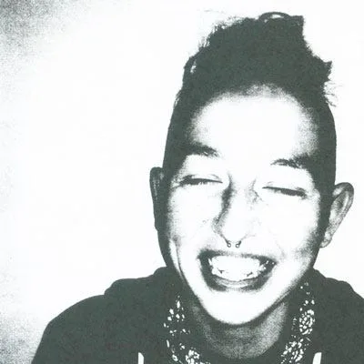
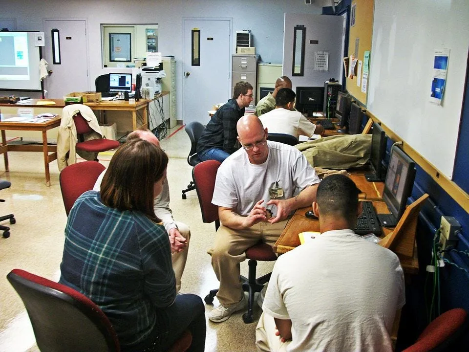
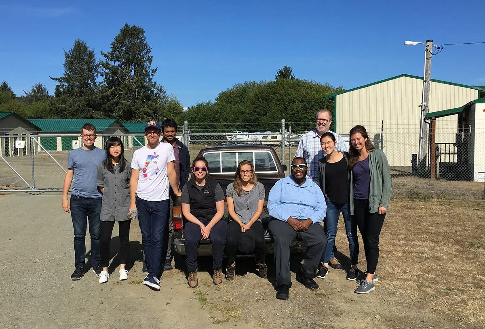

### 2017 Foundation Fellow

#### (in conversation with Johanna Hedva)

---

The 2017 Processing Foundation Fellowships supported an unprecedented [seven research projects](https://processingfoundation.org/fellowships) that expanded the p5.js and Processing platforms and their communities. Fellows developed work ranging from bilingual zines, to accessible coding curriculum to be taught in prisons, to workshops aimed at teaching code to women, non-binary, and femme-identifying folks. Throughout the summer we’ll be posting a series of articles — some written by the fellows, some in conversation with Director of Advocacy, Johanna Hedva — that showcase and document the great work by this year’s cohort.

---

*[Susan Evans](https://github.com/susanev) is passionate about creating safe, inclusive, and supportive computer science education communities. She has a diverse background in improving the human experience through UX design and code. For her fellowship, Susan worked on crafting and offering a series of classes in Washington state prisons using p5.js. Susan was mentored by [Dr. Rhazes Spell](http://rhaz.es/).*

**Johanna Hedva**: Your fellowship work concentrated on making coding education accessible for people currently in prison. Can you talk about how access to education for those in prison works, or, perhaps it’s more accurate to say, how it doesn’t work?

**Susan Evans**: In Washington state, people in prison have limits on the amount of educational programming they can access throughout their time there and it’s especially difficult for people with long or life sentences to access these programs. Most of our prisons provide some sort of computer lab (to those in educational programs), but they are usually only allowed to use those computers during class time. Additionally, there are also lots of rules around people in prison communicating with people on the outside, so for the most part, the people in prison have no access to educational mentoring, or feedback outside of their scheduled class time.

That all being said, there are lots of people and programs working to disrupt the system and provide improved educational opportunities. Recently, I have been volunteering with [Unloop](http://www.un-loop.org/), who provide workshops and programs in partnership with community colleges to bring web development education to people in prison. Throughout my fellowship I have been working to design a curriculum to use within Unloop’s educational programming. For now that means a one-day workshop, but in the future it will be expanded to multi-day, quarter-based workshops paired with mentoring and support outside of the regular class time.

**We were unable to bring a camera into our Clallam Bay workshop due to regulations, but this photo shows volunteers and students working through an Unloop robotics workshop held at Monroe Correctional Complex.**

**JH**: What got you started in this work?

**SE**: I have always been passionate about education and interested in working in spaces with students who are income-insecure or who’ve had limited access to support systems. I myself navigated my post-high school schooling without any supports in place, so I have a lot of passion and ideas on how to improve these systems for others going through similar experiences. After I completed a bachelor’s degree in mathematics education and computer science (CS), I started teaching at [Technology Access Foundation](http://techaccess.org/) as a STEM educator, and then built a four-year CS program at Cleveland High School in South Seattle. Around the end of my fourth year at Cleveland, I was increasingly frustrated with school systems, so I decided to pursue more community-based ways to contribute to CS education. Currently, that means offering free community workshops, volunteering with Unloop, and contributing to [Ada Developers Academy](http://adadevelopersacademy.org/), who prepare women and gender-diverse people for careers in software development.

I believe everyone should have access to CS education, but right now our systems are broken. There is very limited access, and that access tends to focus on people who are more likely to already have connections in tech. It is crucial that we as a society include everyone in CS educational opportunities and allow everyone to build experiences in CS. Our tech community is not diverse: if we can shift the community to be inclusive we can solve more challenging problems that are often overlooked due to the lack of perspective and empathy. I’d love to see more organizations focused on bringing CS education to people that currently have no connections to tech.

**JH**: Your fellowship work focused on developing workshop curriculum using p5.js. How did you approach this project?

**SE**: I started with a brainstorm of everything I had done so far with p5.js in the classroom and reviewed other work from educators in this space. I also spent time connecting with my peers in education and talking through my ideas. I especially enjoyed collaborating with my mentor, Dr. Rhazes Spell, as he helped me to organize my thoughts, focus on goals, and center the curriculum on the students.

After a lot of iteration, I decided to start with a one-day workshop to develop more experience to drive longer and more involved workshops. I also chose to focus on quick exposure, and open-ended projects as I knew that I was going to be working with students who have a wide-range of experiences. I decided on a project that allowed the students to create a self-portrait, keeping it open-ended — they could take it literally, or go more abstract. The workshop teaches some of the fundamentals with quick reinforcing exercises, and then they can take those skills and apply them directly.

Our first workshop was held at Clallam Bay Corrections with twenty students and ten volunteers, which is an incredible ratio, and I was so thankful to all of the volunteers who donated their time to drive more than six hours to mentor and inspire students. Most students worked in pairs at a single computer, with a volunteer working directly with them to answer questions and provide support. As always in educational settings, I adjusted the curriculum during the workshop to quickly fit the students needs. We ended up doing the [random background activity](https://github.com/susanev/p5js-workshops/blob/master/1-day-workshop/activities/random-background.md), then the [taijitu](https://github.com/susanev/p5js-workshops/blob/master/1-day-workshop/activities/taijitu.md) (which highlights the importance of order of execution, and is a fun problem to solve), and then had students create [face projects](https://github.com/susanev/p5js-workshops/blob/master/1-day-workshop/activities/face.md). Some students explored creating emotion with simple shapes, while other students created a Paint-like program to draw faces. It was fun to see how each pair took the project in a slightly different direction.

The students really loved using p5.js, especially because of the visual feedback it provided as they learned to code. We were also able to provide them with the [offline reference](https://p5js.org/offline-reference/p5-reference.zip) (people in prison do not have access to the Internet), and many students commented on how they really enjoyed using the reference to look up and learn about different functions — it really helped to demystify programming for them. We were also able to bring and leave a number of [books](https://p5js.org/books/), and leave everything installed on the machines, so interested students can come back to continue to work on their projects and start new ones.

**Our ten volunteers sharing and debriefing after a day of volunteering. They travelled from the greater Seattle area to Clallam Bay to inspire and mentor students.**

**JH**: What materials were developed during your fellowship period, and what’s next?

**SE**: Currently, I have developed a [one-day workshop](https://github.com/susanev/p5js-workshops/tree/master/1-day-workshop). I will be continuing to lead this workshop across prisons in Washington state in collaboration with Unloop. For the long term, I hope to be able to put mentoring supports in place to connect people in prison with people on the outside for feedback and support on their personal projects.

I am so thankful to have had the opportunity to bring creative coding to these students. I was also really grateful for the first-time volunteers who participated. Many of them commented on how visiting a prison and working with the students shifted their perception of people in prison from the often toxic perception portrayed by the media. If you are in Washington state, and would like to volunteer at future workshops, please connect with [Unloop](http://www.un-loop.org/) through the contact form on their website.
