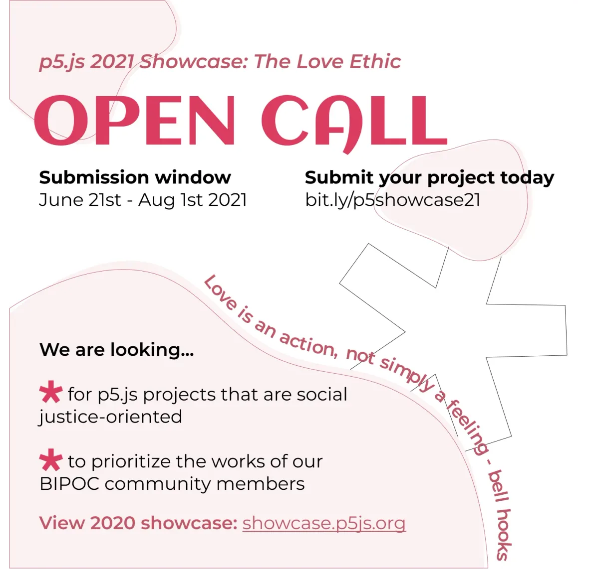
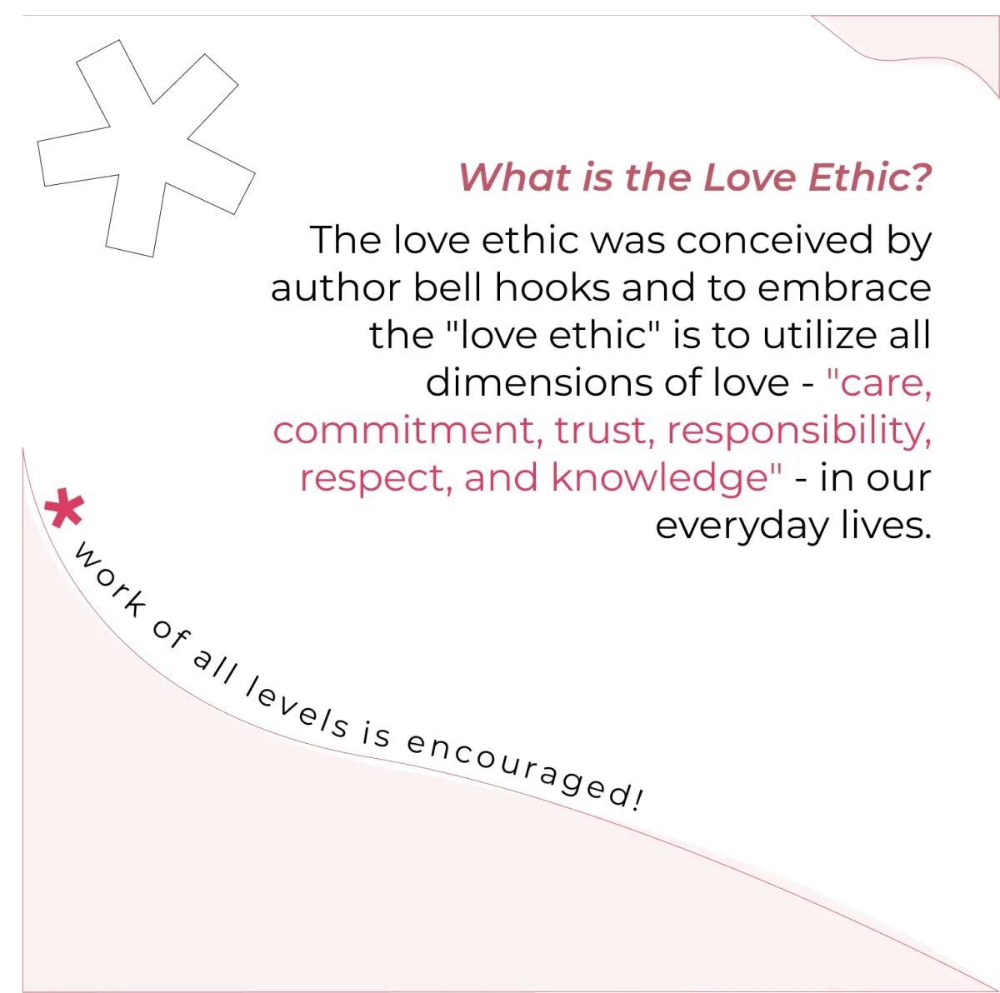
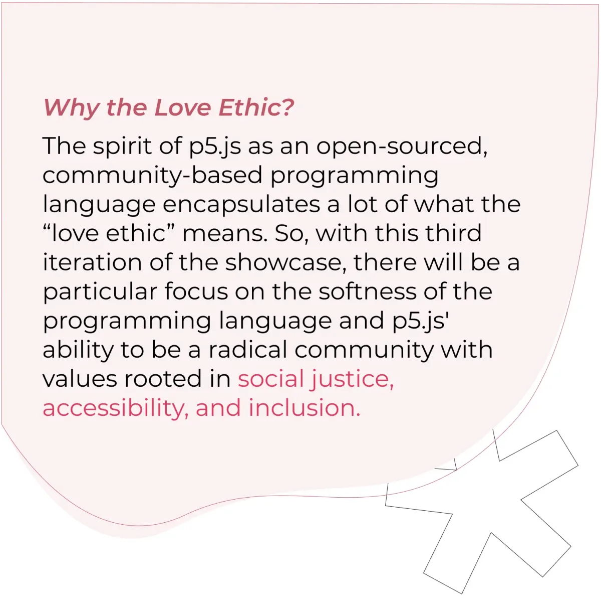
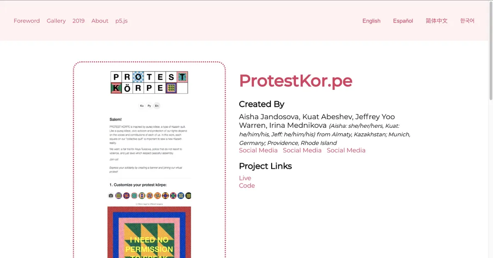
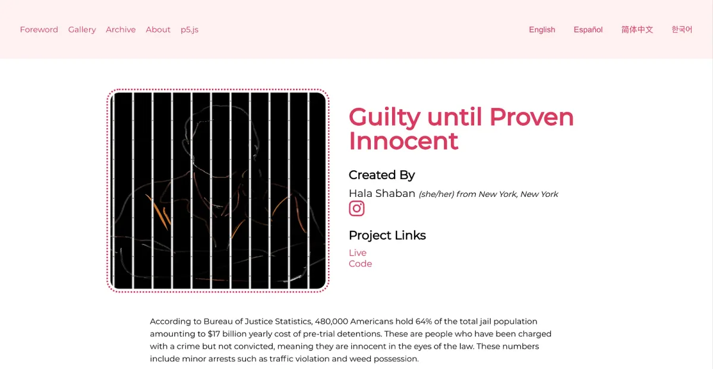
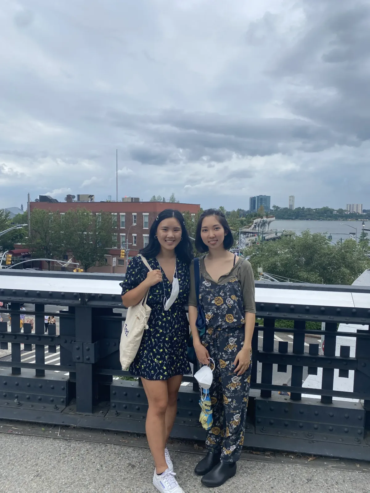

Mentored by KT Duffy, Sam Vassor, and Ashley Kang

---

*As of 2021, Processing Foundation has been participating in Google Summer of Code for a whole entire decade! Each year we’ve been honored to work with students on open-source projects that range from software development to community outreach, and this year’s cohort was no exception. Over the next couple weeks, we’ll post articles written by some of this year’s GSoC students, explaining their projects in detail and in their own words. The series will conclude with a wrap-up post of all the work done by this year’s GSoC students. Congrats, everyone, on a great summer!*

---

I first came across the p5.js 2020 Showcase in my creative coding class during the spring 2021 semester. I remember feeling incredibly inspired and blown away by the diverse projects made by the international community that uses p5.js. When applications for GSoC 2021 came around, I knew I wanted to work on the continued development of the Showcase.

### **Thematic Approach: The Love Ethic**

The design and organization of the Showcase were already very robust, but I felt that the third iteration of it had the opportunity to be curated by a theme. When thinking about themes, I looked at the values of the Processing Foundation and the p5.js community. It got me thinking about accessibility, inclusion, and projects that push the perceptions of how p5.js can be used. These values reminded me of a book I read by bell hooks called [All About Love](https://en.wikipedia.org/wiki/All_About_Love:_New_Visions)*,* where she outlines the idea of the “love ethic,” which proposes putting all dimensions of love into our everyday lives. I thought this translated nicely into a theme that aligned well with the values of p5.js.

With that in mind, I looked for projects that demonstrated the love ethic, specifically projects that were social-justice oriented and contributions from our BIPOC community. The Open Call lasted around a month and a half, and during that time I reached out to different institutions and artists for projects to showcase.

**Open Call social media assets. \[****image description****: Three square Instagram posts each with pink organic shapes and details regarding the Open Call and submission guidelines.\]**

### **The Development Process**

#### *Updating the Archive Page*

I started by updating the 2019 page to an Archive, as there were now two Showcases to archive. This would be the tab archiving all previous Showcases along with their curators. This was a pretty simple task that allowed me to get to know the structure of the code better, and could lead to an easy way of adding new Showcases year after year.

#### *Difficulty Filter*

One of my main proposals was to add a Difficulty Filter to the Gallery page so that projects could be filtered by their level: Beginner, Intermediate, and Advanced. This was one of the biggest obstacles during the summer, as I was not able to find how the 2020 projects were tagged by type, and I had little experience with React.js and Javascript together. When troubleshooting with my mentors, they were unable to figure out the logic either so we reached out to the Processing Foundation for more support. I was able to connect with [Jiwon Shin](https://medium.com/processing-foundation/updating-and-improving-p5-serial-9e38f70946ba), a 2019 GSoC student and 2021 GSoC mentor, who had expertise in React.js and Javascript. After meeting with her once, I was able to figure out the ternary operator that was filtering the tags and add another React.js component to the page that dealt with the difficulty tag.

#### *Social Icons*

I worked on adding social media icons to the individual project pages for each artist rather than the word “Social Media.” This was to make it clearer for the user what kind of page they were being directed to rather than having no indication at all.

**Social Media vs Social Icon. \[****image description****: Individual project pages, top with links that say “Social Media” vs bottom that have the social icon instead.\]**

### **Final Product:**

-   Curated the showcase by a theme
-   Difficulty Tags
-   Social Icons
-   A11y guidelines checklist

### **Looking ahead**

The showcase still needs translations to be added by community members! (Spanish, Korean, and Chinese). The translation structure (i18next) has been implemented and contributors can help with translations!

Another aspect we needed to consider about the Showcase was where it would live and be maintained. In 2019, the Showcase was integrated with the p5.js site, but in 2020 during the overhaul of the showcase site, it lived on the GitHub of the [the last GSoC student to work on it, Connie Liu](https://medium.com/processing-foundation/increasing-the-organization-and-scope-of-the-p5-js-showcase-7193ef558c5a). This year, it lives in my repo as a fork from Connie, but we are now in the process of transferring the repo to the Processing Foundation Github for future Showcase curators.

### **GSoC @ Processing**

Another one of my favorite parts of the summer was the opportunity to meet and connect with other GSoC students at the Processing Foundation ([shoutout to Katie Liu, Niki Ito, and Joseph Hong](https://medium.com/processing-foundation/announcing-google-summer-of-code-2021-our-10th-year-e097ee93433e)). It was amazing to get to learn more about their projects and journey to the GSoC program at Processing.

**Niki Ito and I in NYC. \[****image description****: Two girls with black hair smiling at the camera with New York City skyline in background.\]**

**Acknowledgements**

There are so many people to thank for this summer of growth, learning, and fun, but I will start with the Processing Foundation for providing me with this opportunity to see the thematic showcase through. I would also like to extend my deepest thanks to my mentors Sam Vassor, KT Duffy, and Ashley Kang for their unrelenting (emotional and technical) support and words of wisdom. Finally, thanks to Qianqian Ye, evelyn masso, Saber Khan, Jiwon Shin, and the rest of the GSoC’21 cohort at Processing this summer. I am so excited for what the future has in store for the p5.js showcase.
