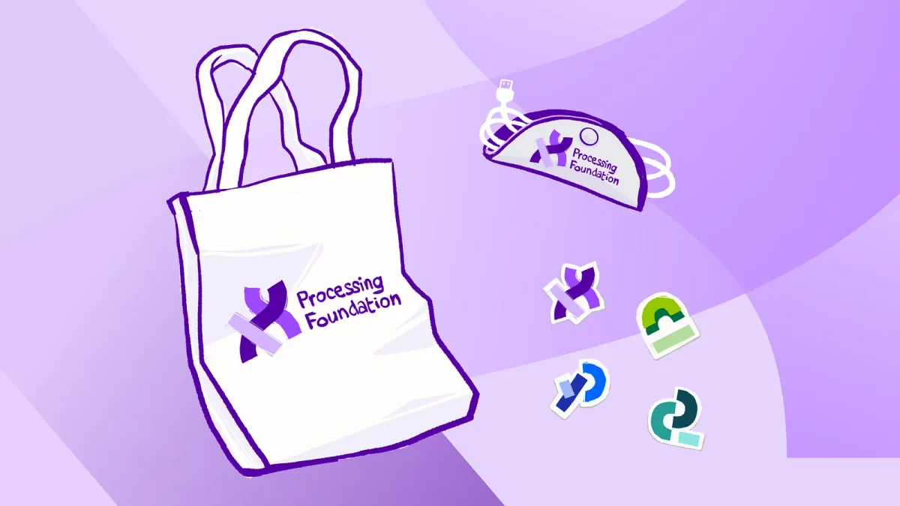
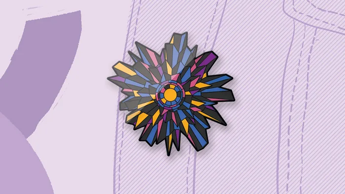

Over the past decade, the Processing Foundation Fellowship Program has run an annual program that supports artists, designers, activists, educators, engineers, researchers, coders, and collectives who are passionate about making a positive impact through open-source software and technology for the arts. Fellows receive a $10,000 stipend, one-on-one mentorship, fellow cohort gatherings, and public-facing opportunities to showcase their work. They also gain access to the Processing Foundation’s network to collaborate and share for their fellowship.

As we celebrate this decade of code, we’re thrilled to invite you to [join our annual fundraiser](https://donorbox.org/to-the-power-of-10). Your financial support is vital in continuing our mission of promoting software learning within the arts and artistic learning within technology-related fields.

[Donate today!](https://donorbox.org/to-the-power-of-10)

*A photo from one of our 2023 Fellows, Nhan Phan, teaching coding to students in Vietnam.*

Here’s how your contribution makes a difference:

-   **Software development:** Your donations directly fund the development of new features, better contributor support, improved documentation, and more.
-   **Community support:** Your donations help us offer resources and opportunities for artists and technologists to collaborate, learn, and create.
-   **Education:** Your donations help us support and expand our existing educational initiatives and partnerships with learning institutions.
-   **Diversity, Equity, and Inclusion:** Your donations help us continue to focus on making technology accessible and equitable, celebrating all voices in the fields of art and code.

Want to know more about the activities of the Processing Foundation? Check out our [2023 Impact Report](https://processingfoundation.report)!

*Our Decade of Code Fundraiser Rewards! Image courtesy of our Community Lead, Raphaël de Courville.*

#### **Special Rewards for Supporters**

To express our gratitude, we’ve prepared exclusive rewards for our donors:

-   Digital Artwork: A selection of captivating digital artworks from our community artists, perfect for adding a touch of creativity to your digital devices.
-   Sticker Pack: A diverse collection of 10 logo stickers and more, each a representation of our foundation’s software projects. Logos are originally designed by [Design Systems International](https://designsystems.international)
-   Enamel Pin: An elegantly designed enamel pin by [Anna Carreras](https://www.annacarreras.com), encapsulating the essence of the immense energy of creativity, community, and relationships. She describes it as, “An overlapping and interconnected burst of art using code that means more than we can imagine. Like a flower blossoming diversity.”
-   Tote Bag: Stylishly designed merchandise that not only serves practical purposes but also carries the identity and ethos of our foundation, making them perfect companions for everyday use.

*Special Edition pin designed by Anna Carreras.*

Additionally, **the first 100 donors contributing $100 or more** will receive an **exclusive enamel pin** **designed by the renowned generative artist Anna Carreras**. This pin celebrates ten years of collaborative art, coding, and education.

[Donate today](https://donorbox.org/to-the-power-of-10) **for a chance to get this exclusive pin!**

#### **Join Our Membership Program**

Become a recurring donor and join our budding membership program — receive monthly updates and insight from our team as well as community. Your support is essential to our community. It enables us to dream bigger and reach further. Thank you for being with us on this journey, and here’s to another decade of code!

*May your code run smoothly 💜  
The Processing Foundation*
