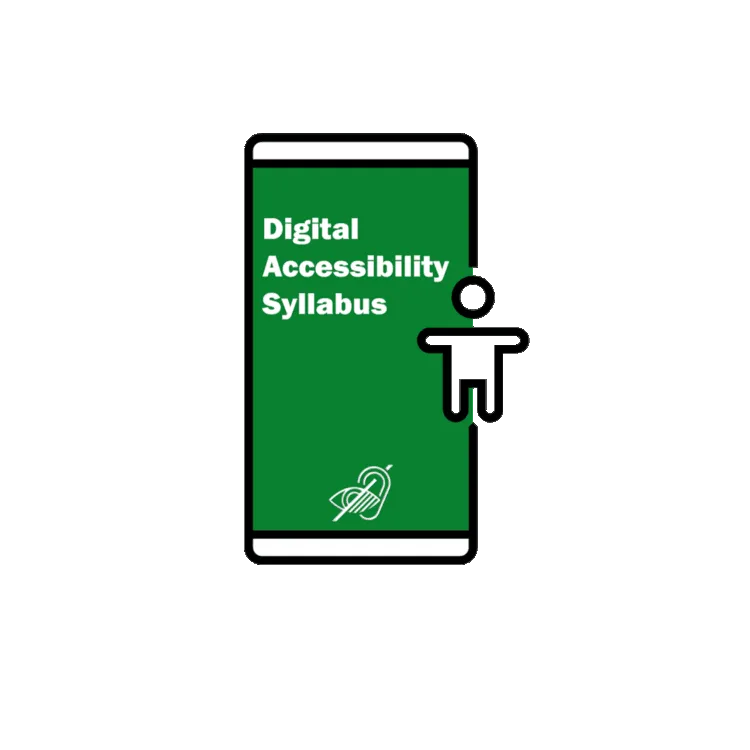
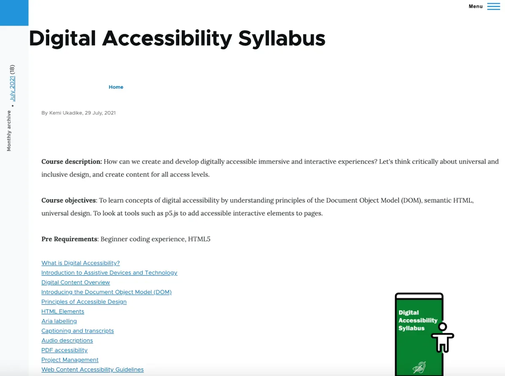
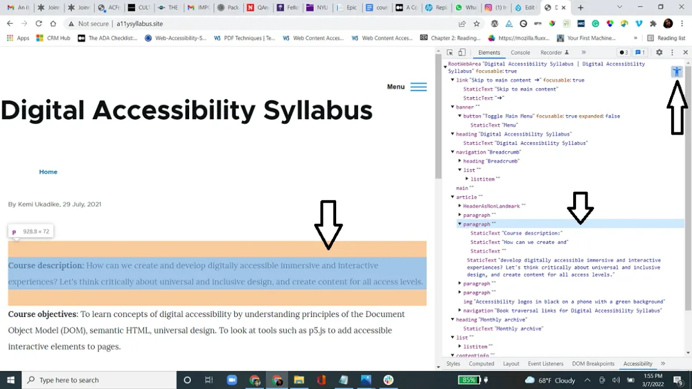
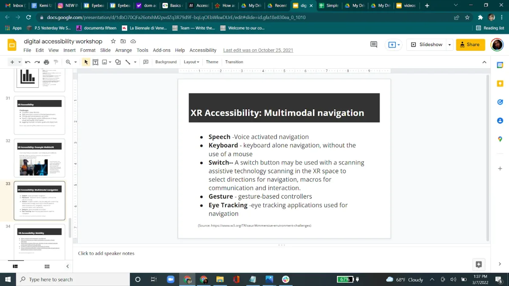

For the sixth year of our annual Fellowship Program, we aimed to better support the new paradigm of remote and online contexts and socially distanced communities. We asked applicants to address at least one of four Priority Areas that, to us, felt especially important for finding ways to feel more connected right now: Accessibility, Internationalization, Continuing Support, and AI Ethics and Open Source. Additionally, we sponsored four Teaching Fellows, who developed teaching materials that will be made available for free, and are oriented toward remote learning within specific communities. We received 126 applications and were able to award six Fellowships, with four Teaching Fellowships. We are excited to note that this is our most international cohort ever, with Fellows based in Australia, Brazil, India, Mexico, Philippines, Switzerland; and in the U.S. in California, Portland, and New York. With this interview, we begin highlighting the work of the four Teaching Fellows. For an archive of our past Fellows [click here](https://processingfoundation.org/fellowships), and to read our series of articles on past Fellowships, [click here](https://medium.com/processing-foundation/https-medium-com-tag-pf-fellowships-la/home).

---

*Kemi Sijuwade-Ukadike’s 2021 Teaching Fellowship project is a [“Digital Accessibility Syllabus,” which can be found here](http://a11ysyllabus.site/). It is an open-source, university-level, digital accessibility syllabus that teaches those interested in developing immersive and interactive digital experiences how to critically think about universal and inclusive design, and create accessible content. [Kemi](https://www.linkedin.com/in/adekemisijuwade/) is presently the Manager for Program and Inclusion at Eyebeam. She also was the 2019–2020 digital accessibility fellow at Lincoln Center for the Performing Arts. She holds a MPS from NYU’s ITP program, and a BA in Journalism and Psychology from NYU. \[**image description**: Accessibility logos in black on a phone with a green background.\]*

**Saber Khan: Today I am here with** [Kemi Sijuwade-Ukadike](https://www.linkedin.com/in/adekemisijuwade)**, a Teaching Fellow with the Processing Foundation in 2021. Kemi, do you want to introduce yourself and tell us who you are?**

**Kemi Sijuwade-Ukadike**: Right now, I work at [Eyebeam](https://www.eyebeam.org/), a nonprofits arts organization, as the Manager of Programs and Inclusion. I manage several fellowships that we have, as well as our upcoming digital initiatives that we’re going to launch soon, and also our work with diversity, equity and inclusion. Primarily, what I do in that role is look for opportunities to create closer connections to networks of [BIPOC](https://www.merriam-webster.com/dictionary/BIPOC) people and people with disabilities in arts, technology, and social justice.

**Saber Khan: You have been doing this work for a while now, before Eyebeam. Do you want to tell us a little bit more about your work in accessibility and digital accessibility, so we can understand more about your summer project?**

**Kemi Sijuwade-Ukadike**: My work started while I was a graduate student at [NYU ITP](https://tisch.nyu.edu/itp) and we needed to audit the pages for the ITP website. At the time, digital accessibility unfortunately was something that organizations and companies paid attention to because they were getting sued or because they didn’t want to get sued. My passion came from thinking about how websites should be in the first place, like any digital presence really should be — universal design principles, so I really got into that.

When I finished at ITP I worked at [Lincoln Center](https://www.lincolncenter.org/) as a [Digital Accessibility Fellow](http://aboutlincolncenter.org/support/thanks-to-our-supporters/32-about-us/internships/1168-digital-accessibility-fellow-2018-2019) and I learned a lot there. It is a huge arts organization, and my work had to do with not only websites, but also email marketing and pdfs, access in the guest services department, other non-digital events and assisting in those events. It made me get more interested in this idea of spaces, be they online or offline, and making these spaces accessible to people of all disability levels.

From there I moved to Eyebeam. The pandemic had just started and Eyebeam launched a huge fellowship program called [Rapid Response](https://www.eyebeam.org/rapidresponse/). There were many fellows, and some were groups, so I ended up dealing with around 50 fellows during the pandemic. The topic of the fellowship was [Exiting Surveillance Capitalism](https://www.eyebeam.org/eyebeam-announces-investments-in-rapid-response-for-a-better-digital-future/), so we saw a range of projects from facial recognition projects, to mental health and healing projects, to dance-based projects. This made me look at accessibility from different angles.

In speaking to the fellows one thing that always came up was that I’m really interested in accessibility, but education has never included it. There are no digital accessibility courses anywhere. If you want to get into it, you have to go on the web and do your own research. A lot of the fellows felt lost. Where do they start? What are the things they should look out for? What are the most problematic things that you’ve seen on websites?

This got me thinking that there should be some kind of syllabus that can be read or accessed like you would in a class. Furthermore, I wanted it to be open source, free, and on the web. When I saw the fellowship posting from Processing Foundation I jumped on it because I’m familiar with Processing having been a student at ITP with Dan Shiffman.

**Saber Khan: Can you tell us what you proposed for the Fellowship?**

**Kemi Sijuwade-Ukadike**: I proposed a digital accessibility syllabus for university- or college-level practitioners or students. This is something that a lot of people in the digital world have an interest in and really don’t know where to start. I wanted to go through the basics, from what does it mean, and how can you apply it, and what elements are involved. How do you look at your documents and also cover prominent problem areas such as [alt-text](https://moz.com/learn/seo/alt-text) for images, the difference between a caption and alt text, color contrast, identifying your forms and other parts on a web page that people may have to fill out or interact with. How do you identify these things? How do you identify your canvas scripts like a sketch you’re putting on a web page? How do you identify these and describe them to somebody with no vision or somebody who needs that information? How to think about how information is parsed on the web with your headings and the structure of your websites and web pages? How to make sure that on a PDF the order of the information that is being read by a screen reader or assistive device is what you wanted it to be, the intent of your content, making sure that it gets through how it’s supposed to?

[**screen-reader-example.mp4**  
drive.google.com](https://drive.google.com/file/d/16Nk_l-q5mYDWW0ZX9Xk8t0Vij6eAiYi1/view?usp=sharing "https://drive.google.com/file/d/16Nk_l-q5mYDWW0ZX9Xk8t0Vij6eAiYi1/view?usp=sharing")

*\[****video description****: An example video of how the first page of the* [A11ySyllabus website](http://a11ysyllabus.site/) *reads in a screen reader. Missing alt-text means images are not being registered by screen readers and other devices.\]*

**Saber Khan: Can I ask a clarifying question — could you define digital accessibility for us?**

**Kemi Sijuwade-Ukadike**: Digital accessibility is the practice of ensuring digital technology, including websites and mobile applications, immersive experiences, digital environments and mixed-reality, can be consumed by anyone or entity, regardless of visual, cognitive, and auditory disabilities.I would also like to say that over 1 billion people right now in the world have a disability, which is about 15 to 20% of the population. So, any experience that is inaccessible leaves out much of this population. In general, digital accessibility is deeply rooted in the concept of Universal Design, I’m going to read a quote from the [Center of Excellence in Universal Design](https://universaldesign.ie/what-is-universal-design/):

“Universal Design is the design and composition of an environment so that it can be accessed, understood and used to the greatest extent possible by all people regardless of their age, size, ability or disability. An environment (or any building, product, or service in that environment) should be designed to meet the needs of all people who wish to use it. This is not a special requirement, for the benefit of only a minority of the population. It is a fundamental condition of good design.”

**Saber Khan: Thank you. That’s super helpful. So you wanted to build a syllabus that made it easier for educators to teach on the topic. Tell us how the project went and how you went about organizing yourself for this project.**

**Kemi Sijuwade-Ukadike**: I wanted to do a lot of research because accessibility can be seen as something that’s purely technical but there’s also a social side. I really wanted to get into researching different aspects and angles of this work from [Design Justice](https://mitpress.mit.edu/books/design-justice), a book that I read by [Sasha Costanza-Chock](https://www.schock.cc/). I wanted it to be half research and half writing this syllabus. But I realized when I started writing that I still had to go back to my research, to get a quote, citing references. It took much longer than I thought it would. I thought oh it’s gonna be easy, I have previous writing experience. I’ve written for newsrooms, 15 stories a day. This is gonna be the same thing. No it is not.

**Saber Khan: Is it because the topic is so wide and broad and, as you said, there’s such a myriad of ways that people are disabled, and the products, like websites, for example, are just one area? Is what made the research so broad and daunting is that it’s such a big area to look at?**

**Kemi Sijuwade-Ukadike**: Yes, it is such a big area. At one point I had to define multimedia, like what is audio. These definitions have to be restated even though they’re the obvious, because when it comes to this field, you want to make sure that there’s an understanding of what audio is for when audio needs to be used as content in any kind of digital project. You have to make sure that the audio has a certain specification and, in addition, if possible, how you describe the audio. Are you going to describe only the sound? If there are words you need to have a transcript that is both video and audio, and that should have captioning. That’s why it’s taking so long because it’s a redefinition of everything through this lens.

**Saber Khan: Do you want to talk a little bit about the chapters that you made and what a fully fleshed-out version of this project might look like?**

**Kemi Sijuwade-Ukadike**: Right now, I have the first chapter which goes over what digital accessibility is, and here I define digital accessibility and I talk a bit about myself, my passion, and why this became something interesting to me. Digital accessibility, for example, can affect somebody like me because I have motor-mobility issues with muscle weakness. In this chapter I also go over the way digital accessibility is defined by the [Worldwide Web Consortium](https://www.w3.org/), the definition and guideline and standards. I go over the basics of that standard and why it’s so important. Then with every chapter I have some kind of exercise, some kind of homework or activity, to help people understand. To practice, there are exercises and then readings and links.

The second chapter goes into introducing assistive devices and technology, the tools and systems used by people and how. I go over the most popular ones, like screen readers; how turning on the accessibility settings in Google docs and the assignment involves downloading a free screen reader or using voiceover; I go over reading documents with that and seeing how pages are read with the screen reader. There are readings on how people with disabilities use the web, and how people with other assistive technologies consume digital information.

*The first page of the [A11ySyllabus website](http://a11ysyllabus.site/). \[**image description**: Screenshot of the [A11ySyllabus website](http://a11ysyllabus.site/), which is a white background with text on top in black, with blue hyperlinks. The title is “Digital Accessibility Syllabus.” The text reads: “Course description: How can we create and develop digitally accessible immersive and interactive experiences? Let’s think critically about universal and inclusive design, and create content for all access levels.” Below that are, course objectives, pre requirements, and a list of links.\]*

**Saber Khan: I’d love to hear about where the rest of the chapters go.**

**Kemi Sijuwade-Ukadike**: In the next one I worked on defining text. When we say “information,” what is this information? I wanted to introduce the Document Object Model, or [DOM, and the accessibility object model](https://developer.mozilla.org/en-US/docs/Glossary/Accessibility_tree). This is a way to structurally define the elements on a webpage through the DOM and its scripted as well as HTML elements. This involves breaking down the common elements that you should have in mind, almost memorized, so you can just plug them in and know what to do, as opposed to looking for the reference each time. This includes alt text, identifying forms, identifying your links.

Then I go into color contrast, captioning, and transcripts. I’m going to go into [audio descriptions](https://digital.gov/2014/06/30/508-accessible-videos-how-to-make-audio-descriptions/#:~:text=Audio%20Description%20makes%20videos%20and,pauses%20in%20the%20audio%20track.) and [PDF accessibility](https://www.section508.gov/create/pdfs/); as well as project management, like having all your assets and your media organized in one area, labeling them properly and tagging them so that when you are ready to put it together you already have this asset/folder. This also might be useful as a coder, especially if you are doing object-based coding, to have everything organized and accessible.

**The Mozilla developer tool has the option to switch from a DOM view to the accessible tree view. Here is the accessibility tree view for the* [A11ySyllabus website](http://a11ysyllabus.site/) *homepage. \[****image description****: Screenshot of a browser open to the Digital Accessibility Syllabus website. On the right of the screen is the accessibility tree view. An arrow points to the accessibility logo in the upper right corner.\]**

Going over the web-content accessibility guidelines from the World Wide Web consortium includes interactive elements, like scripts and any kind of interactivity that you have like, and how that is defined. What are the parameters that people should be thinking about? Immersive experiences are going to [mixed-reality](https://en.wikipedia.org/wiki/Mixed_reality) experiences, such as web3, virtual reality, augmented reality, gaming, etc.

I present my research on that and then how to audit a project once it is done. There is the practice of self-honoring, what tools are needed to audit. I would say that, after this class and using this syllabus, a person would be able to audit their website and probably other people’s websites as well.

**Saber Khan: That’s such a long impressive list of topics you’re looking to get into. I wanted to know how many of these topics come from research you’re doing or the experience you’ve had working, working with people or working in practice yourself.**

**Kemi Sijuwade-Ukadike**: Both. The one that is more research-based for me is mixed-reality, because even though I have made some mixed-reality content, it is not my specialty. That will be the one thing that is mostly research. The way I broke it down is based on my experience, how I had to look at websites and how I’ve had to look at digital properties — like, I’ve had to look at emails or PDFs or websites in a certain way.This is how I break it down. Like if I were to explain it, this is how I came up with how it should be explained, because there are a lot of aspects and elements to this work.

**Saber Khan: Let’s jump back to the topic you briefly mentioned before, which is digital accessibility beyond just the web.**

**Kemi Sijuwade-Ukadike**: This is one area a lot of people have questions about because it’s such a burgeoning new field, and it keeps growing and it keeps getting more immersive. The complexity of these input devices — joystick or keyboard or even more complex input devices — when it comes to world-building and being successful with navigation, involves really high precision. And I have to be fast. I look at my son, playing whatever game he’s playing, and he’s super fast. I think, how can somebody move so fast and precisely? You have to be successfully navigating.

**Saber Khan: — And getting feedback from the system that you’re fast enough to, here’s where you are.**

**Kemi Sijuwade-Ukadike**: If your system is not fast enough, you’re not going to be successful. So, imagine a person who has weak finger muscles or cannot be that fast for other reasons, or may not be able to see where they’re navigating — the response time will be a bit different, and these are some of the challenges. It’s really hard to distinguish subtle differences, sometimes with colors, or shades, or with audio — things may sound similar depending on where you are in the space that you are. If there’s an auditory issue or your hearing may not be as good as you want it to be, then you’re missing out on some information. On top of that there’s the juggling of complex goals and objectives which for some, neurologically, is just not possible.

Basically, it’s about creating a multimodal way of navigating, that’s the first principle of mixed-reality accessibility. The creator should think, “What are the different ways that information or navigation can happen in my world?” Let’s say, for example, it’s through switches or using a joystick or a keyboard. Maybe think about sound, maybe you can have a sound control that may be easier. For somebody who has low vision or weak motor skills, they navigate through websites just with the keyboard. So maybe having a world that is only keyboard navigable or gesture-based controllers in case we cannot use the other devices — that’s something that would definitely work.

I also learned the basics for [XR accessibility](https://www.w3.org/TR/xaur/), which can be broken down according to the challenge that the audience is facing. For example, those who are facing mobility challenges can align their controls to be mapped and already configured to this person’s device. It’s important to make sure that controls are as simple as possible, or to provide a simpler alternative to navigation that includes an option to adjust the sensitivity of the controls; and to make sure interactive elements or virtual controls are large and well-spaced especially on smaller screens.

Moving on how to make cognitive or neurological accessibility environments more accessible, you can use clear navigation menus and make sure the fonts are really big. These are easy to implement — using clear and simple language, easy and clear directions on playing the game or getting through the world. There are also tutorials on avoiding flickering images and repetitive patterns.

With vision in mixed-reality, some tips that I have are: avoid the VR simulation sickness triggers; make sure that you do your research; and create an easily readable font size, clear formatting, a high-contrast UI, and high contrast between the elements in the world in the space. With sound, providing subtitles for speech is really important for directions, with separate volume controls for muting effects and background music, so people can choose if they need the background music or not. Also, ensure that no essential information is conveyed by only sound: there has to be some kind of text alternative.

**Screenshot about mixed-reality navigation from Kemi’s Digital Accessibility workshop. \[****image description****: A screenshot of a slide from Kemi’s presentation. The text reads: “XR Accessibility: Multimodal navigation. Speech—voice activated navigation. Keyboard—keyboard alone navigation, without the use of a mouse. Switch—A switch button may be used with a scanning assistive technology scanning in the XR space to select directions for navigation, macros for communication and interaction. Gesture—gesture-based controllers. Eye tracking—eye tracking applications used for navigation.”\]**

These are the basics. They’re very similar to web accessibility basics. If you start having a habit of thinking about accessible universal design, all your environments will end up being closer to digitally accessible than they were before.

**Saber Khan: So, there are principles that you can identify and apply regularly that will achieve accessibility, and by following certain principles, you can aim for the main areas of understanding accessibility. That’s a good jumping off point for a broader question, which is where should digital accessibility be taught and how should it be taught?**

**Kemi Sijuwade-Ukadike**: I think it should be taught with any computational media classes, whether it’s learning Javascript, or HTML and just building websites. At the very least, it helps if whoever wants to learn this has some kind of HTML experience. You cannot get digital accessibility if you don’t have that HTML experience. I would say that should be the first step because you will not know how to, say, tag things, or you wouldn’t know how to identify forms.

In fact, I will go as far as to say, teach digital accessibility before introduction to computational media.

**Saber Khan: That’s a pretty bold statement because it doesn’t happen that way anywhere. Maybe it’s happening in some places, but we’re so hungry to get our hands on the computational media that I can’t imagine that the digital accessibility classes are happening first.**

**Kemi Sijuwade-Ukadike**: I think that the fact that it’s not on the curricula in a lot of interactive media or computer science course loads is, in itself, a sort of bias. I believe that it’s this important; it is so vital and there are so many things that one can learn. You learn about universal design through it — you don’t need to take a whole design course about universal design because it’s right there in digital accessibility. You learn how to write clean code, really making sure your code is clean and the information that you have is being parsed the way you intended, which means that your content will be consumed the way you intended, for every audience, and that’s just writing clean code.

> “It’s a bias, that digital accessibility is not part of the curricula of computational media degrees, or even computer science.” —Kemi **Sijuwade-Ukadike**

**Saber Khan: I’m nodding my head. This is such a large project. How would you like to continue it? What are your hopes for getting to the rest of the chapters?**

**Kemi Sijuwade-Ukadike**: I definitely want to finish this project. I thought it would be a fun summer project, but it’s more like having a full-time job, and I already have a full-time job and two teenagers that demand a lot of energy after work. So my time was really, really limited to a few hours a week. I would like to finish this up, hopefully before the next year, and just continue with the work.

What has really helped are the workshops that I give. I gave a workshop at New, Inc., in the Fall of 2021 to their new cohort. The feedback I received helped me understand even more of the questions people have, and where they need help and what they need, how they need to understand stuff. There were questions about color contrast, like, which colors go well together? We went over mixed-reality, and a question came up about how to create a dance world for somebody who cannot move. How do you involve them in VR? This is such a new field that one needs to do user testing, and for that, you need to find users and write about it. People want to learn from this. If you’re in a fellowship that gives you the ability to learn about how people, who cannot move, want to experience dance in VR, then that’s a good research paper right there. I really want to encourage research in this area that we can share in the open source community.

**Saber Khan: That’s a wonderful sentiment. What a profound question to be able to work on. Maybe you’re saying that because accessibility principles offer creators a way to think deeply about their own work and what it means for people to experience it, like you said earlier, if you want it to be good, you need to do this. In some sense, it sounds like it needs to be baked into how digital media and computation is taught. It’s not a separate class but instead becomes part of how folks learn. Do you want folks to invite you to give workshops, so you get a chance to get feedback and how you develop your materials?**

**Kemi Sijuwade-Ukadike**: Yes, it’s valuable to be invited to give workshops or to write, to look at people’s projects, and to be invited to see how their projects can be more accessible. It’s a learning experience for me, and an opportunity to spread the word. I look forward to that because it offers me so much.

**Saber Khan: You have your work at Eyebeam too — can you tell us more about Eyebeam before we finish?**

**Kemi Sijuwade-Ukadike**: At Eyebeam we put accessibility front and center. This is our focus moving forward. We believe in the creativity that we can unfold and learn about from that. There’s so much creativity within this audience. For us it’s been a learning experience, because it’s a different way of thinking about things. Even though I identify as a person with a disability, I’ve had to think smarter and not faster about many things so that I can get them done. I learned how to do this when I was a student at ITP. People were building these huge projects, and I could only build this one tiny thing that might help me or help someone else. You have to think differently when you have a different ability level. I want to put Eyebeam and these artists front and center, and support them.

**Saber Khan: That’s a really good way to connect the dots back to where the conversation started. I’m a big fan of Eyebeam. Folks should definitely check out the work that comes out of that space. Thank you so much, this was such a great opportunity for me to talk with you about a topic that many in our community want to learn more and do more about. Thank you for sharing the wisdom that you’ve learned.**
