For the sixth year of our annual Fellowship Program, we aimed to better support the new paradigm of remote and online contexts and socially distanced communities. We asked applicants to address at least one of four Priority Areas that, to us, felt especially important for finding ways to feel more connected right now: Accessibility, Internationalization, Continuing Support, and AI Ethics and Open Source. Additionally, we sponsored four Teaching Fellows, who developed teaching materials that will be made available for free, and are oriented toward remote learning within specific communities. We received 126 applications and were able to award six Fellowships, with four Teaching Fellowships. We are excited to note that this is our most international cohort ever, with Fellows based in Australia, Brazil, India, Mexico, Philippines, Switzerland; and in the U.S. in California, Portland, and New York. This interview is part of the series with the four Teaching Fellows. For an archive of our past Fellows [click here](https://processingfoundation.org/fellowships), and to read our series of articles on past Fellowships, [click here](https://medium.com/processing-foundation/https-medium-com-tag-pf-fellowships-la/home).

---

*[Shawn Patrick Higgins](https://www.shawnpatrickhiggins.com/) is a middle school computer science teacher, ScratchEd PDX Coordinator, and Oregon’s resident PBS Digital Innovator. His 2021 Teaching Fellowship developed curriculum for teaching creative projects with Scratch and p5.js, including [video tutorials that can be viewed here](https://www.youtube.com/channel/UC5yhyASOEHzK32ygv_rNZyw). *\[****image description****: Photograph of Shawn Patrick, a white male with a large beard, smiling up and to the right of the camera. He wears thin golden-rimmed glasses, a buttoned-up blue collared shirt, a yellow sweater, and a bright red knitted cap. The background is a green screen.\]**

**Saber Khan: I’m talking with** [Shawn Patrick Higgins](https://twitter.com/SPHSPHSPHSPH) **today. Shawn, do you want to introduce yourself to the audience?**

**Shawn Patrick Higgins**: I’m Shawn Patrick Higgins. I’m a middle school media arts and coding teacher in Portland, Oregon. I taught for six years at the [SEI Academy](https://www.selfenhancement.org/) and then four more at [Parkrose Middle School](https://ms.parkrose.k12.or.us/index.php?id=562). I’m going into my 11th year of teaching.

**Saber Khan: I’d love to hear about what brought you into teaching. What does a class with you look like?**

**Shawn Patrick Higgins**: My journey as an educator actually started when I was a working artist. I went to school for “transmedia” with a concentration in video art, which I’m sure my parents were *thrilled* about. But surprisingly, it served me quite well!

After university, I was a professional artist working in photography and video. I grew up with art and education being forefronted, and I always taught in after-school programs. Sometimes it was little kids, and sometimes it was adults and volunteering. Even when I was in university, I was still doing after-school volunteering, things like that.

One of the schools where I taught afterschool, **the SEI Academy**, had an opening for a computer science and technology teacher. The descriptions of what a general technology teacher should know are pretty outrageous. It’s like, okay, you know coding, you know video editing, you know audio editing, you know game-making. What about graphic design? How about 3D? How about photography and HTML? [BASIC](https://en.wikipedia.org/wiki/BASIC)? Processing? How about Excel and Word?

**Saber Khan: “How about typing?”**

**Shawn Patrick Higgins**: How about typing! Ha. But I joined the Academy and my classes were fairly small, 15–20 students. Six years later when I made the jump to a public school, my class sizes more than doubled to 35–42 per class, with six 45-minute periods a day.

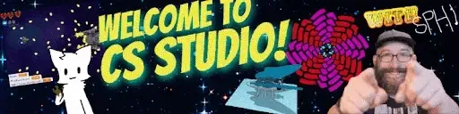

**\[****image description****: An animated google classroom banner that says “Welcome to CS Studio!” The banner is filled with examples of student work, in Scratch game-making, animation, motion graphics and 3D. There is also an animation of Shawn Patrick pointing at the camera and smiling on the bottom right of the banner.\]**

**Saber Khan: So much of the age we’re in, of Computer Science for All, is not about the students that are in small classes with a lot of resources, it’s more about the students in your kind of classroom. Can we talk a little bit more about your students? How do they react to the work that you’re putting out? What do they make? What do they want to make? How do they share it?**

**Shawn Patrick Higgins**: It’s been interesting doing this work with so many students, because you have students that approach it completely differently. At the start, I have students work sequentially with project-based assignments because it builds fundamental skills. From those initial projects, the outcomes are media artifacts that the students reuse in work later on, and I find that really effective. That’s probably one of my core philosophies — the idea that what you’re making isn’t a complete object to be left behind, but you know you’re going to use it again. That might be in the next project, or three or four projects later, or it might not be until the next year.

That’s something that I feel really builds connection. It’s like if you’re doing a history class and last year you talked about a person or writer, and then you hear about them again in a different historical context — you have that prior knowledge. When you’re digitally creating an artifact and you’re able to use that artifact again, that’s been one of the structural things that I found the most success with.

I’ve also found success using Scratch not just as a tool, but as an educational model. Five years ago, I went to [Harvard’s Creative Computing Institute](https://creativecomputing.gse.harvard.edu/guide/index.html) for a week during the summer, and that really helped crystallize a lot for me about why I was teaching and the teacher I wanted to be. Getting into Scratch not just as a way to code but as inspiration on how to teach in a way that centered remixing and students’ fandoms, was one of the most impactful takeaways from me. Getting to work with [Karen Brennan](https://www.gse.harvard.edu/faculty/karen-brennan) that summer, and then reading [Mitch Resnick](https://www.media.mit.edu/people/mres/overview/) for the first time, gave me the context on how to level up and really create with my students on a higher tier. In turn, working as a Teaching Fellow with Processing Foundation, I think about how I can use p5.js in those same ways that I’m working with Scratch.

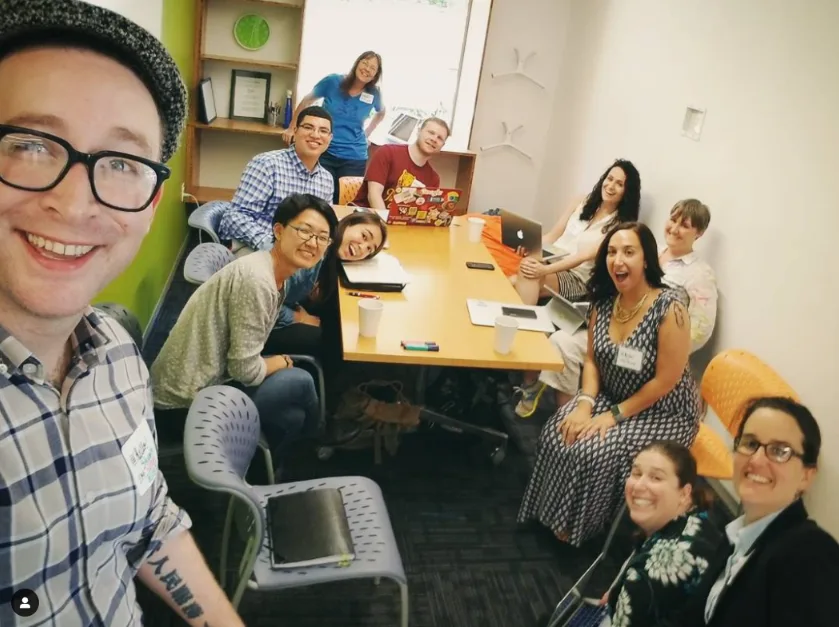

**The ScratchEd Summit in Boston with ScratchEd facilitators from around the country. \[****image description****: Group selfie photo by Shawn Patrick, who is smiling on the left. Ten people are behind him at a table, all smiling at the camera.\]**

**Saber Khan: I feel like it’s worth mentioning this distinction. You’re not using Scratch just to teach Computer Science and Computer Science concepts. What you mean is you’re using Scratch as a production tool, to make materials and assets that students can use in their own creative projects. You’re creatively minded about Scratch — which is kind of what the original intent of the tool is, especially for students. They’re not interested in what they’re learning from it — well maybe they are, but that’s not the main thing — they’re interested in what they’re making with it.**

**Shawn Patrick Higgins**: Right, absolutely. There is a quote from Mitch Resnick that’s something like: “Coding should be thought of the same as a pencil, for the students to create with as they wish.” What are they going to make with it? That’s up to them, but they learn coding can be as easy as making a sketch. Exactly what you just said.

> “You want to help them find out what they love, and then they can do with it what they want. That’s my job. They have questions on the technicals and run into a problem? That’s my job to be their support. I’m there to help them make, whether it be coding or podcasts or posters and Gandalf memes — it’s no problem. As long as they’re making and creating, we’re all making progress.” — Shawn Patrick Higgins

I’ve always started my classes teaching basic Photoshop skills, which is shorthand for graphic design skills. We use [Photopea](https://www.photopea.com/), a free web-based Photoshop alternative. I do this because there are so many usability and digital literacy skills that you don’t think about, that students need to develop, like keyboard shortcuts or visual layer management. Most middle-schoolers aren’t using keyboard shortcuts. You start with simple things. We start with creating a computer or cell phone background. They could do one for their parents, one for themselves. Then we get into YouTube and making a YouTube banner, so it’s all the basics of moving things around digitally.

By the time we get into Scratch after our graphic design unit, there are skills that translate precisely, which many teachers don’t think about. If you right-click on a layer in Photoshop, you can duplicate it — it’s the same process in Scratch. For example, in the Scratch project “[Paint with Gobo](https://scratch.mit.edu/projects/10015857/),” there’s a sprite, a ball that’s moving around the screen and changing color. You right-click on that sprite in Scratch, and can duplicate it. Now it’s got the same code, but it has randomness — all of a sudden you’ve got two balls moving around the screen, do it two more times, and then you’ve got four.

When I first saw Scratch ten years ago I was like, “oh, this is kind of like a free low-resolution After Effects!” I focused on motion graphics with the initial projects and then added audio. So it was like, “okay, we’re focused on motion and movement. I’m a video teacher! I get this!”

There’s a later project where we take digital art that the students previously drew and we duplicate, rotate, duplicate, rotate. You’re kind of making these graphical mandalas, this repetitive circular pattern. We save that as a PNG, then port that over to Scratch. You rotate it, duplicate, resize, and repeat in different ways. Screencast it, turn it into a GIF, and *voilà*! A student can show off an animation of motion graphics they coded using their own original graphic design and digital art. Of course there’s so much more they can do other than that. When it’s based on their prior work and passions, that’s the key.

**The evolution of a student’s small digital drawing. \[****image description****: A digital drawing of an abstract shape, similar to a pointed G, rotated 90 degrees counterclockwise. It is a purplish blue color and has a 3D appearance, with two simple purple wing shapes below it.\]**

**\[****image description****: An abstract symmetrical design with eight illustrated spokes. Atop each spoke is the first image, now appearing almost to be a flower, with the spoke resembling a stem. The illustration has colored leaf shapes coming out of the bottom of each spoke. One section retains the original image’s purple color, and there are three new colors, green, pink, and orange. Each of these colors repeat once across from each other on the symmetrical image.\]**

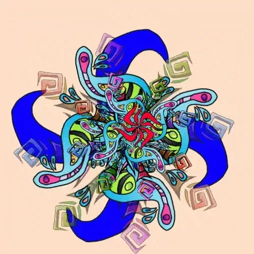

**\[****image description****: An animated GIF showing the multiplied version of the second image, now rotating and changing color. This image is layered with other symmetrical abstract illustrations.\]**

**Saber Khan: How did you get to p5.js? We met at a p5.js workshop a few years ago. How did you end up there? What were you looking for? How does p5.js fit into this very rich world you’ve described for your students?**

**Shawn Patrick Higgins**: The main reason was that I wanted something for my high-end students to explore after they already finished all my core class projects. At the top end of my class, I’ve got advanced game-making, animation, and choose-your-own-adventure projects in Scratch that can take teams a few weeks to do — but where do they go from there, while maintaining that focus on creativity? I didn’t really have an answer for the last few years. As I’ve worked more with it, I think that p5.js can be that advanced pathway. It has many of the same advantages of Scratch, but with an even higher ceiling. It’s online, it’s free, and it foregrounds creativity.

As a teacher, I don’t have money for software. The students absolutely don’t have money to spend on software. It’s a super important value for me that the students can access the tools we use in the classroom from home or from the library. I know some teachers get grants, they get real Photoshop or fancy buy-in programs, but it’s like, well, if the kids can’t use it at home, it’s a huge problem. I learned that firsthand with Obama’s [ConnectedEd initiative](https://en.wikipedia.org/wiki/ConnectEd_Initiative), where I was able to get, I think, 20 copies of free Photoshop. Once I installed them all and started working with it, over the semester student participation bombed. Totally cratered. Because they couldn’t do it at home. They have Photoshop at school, sure, but that doesn’t help them if they go home and want to make a poster for their cousin. But that’s what you can do if you’re using Photopea or [Pixlr](https://pixlr.com/) or any other platform-neutral web-based alternative, which you can’t if you’re locked in to Photoshop.

Looking at everything that’s out there, it seemed like p5.js naturally fit right in. You just login and it’s right there, for free, on any computer. A big thing, and I know we’ve talked about this before, is that it’s higher resolution too. Scratch, for completely understandable reasons, is limited to something like 360 by 240 pixels, so very low-resolution. But as a former film and video person, the importance of fidelity is real. The low-res graphics of Scratch will just lose some students but luckily that’s a limitation p5.js doesn’t have.

**Saber Khan: p5.js fills a nice, advanced area, perhaps for students who’ve done a lot of stuff with Scratch and Photoshop and are ready to move on to more complicated things.**

**Shawn Patrick Higgins**: Right, exactly, but many of the processes are the same when you’re loading in images or sound. There’s a pretty quick visual representation, even quicker than Scratch in some ways. So with p5.js I think I found the thing that’s the best option to teach my high-end students after Scratch. p5.js fits that role perfectly.

**Saber Khan: That’s where you were before summer 2021. What did you apply to do as a Teaching Fellowship project? What did you make? What are these videos and what is your hope for them?**

**Shawn Patrick Higgins**: Yeah! While I had heard of it before, the first time I really got into p5.js was at the [Pathfinders Creative Coding](https://www.infosys.org/infosys-foundation-usa/pathfinders.html) workshop you put on virtually during the summer of 2020. I believe the curriculum was loosely based on Dan Shiffman’s [Coding Train](https://www.youtube.com/c/TheCodingTrain), but taught via Google Classroom and [Peblio](https://www.peblio.co/). That was actually my first ever virtual-teacher training and it was great!

One of the projects we worked on during that workshop focuses on the way images are created in p5.js — and that, in turn, really reminded me of the “[Paint with Gobo](https://scratch.mit.edu/projects/10015857/)” Scratch project. The idea of trying to recreate “Paint with Gobo” in p5.js occurred to me immediately. And it was something that stayed with me evolving over the year, and eventually became the basis of my proposal for the Teaching Fellowship.

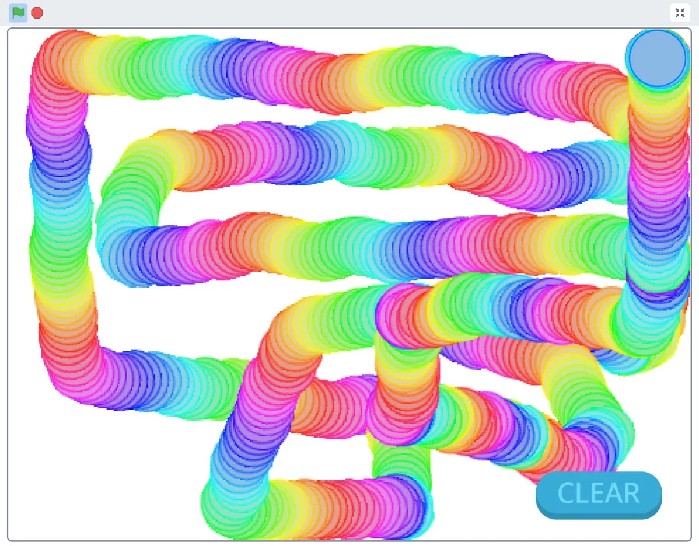

**Paint with Gobo in Scratch. \[****image description****: A screenshot from a Scratch coding canvas. It is a white square with a small green start flag and red stop sign in the top left. In the bottom right, there is a blue “clear” button. Within the canvas is a rainbow tube that has been drawn all over the screen, created by the mouse which prints a small circle wherever it goes. The circles are the same size, and each circle is a different color, creating the rainbow effect.\]**

**Paint with Gobo in p5.js, made during day two of* teacher training at Infosys Pathfinders, for the “Drawing Apps in p5.js” project. *\[****image description****: A digital image that appears to be created with printed circles. Each circle is a beige color with a black outline. The background behind the worm-like circles is a light pink to dark pink gradient. The beige and black circles create eight vertical tubes of various sizes which cross the screen. Atop them there are 10 small semi-transparent beige circles with lines connecting them.\]**

**Saber Khan: Do you want to describe what Paint with Gobo is?**

**Shawn Patrick Higgins**: For anyone who doesn’t know, it’s one of the best introduction projects to Scratch, especially for younger students. There’s a very small amount of code, basically changing color, and repeatedly printing one sprite over and over while it follows the mouse rotating and bouncing around the screen. It looks pretty goofy initially, but if you’re hitting the spacebar, it changes shape and basically becomes a sort of abstract painting tool.

Taking your time with it you can create a pretty amazing pixelated rainbow canvas. It’s also one of the best projects for remixing and tinkering because you can easily modify it by adding in your own custom images or, as I mentioned before, duplicating the gobo-art brush. You can take a photo yourself, you can download a photo of your favorite cartoon, you can do a shape, or you can draw your own. The hallmark of a great intro project is that with very little code you can create something visually stunning. “Easy but awesome” is definitely the mantra for getting that initial buy-in from middle schoolers.

**Saber Khan: What were you hoping to do with this existing Paint with Gobo project with the Fellowship? How were you hoping to use the support to do more?**

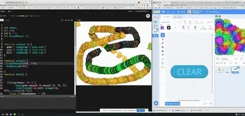

**\[****image description****: An animated GIF showing two screens. On the left is a p5.js version of Paint with Gobo in dark mode, with code on the left, and on the right, a gobo and circle icon following the mouse and printing itself across the screen. This emulates the Scratch project on the right, which shows half of a Scratch project doing Paint with Gobo. The ”clear” button is on the costume tab. On the top right of the screen, rainbow Gobos are shown printing around the bottom left of the Scratch canvas.\]**

**Shawn Patrick Higgins**: Like I mentioned, this project had been in the back of my mind since day one of p5.js training. It feels like there’s a very natural progression between the Paint with Gobo project and the initial suggested p5.js projects. But I love the idea of bringing back what was effectively a starter project in 6th grade, and up-mixing it to a syntax language as one of the final projects in 8th grade. An echo of that [spiraling](https://en.wikipedia.org/wiki/Spiral_approach) [remix pedagogy](https://education.storyblocks.com/blog/remix-education-for-improved-digital-literacy/) I was speaking to earlier.

Something that was sort of unexpected for me while trying to port this project over was the challenge of how many guardrails exist in the way Scratch interprets visuals. It’s been a challenge trying to approximate the way Scratch behaves. But that challenge brings its own rewards. I’m sure everyone who teaches Scratch has the experience of kids coming in and saying, “This is great, but where’s the real coding?” You get a lot of old-guard high school teachers coming in and saying the same thing, basically talking down on visual programming. I think that’s part of a broader conversation of what constitutes real programming. For my sixth graders who come in and say, “We did Scratch in fifth grade, I already know it.” I always say “Well, if you get into Harvard you’ll be using it freshman year, so I think we can keep going with it for at least a little while longer.”

**Saber Khan: Quick aside: I’ve taught middle and high school and we would all start with Scratch across the board, whatever the grade. Even for advanced kids it’s a really great tool to see conceptually what they understand because the visual should be pretty easy. It’s such a lovely place to start, and to spend time and build something with a bunch of people together. That’s a really nice part about it — it has a great community feeling.**

**The other thing I want to say is that I think this authenticity problem, the question of what “real” coding is, comes up with p5.js too. Almost every week I bet there’s some kid sitting in Java class being like, “When are we going to do the real programming? When am I going to do AI?”**

**Shawn Patrick Higgins**: Oh, I guess I did lie when I said I hadn’t really ever tried to do “real” programming before. I think, when I was 16, I bought *C++ For Dummies* book and got 100 pages in before giving up, completely confused. I was like, “I’m going back to Photoshop.”

Alas, just a few years too early for Youtube.

**Saber Khan: \[*Laughs.*\] A very real and honest answer. Back to the Fellowship. You’re making tutorials that allow your students who have made a project in Scratch to remake it in p5.js. You’re giving them options for remixing and creating more — but through projects they’re familiar with already from Scratch. Is that correct?**

**Shawn Patrick Higgins**: That’s the idea. The first one is Paint with Gobo, but I also want to do a soundboard project which has always been a favorite with students. In the same way that we saved our visual assets while working in Photopea to later use in Scratch, we do the same thing with audio editing in a later unit. It’s mostly basic audio sampling, levels, that sort of thing. We do celebrity conversation remixes and a review podcast, but at this point in the class the students are wise to the fact we’ll be using their audio projects again later. It’s an important step, because when we go back to coding audio and interaction, the students have their own personal audio samples to work with, same as they had visually when we were doing motion graphics.

One common complaint that I hear from teachers first learning Scratch is a ton of frustration around the fact that the students will just remix someone else’s project and it’s not their original work. You completely disarm that as a potential problem if every project is using the students personal assets they’ve made in projects before. Obviously, you have to go through this pipeline where the students first make the things, but I absolutely feel like it’s worth it.

For p5.js and the Teaching Fellowship, what I proposed was to add an additional level on top of that. You have your assets that you made from the initial audio and visual projects, then you’ve put them together in your prototype Scratch project — now let’s iterate and upscale it into HD using javascript. Let’s step up the quality, and let’s do it in syntax so it’s another iteration on top with the assets that they’ve used before. To get students engaged in coding, my job as a teacher is to *prove the value* of it to them. I feel like this spiraled approach is a better intro to familiar yet complex projects like a soundboard, or a choose-your-own-adventure story, or a basic website project.

What I wanted to do in the Fellowship was to create some videos for my class (and anyone else) as another tier atop the original versions of these Scratch projects, essentially remixing them into p5.js. So we’re increasing the fidelity, we’re using a different coding language, but that’s going to be a lot more familiar to the students if they’ve done that original project. They’ll have their assets that will be unique, they’ve gone through the philosophical idea of how to put everything together already, and now we’re just using a different form. For me, it’s a bridge for my students that continues the idea of constantly using and repurposing what we’ve done in the past.

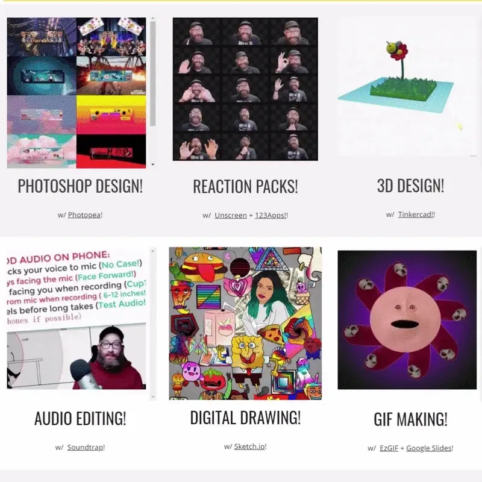

**Topics covered in Shawn Patrick’s class. \[****image description****: A large animated GIF with a gray background with the following topics: Photoshop Design!, Reaction Packs!, 3D design!, Audio Editing!, Digital Drawing!, and GIF Making! Each topic has a small square above it with an animated GIF.\]**

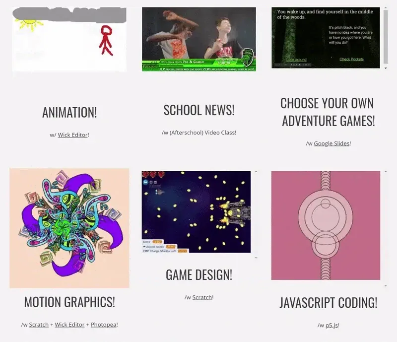

**Topics covered in Shawn Patrick’s class. \[****image description****: A large animated GIF with a gray background with the following topics: Animation!, School News!, Choose Your Own Adventure Games!, Motion graphics!, Game Design!, Javascript Coding! Each topic has a small square above it with an animated GIF.\]**

**Saber Khan: I really like your point about needing to have a community library of assets for students to be able to produce stuff that’s going to inspire them, otherwise they have to go to the Internet and grab stuff that they don’t have licenses to. That’s something a computer science teacher might not think of, but that you, having an art training, are more aware of.**

We’re still in COVID time and it’s difficult to meet in person. Everything has to be scheduled online. What was it like doing the project in this context? How much did you get done versus how much you thought you’d get done? Do you have any thoughts about trying to complete a project somewhat asynchronously, with some support? What are your thoughts about how the Fellowship went and what you learned through it, on a meta level versus the nitty gritty of what you made?

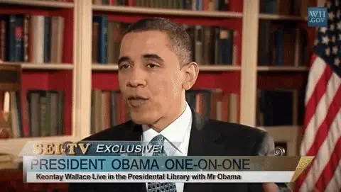

**\[****image description****: An animated GIF showing a clip of a “celebrity remix” video, where a student with a greenscreen background image of the presidential library seemingly interviews President Obama in the same room. There is a visual school banner and WH.gov icon overlaid in the center and top right of both shots to create the illusion the clip is authentic.\]**

**Shawn Patrick Higgins**: On the meta level, I think it accomplished exactly what I wanted it to. The volume of accomplishment was a bit smaller than I was hoping, but I think, especially in talking to some of the other educators, we’re always ambitious and we’re always biting off more than we can chew. I received a lot of support in the program from other Fellows. [Ted Davis](https://medium.com/processing-foundation/p5live-walking-through-a-collaborative-p5-js-environment-for-live-coding-bc39d95908c6) gave me a lot of great feedback.

I think, of all the Teaching Fellows, I was probably the least experienced using p5.js going into it. I’d had the teacher workshop, and messed around with p5.js in three or four personal projects, maybe 20 to 25 hours of experience total? Throughout the Teaching Fellowship that jumped up to about 80 hours.

We talked about this as it was going on, but as someone for whom all their knowledge is coming from Scratch, there are so many guardrails that you don’t necessarily know about going in. That challenge for me is also the likely experience of any student that will be doing the same transition, so it’s an incredibly valuable experience to go through that and experience it yourself.

What I wanted was to force myself as an educator to create this higher tier, and the Teaching Fellowship enabled me to do exactly that for my students. It’s adding extra rungs to the ladder so my students can climb higher. I think, especially using the form of video, the idea is that other people can have access to that too. I’ve learned a couple lessons in approaching something that’s a bit more complicated, especially for younger students: I need to strive to make it as simple as possible.

Some of the feedback that I got was, “Could you do a couple starter videos to get us into this?” My initial response is that I don’t want to necessarily do that because there’s already a great progression pathway through the Coding Train for students who are passionate about it. So the idea with these videos was that we’re specifically recreating a popular Scratch project. And that I’m not ramping up into that with other videos. But the feedback I’ve gotten was: That works for some students and it doesn’t for others. They want more background knowledge before jumping in and doing it. I’m thinking incorporating a small p5.js intro unit using the Coding Train or maybe something like the work \[Teaching Fellow\] [Angi Chau](https://medium.com/processing-foundation/three-layer-cs-cake-how-to-make-sure-every-kid-gets-some-cake-f7ee52e147f1) is doing before these intermediate Scratch to p5.js projects might be best.

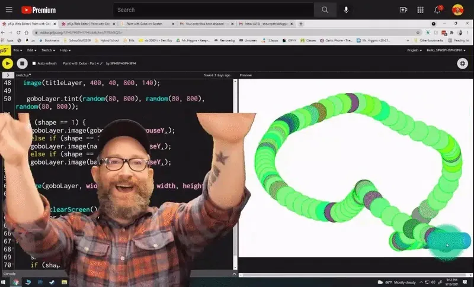

**\[****image description****: An animated GIF showing Shawn Patrick, wearing a red and gray plaid shirt and black baseball cap, enthusiastically gesturing toward the camera. Behind him, a p5.js editor screen with the Paint with Gobo code is successfully running, making a snake-like animation of green circles.\]**

One of the values that Scratch really encourages is the idea of tinkering: just build it. You don’t even need to know exactly what’s happening — play with it, explore it, change it, remix it. As a philosophy, that works really well in Scratch. And it can work just as well in p5.js, but because the code is not visual, it’s more difficult for students to tinker and not critically break their program. The ability to undo in Scratch is much simpler. If you mess up, you can step back very easily. Theoretically you can in p5.js, too, but when it’s line-by-line or even character-by-character, it’s harder to catch that undo precisely.

**Saber Khan: Maybe once they get enough confidence in the code, it becomes easier to remix in p5.js. But right off the bat it’s not going to be super welcoming. So many things can break in Javascript with just one misplaced dot or whatnot.**

**Shawn Patrick Higgins**: Ultimately, I broke Paint with Gobo into a complicated version and a simpler version. I’m thinking about how to make an even simpler one. To step back and have three tiers of each video — introduction, intermediate, and advanced. I think going forward, that’s probably what I’ll do. I’ll try to shorten them because if it’s a 25-minute video, it’s too long for some folks. Especially the younger ones. If it’s more than 10 minutes some students are like, “Argh that’s impossible! I could never *live* more than 10 minutes!”

**Saber Khan: A quick aside: It sounds like there’s always more room to explore what beginners need. It’s something that I’ve heard many times in this community, and it seems like you discovered that too. I know, in trying to help you over the summer, a lot of decisions were made for you by Scratch. With p5.js, you have to recognize the decisions that got made by Scratch and then you decide if you want to follow that logic with p5.js or recreate it in some other way to get a similar effect.**

**Shawn Patrick Higgins**: Absolutely. It was a fun process for an educator to go through, to be mindful to harness those lessons and try to embody that in the next iteration going forward.

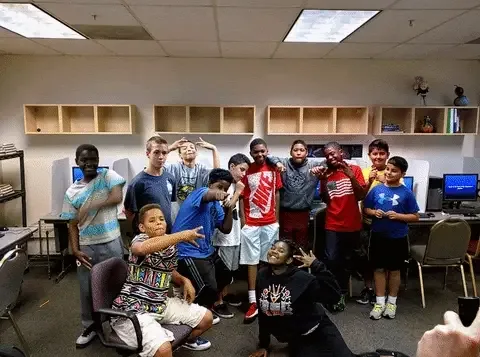

**\[****image description****: An animated GIF of a group of students taking a group photo during a game-making camp in Shawn Patrick’s computer lab.\]**

**Saber Khan: Scratch is such an important part of technology education. It really has laid a way forward, especially in progressive education and tech. I’m wondering what you see, since you’re such an involved member of the Scratch community and now involved in the p5.js community, as connections and opportunities between the two communities?**

**For us, it seems like a natural transition to go from Scratch to p5.js. But as you pointed out, there were a lot of challenges along the way. I’d love to hear your bigger thoughts about where those two communities are and ways that we might interact together.**

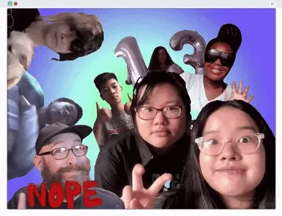

**\[****image description****: An animated GIF of a Scratch coding canvas, that has several GIFs of Shawn Patrick and his students waving, giving the peace sign, thumbs up, and generally greeting the camera in various ways while a multi-color gradient background loops.\]**

**Shawn Patrick Higgins**: One of the number one things is: folks don’t know what they don’t know. Educators don’t know what they don’t know. That is a supreme problem across the landscape, because everything is so fragmented, but there’s so much in development. There are so many free tools on the Internet that are being developed that it’s almost impossible to keep up. Literally every other month there is a new free or paid tool, or an update to Blender, or a change in Unity. It’s kind of the same thing in education; there are so many things being developed even if you’re super tech savvy it’s hard to keep up with everything that’s happening, let alone be proficient in it.

I think with the p5.js and Scratch communities, it’s a great transition for students who want to experience syntax coding to challenge themselves. But the biggest issue is most people don’t know about it, even though they came from a similar place. Processing and Scratch ten years ago were probably even more closely related. So one of the biggest things is just raising awareness.

I think the Coding Train stuff has become very popular, especially for people learning higher-end things. As I started this, I was looking for project videos in p5.js, and there aren’t a ton. There are *some*, but they’re often abstract things. I think, as p5.js becomes slicker and slicker, as it proliferates and grows, there will be a huge growth of people who adopt it and make with it and show off what they’re making.

**Saber Khan: We were very excited to support your project because we totally agree with you. We feel like these projects that understand the Scratch context, and then make them in the p5.js context, are of such value. Sure, there are a lot of Scratch teachers, but they might not know about p5.js. Now that you’ve completed one set of this, what do you hope the reception or consumption of your video will be like outside of your classroom? Who do you think might consume it and how might they use it?**

**Shawn Patrick Higgins**: Ideally, someone who has had a lot of experience with Scratch, in maybe the 8th, 9th, 10th grade range, or anyone else in similar circumstances where they’ve had experience with Scratch but they’re wanting to jump into syntax — and maybe for whom Paint with Gobo is a fun throwback.

In retrospect, going through this process and getting the feedback I did, I think that the two other projects that I’m planning on doing will probably work better as introductions. Paint with Gobo is a phenomenal introduction to Scratch for various Scratch-specific reasons, but I do think that making a soundboard or making a basic interactive website with just information, those are things that will be simpler for teaching that connection between Scratch and p5.js.

The feedback I kept getting was, “Can we simplify it?” And there are projects where you can do that, but when it’s so deeply rooted in project-based learning, a functional outcome is pretty important — if their soundboard or websites just don’t work the way they want, in the end you’ll lose a bunch of students. So it’s a balancing act, pedagogical speaking.

Paint with Gobo is a good conceptual learning experience for any student, but I’m excited to get on to the other videos where we’re making a product that the students can actually use. So I think, in retrospect, I did these out of order. Paint with Gobo should probably be the third in sequence. I should have started with the website first, since essentially it’s just simple interaction and the visuals.

**Saber Khan: Yeah, but maybe that complexity wasn’t clear to you earlier? I think we discussed the way p5.js handles draw and setup, and how that creates challenges for moving these Scratch projects over. That was probably not very clear. It was not clear to me either. I wouldn’t have been able to identify that. It is quite an interesting thing to learn.**

**You mentioned your reliance and your appreciation of open source and free tools, an ethic that Processing Foundation also shares. What are your thoughts about that? What is it like using these tools?**

**Shawn Patrick Higgins**: I’ve been doing this for a decade, and economic equity is a huge issue for both urban and rural schools, as well as for staff. The cost associated with all these gadgets and teaching tools can be astronomical, if you’ve been to one of the larger ISTE ([International Society for Technology in Education](https://www.iste.org/)) conferences, there is just a sea of amazing stuff that is completely outside the price range of 90 percent of teachers. I’m sure the vast majority of teachers are in the same position as me, where they just don’t have any money. Sure you can keep trying to write grants year after year, but a decade on your friends and family get tired of chipping in to your DonorsChoose every six months.

And there are so many free options! There are so many resources that are really good that teachers just don’t know about. I think there’s always the danger of the products just disappearing — like the [Google Wave](https://en.wikipedia.org/wiki/Google_Wave) effect. But they’re free, and some have been around for a very long time. At this point if something has been around for 5+ years, it’s probably not going anywhere. Along with p5.js, Scratch is free, [Wick](https://www.wickeditor.com/#/), similar models. There are so many resources. I talk to teachers and they have no idea.

It’s hard to keep up, and just following other content creators who are talking about these things eats up a lot of attention and space. It’s really inspiring, though, not just for teachers but more importantly for the students. Because at zero cost, students can do great animation, great graphic design, and make high-quality programs and motion graphics. In the same way that I first looked at Scratch and thought about it as After Effects, that’s even truer for p5.js.

**Saber Khan: I wanted to circle back to the point you were making about how a lot of teachers view Scratch as a computational-thinking tool. Thinking about Scratch and p5.js not as just tools for learning but tools for creation — while it seems so simple to say that, it is not often true in an educational context. Often the educational goal becomes number one, so it’s refreshing to talk to someone who cares about something that the kids also care about so prominently.**

**Last, can you describe more of what you’d like to see in the future?**

**Shawn Patrick Higgins**: I’m really excited to have started on this path because it’s an area I’ve been wanting to level up in for awhile and I finally am. The sheer vastness of creative potential of all these free tools, and the way kids can potentially harness them if teachers step up though, it’s truly awe-inspiring.

If your students want to get into graphics design, for no cost they can do that. Or sampling and remixing their favorite twitch streamers. Or coding data representation. Or building 3D miniatures. Or getting into interactive animation. There are just so many ways to “make” with creative technology. As the breadth of options becomes larger and larger, there is an entry point for any student. Sure, some too-cool 14-year-old who hasn’t had a great experience with school might not be super excited about typing out a wall of HTML, but maybe sampling the newest CoryxKenshin clip and making a soundboard in Javascript out of their favorite edits will do the trick. All the zero-cost tools are there for this identity- and passion-focused curriculum to work, it’s just finding teachers who are able to make it happen in their classrooms.

In p5.js, if the students have climbed all the way up to the top of this middle school ladder and they want to experiment and engage, they can. If they want to keep on Scratch, they can. I’m lucky: it’s giving the students as much exposure to all the different ways that they can create.

You want to help them find out what they love, and then they can do with it what they want. That’s my job. They have questions on the technicals and run into a problem? That’s my job to be their support. I’m there to help them make, whether it be coding or podcasts or posters and Gandalf memes — it’s no problem. As long as they’re making and creating, we’re all making progress.

**Saber Khan: That’s a wonderful sentiment to end on, so why don’t we end there.**
