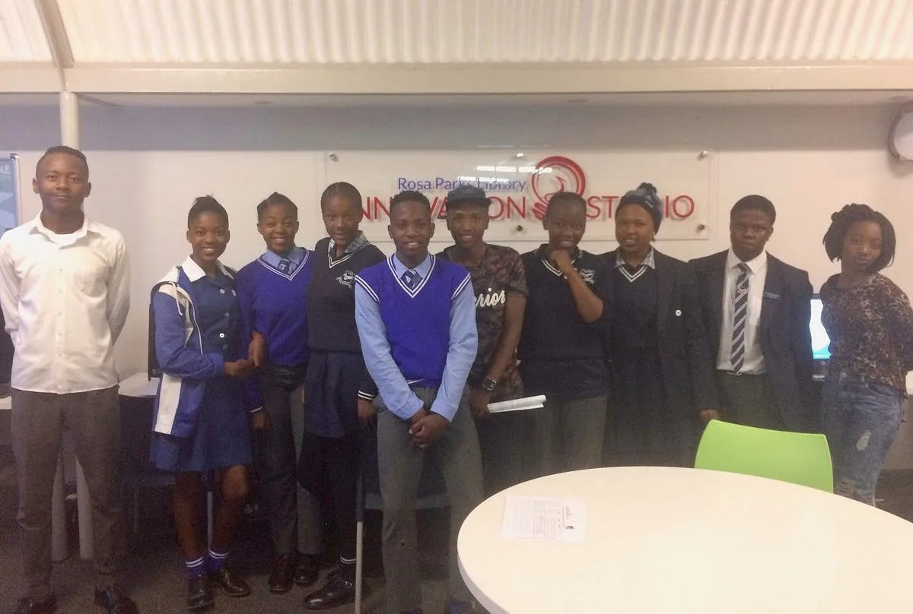
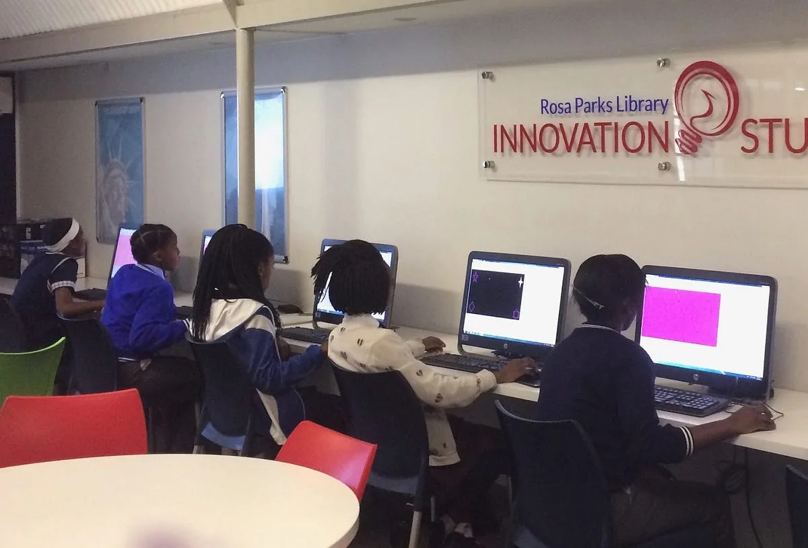
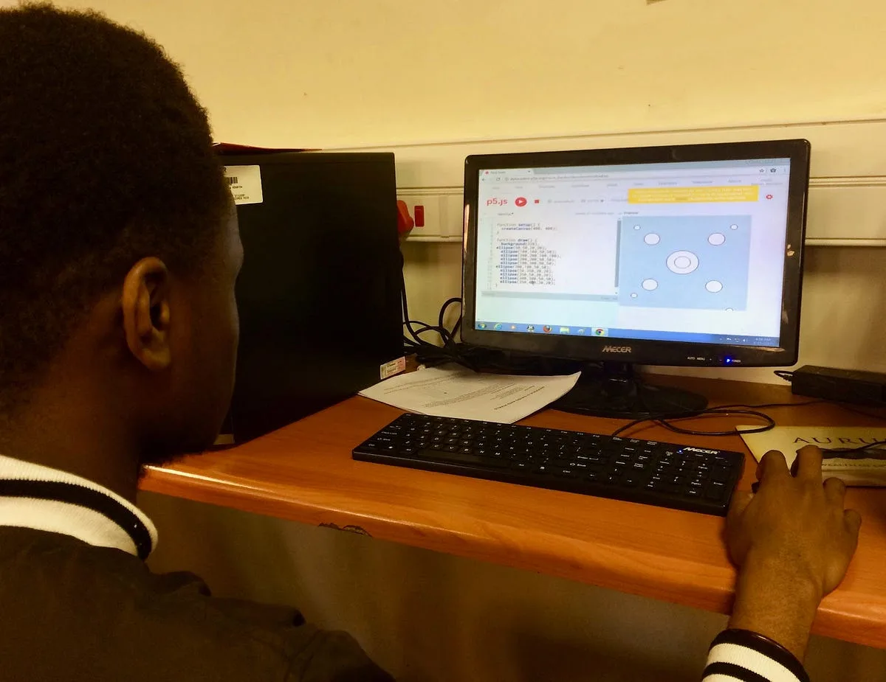
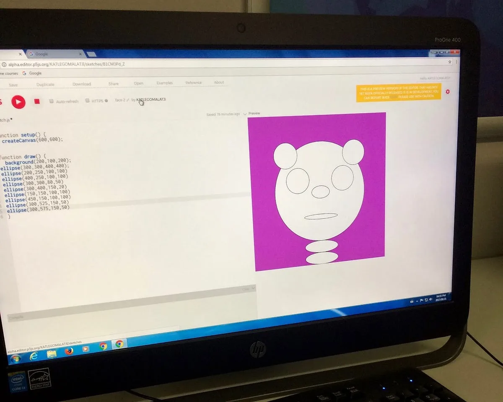

The 2017 Processing Foundation Fellowships supported an unprecedented seven research projects that expanded the p5.js and Processing softwares and their communities. Fellows developed work ranging from bilingual zines, to accessible coding curriculum to be taught in prisons, to workshops aimed at teaching code to women, non-binary, and femme-identifying folks. Throughout the summer we’ll be posting a series of articles — some written by the fellows, some in conversation with Director of Advocacy, Johanna Hedva — that showcase and document the great work by this year’s cohort.

---

*[Niklas Peters](http://www.niklaspeters.com/) is a visual artist and musician based in Johannesburg, South Africa. For his fellowship, Niklas developed and piloted a curriculum to introduce students with low computer literacy to the fundamentals of computer programming and creative expression through code. Niklas was mentored by [Daniel Shiffman](http://shiffman.net/).*

From my first experiences in creative coding, I’ve been impressed by the openness and generosity of the Processing/p5.js community. There are countless resources for students to teach themselves to code, which I’ve benefitted from as a self-taught programmer. However, many people face significant barriers in accessing these self-directed paths. Students from marginalized groups often lack a baseline familiarity with computers, and even if they become more comfortable with computers, coding can seem cryptic and inaccessible.

*Ten students from three different high schools in the Soweto township in South Africa learned the basics of creative coding in p5.js.*

My fellowship aimed to bridge that gap. I designed a curriculum for students with low computer literacy, with the end goal of having participants make basic programs and feel comfortable to continue their coding education by accessing free resources on their own. Learning to creatively express yourself with code is very empowering. For me, it was a driving force to learn more about programming to make my ideas come to life on the screen. Hopefully, mastering the basics of p5.js will motivate students to explore new ideas and skills which previously seemed unattainable.

To develop this curriculum I had to imagine what it’s like to have no familiarity with computers. What does “double clicking” mean? How do I type something on a new line? How do I type symbols like ( ) or { }? How do I create new folders and save files in that folder? It made me realize how much I now take for granted when using a computer.

*South African high school students getting familiar with the mouse and menus by using MS Paint.*

In July, I ran a pilot of my curriculum with high school students in Johannesburg, South Africa. The first few modules covered the basics of using a computer, including drawing with different brushes and colors in MS Paint, exploring keyboard shortcuts and special characters, and navigating files and folders in Windows.

At first, many students needed help figuring out practical skills like which mouse button to click and how to use the Shift key. However, the students progressed very quickly. I found this surprising at first, but realized that their ease came from a familiarity with using smart phones every day.

*Porch, a participant in the pilot group, makes a pattern with ellipses using the web editor.*

The most exciting part of the pilot was seeing the students create their first sketch in the p5.js web editor. There were murmurs of excitement throughout the computer lab as they saw their first circles appear on the screen, and found they could control a circle’s size and position with tiny modifications to the code. As the students learned more about colors, variables, and how to make their sketches interactive, their excitement about the possibilities of creative coding grew.

*Using the p5.js web editor, a student named Katlego made her first sketch in code.*

Since finishing the pilot, I’ve started teaching the curriculum with a second group of students in Soweto. The full course consists of 10 stand-alone modules, each designed to take 90 minutes to complete. During the first half of each module, new ideas and tools are introduced; students spend the second half experimenting with the concepts they learned that day. The latest version of the curriculum [is available on GitHub](https://github.com/nikfm/p5jsCurriculum). Other educators are welcome to use the modules and modify them as they see fit for their context.

The Processing Fellowship reminded me how empowering it is to learn to code. I experienced this when I was teaching myself creative coding, and now, I’ve been able to share the joy of learning a new skill with a few dozen students in South Africa. I will keep teaching the course with funding from local organizations so that (hopefully) hundreds of marginalized students will be writing basic programs in p5.js and feel empowered to continue their self-directed coding journey using existing online resources.
