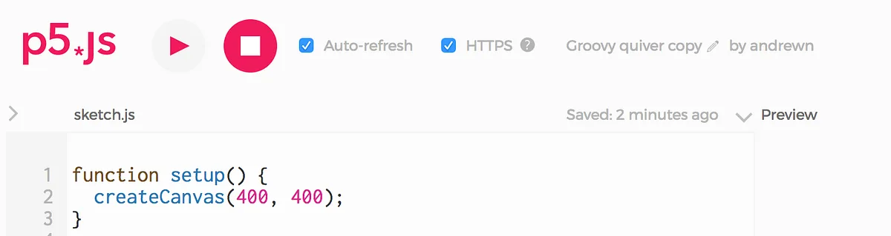
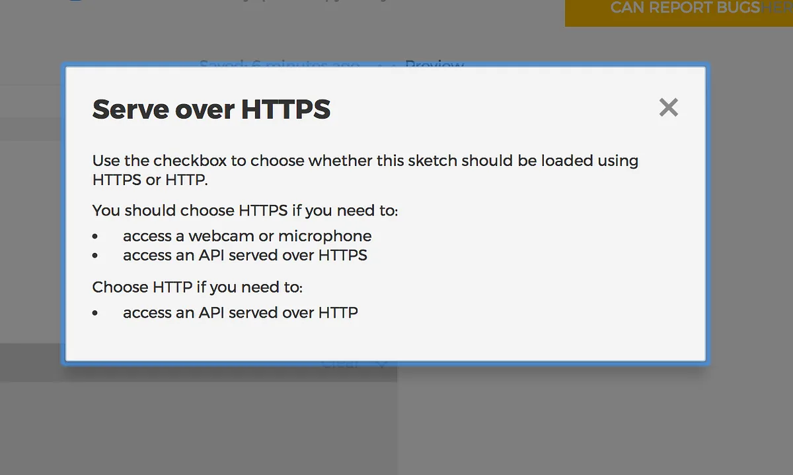
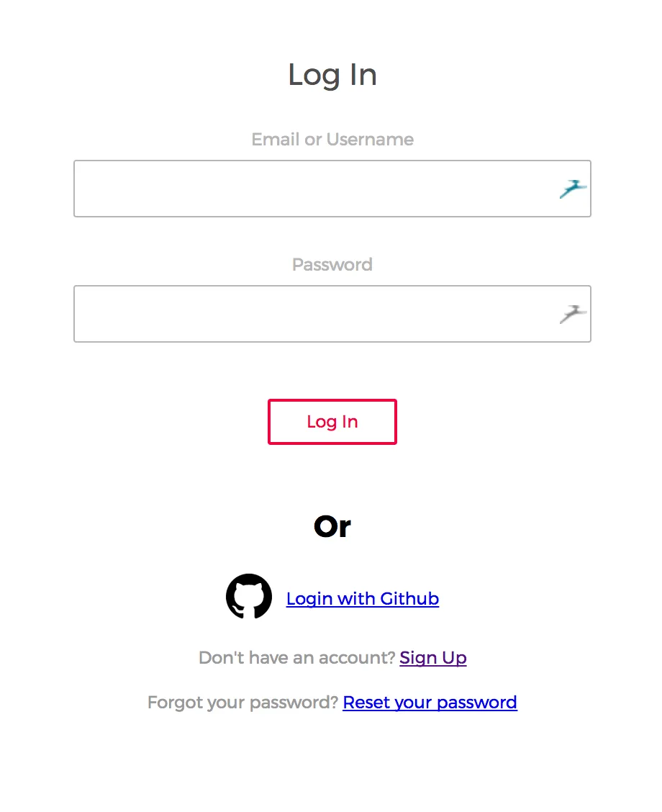
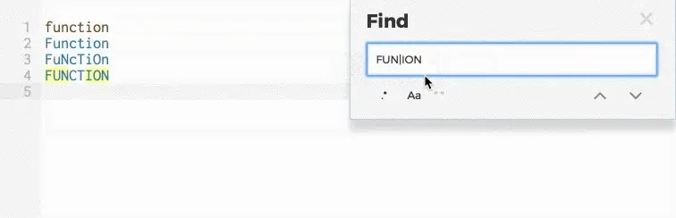

*The 2017 Processing Foundation Fellowships supported an unprecedented seven research projects that expanded the p5.js and Processing softwares and their communities. Fellows developed work ranging from bilingual zines, to accessible coding curriculum to be taught in prisons, to workshops aimed at teaching code to women, non-binary, and femme-identifying folks. Throughout the summer we’ll be posting a series of articles — some written by the fellows, some in conversation with Director of Advocacy, Johanna Hedva — that showcase and document the great work by this year’s cohort.*

---

*[Andrew Nicolaou](http://andrewnicolaou.co.uk/) is a Creative Technologist with a background building web applications and connected products. He’s passionate about the power web-based tools offer for expanding creative expression. For his fellowship, Andrew worked on general enhancements to the p5.js Web Editor. He was mentored by [Cassie Tarakajian](https://github.com/catarak).*

For my fellowship project, I worked on p5.js Web Editor, the web-based code editor that lets artists, educators, and beginners easily create p5.js sketches and share them online. An early “alpha” release of the editor is currently being used to teach creative coding at several institutions, though hearing about some of the educator’s experiences first-hand was great to understand their needs a little better. For example, students were finding it difficult to find specific bits of code in their sketches, which led us to prioritise our own “Find” feature. My mentor [Cassie](https://github.com/catarak) is the lead developer and had a [list of tasks to start with](https://github.com/processing/p5.js-web-editor/projects/1).

The project was working toward a “beta” release that would be open to many more users. The priority was fixing common bugs, ensuring the security of the app and user’s data, and smoothing out areas that might cause users to get stuck. The [full list of things I worked on is here](https://github.com/processing/p5.js-web-editor/commits?author=andrewn). In this post, I’ll cover the four main features I worked on: HTTP/S Switch, Security, Social Login, and Find. These aren’t glamorous but they’re vitally important for the product to be stable and easy to use.

*The small “HTTPS” checkbox switches between HTTP and HTTPS protocols on a per-sketch basis.*

Users can include JavaScript libraries and access powerful browser features (such as the webcam) in their sketches, but, depending on which features need to be accessed, the sketches need to be loaded over the HTTP (insecure 🔓) or HTTPS (secure 🔒) protocols. This can be done by changing the URL in the browser’s address bar, but this was difficult to figure out without being told about it by someone.

I added a UI switch that allows this to be toggled, reloading the page to the correct protocol. This is saved with the sketch so it automatically does the right thing whenever it’s loaded. This UI also allowed space for a help button to explain more about when a user might want to switch.

*A new info box gives examples of when someone might need to switch between HTTP and HTTPS.*

Although being able to access sketches over HTTP is useful, there are some things that should always be served securely, like anything to do with the user’s account such as login, signup, and password settings.

Making sure the app always did the right thing turned out to be quite complex as it depended on whether the user was already logged in, the settings of the particular sketch being edited, and if they were already on a secure part of the site. Switching between HTTP and HTTPS requires a full reload of the browser window, and, to make it more complicated, an editor page on HTTP and an editor page on HTTPS can’t access each other’s browser storage. This means it was possible that the user’s current work could be lost when the page was reloaded. Part of the solution was to save the data temporarily in the user’s browser and to retrieve it again when they are redirected. I also use the URL of the page to pass around information about whether a user needs to be redirected to HTTP or HTTPS. Although it was tricky, the end result for the user should be seamless and secure. 🔐

Another small, but important fix I made was enabling login with a user’s GitHub account, if they had one. This tries to match a user’s account email address with one of the emails linked to their GitHub account. If there’s a match then we can automatically log them in — saving them having to remember another username/password combo!

*“Login with Github” means no more remembering yet another username and password combination.*

A frequently requested feature is having a way to search for code in sketches. [CodeMirror](https://codemirror.net/), the library powering the actual code editor, doesn’t work well with the browser’s built-in “Find” function.

CodeMirror does have a “[search” add-on](https://codemirror.net/doc/manual.html#addon_search) but its user interface isn’t very beginner-friendly and there’s no easy way to alter the design and functionality.

I explored a few technical approaches and looked at what other CodeMirror-based editors, such as [Glitch](https://glitch.com/), were doing. I ended up altering the CodeMirror search add-on to add buttons for the functionality we needed to match the editor’s designs. I then implemented the various query modes exactly as required.

This approach means that it hooks into CodeMirror’s excellent functionality for keyboard shortcuts and that it can highlight matching words and active results in response to the search.

*Fun searching with options for case-sensitive search, whole words, and regular expressions for more advanced users.*

During my fellowship I focused on shipping bug fixes and improvements to the editor based on feedback from early users of the editor and security best practices. I gained an understanding of the whole technology stack and hopefully made it a better experience for users. There’s still [plenty to do](https://github.com/processing/p5.js-web-editor/projects/1), so why not take a look?
