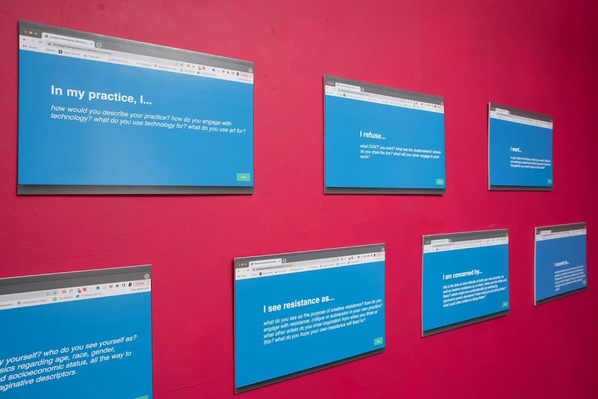
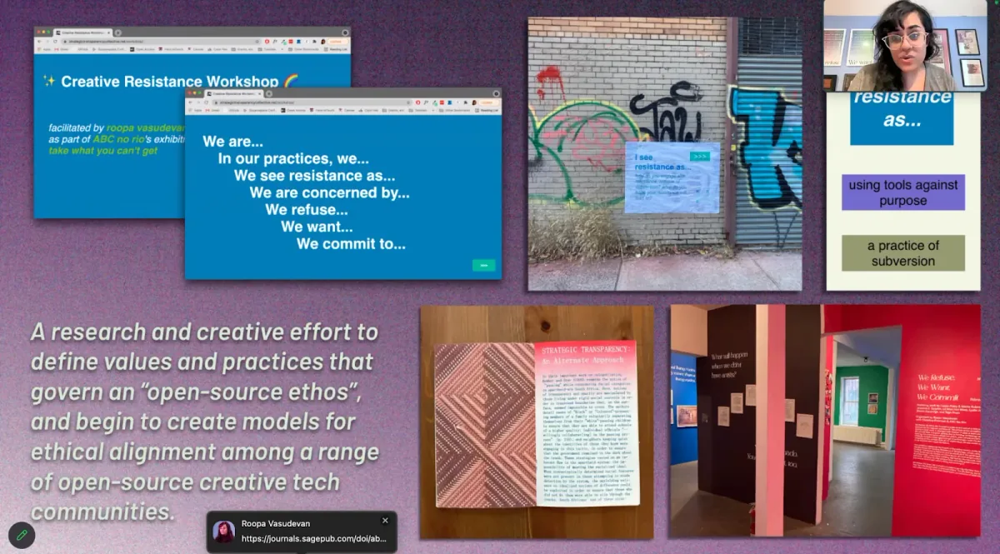

  <iframe src="https://www.youtube.com/embed/lErSCUXS9r8?feature=oembed" frameborder="0" scrolling="no"></iframe>

This year, our fellows have continued to burst open the boundaries of art and technology, creating visionary projects that inspire action, reflection, and connection! Among them, Roopa Vasudevan’s [Aligning an Open-Source Ethos](https://opensourceethos.net) stands out as a transformative exploration of the values and challenges within our open-source communities. We are so honored to support this work and artist!

[Roopa Vasudevan](https://roopavasudevan.com) (she/her) is a new media artist, computer programmer, and researcher whose work examines the intersection of technology and power. Her background spans artistic sensibility and academic rigor — shaped by an MPS from NYU’s Interactive Telecommunications Program and a PhD in Communication from the University of Pennsylvania — Roopa brings depth and innovation to all her endeavors. As an Assistant Professor in the Department of Art at the University of Massachusetts, Amherst, her contributions have been recognized globally through initiatives like the Eyebeam Rapid Response for a Better Digital Future Fellowship and the Mellon-funded Data Fluencies Project.

*Roopa’s Exhibition ‘We Refuse, We Want, We Commit’ at Bullet Space (292 gallery), New York, NY. Organized exhibition with support from Christina Freeman. Image courtesy of the artist.*

Her fellowship project, *Aligning an Open-Source Ethos*, exemplifies the spirit of the Processing Foundation’s fellowship program: using creative technology to examine systemic inequities and envision bold, inclusive futures. Through extensive research, including interviews with contributors to open-source platforms like Processing, p5.js, Blender, and Arduino — Roopa uncovers the motivations and challenges shaping these ecosystems. Her work invites us to reflect on the systemic barriers within open-source spaces, from labor inequities and maintainer burnout to tensions around governance and corporate co-optation.

At the heart of her project is a web-based zine that serves as a living document — a space for community reflection and a platform for participants to share their visions for the future of open-source technology. Complementing this is a beautiful print companion, emphasizing the importance of tactile, intentional engagement — so important in this era. As Roopa puts it, “Reading something in printed form just hits differently. It allows for a more reflective and intentional engagement with the material!”

*Screenshot of Roopa’s Fellowship check-in.*

Through *Aligning an Open-Source Ethos*, Roopa challenges us to broaden our understanding of what it means to contribute to open-source communities. Her research underscores that every action, no matter how small, whether fixing a typo, participating in discussions, or offering design feedback, has the power to build more inclusive and sustainable spaces. By reframing contribution and collaboration, Roopa’s work dismantles traditional hierarchies, ensuring that open-source remains true to its ideals of accessibility, education, and equity.

Supporting Roopa and the other fellows this season has been an incredible privilege. Her project serves as a reminder of the immense potential of open-source. These spaces acting not just as a technical practice but as a means of fostering connection, accountability, and collective action. Her findings, presented through accessible and intentionally crafted resources, are a call to action for all of us to reflect on the systems we participate in and to reimagine them in alignment with our shared values!

I encourage you to explore *Aligning an Open-Source Ethos* on its web platform and pre-order the print zine to experience this work firsthand! As we celebrate this year’s fellows, I’m just so deeply inspired by their vision and commitment to pushing the boundaries of what’s possible in computation communities. Thank you Roopa for this incredible fellowship project!

[Explore Aligning an Open-Source Ethos](https://opensourceethos.net/) on its web platform or pre-order the print zine.

*Stay tuned as we continue to highlight the remarkable contributions of this year’s fellows, each of whom is redefining what is possible at the intersection of creativity and computation. For more information on the fellowship program and past fellows, visit the* [Processing Foundation Fellowship Page](https://processingfoundation.org/fellowships)*. Follow Roopa on* [Instagram @rouxpz](https://www.instagram.com/rouxpz/)*.*

[Donate here](https://processingfoundation.org/donate) *if you would like to support the incredible ongoing work of our fellowship programs sustaining critical work within open-source and creative technology!*
