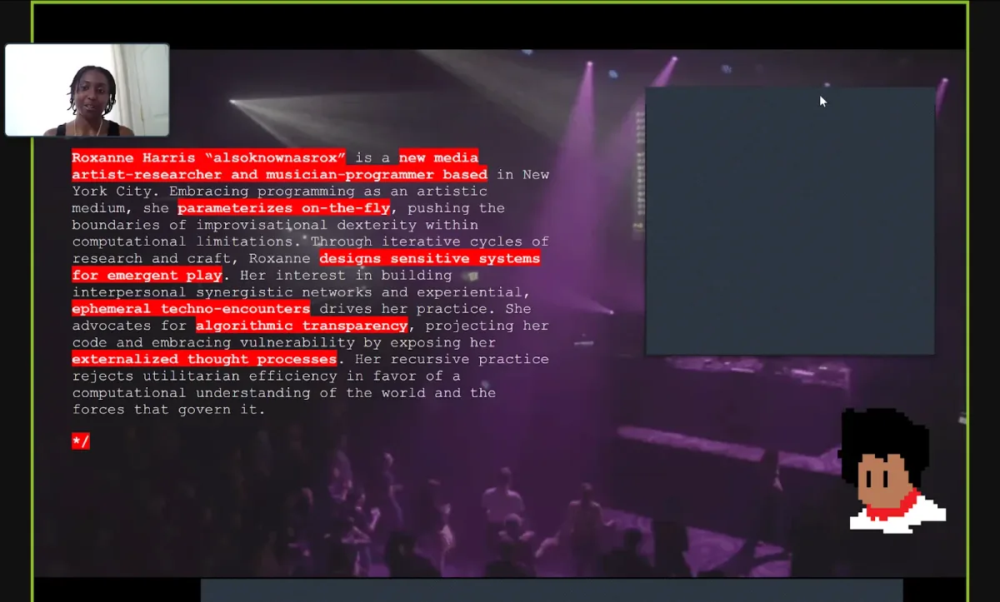
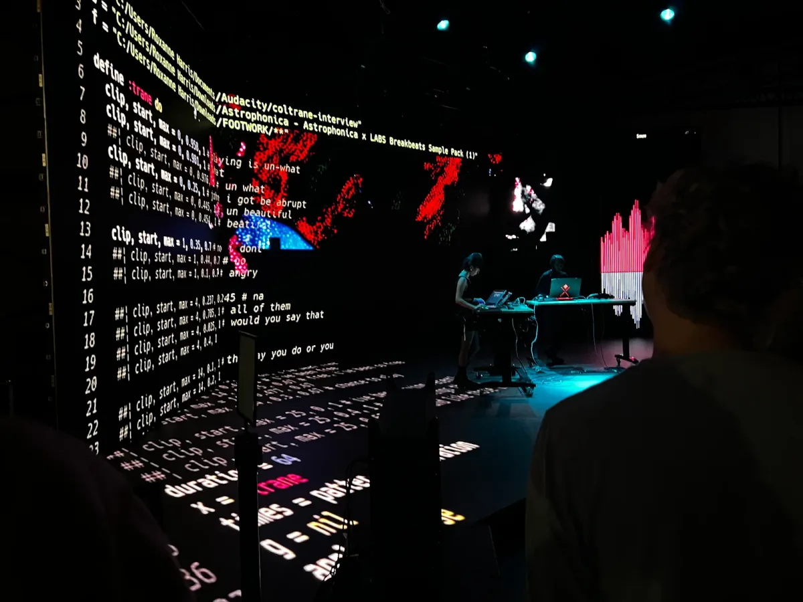

<iframe src="https://www.youtube.com/embed/sxtN4kuUa1k?feature=oembed" width="700" height="393" frameborder="0" scrolling="no"></iframe>

The Processing Foundation’s 2024 Fellowship season has drawn to a close, and with it, we celebrate another year of transformative projects at the intersection of art, technology, and community. This season has been a testament to the creativity and dedication of our fellows, and it’s my honor to showcase one of this year’s standout projects: *Ephemeral Experiments: Decoding Tendencies in Live Coding* by Roxanne Harris.

Roxanne Harris (she/her), known as alsoknownasrox, is a New York City-based new media artist, researcher, and musician-programmer whose work masterfully blends computational rigor with artistic improvisation. Her practice reflects a deep commitment to algorithmic transparency and creative vulnerability, pushing the boundaries of programming as a creative medium. With a B.A. in Computer Science and Music from Yale University and an M.F.A. candidacy in Design | Media Arts at UCLA, Roxanne brings technical expertise and an artist’s intuition to her work. She has performed at renowned venues such as MoMA PS1, ZeroSpace Brooklyn, and Gray Area in San Francisco, and her research has been featured at the International Conference on Live Coding, SXSW, and in *Office Magazine* and *Alternative Press*.

Roxanne’s project, *Ephemeral Experiments: Decoding Tendencies in Live Coding*, is a groundbreaking exploration of the ephemeral nature of live coding performances. Live coding — a practice where artists write and modify code in real time to create music, visuals, or other outputs — is inherently improvisational, with its processes often fleeting and undocumented. Roxanne’s project bridges this gap by developing a platform-agnostic tool to capture and analyze the live coding process. By recording keypress events, mouse movements, and state changes in the source code, this tool not only preserves the moment but offers artists and researchers invaluable insights into the mechanics and aesthetics of live coding.

At the core of *Ephemeral Experiments* is Roxanne’s innovative use of Python to build custom modules for event capture and data visualization. Her tool transforms live coding performances into 3D visualizations of interaction patterns, offering a granular view of how intent, spontaneity, and computational output intertwine. The intuitive PyQt5-based interface empowers users to seamlessly record, visualize, and analyze their work, fostering technical precision and creative reflection.

*Screenshot of Roxanne’s Fellowship check-in.*

What resonates most about Roxanne’s approach is her commitment to creating a tool that feels alive. As she beautifully puts it, “This project is about practicing letting go, making mistakes, and finding freedom within constraints.” That ethos reflects the Processing Foundation’s mission to support work combining technical innovation with artistic exploration. Roxanne’s project invites us to see live coding as a performance and as a collaborative and reflective practice where every keystroke becomes an opportunity for growth and connection.

One of the most remarkable aspects of *Ephemeral Experiments* is its ability to translate the transient nature of live coding into something tangible and enduring. Roxanne has created a tool that enables replayable documentation and retrospective analysis by mapping user interactions — such as mouse positions or typing speeds — to real-time visualizations. The project’s open-source foundation ensures accessibility and adaptability, inviting the broader live coding community to collaborate and innovate.

Supporting Roxanne’s journey has been an absolute privilege for the Processing Foundation. Her work challenges traditional hierarchies within creative technology spaces and invites us all to reconsider what it means to document, share, and celebrate artistic practice. By making the ephemeral tangible, *Ephemeral Experiments* fosters a shared language for live coding, strengthening the bonds of a global community of artists and technologists.

*Roxanne Harris’ live coding performance with a collaborator. Image courtesy of the artist.*

Roxanne’s work reminds us why we do what we do: to support projects that bring creativity, technology, and humanity together in inspiring and transformative ways. I encourage you to explore her project further on the [Ephemerex GitHub repository](https://github.com/thatkidnamedrox/ephemerex), where you can download the tool, explore its documentation, and contribute to its development. As we celebrate the remarkable achievements of our 2024 Fellows, I am filled with gratitude for the opportunity to witness and support such visionary work.

*Stay tuned as we continue to highlight the remarkable contributions of this year’s fellows, each of whom is redefining what is possible at the intersection of creativity and computation. For more information on the fellowship program and past fellows, visit the* [*Processing Foundation Fellowship Page*](https://processingfoundation.org/fellowships)*. Follow Roxanne on* [*Twitter/X @alsoknownasrox*](https://twitter.com/alsoknownasrox)*,* [*Instagram @alsoknownasrox*](https://www.instagram.com/alsoknownasrox/)*,* [*Roxanne’s Website*](https://alsoknownasrox.com/)*,* [*Bandcamp @alsoknownasrox*](https://alsoknownasrox.com/)*,* [*Tiktok @alsoknownasrox*](https://www.tiktok.com/@alsoknownasrox)*, and* [*Soundcloud @alsoknownasrox*](https://soundcloud.com/alsoknownasrox)*.*

*Donate here if you would like to support the incredible ongoing work of our fellowship programs sustaining critical work within open-source and creative technology!*
