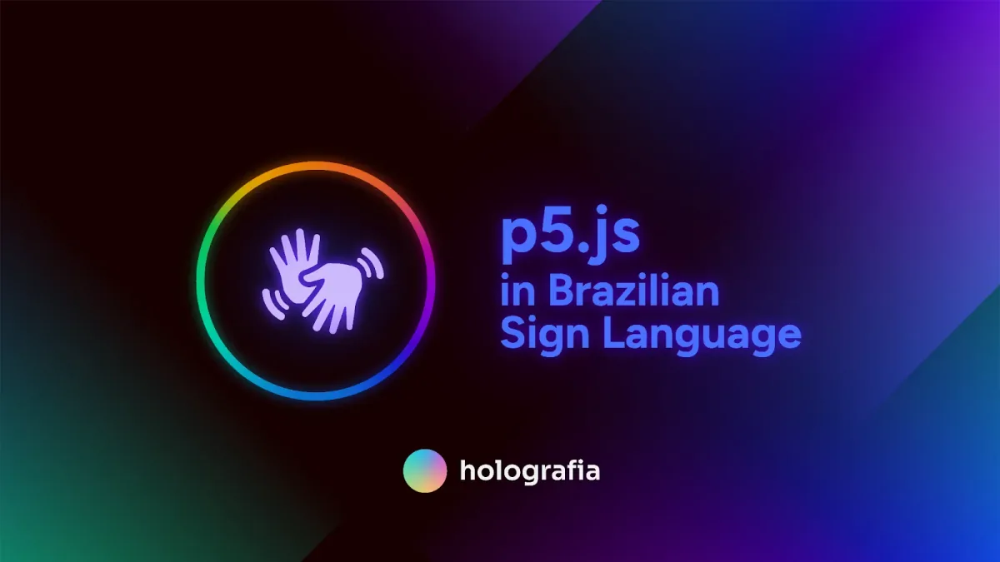
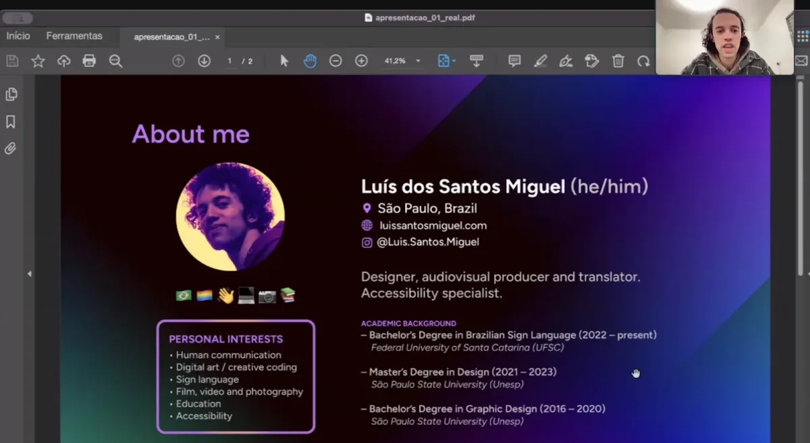

  <iframe src="https://www.youtube.com/embed/5cxp7eKhC7I?feature=oembed" frameborder="0" scrolling="no"></iframe>

The Processing Foundation’s 2024 Fellowship season has come to a close, and with it, we celebrate another year of transformative projects that redefine the boundaries of art, technology, and community. Among the exceptional fellows this year is Luís dos Santos Miguel, whose groundbreaking project, *Holografia: p5.js in Brazilian Sign Language*, is a powerful step toward accessibility and inclusivity in creative coding.

Luís dos Santos Miguel (he/him) is a São Paulo-based designer, audiovisual producer, translator, and educator deeply committed to accessibility and inclusive design. With a Master’s degree in Design and a Bachelor’s degree in Graphic Design from São Paulo State University (Unesp), as well as ongoing studies in Brazilian Sign Language (Letras-Libras) at the Federal University of Santa Catarina, Luís brings a wealth of expertise to his work. His practice centers on bridging communication gaps through innovative design and education, focusing on audiovisual accessibility and multimodal expression. His academic research has explored digital interfaces, semiotics, and the unique affordances of sign languages, making him an ideal leader for this ambitious project.

**Holografia: p5.js in Brazilian Sign Language, courtesy of Luís dos Santos Miguel.**

*Holografia: p5.js in Brazilian Sign Language* is an initiative rooted in open-source principles, designed to promote creative coding and design literacy within Brazil’s Deaf community. The project features a series of freely accessible educational videos in Libras, the sign language used by Deaf communities in urban areas of Brazil. These videos introduce the fundamentals of p5.js, utilizing visual resources, Portuguese audio tracks, and subtitles to ensure accessibility for a broad audience.

Central to this project is Luís’ innovative approach to addressing the lack of technical vocabulary in Libras. Collaborating with Deaf colleagues, Luís has developed new signs for key concepts like “Processing” and “p5.js,” which integrate visual elements from logos and letters to make these terms intuitive and meaningful. Luís explains, “Especially for Deaf people whose first language is sign language, it’s much more comfortable to access this knowledge in their native language.” This pioneering work lays the groundwork for standardizing technical terminology in Libras, fostering a more inclusive landscape for creative technology.

> “Especially for Deaf people whose first language is sign language, it’s much more comfortable to access this knowledge in their native language.” — Luís dos Santos Miguel

Luís’ journey through the fellowship has been marked by breakthroughs. However, Luís used this time to deepen his research, refine the project’s visual identity, and engage with the Deaf community to co-create terminology and design strategies. These efforts have enriched the project and sparked valuable conversations about accessibility within the Processing Foundation and beyond.

*Screenshot of Luis’ fellowship check-in.*

One of the most inspiring aspects of *Holografia* is its potential to impact multiple communities. By creating bilingual resources, the project serves Deaf learners while offering hearing audiences a unique opportunity to engage with Libras as a second language. As Luís notes, the project highlights broader gaps in educational accessibility, “There is an educational gap for Deaf individuals in Brazil, and many are not familiar with subjects like coding, math, or design. This project seeks to bridge that gap while modeling systemic solutions for future accessibility initiatives.”

The technical and pedagogical strategies underpinning *Holografia* reflect Luís’ thoughtful and holistic approach. In addition to creating educational videos, the project includes a dedicated website and plans for promotion across platforms popular in the Deaf community, such as Instagram, YouTube, and WhatsApp. Luís is also developing a roadmap to guide future initiatives incorporating sign language into creative coding and design education.

For the Processing Foundation, supporting *Holografia* has been a profound privilege. Luís’ work exemplifies this year’s fellowship theme, ‘Sustaining Community: Expansion and Access,’ by addressing systemic barriers and creating opportunities for connection and learning. The project not only enriches the field of creative technology but also serves as a model for inclusive practices that can be adopted globally.

Luís’ vision extends far beyond this fellowship. He envisions *Holografia* as a long-term resource for design literacy and creative coding in Libras, contributing to the normalization of sign language in educational content and empowering the Brazilian Deaf community to explore new forms of creative expression. As he reflects on the project’s impact, Luís shares, “This is more than a series of videos — it’s a way of making knowledge accessible and meaningful to a community that has long been excluded from these conversations.”

*Stay tuned as we continue to highlight the remarkable contributions of this year’s fellows, each of whom is redefining what is possible at the intersection of creativity and computation. For more information on the fellowship program and past fellows, visit the* [*Processing Foundation Fellowship Page*](https://processingfoundation.org/fellowships)*. Follow Luís on* [*Instagram @luis.santos.miguel*](https://www.instagram.com/luis.santos.miguel/) *and* [*LinkedIn (Luís dos Santos Miguel)*](https://www.linkedin.com/in/luissantosmiguel/)*, or visit* [*Luís’ website*](https://luissantosmiguel.com) *for updates.*

*Donate here if you would like to support the incredible ongoing work of our fellowship programs sustaining critical work within open-source and creative technology!*
