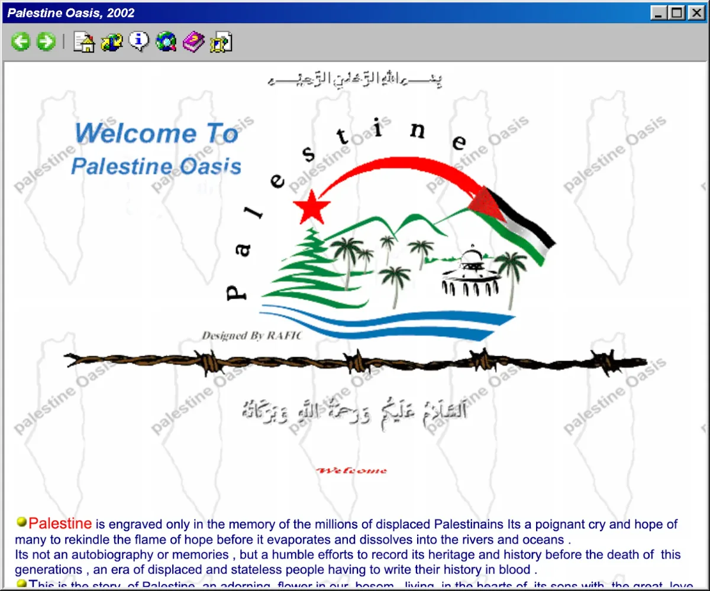
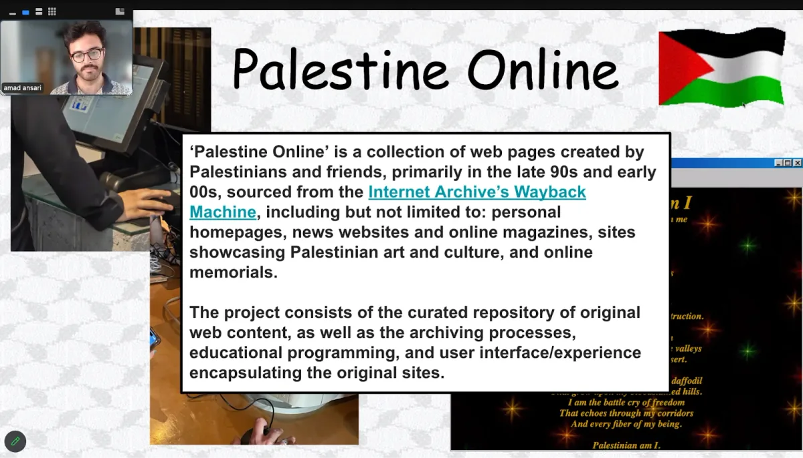

  <iframe src="https://www.youtube.com/embed/L3u9q9z003E" frameborder="0" scrolling="no"></iframe>

The Processing Foundation’s 2024 Fellowship season has come to a close, and with it, we celebrate the remarkable achievements of this year’s fellows. Among them is Amad Ansari, whose project, *Palestine Online*, bridges digital archiving, cultural preservation, and creative technology to amplify Palestinian voices and history in an era of erasure.

Amad Ansari (he/him) is a software engineer with a computer science and art history background. His practice lies at the intersection of digital archiving and creative technology, focusing on preserving what might otherwise be lost. Through *Palestine Online*, Amad brings together a curated collection of websites created by Palestinians — or about Palestine — from the late 1990s and early 2000s, a crucial era for digital self-representation. By documenting and revitalizing these websites, his work emphasizes the role of the internet as a vital tool for resistance, connection, and cultural preservation for a people under occupation.

At its core, *Palestine Online* is a repository of web pages sourced from the Internet Archive’s Wayback Machine. These pages include personal homepages, news websites, online magazines, art showcases, and memorials that capture the experiences and expressions of Palestinians during or near the Second Intifada. *Palestine Online* recreates the aesthetics of the early internet through a period-correct interface while showcasing its potential as a tool for advocacy and storytelling.

For Amad, this project is deeply personal and political. “Especially with the current siege on Gaza, it’s important for me to place the history of Gaza front and center,” he explains. “This project preserves the culture of a place being demolished and destroyed.” Amad’s work honors the resilience of Palestinians who have continuously created their own digital spaces, even amid displacement and occupation. By categorizing these websites into themes like “documenting and memorializing,” the project highlights the creative ingenuity of early Palestinian internet users and the enduring importance of remembering those lost to the occupation.

*Palestine Oasis website from 2002. Screenshot courtesy of Amad Ansari.*

One of the most striking elements of *Palestine Online* is its attention to the unique characteristics of the early web. From tile backgrounds and Flash animations to the simplicity of early coding, Amad uses these elements to immerse users in a digital time capsule. For younger audiences, many unfamiliar with the early internet, this project is an educational tool that bridges the past and present. “When I’ve shown this project to teenagers in workshops, they’re amazed,” Amad shares. “They see parallels between the documentation of that era and the stories they see today on Instagram.”

Amad approaches his role in this project with sensitivity, especially as a non-Palestinian. He emphasizes letting the websites and their creators to speak for themselves. “This project is about amplifying voices, not imposing my own,” he says. He aims to create a space where users can explore, learn, and come away with a deeper understanding of Palestinian resilience and solidarity.

*Screenshot of Amad’s Fellowship check-in.*

During the fellowship, Amad focused on refining the user interface of *Palestine Online* to ensure it is robust, accessible, and adaptable for future expansions. He also organized the collection of websites into categories and subcategories to make navigation intuitive. The project’s open-source nature allows others to contribute, extending its reach and impact. Amad envisions *Palestine Online* as a standalone archive and a framework that can be replicated for other communities and contexts.

The fellowship has also allowed Amad to connect with youth in his local community, using *Palestine Online* as a teaching tool. Workshops in Bay Ridge with an Arab American organization introduced younger participants to the history of Palestine and the early internet, sparking curiosity and engagement. “Seeing people browse through these websites and come away with intense passion and solidarity with Palestinians today makes me incredibly happy,” he reflects.

> “Seeing people browse through these websites and come away with intense passion and solidarity with Palestinians today makes me incredibly happy,” — Amad Ansari

As *Palestine Online* continues to evolve, Amad plans to enhance the project’s educational capabilities by incorporating user-submitted content and tools for contextualizing the websites further. He also hopes to showcase the archive in physical installations, using period-appropriate hardware like CRT or 4:3 monitors to immerse audiences in the early internet experience fully.

For the Processing Foundation, supporting *Palestine Online* has been a profound privilege. The project exemplifies this year’s fellowship theme, ‘Sustaining Community: Expansion and Access,’ by using technology to create a living archive that resists erasure and celebrates cultural resilience. Amad’s work reminds us of the internet’s transformative potential — not just as a technical tool but as a space for connection, resistance, and expression.

*Stay tuned as we continue to highlight the remarkable contributions of this year’s fellows, each of whom is redefining what is possible at the intersection of creativity and computation. For more information on the fellowship program and past fellows, visit the* [*Processing Foundation Fellowship Page*](https://processingfoundation.org/fellowships)*.* Explore *Palestine Online* at [palestineonline.net](https://palestineonline.net), or follow Amad on [Instagram @badgalansari](https://www.instagram.com/badgalansari/) for updates.

[*Donate here*](https://processingfoundation.org/donate) *if you would like to support the incredible ongoing work of our fellowship programs sustaining critical work within open-source and creative technology!*
