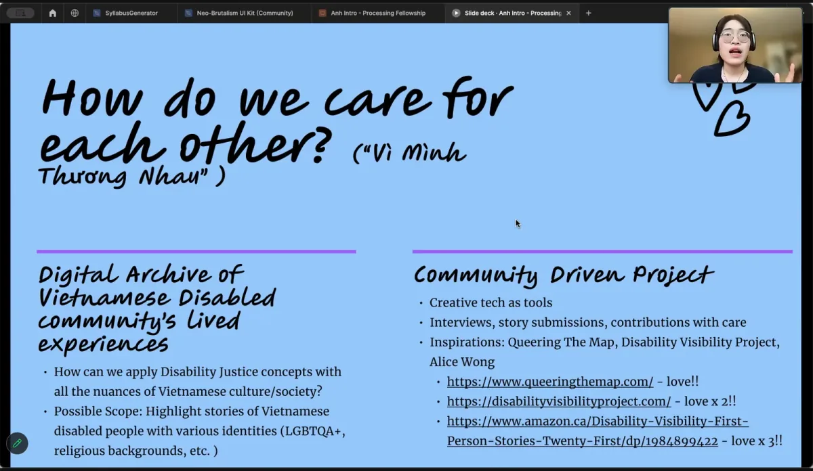

  <iframe src="https://www.youtube.com/embed/l9tZrlM2f3Q?feature=oembed" frameborder="0" scrolling="no"></iframe>

The Processing Foundation’s 2024 Fellowship season has come to a close and continuing our series honoring our fellows we are so excited to share about *How do We Care for Each Other (Vì Mình Thương Nhau)*, created by Anh (Autumn) Pham. Anh (they/them) is a Deaf, Queer tech worker and writer from Vietnam, now based in Vancouver, British Columbia. Their work bridges the intersection of accessibility, storytelling, and advocacy, focusing on empowering marginalized communities. Anh’s personal experiences growing up in Vietnam, where disability was often stigmatized, inspired this project. “My culture, my family, and my community saw disability as something wrong with us,” Anh shares. “I hope that through this project, Deaf children and other disabled people will feel they are not alone in their experiences. It’s something I wish I had growing up.”

At its core, *How do We Care for Each Other* is an archival website documenting the lived experiences of disabled people in Vietnam. Through visual storytelling powered by creative coding tools like Processing and p5.js, the project celebrates the diverse and complex lives of disabled individuals. Anh’s game prototype, built using p5.js, immerses players in a soundless experience, replicating the Deaf perspective and challenging audiences to reconsider how they perceive disability. “Disability isn’t something wrong with a person,” Anh emphasizes. “Disabled people live, love, make mistakes, and thrive like anyone else.”

> “Disability isn’t something wrong with a person. Disabled people live, love, make mistakes, and thrive like anyone else.” — Anh (Autumn) Pham

The fellowship allowed Anh to combine their technical expertise with their passion for storytelling and advocacy. The project’s message is a call to action beyond visibility. “I want to advocate for better treatment and access to basic services like healthcare, education, and social support for disabled people in Vietnam,” Anh explains. By presenting this archive to scholars, students, and even policymakers, they hope to inspire systemic change and dismantle ableism within the Vietnamese cultural context.

*Screenshot of Anh’s fellowship check-in.*

One of the most powerful aspects of this project is its emphasis on community. Anh collected first-person narratives from disabled individuals, creating a space where their voices could be heard and celebrated. The project also poses an essential question, “How have you cared for your community, and how has your community cared for you?” This reflection invites audiences to think critically about their roles in fostering inclusivity and equity.

Anh’s personal and professional journey adds depth to the project. A recipient of an Apple award for a visualization project that teaches people how to read audiograms, Anh also interned with Apple’s iOS Accessibility team, working on hearing accessibility. Outside of their 9-to-5 in financial tech, they write the *Letters from Anh* newsletter about accessible tech, disability, and humanity, and organize mentorship and fellowship programs for young people. Anh’s work is driven by curiosity, care, and a vision for a world where no one is left behind.

Supporting *How do We* *Care for Each Other* has been a privilege for the Processing Foundation. This project aligns with the fellowship theme, ‘Sustaining Community: Expansion and Access,’ by amplifying marginalized voices and fostering a deeper understanding of Disability Justice. Anh’s work reminds us of the transformative potential of creative technology to advocate for care, equity, and systemic change.

*How do We Care for Each Other* serves as an archive and a call to action. Beyond the fellowship, Anh envisions this platform as a resource to inform policy and inspire research, cultivating a stronger Disability Justice movement in Vietnam. “Better data informs better policies,” Anh reflects. “This archive can help advocate for better support in housing, education, healthcare, and beyond.”

*Stay tuned as we continue to highlight the remarkable contributions of this year’s fellows, each of whom is redefining what is possible at the intersection of creativity and computation. For more information on the fellowship program and past fellows, visit the* [*Processing Foundation Fellowship Page*](https://processingfoundation.org/fellowships)*. Follow Anh on* [*Twitter/X @anhphamprog*](https://x.com/anhphamprog)*,* [*LinkedIn (Anh Pham)*](https://www.linkedin.com/in/anhpham604/)*, and* [*Substack*](https://anhpham.substack.com)*.* *This project is a testament to the power of storytelling, technology, and community care to drive meaningful change.*

[*Donate here*](https://processingfoundation.org/donate) *if you would like to support the incredible ongoing work of our fellowship programs sustaining critical work within open-source and creative technology!*
