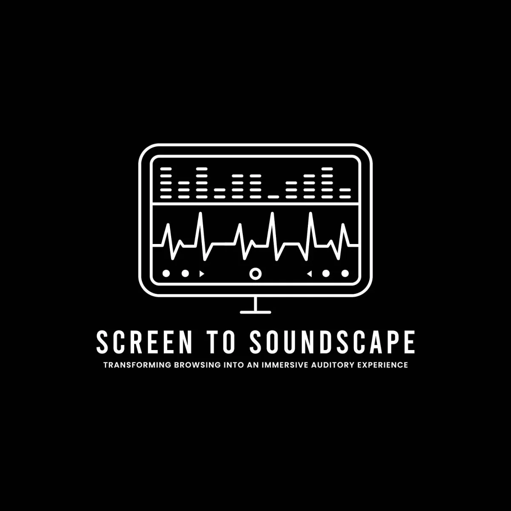

<iframe src="https://www.youtube.com/embed/ejZkNXIGuvI?feature=oembed" width="700" height="393" frameborder="0" scrolling="no"></iframe>

The Processing Foundation’s 2024 Fellowship season has come to an inspiring close, and we’re thrilled to celebrate the completion of *Screen-to-Soundscape* — an ambitious and imaginative project led by Ahnjili ZhuParris, Dan Xu, Colette Aliman, and Alyssa Gersony. This team has redefined how we navigate digital spaces, transforming web browsing into a deeply immersive auditory experience rooted in accessibility and creative exploration.

*Screen-to-Soundscape* pushes the boundaries of what sound can do in a digital world. Designed as a speculative prototype, the project reimagines traditional screen reading software. It offers a spatially-aware and multi-sensory interface that doesn’t just tell you where you are — it invites you to experience it. As users navigate with their keyboards, sound cues guide them through a web page with spatial audio mapping text, headers, images, and more. It’s an approach that doesn’t just enhance accessibility for Blind and low-vision users — it opens a new dimension of web browsing for everyone. “Sound isn’t just functional here,” the team shares. “It’s a medium for understanding how digital spaces can live, breathe, and resonate.”

The project was brought to life by a stellar interdisciplinary team:

-   **Ahnjili ZhuParris**, the project coordinator, brought her expertise in AI and accessibility to shape the vision and execution.
-   **Dan Xu**, the lead developer, crafted the interactive interface, ensuring a seamless user experience.
-   **Colette Aliman**, the sound designer, composed the auditory cues that give the interface texture and depth.
-   **Alyssa Gersony**, an interdisciplinary artist, facilitated co-creation sessions with blind and visually impaired collaborators, grounding the project in user-centered design.

The collaborative process behind *Screen-to-Soundscape* is just as remarkable as the result. The team worked directly with users through workshops and listening parties to refine their prototypes. “We didn’t just want to build a tool — we wanted to create something that felt alive, responsive, and meaningful to the people using it,” they explain. By centering the voices and experiences of Blind and low-vision users, the team created a prototype that resonates far beyond its immediate purpose.

> “We didn’t just want to build a tool — we wanted to create something that felt alive, responsive, and meaningful to the people using it,” — Screen-to-Soundscape project fellows

What makes this project truly special is how it balances artistic innovation with technical ingenuity — using tools like JavaScript, p5.Panner3D, and p5.speech, the team built an intuitive yet immersive interface. Users navigate the prototype like a game, moving through auditory environments where sound cues signify headers, paragraphs, or images. Even the interface edges have sonic markers, ensuring users know where they are in the digital space. “We wanted to create something that felt exploratory yet safe,” they reflect. “A soundscape that doesn’t just inform but invites users into an entirely new way of interacting with the web.”

**Screen-to-Soundscape logo.**

Throughout the process, the team prioritized accessibility as more than just a technical challenge — it became the creative heartbeat of the project. “Accessibility isn’t an afterthought; it’s the foundation,” they assert. “When we think about sound as a medium, it’s not just about utility — it’s about joy, curiosity, and connection.”

For the Processing Foundation, supporting *Screen-to-Soundscape* has been a privilege. This project exemplifies the theme of ‘Sustaining Community: Expansion and Access,’ demonstrating how creative technology can reimagine digital spaces for equity, engagement, and innovation. It’s not just about making the web accessible — it’s about making it more human.

Now complete, *Screen-to-Soundscape* is poised to make a lasting impact. Its open-source code and documentation are available for others to build upon, ensuring the project lives on as a resource for developers, sound designers, and accessibility advocates. The team envisions future iterations, from browser extensions to public installations, inviting audiences to experience the web through sound in transformative ways.

*Stay tuned as we continue to highlight the remarkable contributions of this year’s fellows, each of whom is redefining what is possible at the intersection of creativity and computation. For more information on the fellowship program and past fellows, visit the* [*Processing Foundation Fellowship Page*](https://processingfoundation.org/fellowships)*.*

To explore *Screen-to-Soundscape* and learn more about the team’s work, follow them on their respective platforms:

-   **Ahnjili ZhuParris**: [Instagram @artificialnouveau](https://www.instagram.com/artificialnouveau/), [LinkedIn (Ahnjili ZhuParris)](https://www.linkedin.com/in/448767120/), and [Ahnjili’s Website](https://artificialnouveau.com)
-   **Dan Xu**: [Instagram @xxdanxx\_](https://www.instagram.com/xxdanxx_/), LinkedIn (Dan Xu)
-   **Colette Aliman**: [Instagram @colettealiman](https://www.instagram.com/colettealiman/), [@sound\_\_\_office](https://www.instagram.com/sound___office/), and [Colette’s Website](http://sound-office.online)
-   **Alyssa Gersony**: [Instagram @a\_\_gersony](https://www.instagram.com/a__gersony/), [LinkedIn (Alyssa Gersony)](https://www.linkedin.com/in/alyssa-gersony-96434966/), and [Alyssa’s Website](https://alyssagersony.com)

[*Donate here*](https://processingfoundation.org/donate) *if you would like to support the incredible ongoing work of our fellowship programs sustaining critical work within open-source and creative technology!*
