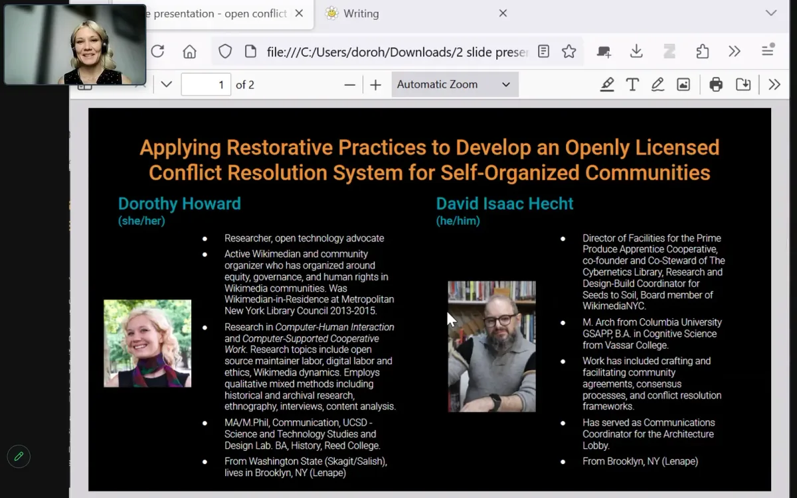

  <iframe src="https://www.youtube.com/embed/C41md0IOvIc?feature=oembed" frameborder="0" scrolling="no"></iframe>

The Processing Foundation’s 2024 Fellowship season has drawn to a close, and we are proud to highlight the completion of *Applying Restorative Practices to Develop an Openly Licensed Conflict Resolution System for Self-Organized Communities*. Created by Dorothy Howard and David Isaac Hecht, this project provides a much-needed framework for addressing conflict in self-organized communities, blending the ethics of care with restorative justice to build stronger, more equitable governance systems.

Dorothy Howard (she/her) is a researcher and open knowledge advocate based in Brooklyn, NY. She has deep experience in designing governance systems that center accountability, transparency, and marginalized voices. David Isaac Hecht (he/him) is a facilitator, researcher, and community organizer whose work spans collaborative labor practices, knowledge structures, and organizational dynamics. Together, they have created a resource that offers transformative tools for communities seeking to handle conflicts with fairness and care.

This project addresses a fundamental challenge: what happens when conflict arises in an organization without clear mechanisms to process harm? Dorothy explains, “Without a structure, marginalized people often face the worst effects of negligence when they come forward with a report. Our work provides organizations with tools to assess their preparedness and ensure equitable processes.”

At its heart, this project is an openly licensed conflict resolution system designed for self-organized communities, such as open technology projects, cooperatives, or online groups. The system is built around a self-assessment tool that organizations can use to evaluate their readiness to intake and process reports. Additionally, it provides a customizable framework for creating safe spaces and handling incidents, allowing communities to adapt the system to their unique needs.

The fellowship allowed Dorothy and David to ground their design in rigorous research and community engagement. They reviewed restorative justice practices, case studies, and academic literature to inform their approach. Additionally, they facilitated listening sessions to gather insights from practitioners and community members, ensuring the system is practical and responsive to real-world needs. “The listening sessions emphasized the importance of confidentiality and comfort for participants,” David shares. “This guided our design toward solutions that prioritize safety and compassion.”

*Screenshot of Dorothy and David’s fellowship check-in.*

One of the standout features of the system is its emphasis on openness. By releasing the framework with an open license, the team ensures it can evolve with input from the communities using it. “We hope organizations pick it up, tailor it, and put it back into circulation,” Dorothy says. “This iterative process is key to creating governance systems that are living, adaptable, and effective.”

The project also highlights the importance of accessibility in governance. Dorothy and David have worked to ensure the system is easy to implement and understand, avoiding dense legalese and focusing instead on practical, user-friendly tools. Their work acknowledges the power dynamics inherent in conflict resolution, offering strategies to create equitable outcomes that center both accusers and those accused of harm as individuals deserving dignity and respect.

For the Processing Foundation, supporting this project has been an honor. It aligns deeply with the fellowship theme, ‘Sustaining Community: Expansion and Access,’ by addressing structural inequities and offering tangible tools for community resilience. Dorothy and David’s approach demonstrates the transformative potential of open-source governance, fostering cultures of accountability and care in creative technology and beyond.

The project is an openly licensed resource organizations can use, modify, and improve. Dorothy and David envision it becoming a touchstone for communities navigating conflict, promoting transparency and equity in addressing harm. As Dorothy reflects, “This project is about helping people work together better. It’s about creating systems that support not just individuals but the entire community.”

*Stay tuned as we continue to highlight the remarkable contributions of this year’s fellows, each of whom is redefining what is possible at the intersection of creativity and computation. For more information on the fellowship program and past fellows, visit the* [Processing Foundation Fellowship Page](https://processingfoundation.org/fellowships)*. Follow Dorothy on* [Instagram @hexjelica](https://www.instagram.com/hexjelica/)*, Twitter/X @hexatekin, and* [Dorothy’s website](https://dorothyhoward.com)*, and David on* [Instagram @wileycount](https://www.instagram.com/wileycount/)*, Twitter/X @wileycount, and* [David’s website](https://davidisaachecht.com)*.*

[Donate here](https://processingfoundation.org/donate) *if you would like to support the incredible ongoing work of our fellowship programs sustaining critical work within open-source and creative technology!*
