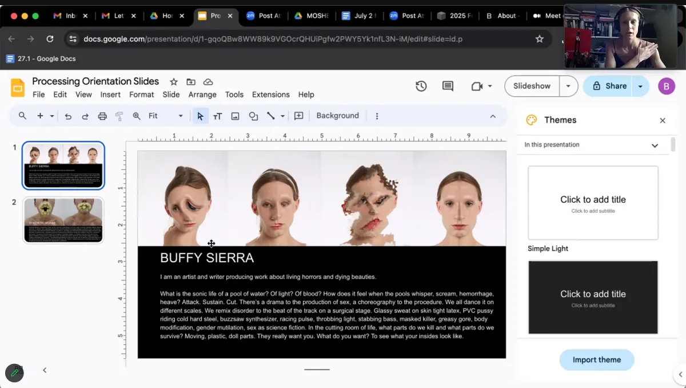

  <iframe src="https://www.youtube.com/embed/icDHLimlMmg?feature=oembed" frameborder="0" scrolling="no"></iframe>

The Processing Foundation’s 2024 Fellowship season has drawn to a close. With it, we celebrate the completion of Buffy Sierra’s *Synthetic Moans* — a piercing scream into the void and a soft whisper to a lover, sister, or mother. Buffy’s project is a breathtaking exploration of transfeminine life, realized through sound, memory, and technology.

[Buffy Sierra](http://buffysierra.com) (she/her) is an artist and writer whose work navigates the gothic, grotesque, and ephemeral. Her practice moves fluidly across performance, music, and design, unraveling how we live through life’s horrors with a fierce affirmation of beauty. Buffy’s art combines visceral and ethereal elements, creating transformative spaces for audiences to experience intimacy, resonance, and rapture.

*Synthetic Moans* embodies Buffy’s multifaceted vision, indexing a process, a practice, and a palimpsest of transfeminine life. The project sonifies trans biological data — hormone levels, medical visit frequencies, and embodied memories — into evocative tones, sequences, and scores. Alongside this, Buffy collaborated with transfeminine contributors to document and share feelings, ephemera, and documents related to transition. The result is a digital archive and an evolving compendium of sounds and resources, offering a nuanced and resonant reflection of transfeminine experiences.

Buffy’s process integrated coding and music, challenging traditional definitions of sound, identity, and pathology. “Working with code has helped me understand music more, and working with music has helped me understand code,” she shares. Using tools like the [p5.js sound library](https://editor.p5js.org/thomasjohnmartinez/collections/Dp0zGclVL), Buffy reimagined sound as a medium for understanding identity, deconstructing binaries of strength and illness, and exploring the intersections of aesthetics, music, and science.

Throughout the fellowship, Buffy completed a comprehensive transmedical archive spanning 2017 to 2024, conducted extensive research on sonification methods, and collaborated with contributors to frame and interpret their data. Her efforts culminated in a sonification tool that transforms trans biological data into immersive soundscapes, accompanied by a robust archive of research and resources.

*Screenshot of Buffy’s fellowship check-in.*

The project’s impact is profound, offering a transformative lens through which to view transfeminine lives and lineages. By sonifying data and crafting a digital archive, Buffy’s work amplifies the complexities of trans existence while fostering solidarity and self-reflection within trans communities. “This project has deepened my relationship to transness and expanded my understanding of memory, identity, and transition,” Buffy reflects.

> “This project has deepened my relationship to transness and expanded my understanding of memory, identity, and transition,” - Buffy Sierra

For the Processing Foundation, supporting *Synthetic Moans* has been an honor. The project exemplifies this year’s fellowship theme, ‘Sustaining Community: Expansion and Access,’ by blending creativity, inclusivity, and technology to create a space for connection and resonance. Buffy’s work demonstrates the transformative potential of open-source tools and artistic innovation to amplify marginalized voices.

Now complete, *Synthetic Moans* lives on as a testament to the power of art to challenge norms, deconstruct binaries, and build community. The project’s digital archive, sonification tool, and accompanying sound files are publicly accessible, ensuring its ongoing impact. Buffy also plans to continue facilitating conversations and collaborations, expanding the reach of this extraordinary project.

*Stay tuned as we continue to highlight the remarkable contributions of this year’s fellows, each of whom is redefining what is possible at the intersection of creativity and computation. For more information on the fellowship program and past fellows, visit the* [Processing Foundation Fellowship Page](https://processingfoundation.org/fellowships). Follow [Buffy Sierra on Instagram](https://www.instagram.com/buffysierra/) and other platforms @buffysierra or visit her website at [buffysierra.com](https://buffysierra.com).

*Donate here if you would like to support the incredible ongoing work of our fellowship programs sustaining critical work within open-source and creative technology!*
