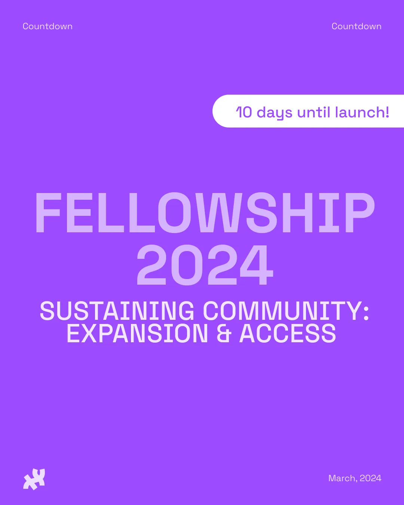

*2024 Processing Foundation Fellowship: ‘Sustaining Community: Expansion & Access’ Countdown flier*

With spring beginning to bloom, the time has come once again for our Processing Foundation Fellowship applications to launch! We’re thrilled to announce the start of our 10-day countdown to the launch of our [*2024 Processing Foundation Fellowship: “Sustaining Community: Expansion & Access.*”](https://processingfoundation.org/fellowships) This moment signals an open call for you to gear up to apply and share widely to your communities!

For the past few fellowship seasons, we’ve invited projects from artists, educators, researchers, developers, and collectives creating under the themes of Internationalization, Accessibility, AI Ethics and Open Source, and Ecology & The Environment. Looking back on last year’s remarkable projects, we saw work responding to these thematics such as the *‘[Engaging STEM Toolkit](https://inclusivestem.info),’ ‘[Freedom is a Durational Practice](https://zai.zone/#freedom),’ ‘[The Data Garden Project](https://datagardenproject.com),’ ‘[CodeSurfing](https://codesurfing.club),’ ‘[Expanding the p5.Sound Library](https://p5-sound-curriculum.gitbook.io/p5.sound-library-curriculum-unit-1)’* and *‘*[Black Life in the Age of AI](https://www.blacklifeai.com),’ among others. From across the globe toolkits, educational resources, archives, and coding projects were supported by a group of community mentors, a fellow stipend, regular cohort meetings with skillshares to professional development opportunities, and public presentations.

This year we seek to build on our incredible decade-long legacy of fellowship projects with the following focus areas: Archival Practices: Code & New Media, Open-Source Governance, Disability Justice in Creative Tech, and Access & AI for our 2024 Processing Foundation Fellowship Season: ‘Sustaining Community: Expansion & Access.’ These areas selected alongside our community reflect both our growing commitments as an organization but also focuses that we feel will birth new support systems for our software projects, the open-source field, and beyond.

Our applications for the fellowship will be launching **April 1st** with our program running from **June 15th to October 31st.** Eight fellows will be selected to receive a $10,000 stipend, mentorship, and opportunities for support within a cohort.

#### **Key dates to remember:**

-   Applications Open: April 1st
-   Fellowship Information Sessions: April 5th and April 20th
-   Applications Close: May 2nd
-   Semi-Finalist Interviews: Week of May 15th
-   Fellowship Start Date: June 15th
-   Fellowship End Date: October 31st

Additionally, this year introduces the launch of *pr05 = ‘Processing Foundation Software Development Grant*’; a new initiative in partnership with our fellowship program. The program will be a new mentorship initiative by the Processing Foundation designed to support the professional growth of emerging software developers through hands-on involvement in open-source projects with more information to come and applications launching May 1st!

As we countdown to the 2024 Fellowship Season, we do so with great anticipation for the innovative projects and impactful work that will emerge. We celebrate not just the inception of new endeavors but also the ongoing journey of our community toward creating a more accessible, equitable, and creatively vibrant world.

I encourage you all to spread the word, prepare your applications, and join us!

\-Tsige Tafesse, Program Manager
