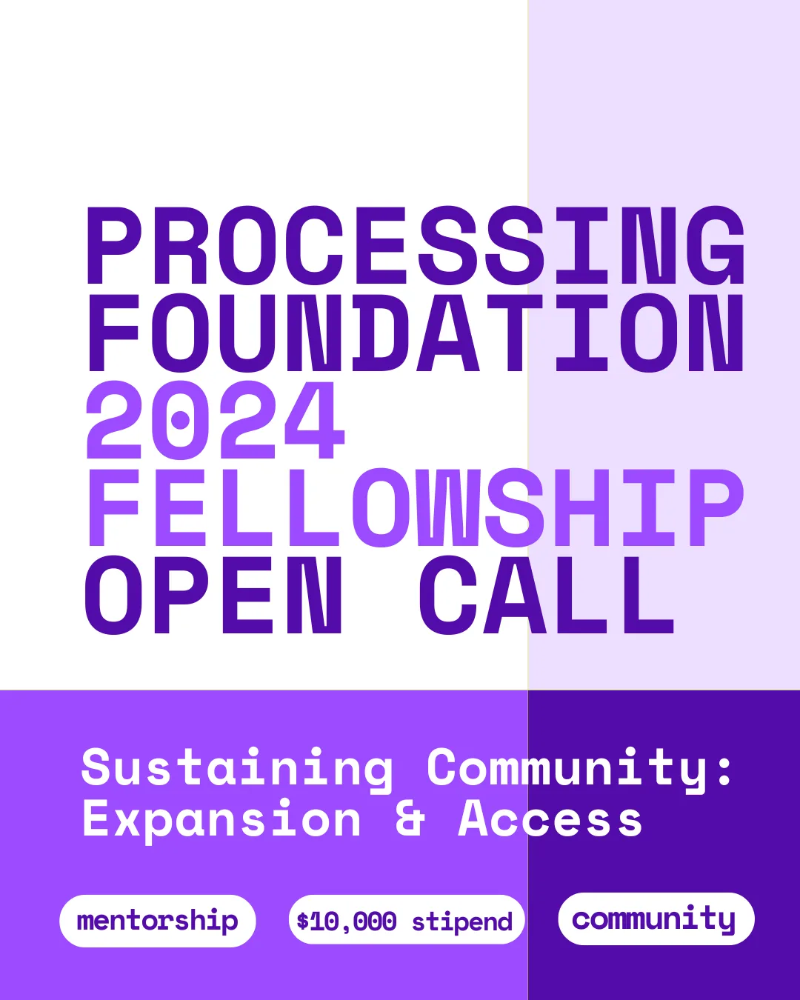

*Processing Foundation 2024 Fellowship ‘Sustaining Community: Expansion & Access’ Open Call Flier*

[Apply here](https://processingfoundation-bpmfa.formstack.com/forms/2024_fellowship_application)

The Processing Foundation is thrilled to announce the open call for our 2024 Fellowship Program, themed ‘Sustaining Community: Expansion & Access.’ This year, we seek to support innovative projects from artists, designers, activists, educators, engineers, researchers, coders, collectives, and many more, who are working at the intersection of creative technology, art, and open-source software.

Our fellowship is designed to provide substantial support to individuals and groups within our community. This includes a $10,000 stipend, dedicated mentorship, skill-building workshops, public programs, and community engagement opportunities. Participation for the fellowship is entirely online and we invite applicants from around the world to apply.

Fellowships are an essential element of our foundation’s work in developing tools of community power, connection, stewardship and in nurturing the aims/needs of the people and communities who use our software. Projects can range from development of the existing software projects and related Processing projects (Processing, p5.js, Processing.py, Processing for Android, ml5.js), to creative and exploratory work for new iterations.

We are open to applicants from all backgrounds and skill levels, and support proposals that center investigations, experiments, and learning. We are attentive to proposals that demonstrate enthusiasm and the evolution of a fellow’s practice rather than their pre-existing technical skills.

### Fellowship Priority Areas for 2024

This year we aim to support fellowships that respond to and meet the needs of the priority areas below. Applicants are asked to address at least one of the below, describing how their project responds to the concerns of the topic.

**Archival Practices: Code & New Media:**

-   Projects aimed at developing tools and platforms for archiving and preserving creative code/the digital, as well as new media archival practices.

**Open-Source Governance:**

-   Initiatives focused on creating governance models that promote equitable decision-making, inclusive communities, engagement, and sustainable growth in open-source projects.

**Disability Justice in Creative Tech:**

-   Tools and projects that advance access and promote disability justice within the realm of creative technology

**Access & AI:**

-   Engaging AI technologies to create accessible solutions and improve inclusivity in digital spaces.

See Fellowship Guidelines below before applying.

The application period opens *Wednesday, April 1, 2024* and closes *Monday, May 2, 2024 11:59pm*. Selected fellows will be notified no later than the last week of May 2024. Late applications will not be accepted. Fellows will be selected by the Processing Foundation’s team, a community review committee, and our [Board of Directors](https://processingfoundation.org/people).

Before applying, please review our past fellowships and familiarize yourself with the scope and impact of previous projects. We encourage projects that not only meet the immediate needs of the community but also consider future sustainability and broader applicability.

#### Eligibility:

Open to U.S.-based and international applicants. Collective projects should have a lead applicant. Only one application per person.

If you have any questions please contact Tsige Tafasse, Program Manager, at *fellowship@processingfoundation.org*

### Fellowship Timeline

Processing Foundation Fellows are expected to commit 200 hours to proposed projects, over the course of June 15 to October 31, 2024.

The 200 hours of the fellowship must take place during this timeline. How the 200 hours are completed is flexible and decided upon between the mentor and the fellow. For example, if a fellow wants to work 200 hours over the month of July, that is fine. Or, if they want to log a few hours per week throughout the entire fellowship period, that is also fine.

Agreement of schedules and milestone dates is to be decided upon between the Fellow and their mentor (and advisors, if applicable) by the first week of the fellowship.

-   Applications Open: April 1st
-   Fellowship Info Session #1: April 5th, 10am EST
-   Fellowship Info Session #2: April 20th, 7pm EST
-   Applications Close: May 2nd 11:59pm EST
-   Semi-Finalist Interviews: Week of May 15th
-   Fellowship Start Date: June 15th
-   Kickoff meeting: June 15th
-   Mid-point check-in: August 5th
-   Fellowship End Date: October 31st
-   Presentations & Documentation wrap up October 2024

### Mentorship

Mentors are assigned to each fellow from within the Processing Foundation’s community. The role of mentors is to provide guidance (creative, technical, and professional), as well as serve as an advocate for the fellow’s work.

If a specific mentor is desired, please indicate this in the application. We can contact this mentor and ask if they’d be available.

Regular bi-monthly virtual meetings with a mentor throughout the fellowship are required.

### Community

We follow the [community guidelines of p5.js](http://p5js.org/community/) for our code of conduct.

At the start of the fellowship, an introductory meeting with all 2024 fellows will take place virtually. The meeting is an opportunity for this year’s cohort to meet each other and learn about each other’s work. Attendance is required.

Fellows are encouraged to build community with their cohort throughout the fellowship period in group chats like Signal, Slack, or Discord, as well as Zoom meetups. Additionally, Fellowship Program Alumni will deliver online talks and workshops with this year’s cohort. Attendance to these Alumni workshops is strongly encouraged but not required, as they are meant to create connections and support knowledge-sharing within the fellowship community. They will engage in regular cohort meetings bi-monthly, as well as town hall forums with our new partner program pr05 = “Processing Foundation Software Development Grant”; and opportunities to present their finished projects publicly.

Along with mentorship, the Foundation staff will work to provide fellows with connections to other community members who might be able to support the fellow with specific needs in the roles of advisors and consultants; we will also look for organizations and spaces that might be able to host the fellow for future events and collaborations.

### Project Documentation

Progress updates via our social media, blogs, etc., are required to be posted after each bi-monthly progress meeting with the fellow’s mentor.

Fellowship projects are featured on the Processing Foundation’s website, with the fellow’s bio, images, and a link to the project. These materials must be provided by the start of the fellowship and updated at the end.

Final online documentation of fellowship projects is required. Documentation can take many forms — a GitHub repository, a series of video tutorials, a website, etc. We are open to what fits best for the work, in terms of format.

### Project Legacy

Fellowship projects *must* be open source.

Project legacy is an important component of fellowships. We encourage applicants to think about how projects may support future sustainability or archiving of the work.

This includes, but is not limited to: code commenting and reusability, documentation, prioritized to do lists / roadmaps (if there’s more to do after your fellowship is completed), laying out infrastructure that enables others to carry on, summary of discoveries for research-focused projects, etc.

### Stipend

The stipend for the 2024 Fellowship is $10,000 USD. Payment of the stipend will be made in four installments: $2,500 USD paid at the start of your fellowship, and the remaining split throughout the fellowship, and remainder upon its completion. Additionally, there is a small amount of discretionary project funds for the fellowship projects.

A fellow must complete the requirements of the fellowship for the stipend to be paid in full.

### About us

The Processing Foundation’s mission is to promote software literacy within the visual arts, and visual literacy within technology-related fields — and to make these fields accessible to diverse communities.

Processing Foundation is committed to diversity in its programming and in nurturing a community culture and environment that is reflective of the diversity of the US as well as the global community networks we operate within. We aspire to create a climate where diversity is an asset for creativity and innovation. We strongly encourage applicants representing a range of differences that include — but are not limited to — age, national origin, ethnicity, race, religion, ability, sexual orientation, gender and sexual identity. Processing will consider all qualified applicants with criminal histories in a manner consistent with the requirements of the San Francisco Fair Chance Ordinance and New York City Fair Chance Act.

#### Further questions?

Please contact our Program Manager, Tsige Tafesse at *fellowship@processingfoundation.org*
