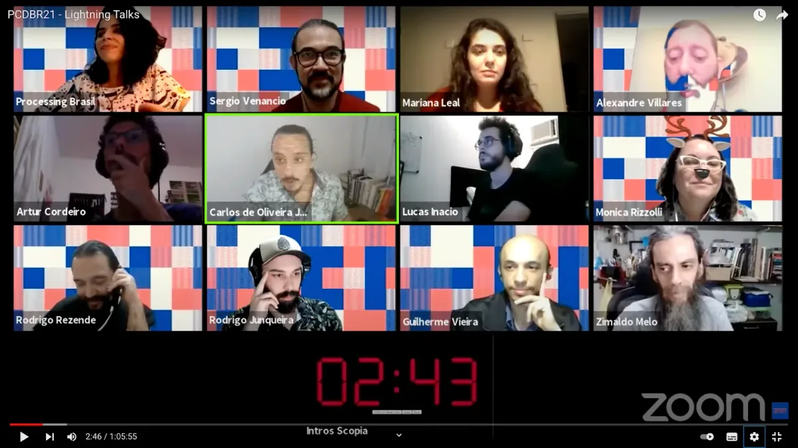
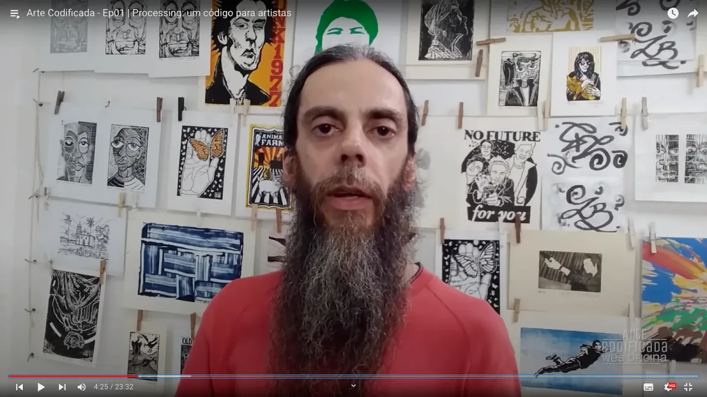
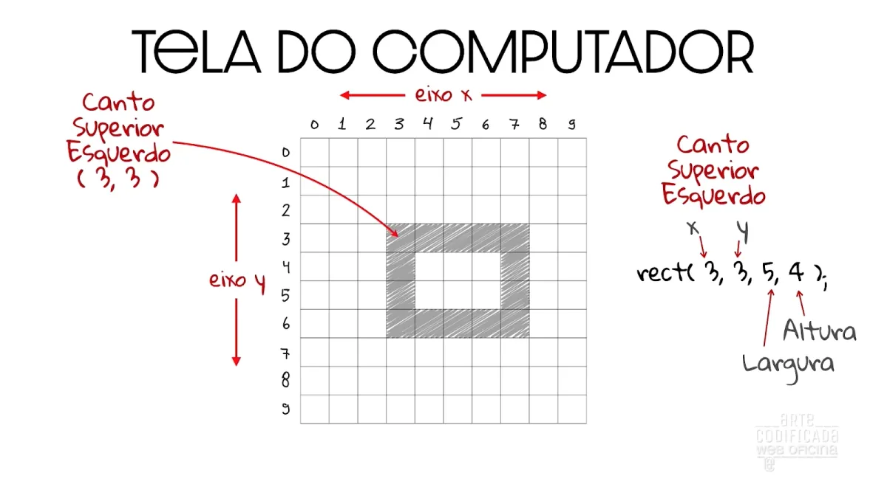
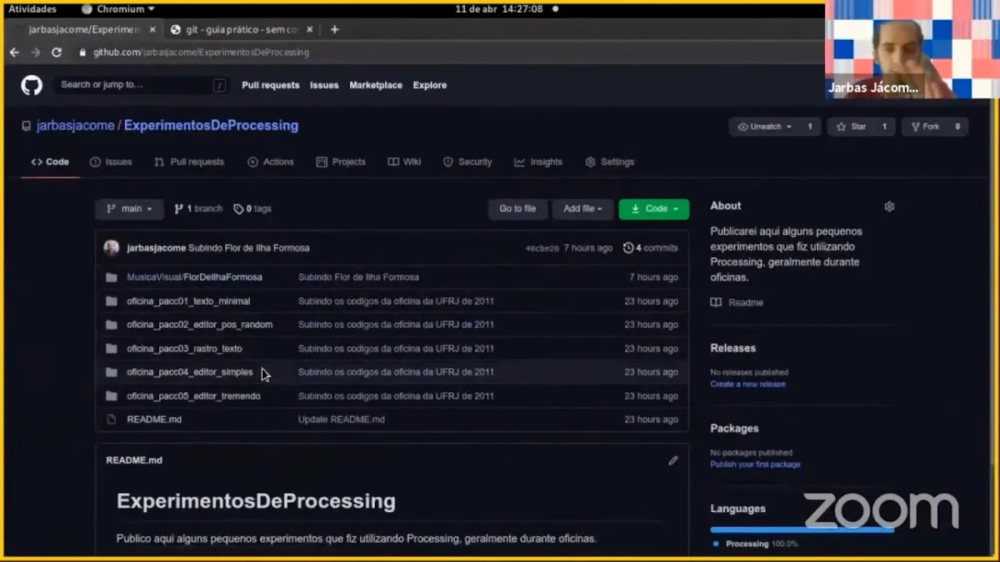

#### por Zimaldo Melo

For the English version of this story, [click here](https://medium.com/processing-foundation/celebrating-20-years-of-processing-with-arte-codificada-ec9892346b94).

---

*This year, on August 9, the Processing software turned 20 years old. To celebrate, the Processing Foundation organized* [*Processing Community Day 2021*](https://processingfoundation.org/advocacy/pcd-2021)*, a distributed, worldwide party held on August 20–22, 2021. For PCD2021, the community could participate in a number of ways, from hosting an event online or in their city, to contributing to the* [*20th Anniversary Processing Community Catalog*](https://processingfoundation.org/advocacy/community-catalog)*, to sharing creative coding projects and resources at* [*#pcd2021share*](https://twitter.com/search?q=%23pcd2021share&src=typed_query&f=live)*, to creating a real or virtual birthday cake at* [*#pcd2021cake*](https://twitter.com/search?q=%23pcd2021cake&src=typed_query&f=live)*. Over the next couple weeks, we’ll be posting a series of articles written by some of the folks who organized a PCD2021 event. Happy 20th birthday!*

---

Este ano de 2021 foi, sem dúvidas, um período agitado para a comunidade Processing, e em especial para a comunidade Processing no Brasil. Dois grandes eventos conectaram pessoas em todo o mundo. Talvez, por causa da pandemia de Covid-19 — que nos obrigou a todos ficarmos em período de reclusão e afastamento, a tecnologia favoreceu encontros na esfera digital. No caso do Brasil, possibilitou encontros de diversos grupos locais que antes estavam isolados, criando conexões por todo o país.

Para mim, 2020 foi um ano de uma retomada ao aprendizado e desenvolvimento com Processing. Sendo um profissional de design gráfico experiente, desde 2011 (nesse período iniciei meus estudos em programação criativa com o Prof. Jarbas Jácome, no Curso de Artes Visuais na Universidade Federal do Recôncavo da Bahia), venho cada vez mais utilizando o Processing nos processos criativos em design e artes visuais.

Logo de início, percebi que poderia desenvolver vários projetos a partir dos códigos. Através do Processing, criei meu primeiro código, o Desenho Aleatório Colaborativo sem as Mãos. Minha concepção de obra de arte está ligada ao fazer criativo em grupo. Deste modo, o Desenho Aleatório Colaborativo Sem as Mãos depende da ação do espectador para existir. É preciso movimentar o rosto na frente de uma tela para o reconhecimento por visão computacional, com o OpenCV, para um desenho se formar e depois, com utilização de scripts de sistema, a imagem gerada é enviada para uma fila de impressão e o arquivo da imagem é apagado da memória do dispositivo. Foi assim que consegui participar de um dos maiores festivais de arte da Bahia, a Bienal do Recôncavo. A apresentação foi realizada no Espaço Danemman em 2012, na cidade de São Félix, durante a 11ª edição desta bienal.

A partir de 2012, comecei a criar vários projetos em design gráfico utilizando o Processing. São identidades visuais e padrões gráficos que mudam a cada clicar e também são conhecidos como peças generativas. Portanto, minha rotina hoje é utilizar o Processing para desenvolver imagens e projetos visuais que mudam de acordo com o algoritmo proposto, podendo ser uma obra de artes visuais ou uma solução para impressão por demanda.

Em 2021, através da Lei de Incentivo às Artes Aldir Blanc e do Prêmio das Artes Jorge Portugal, consegui colocar em prática um projeto de inclusão digital: a Web Oficina Arte Codificada. Este trabalho contou com o apoio da artista visual Vaneza Melo, ex-aluna também do Prof.º Jarbas Jácome. Juntos, elaboramos uma série de videoaulas para a iniciação ao Processing, voltadas para artistas de vários campos de produção e sem experiência em programação.

A Web Oficina Arte Codificada iniciou com um episódio de abertura dedicado à história do Processing a partir da figura lendária da designer gráfica Muriel Cooper. Fizemos exposições dos ensinamentos do Processing a partir do livro de Daniel Shiffman e duas lives, mostrando o universo da aplicabilidade do processing, com Jarbas Jacome e Tony de Marco.

Ainda em 2021, fomos selecionados pela direção do Processing Community Day Brasil e o 20º aniversário do Processing. Participamos da programação deste importante evento e inserimos a Bahia em comunidades importantes como estas. Não mostramos apenas o potencial de nossa Web Oficina, como também falamos sobre a importância da construção de códigos no século XXI.

Neste contato com a comunidade Processing Brasil, conhecemos trabalhos de programadores criativos de todo o país e dialogamos com figuras relevantes da comunidade processing no Brasil, como a artista gráfica Monica Rizzolli, o Alexandre Villares, o Sergio Venâncio, Rodrigo Rezende, Rodrigo Junqueira, Guilherme Vieira, Mariana Leal, dentre tantos outros.

### Inclusão Dialógica

Quando pensamos no projeto Web Oficina Arte Codificada, imaginamos o poder que o código tem para incluir pessoas. O Brasil carece de objetos didáticos capazes de motivar adolescentes e adultos em sala de aula. A programação criativa pode ser uma maneira de atrair diversos públicos para o universo dos códigos. Este projeto nasce para incluir um diálogo tardio sobre os códigos em território brasileiro, principalmente na Bahia.

Quem nos levou a imaginar esta possibilidade foi o Prof.º Jarbas Jácome, cujo trabalho relevante nesta área alcança todos os méritos possíveis. Como orientador, Jácome formou a primeira geração de artistas na Bahia que trabalham com a linguagem de programação Processing. Incentivou grupos de pesquisas, acompanhou trabalhos de conclusão de curso e ainda mantém diálogo constante com os ex-estudantes, sua comunidade.

Percebemos que, a partir de uma cidade do interior do estado da Bahia, Cachoeira, tivemos a sorte de ampliar nosso conhecimento através de uma ferramenta extremamente poderosa, porque consegue também dinamizar o aprendizado da comunidade em seu entorno. Sim, a comunidade fora da academia também é estimulada a pensar através do Processing, com projetos práticos nas escolas públicas, criando assim uma possibilidade de inclusão.

O que nos estimulou a falar sobre os códigos em episódios na web foi a possibilidade de incluir pessoas que já trabalham com artes visuais ou não e as estimularem a ver um outro caminho, cujo propósito é um grande trabalho em equipe. Afirmamos isso porque a própria essência do Processing nos provoca a frequentar fóruns, estabelecer contatos para alcançar o nosso objetivo.

*Live de Abertura da Web Oficina Arte Codificada em 17 de abril de 2021 e uma tela do Talk Lights com diversos participantes do Processing Community Day Brasil 2021.*

Desta forma, temos como proposta criar conteúdo voltado para o ensino de programação criativa na Língua Portuguesa, com utilização de recursos visuais e exemplos práticos em plataforma digital. Mostramos trabalhos de artistas visuais e outras linguagens artísticas que utilizam a linguagem de programação Processing em suas poéticas.

Hoje, o canal tem um conteúdo diversificado, sendo uma “biblioteca visual” e inclusiva com um mini documentário de 23 minutos sobre a história da criação do Processing, quatro videoaulas de introdução à linguagem de programação Processing (60 minutos aproximadamente cada), e 3 Lives com artistas convidados. Já temos também dois novos roteiros finalizados.

*Captura de tela do Ep. 01 da Web Oficina Arte Codificada: Processing, um código para artistas.*

### Mundo Processing

O primeiro vídeo da Web Oficina Arte Codificada, intitulado de “Processing: Um código para artistas” é resultado de uma cuidadosa pesquisa da artista visual e pesquisadora Vaneza Melo e traz a figura de Muriel Coopper como influência primária para os trabalhos de John Maeda e, posteriormente, de Ben Fry e Casey Reys. O vídeo traz ainda as diversas bibliotecas e APIs que contribuíram para o Processing e os desdobramentos da linguagem, como o desenvolvimento do p5.js e os ambientes alternativos ao PDE, além de um passo-a-passo de como instalar o Processing e acessar o editor online para o p5js.

*Captura de tela do Ep 02 da Web Oficina Arte codificada: Do desenho à lógica de programação.*

Já nas videoaulas, utilizamos como referência e exemplos o livro Learning Processing, de Daniel Shiffman, além de códigos criados por mim para projetos de artes visuais ou designer gráfico. Procuramos detalhar bastante cada aspecto do Ambiente de Desenvolvimento do Processing e cada procedimento demonstrado, partindo dos fundamentos da programação, até chegar à programação orientada à objeto.

Nas Lives da Web Oficina Arte Codificada, convidamos artistas programadores com produções relevantes em programação criativa no Brasil. O primeiro convidado foi o músico e arte programador Jarbas Jácome, Bolsista de Doutorado | Voxar Labs / CIn-UFPE / Samsung, Professor do CAHL-UFRB e ganhador do [Prêmio Sérgio Motta de Arte e Tecnologia 2009](http://www.ism.org.br/ism/?p=1727) e do [Prêmio Rumos Itaú Cultural Arte-Cibernética 2007](http://www.itaucultural.org.br/index.cfm?cd_pagina=2569). Nessa Live, Jácome fala sobre suas pesquisas no doutorado na UFPE.

*Live com artistas da comunidade da programação criativa do estado da Bahia.*

A Live em comemoração aos 20 anos de lançamento do Processing foi realizada em 24 de agosto de 2021 pelo canal local Filtro de Barro, com mediação de Adriano Soares, o Big, e contou com a participação de Regiane Coelho, Artista Visual e Pesquisadora na área de educação e tdics, Fagner Fernandes, Artista visual e especialista em tecnologias e educação aberta e digital, e Cristiano Figueiró, Professor Doutor do Bacharelado Interdisciplinar da UFBA — IHAC. Cada um dos participantes falou sobre suas produções e experiências com o Processing.

No dia 31 de agosto de 2021 realizamos a Live de encerramento do Projeto Web Oficina Arte Codificada com a participação do designer e tipógrafo Tony de Marco que falou de sua carreira como designer e ilustrador e como ele se aproximou da programação criativa. Paulista, ficou conhecido por sua passagem por grandes veículos de imprensa brasileira, além de ser criador da icônica revista Macmania, principal veículo da comunidade Macintosh no Brasil nos anos 90 e 2000. Também fez a publicação Tupigrafia, dedicada à tipografia e tipógrafos brasileiros.

De Marco mostrou a versatilidade de um artista visual em território brasileiro do século XXI. Sua aproximação com o Processing fez com que sua produção se diversificasse a ponto de criar uma figura visual urbana denominada Pixotosco, um grafite pós-moderno inserido como uma arte marginalizada no Brasil. No campo da tipografia, De Marco produz tipos utilizando códigos. Esses tipos estampam cartazes, camisetas e outros objetos.

*Lives da Web Oficina Arte Codificada com os arte-programadores Jarbas Jácome e Tony de Marco.*

Deste modo, o projeto da Web Oficina Arte Codificada, realizado entre os meses de março a agosto de 2021, com o apoio financeiro da Secretaria de Cultura do Estado da Bahia — Brasil, através do Prêmio Jorge Portugal, pelo Programa Aldir Blanc Bahia, nasceu para o mundo Processing.

Celebramos os 20 anos de Processing com oportunidades de apresentarmos saberes. Seguindo o caminho indicado por Paulo Freire, buscou-se com a produção desse material uma troca de aprendizados. Tentamos unir grupos dentro de uma só comunidade. Acredito que trocamos experiências. A quem tiver interesse, todo conteúdo exposto neste artigo está reunido no canal [www.youtube.com/artecodificada](http://www.youtube.com/artecodificada) e no site de Zimaldo Bactéria, em [www.bacteria.com.br](http://www.bacteria.com.br). Nosso desejo é um só: que venham mais 20 anos de Processing…
