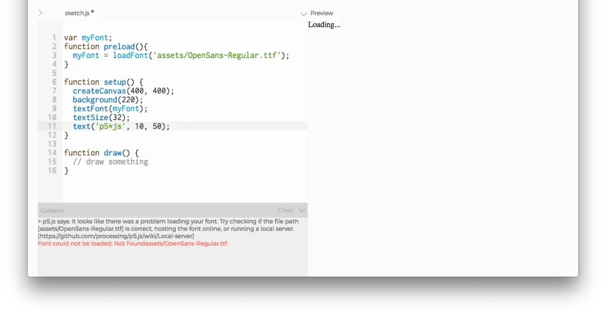
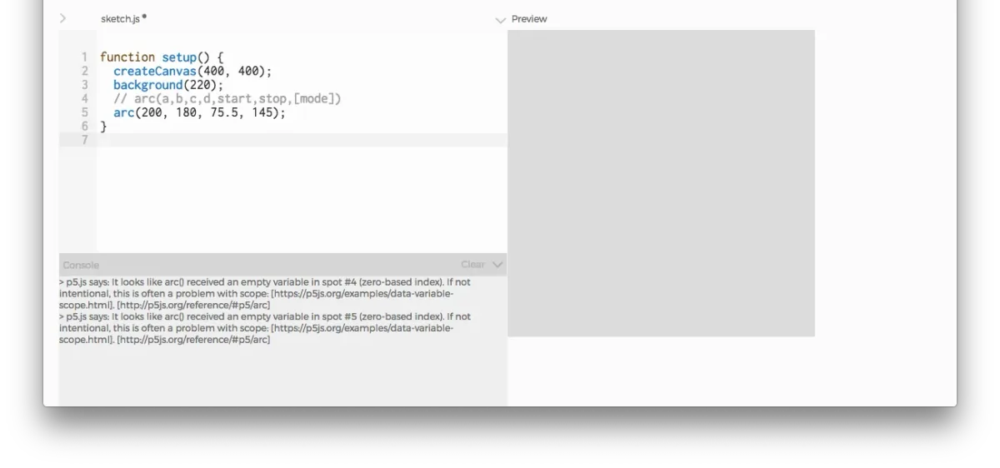
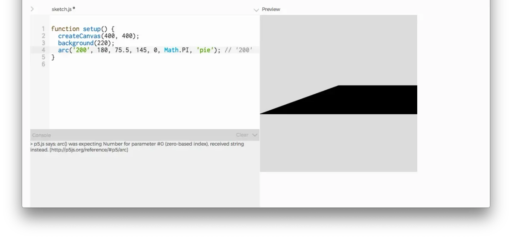
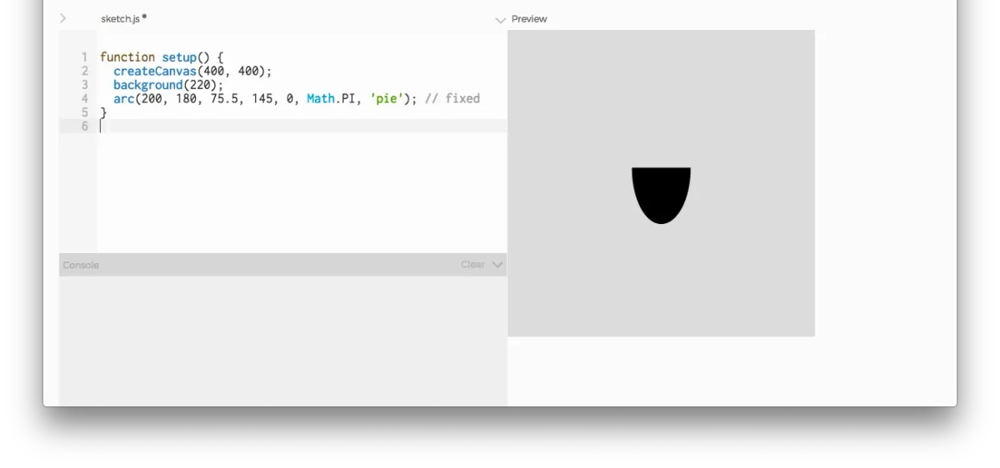
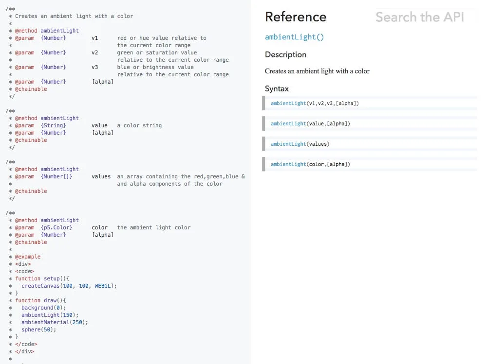
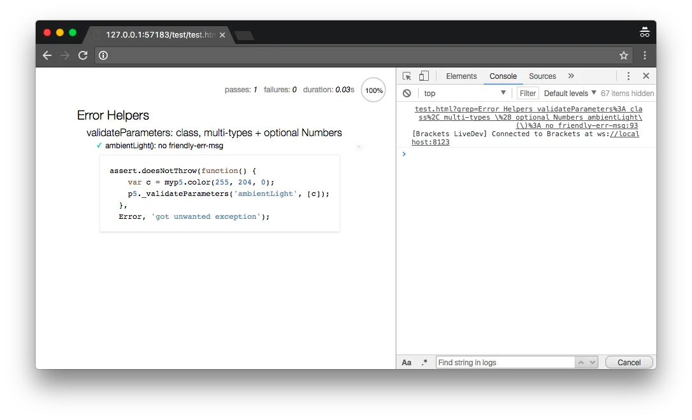
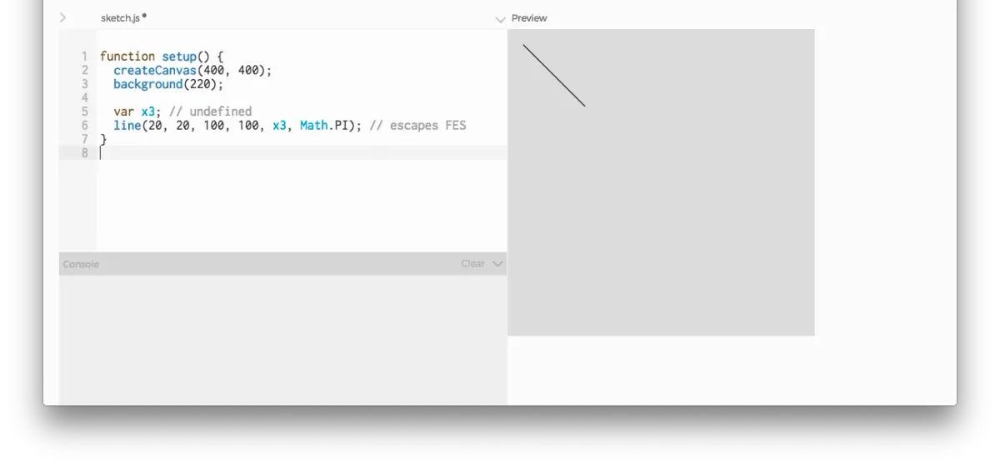

2017 marks the Processing Foundation’s sixth year participating in [Google Summer of Code](https://summerofcode.withgoogle.com/). We were able to offer sixteen positions to students. Now that the summer is wrapping up, we’ll be posting a few articles by students describing their projects.

By [A. Mira Chung](https://almchng.itch.io/)  
mentored by [Luisa Pereira](http://www.luisapereira.net/)

Consider how much time we spend on debugging. It’s easy to imagine how an effective debugger can cut down development time. What we often overlook is the mood we are in during the programming experience. After all, at the core, the experience of programming resembles an endless back-and-forth communication between the programmer and the debugger.

The voice of a debugger will have an impact on new developers’ first impression and following coding experience. This is why designing a friendly debugger and error system is essential for projects with an outreach mission such as [Processing](https://processing.org/) and [p5.js](https://p5js.org/). Having a well-designed debugger written in the right tone can lower the barrier for inexperienced users.

p5.js’s new feature, the Friendly Error System (FES), was developed with this idea in mind. Started from examining language-specific common error cases, we developed FES which creates console messages that can hint at the debugging solution rather than throw an error and exit. JavaScript often allows “silent failures”, meaning the code will fail to execute the expected behavior without a warning (i.e. error messages) from the debugger. For example, JavaScript doesn’t support type checking by default, making errors in parameter entry harder to detect for new JavaScript developers.

So far, FES is able to detect and print messages for two kinds of errors: (1) validateParameters() checks a function’s input parameters to confirm it matches the inline documentation and (2) friendlyFileLoadError() catches file loading errors. We have integrated these two kinds of error checking to a selected set of p5 functions, but developers can add them to more p5 functions, or their own libraries, by calling the above FES functions. FES provides a generalized error message generation system, so more error types can be implemented in the future.

*<PRO TIP> disable FES in setup by simply setting: p5.disableFriendlyErrors = true;*

To help beginners without requiring additional setup, FES is enabled by default in p5.js. In p5.min.js, it is completely disabled for efficiency. We understand that having an assistant system like FES can be counter-productive and it is possible to easily disable FES by setting \`p5.disableFriendlyErrors = true;. I’ll be using p5.js with the default setting in all the following examples.

Without further delay, let’s see FES in action. I will be showing these examples in the exciting new p5.js Web Editor, which will be released in the fall!

### 1\. File load errors

Here is a simple scenario where I’m trying to stylize text using a font file, and the output fails to render the text in the desired style. In addition to JavaScript error messages, friendlyFileLoadError generates a message in the console:

\> p5.js says: It looks like there was a problem loading your font. Try checking if the file path \[assets/OpenSans-Regular.ttf\] is correct, hosting the font online, or running a local server.\[https://github.com/processing/p5.js/wiki/Local-server\]

The message first provides a short error case summary, and then displays the given path that seems to be incorrect and causing the problem. Lastly, it provides additional resources that may guide the users to a correct solution. This kind of file loading FES is currently implemented for the loadImage(), loadFont(), and loadTable() functions.

### 2\. Missing parameters

Here, I’m trying to draw an arc, but with a number of parameters less than the required. This is the silent error case that was discussed above, and thus no error from JavaScript. In the console, FES generates two messages, one for each missing parameter:

\> p5.js says: It looks like arc() received an empty variable in spot #4 (zero-based index). If not intentional, this is often a problem with scope: \[https://p5js.org/examples/data-variable-scope.html\]. \[https://p5js.org/reference/#p5/arc\]

\> p5.js says: It looks like arc() received an empty variable in spot #5 (zero-based index). If not intentional, this is often a problem with scope: \[https://p5js.org/examples/data-variable-scope.html\]. \[https://p5js.org/reference/#p5/arc\]

Similar to file loading error messages, the FES first provides a short error case summary with a location, and then provides additional resources that may be useful for debugging.

### 3\. Wrong parameter type

In a similar vein, FES also checks parameter types. In this scenario, I’m trying to draw an arc but gave wrong parameter type, String, instead of the required parameter type, Number. FES generates a message summarizing this with a link to the function’s documentation:

\> p5.js says: arc() was expecting Number for parameter #0 (zero-based index), received string instead. \[https://p5js.org/reference/#p5/arc\]

Once the error is corrected, the console messages disappear:

### 4\. Object parameters and multiple parameter formats (+ an example for developers)

FES not only supports type checking for JavaScript’s default types (Boolean, String, Number, Array, and undefined) but also objects by checking the object’s name parameter. This means on the p5 developers’ side, whenever they are creating a new class for p5 they need to declare an object’s name parameter, e.g.:

p5.newObject = function(parameter) {  
  this.parameter = ‘some parameter’;  
  this.name = ‘p5.newObject’;  
};

In addition, FES supports having multiple parameter formats in a function if they are defined in the function’s inline documentation. FES looks up inline documentations to check parameters, which also serve as the direct source for p5.js’s official web documentation.

For example, let’s take a look at ambientLight() function. This function accepts multiple type formats, with one format case requiring p5.Color object as the first parameter.

Inline documentation for ambientLight() with four supported parameter type formats (left), which gets rendered into the p5.js web documentation (right).

Here is an example on how to use p5.\_validateParameters(). This is one of the FES’s unit tests running on Bracket’s local server (shown inside Chrome Developer Tools):

FES is yet implemented in ambientLight(). However, we can test behaviors of p5.\_validateParameters() in action by calling it with the function’s name and a sample parameters array:

p5.\_validateParameters(‘ambientLight’, \[c\]);

As a result, the parameter array had passed the validation test and we get no FES message in the console.

For more detailed guidelines on developing with p5.\_validateParameters(), please take a look at the p5.js [FES wiki page](https://github.com/processing/p5.js/wiki/Friendly-Error-System).

### 5\. Known limitations (!)

FES still has false negative cases. These are usually caused by the mismatch between designs of the functions with actual usage cases. For example, drawing functions are originally designed to be used interchangeably in 2D and 3D settings, and this can cause problems. Specifically, let’s consider a case where we try to draw a 3D line with:

var x3; // undefined  
line(20, 20, 100, 100, x3, Math.PI);

This missing parameter case will escape FES, because there is an acceptable parameter pattern (Number, Number, Number, Number) in line()’s inline documentation (no pun intended) for drawing in 2D setting. This also means the current version of FES doesn’t check for the environmental variables such as this.\_renderer.isP3D.

FES still has room for improvement, especially in terms of their clarity and precision for describing the detected errors. For future works, it would be a great idea to continue work on identifying more error cases (possibly in conjunction with outreach programs and workshops) and making the code more accessible for wider demographics (e.g. Internationalization). We hope that FES, which appears like a small gesture, can build up a powerful inertia toward creating a more open, inclusive community.
