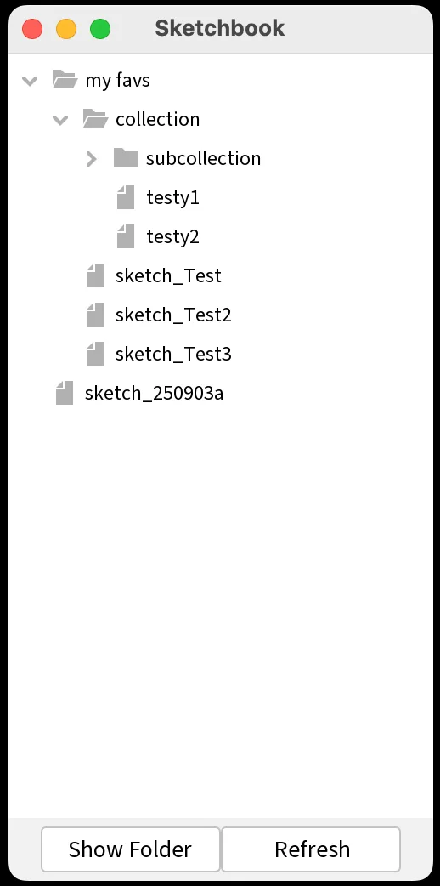
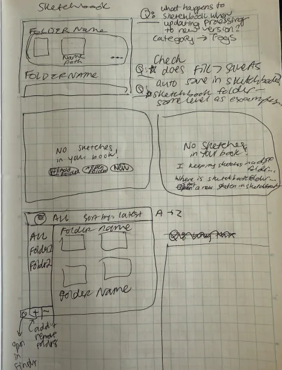
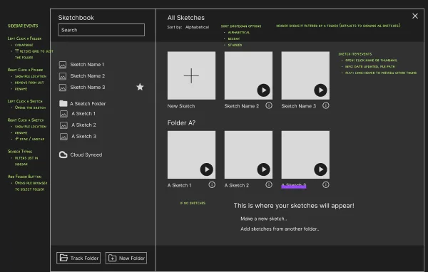
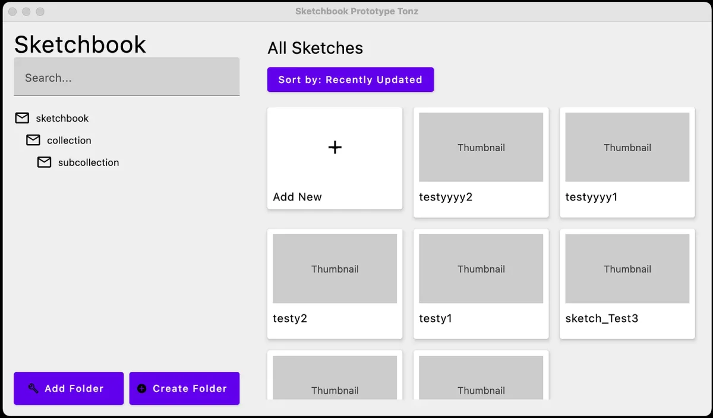
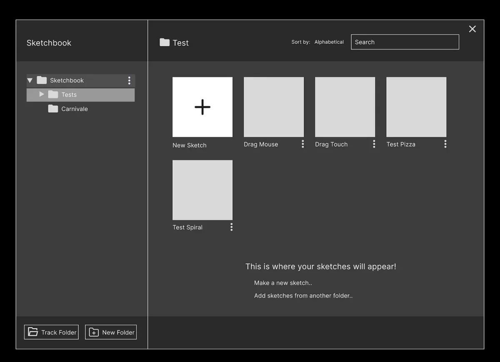
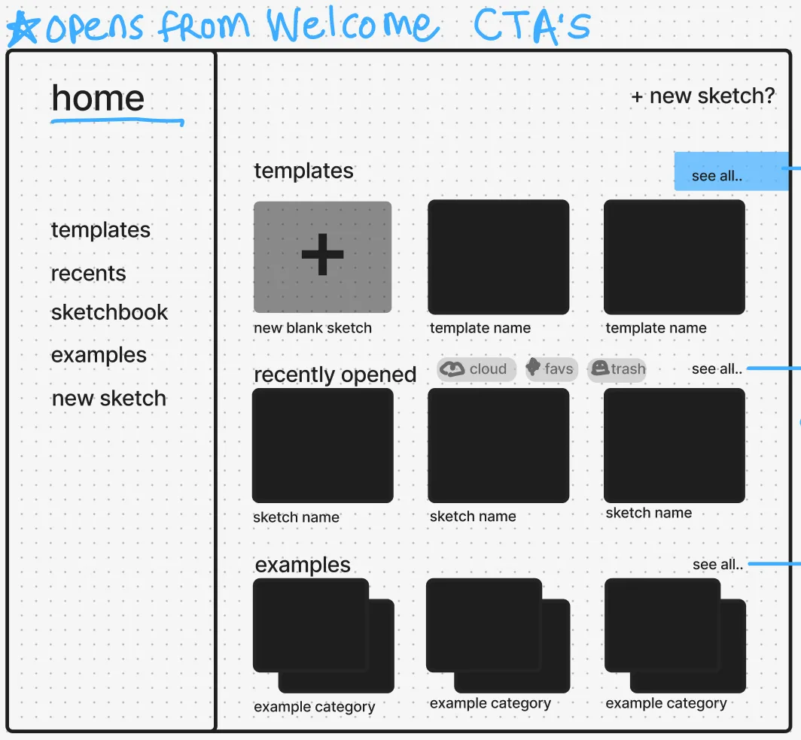
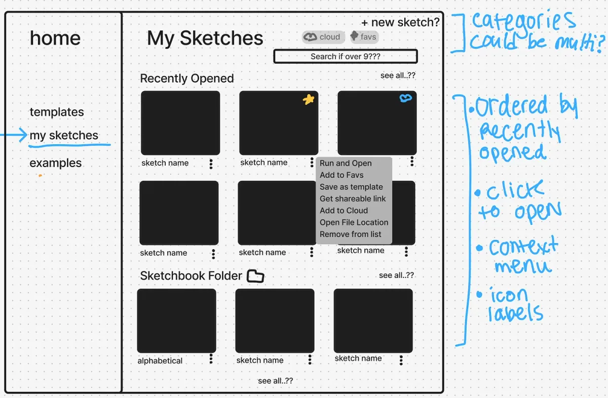
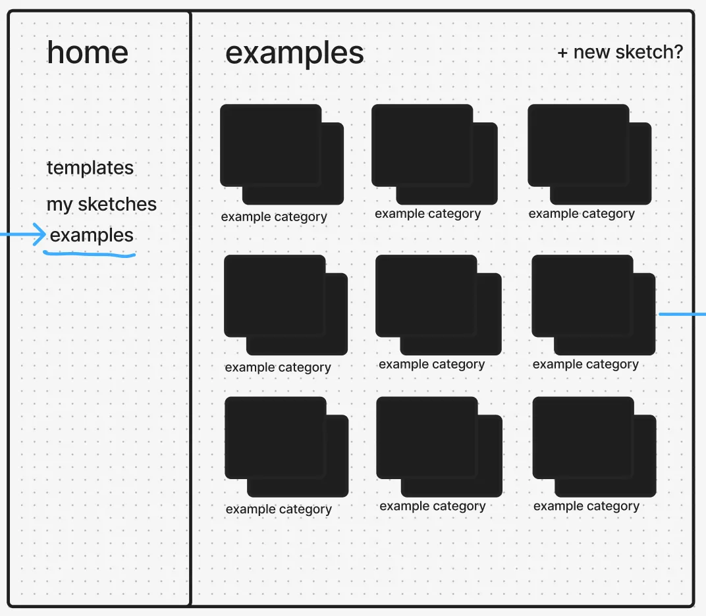

*Tonz, Processing’s Open-Source Community Intern*

Upon starting my internship, I was excited for the chance to see what goes into maintaining the community behind the tools used in so many interactive art pieces.

My time at Processing focused on two main areas:

1.  Contributing to the Open Source Community
2.  Prototyping the UX of the next coming of Processing

---

### **Open Source Community Contribution**

It was my first time contributing to a desktop application with a robust open source community. I hit the ground running [replying](https://github.com/processing/processing4/issues/1117) to GitHub Issues, [requesting](https://github.com/processing/processing4/issues/1138) assignments, [filing](https://github.com/processing/processing4/issues/1157) my own issues and [submitting](https://github.com/processing/processing4/pull/1162) Pull Requests (PR).

One challenge I encountered with filling out a GitHub Issue for a problem was that the issue templates expected me to know answers when I would have preferred to collaboratively explore potential solutions. This experience shaped my perspective as a first-time contributor.

Ultimately, I successfully fixed a bug with Processing’s Command Line Interface (CLI). This involved many personal firsts, including working with IntelliJ, Kotlin, and Gradle. The team took my feedback as a first-time contributor seriously and made the process easier in both the Contributor .MD files and the testing code. Through this experience, I [reviewed](https://github.com/processing/processing4/pull/1161#pullrequestreview-2988131065) my first PR at Processing.

Interestingly, Processing’s CLI seems to have been somewhat under the radar in the community. I’ve since added instructions to the GitHub [Wiki](https://github.com/processing/processing4/wiki/FAQ) and Processing [website](https://github.com/processing/processing-website/pull/639) to increase its visibility. The CLI offers powerful options for automating sketch execution, which can be particularly useful for installation projects.

---

### **Processing’s UX Prototype Development**

After going through the whole Open Source pipeline, I moved to more conceptual topics. As the Processing Editor transitions to Gradle and Kotlin, the UX of each window (Welcome, Examples, Sketchbook) has the opportunity for updated UI. I was offered the chance to re-imagine the Sketchbook. What started as a simple UI update turned into a deeper exploration of the Sketchbook’s fundamental purpose and how users navigate their sketch collections.

**Initial Design Exploration: The Sketchbook UI**

You could think of Processing’s Sketchbook as a gallery or scrapbook of your Processing journey. Currently it looks like this:

It displays any sketches that have been saved into the default Documents/Processing folder or subfolders (Share your [thoughts](https://github.com/processing/processing4/issues/1224) on where you think it should pull from).

For the UX, we wanted a visual grid and the ability to navigate without any double clicking. The design process evolved through several iterations:

-   **Version 0 — Paper Wireframes:** I’m playing with categorizing sketches into subfolders and what to show if you haven’t saved any sketches.

-   **Version 1 — Figma Wireframes:** I’m listing what actions to provide users.

-   **Version 2 — Interactive Prototype** on a [forked processing4 repo](https://github.com/toniab/processing4/tree/sketchbookui): I experimented with using Jetpack Compose for quick UI components, and I’m opening sketches by using [Processing’s schema](https://github.com/processing/processing4/blob/main/SCHEMA.md). It challenged us to rethink how much is in the sidebar versus the grid.

-   **Version 3 — Advanced Figma Prototype:** Back in Figma, but this time using their interactive prototype features to emulate the collapsing folder structure. We moved the search to be with the grid.

**Exploring Broader Conceptual Possibilities**

Once we committed to the visual grid approach, we began rethinking what could be in the sidebar. We explored the possibility of navigating between ‘Examples’, ‘Templates’, and your ‘Sketches’ as distinct categories. This raised questions about whether the Sketchbook could evolve into a more comprehensive hub, potentially becoming the primary interface users see when opening Processing.

We returned to the drawing board to experiment with how we could combine all available content while displaying the specific information users need at any given moment.

**Looking Forward**

Unfortunately, I couldn’t answer everything before the internship came to an end. It would take community input to best resolve these conceptual questions. I’m also interested in gathering feedback from artists who are hearing about Processing for the first time to understand what would make the process more approachable.

One thing that has been reinforced during my internship with Processing Foundation is that approachability is truly in the fabric of the organization, its members, the software, and the community. No wonder it has grown so much, lasted so long, and been so beloved by artists.

---

Our software remains free and open-source thanks to generous donors like you. Please consider making a [monthly donation](https://processingfoundation.org/donate) to help us continue supporting contributors like Tonz.
