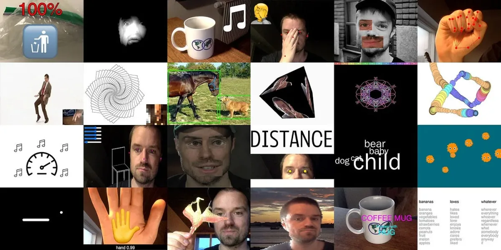
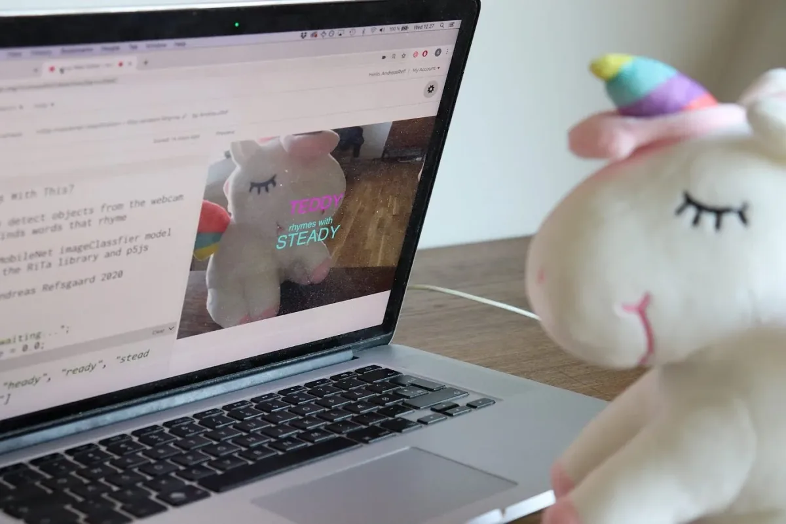
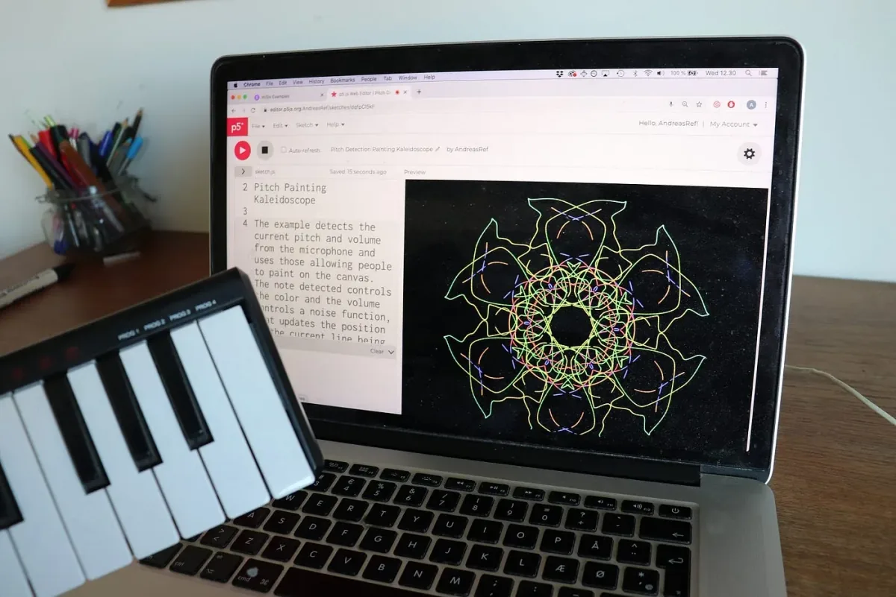

The 2020 Processing Foundation Fellowships sponsored six projects from around the world that expanded the p5.js and Processing softwares and nurtured their communities. In collaboration with NYU’s [Interactive Telecommunications Program](https://tisch.nyu.edu/itp), we also sponsored four Fellows to work on [ml5.js](https://ml5js.org/). Because of COVID-19, many of the Fellows had to reconfigure their projects, and this year’s cohort, both individually and as a whole, sought to address issues of accessibility and inclusion in their projects. Over the next couple months, we’ll be publishing our annual wrap-up articles on how the Fellowship projects went, some written by the Fellows in their own words, and some in conversation with Director of Advocacy Johanna Hedva. You can read about our past Fellows [here](https://medium.com/processing-foundation/https-medium-com-tag-pf-fellowships-la/home).

---

**Collage of the 24 examples built by Andreas Refsgaard during his Fellowship.* [Andreas Refsgaard](https://andreasrefsgaard.dk/) is an artist and creative coder based in Copenhagen. He uses algorithms and machine learning to allow people to play music using only eye movement and facial gestures, control games by making silly sounds or transform drawings of musical instruments on paper into real compositions. He was mentored by [Yining Shi](https://1023.io/).*

**Johanna Hedva: Hi Andreas! Tell me about your ml5.js Fellowship project. What were your intentions and goals, and what did you accomplish?**

**Andreas Refsgaard**: My project was about creating a series of playful examples for ml5.js ([which you can check out here](https://ml5-fellowship-2020.github.io/examples/)) to showcase how cool the library is! I have benefited tremendously from the existing examples, both as an artist and teacher, and for me the website and the current examples have been great learning resources; clear, simple, and concise.

However, from my teaching experience, students can sometimes have a hard time imagining what to build on top of very bare-bone examples and knowing where to add code in order to bring their own ideas to life. So I started making small tweaks to the existing examples for the workshops I have been teaching. This Fellowship is a natural continuation of that work. During my Fellowship I created 26 examples that show how to build simple playful projects using the core models of ml5.js.

**JH: You worked to make two supporting examples, for each major interactive technique in ml5.js, that could be used as templates. You made a simple example and a more advanced one. First, can you explain the differences between the two?**

**AR**: The simple examples build on top of existing examples, by adding just enough additional code to make them more playful or engaging. The aim is to foster creative ideas, and show students how building something themselves with ml5.js can be a fun, playful activity, that does not require a lot of advanced coding.

The more advanced examples go a step deeper, often by combining multiple functionalities within ml5.js or by using p5.js to make the outputs from ml5 machine learning models more interesting. Compared to the simple examples, these examples are generally longer and more complex, and therefore intend to serve more as inspirational examples than as tutorial examples for beginners.

**“Teddy rhymes with steady” — one of the examples combines image classification from ml5.js with the rhyming algorithm RiTa.js**

**JH: Why is it important for ml5.js to have both a simple example and one that’s more advanced? Who are the examples intended for?**

**AR**: The examples are for everyone! I made a rule for myself: that all examples had to work inside the p5.js editor, so all of them can be experienced by simply clicking the play button. Both types of examples will hopefully showcase the creative potential of using ml5.js and attract even more people to use the library.

That being said, my hope is, that these examples will bring insights, inspiration, or joy to different people in different stages of exploring creative coding, machine learning and ml5.js. By seeing how to go from a bare-bone example to a playful small demo in very few lines of code, hopefully beginners will feel empowered to do the same and make their own ideas come to life. And on the other hand, the more advanced examples can be an inspiration for people who have a bit more knowledge, and want to see how ml5.js can be combined with other libraries and techniques.

**JH: What was the most difficult problem you ran into during your project, and how did you work through it?**

**AR**: I got a lot of support from my mentor [Yining Shi](https://1023.io/), who helped me out with fixing bugs and coming up with ideas for the different examples. At times, when I thought some of my examples were either too silly or not interesting enough, her reactions and laughs whenever I showed her new ideas helped motivate me to build and improve the examples.

**JH: What’s next for you? Will you continue your project, and your involvement with ml5.js, or contributing to open source in general?**

**AR**: I have some bigger artistic projects in the works for the rest of the year, but I will use the examples in a few upcoming classes on creative machine learning, and will continue to work on and improve the examples over time. I love ml5.js and hope to help out the project another way, and being part of this Fellowship was a really nice experience for me. For those interested in Processing/p5js, you might also run into me at [discourse.processing.org](https://discourse.processing.org/), where I am frequently posing and answering questions, or see me at Processing Community Day Copenhagen, which I have helped organize the last two years.

**The example “Pitch Painting Kaleidoscope” detects the pitch and volume from the microphone and translates the sound into paintings.**
