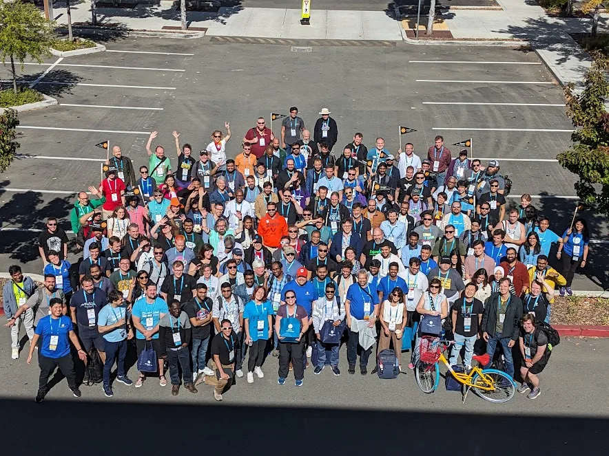
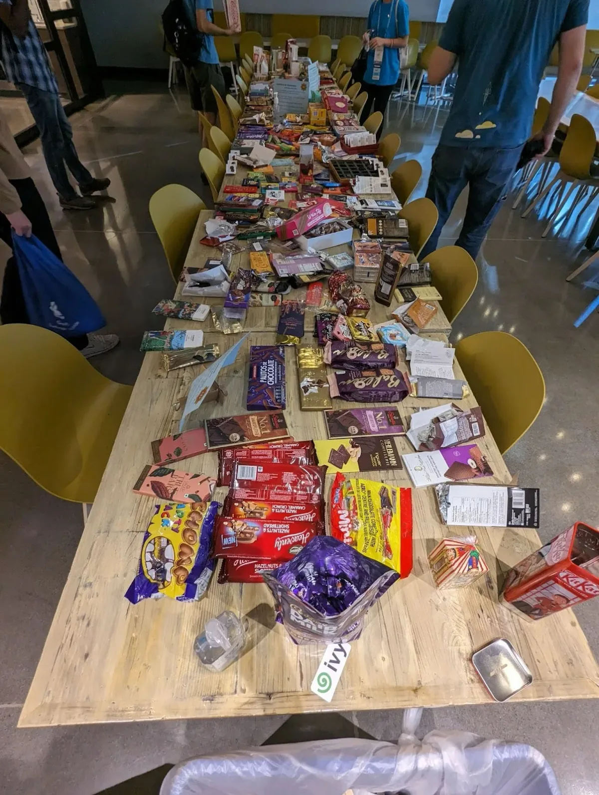
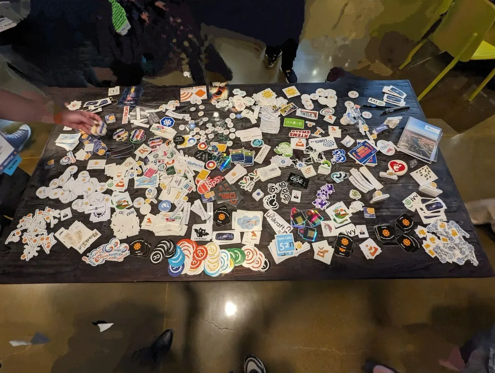
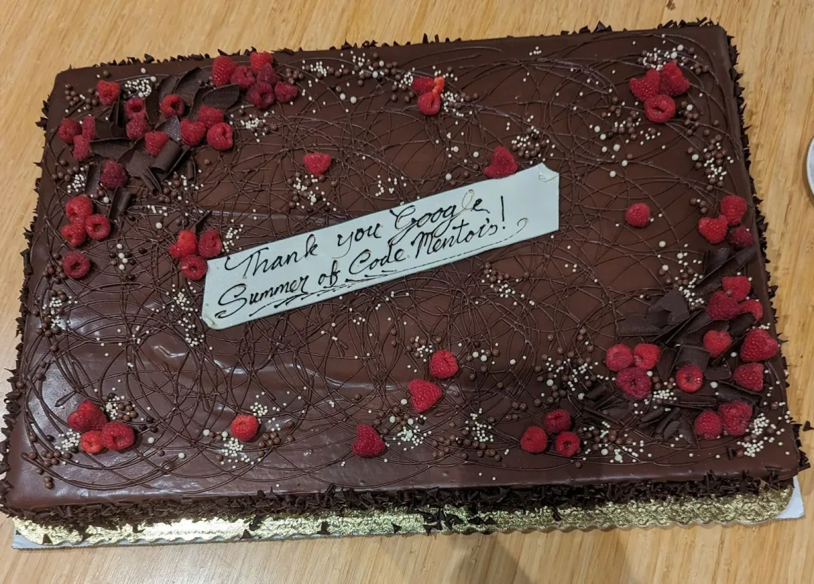
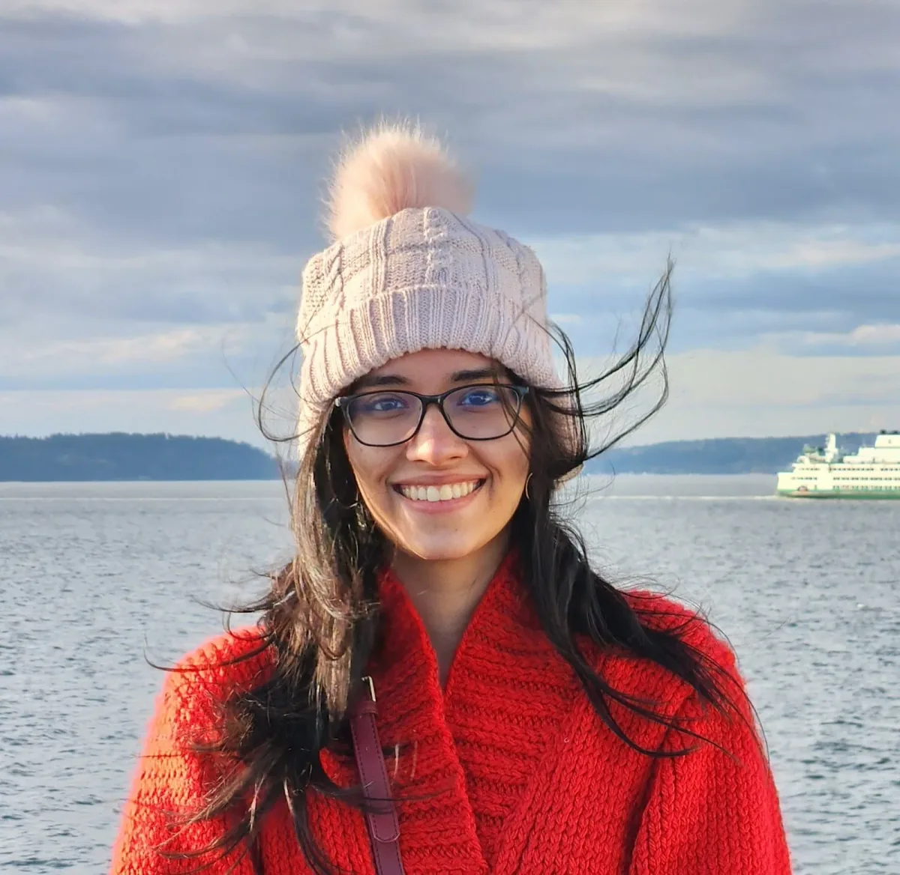

*A group picture of the attendees of the GSoC Mentor Summit.*

The Google Summer of Code (GSoC) Mentor Summit 2023 had mentors and admins of various open source organizations come together at the Google Moffett Park, CA, USA office. Representing the Processing Foundation, this was my inaugural participation in the summit, held from October 13th to 15th. With more than 150 attendees representing diverse organizations, this un-conference-style event was a great way to network, share ideas, and learn from others. Unlike a regular conference where the sessions are already planned, the participants had the opportunity to pitch their own sessions, attend whichever they liked, and had plenty of options to choose from. Hence the un-conference!

#### **A Whimsical Icebreaker**

With so many attendees, one would think that it would be hard to meet most people, but a fun activity made it easy for us to get to know each other. Attendees were encouraged to break the ice by sharing not only their names and organizational affiliations but also four defining words that captured their essence. Words like “community,” “access,” and even some whimsical food-related terms like “eating cake” and “dessert” resonated deeply within our open-source family.

#### **Lightning Talks: A Glimpse into Diversity**

There were 3-minute talks throughout the summit. The lightning talks segment provided a rapid yet insightful window into the various open-source organizations participating in GSoC. Mentors efficiently shared their projects and organizations, offering a quick learning experience and showcasing diversity within the community. We heard from people from all across the globe, from first time mentors and even people who have been organization admins for over 10 years.

There were two tables at the Google office that did a great job of displaying the diversity of the conference — one for stickers from all the participating open source organizations and another for chocolate flown in from mentors across the globe!

*The Chocolate Table*

*The Sticker table*

#### **Collaboration on Giant Boards**

The second day introduced us to a unique method of planning sessions. We had giant boards and many large sticky notes that we could use to craft out our own sessions. In an un-conference, it is up to attendees to decide what they’d like to have sessions about. Each session would last about an hour and with many sessions happening in parallel, it was always exciting to come back to the board to plan where we would go next! On a side note, there were many AI and Large Language Models (and the impact they have) related sessions — as one might expect!

#### **Mentoring the Mentors**

One of the initial sessions I attended revolved around fostering mentorship in large organizations. It was heartening to see mentors from organizations like NumFocus, Python Software Foundation, PostgreSQL, LLVM, CNCF, and others come together. We noted that while many active mentors are past students, not all past GSoC mentors continue to mentor or stay in touch with projects. The concept of “mentoring the mentors” emerged as a valuable takeaway, emphasizing the importance of mentor development within open-source communities.

#### **Open Communication and Shadowing**

The discussions extended to the significance of maintaining open lines of communication with the community. We explored the shadowing program implemented in Kubernetes, shedding light on effective practices within the open-source sphere. Some common choices of having discussions with community members included Discord and Zulip. I found myself re-evaluating my own need for communication and thought long and hard about whether having an open space for all community members to converse is a great idea. Without a doubt, maintaining such a forum and ensuring safe communication would be a hard problem to solve.

#### **Art, AI, and the Future**

A session close to my heart: the intersection of Digital Humanities, Art, and AI, delved into the potential disruption AI could bring to the field of Art & AI. The conversation revolved around the idea that AI tools could inspire more individuals to explore humanities and art, given the possibilities they offer. The session also pondered ways to expand this exploration across a broader organizational framework. This session made me reflect on how the digital art space is relatively new and how large this space can become in the future. We shared our email addresses in the hopes of coming back to the table with more ideas around this space. This was my favorite session!

#### **Feedback and Fostering Relationships**

We had the invaluable opportunity to provide direct feedback to GSoC organizers about the program and website, making it a two-way dialogue. Discussions also revolved around how organizations could better utilize the community bonding period to foster relationships between participating organizations and students. I was able to incorporate feedback received from my mentee regarding the simplification of the GSoC website and making it more beginner friendly, adding a personal touch to the process. Kudos to the GSoC organizers!

#### **Education, Incentives, and Future Endeavors**

In another enlightening session, we explored the role open-source organizations play in education and the tools and methods available to help students engage with these organizations. The importance of providing varying levels of support based on project requirements and skill levels became evident. Notable teaching tools, like those created by the Python Foundation for simplifying initial contributions to their codebase were shared by mentors of the foundation. I was able to bring to notice resources like Dan Shiffman’s Coding Train videos that have played a major role in teaching students across the globe the art of code. The idea of a dedicated site outlining GSoC projects for large organizations, akin to the Processing Foundation’s annual blog posts, was one everyone loved.

In order to incentivize GSoC participation, we discussed ideas ranging from the iconic rock carving at the Mozilla campus to swag and bonus monetary compensations. It was a glimpse into the diverse approaches that have been used and the innovative ideas currently in the pipeline.

*A chocolate cake to celebrate Google Summer of Code Mentors.*

#### **Conclusion**

The GSoC Mentor Summit 2023 was a testament to the strength of the open-source community. It offered a platform for knowledge sharing, collaboration, and innovation. As a representative of the Processing Foundation, I left the summit with a sense of excitement and insights from other organizations that could potentially shape Processing!

*A profile image of Tanvi Kumar.*

[Tanvi Kumar](https://linkedin.com/in/TanviKumar) **(she/her)**Tanvi is a software engineer at Microsoft, India and works for Search at Microsoft Teams. She graduated from NIT Trichy, India in 2020 after completing her B.Tech in Civil Engineering with a minor in Computer Science and Engineering. She was a GSoC contributor in 2018 and GSoC mentor in 2023 for the Processing Foundation. Today she uses p5.js to create pattern-based digital artwork as a generative artist.

Follow Tanvi on [instagram](https://www.instagram.com/generativebyt/)

Thank you, Tanvi for your insightful contributions and reflections within the GSoC program and Summit. We hope to keep supporting the creative code and open source community, year after year. Want to support the Processing Foundation in this work? [Donate here](https://processingfoundation.org/donate) to support our ecosystem of open source contributions!
